# Precision Medicine MCP Servers

AI-Orchestrated Clinical Bioinformatics for Precision Oncology using Model Context Protocol

[](https://www.python.org/downloads/)
[](https://modelcontextprotocol.io/)
[](https://claude.ai/download)
[](LICENSE)

## Statement of Purpose

**Transform clinical decision-making with AI-orchestrated bioinformatics**
- Analyze complete patient profiles—from genomics to spatial transcriptomics—using natural language
- Demonstrate end-to-end precision medicine workflows for Stage IV Ovarian Cancer across 9 specialized MCP servers and 40 tools
- Named 'Patient-One' in memory of a dear friend who passed away in 2025 due to HGSOC

---

## Featured Use Case: PatientOne

**Comprehensive Precision Medicine Workflow for Stage IV Ovarian Cancer**

<kbd></kbd>

**End-to-end demonstration using all 9 MCP servers:**
- **Patient:** Stage IV HGSOC, platinum-resistant, BRCA1 mutation
- **Data Modalities:** Clinical (Epic FHIR) → Genomic (FGbio, TCGA) → Multi-omics (RNA/Protein/Phospho) → Spatial (900 spots, 31 genes) → Imaging (H&E, multiplex IF)
- **Cost:** DRY_RUN demo in 25-35 min (~$0.32) or real analysis in 1-3 hours ($7-29)
- **ROI:** Replaces ~40 hours of manual bioinformatics work per patient

**📖 Learn More:** [PatientOne Documentation →](architecture/patient-one/README.md) | [Quick Start →](tests/manual_testing/PatientOne-OvarianCancer/README.md) | [Sample Outputs →](architecture/patient-one/patient-one-outputs/)

---

## Who is this For?

This repository serves multiple audiences in the precision medicine ecosystem. Find your role below to get started quickly:

### 🔬 **Bioinformatics Researchers**
*You want to analyze multi-omics cancer data and validate precision medicine hypotheses*

**What you can do with this repository:**
- Analyze spatial transcriptomics data (STAR alignment, batch correction, pathway enrichment)
- Integrate multi-omics datasets (RNA, protein, phosphoproteomics)
- Map tumor microenvironment heterogeneity
- Identify drug resistance mechanisms

**Quick Start:**
1. [PatientOne Workflow Guide](tests/manual_testing/PatientOne-OvarianCancer/README.md) - Complete analysis in 25-35 min
2. [mcp-spatialtools Quick Start](servers/mcp-spatialtools/QUICKSTART.md) - Batch correction, pathway enrichment (95% real)
3. [Cost Analysis](docs/COST_ANALYSIS.md) - $0.32 demo or $7-29 real analysis

**Example Outputs for Researchers:**
- [PatientOne Results](architecture/patient-one/patient-one-outputs/for-researchers/) - Complete analysis results with visualizations

**Production-Ready Servers:**

| Server | Tools | Status | Key Features |
|--------|-------|--------|--------------|
| **mcp-multiomics** | 9 | ✅ Production | HAllA integration, Stouffer meta-analysis, upstream regulators |
| **mcp-fgbio** | 4 | ✅ Production | FASTQ/VCF QC, genome reference management |
| **mcp-spatialtools** | 10 | ⚠️ 95% Real | STAR alignment, ComBat batch correction, pathway enrichment, Moran's I |

**Mocked Servers** (workflow demonstration only):
- mcp-tcga, mcp-deepcell, mcp-huggingface, mcp-seqera (0% real)
- mcp-openimagedata (30% real - basic features only)
- mcp-epic (mock FHIR by design)

**Use cases:** PDX model analysis • Tumor microenvironment mapping • Drug resistance mechanisms • Pathway enrichment

---

### 💻 **MCP Developers**
*You want to build custom MCP servers or extend existing bioinformatics tools*

**What you can learn:**
- How to architect MCP servers for complex bioinformatics workflows
- Best practices for testing (91 tests in mcp-multiomics, 68% coverage)
- Integration patterns for external tools (STAR, ComBat, HAllA)
- Real vs mocked implementation strategies

**Server Architecture:**



```mermaid
graph TD
    subgraph "Clinical & Genomic Foundation"
        EPIC[mcp-mockepic<br/>Clinical Data<br/>❌ Mock]
        FGBIO[mcp-fgbio<br/>FASTQ/VCF<br/>✅ Production]
        TCGA[mcp-tcga<br/>Cancer Atlas<br/>❌ Mocked]
    end

    subgraph "Multi-Omics Analysis"
        MULTI[mcp-multiomics<br/>RNA/Protein/Phospho<br/>✅ Production]
    end

    subgraph "Spatial Biology"
        SPATIAL[mcp-spatialtools<br/>Spatial RNA-seq<br/>⚠️ 95% Real]
        IMAGE[mcp-openimagedata<br/>Histology<br/>🔶 Partial]
        DEEPCELL[mcp-deepcell<br/>Cell Segmentation<br/>❌ Mocked]
    end

    subgraph "AI & Workflow Orchestration"
        HF[mcp-huggingface<br/>ML Models<br/>❌ Mocked]
        SEQERA[mcp-seqera<br/>Nextflow<br/>❌ Mocked]
    end

    EPIC -.-> PATIENT[PatientOne<br/>Precision Medicine]
    FGBIO ==> PATIENT
    TCGA -.-> PATIENT
    MULTI ==> PATIENT
    SPATIAL --> PATIENT
    IMAGE -.-> PATIENT
    DEEPCELL -.-> PATIENT
    HF -.-> PATIENT
    SEQERA -.-> PATIENT

    style PATIENT fill:#e1f5ff,stroke:#0066cc,stroke-width:3px
    style FGBIO fill:#d4edda,stroke:#28a745,stroke-width:2px
    style MULTI fill:#d4edda,stroke:#28a745,stroke-width:2px
    style SPATIAL fill:#fff3cd,stroke:#ffc107,stroke-width:2px
    style IMAGE fill:#fff3cd,stroke:#ffc107,stroke-width:1px
    style TCGA fill:#f8d7da,stroke:#dc3545,stroke-width:1px
    style DEEPCELL fill:#f8d7da,stroke:#dc3545,stroke-width:1px
    style HF fill:#f8d7da,stroke:#dc3545,stroke-width:1px
    style SEQERA fill:#f8d7da,stroke:#dc3545,stroke-width:1px
    style EPIC fill:#e2e3e5,stroke:#6c757d,stroke-width:1px
```

**Legend:**
- ✅ Production Ready (solid green, thick arrows `==>`) - 2/9 servers
- ⚠️ Conditionally Ready (yellow, solid arrows `-->`) - 1/9 servers
- 🔶 Partial (light yellow, dotted `-.->`  ) - 1/9 servers
- ❌ Mocked (red, dotted `-.->`) - 4/9 servers
- Mock by Design (gray, dotted `-.->`) - 1/9 servers

**Development Resources:**
- **Architecture:** [System Design](architecture/README.md) • [PatientOne Architecture](architecture/patient-one/README.md)
- **Best Reference:** [mcp-multiomics](servers/mcp-multiomics/README.md) (91 tests, 68% coverage, HAllA integration)
- **95% Real Example:** [mcp-spatialtools](servers/mcp-spatialtools/) ([Implementation Status](servers/mcp-spatialtools/SERVER_IMPLEMENTATION_STATUS.md))
- **Testing Guide:** [Solution Testing](tests/manual_testing/Solution-Testing/README.md)
- **Status Matrix:** [All Server Implementation Details](docs/SERVER_IMPLEMENTATION_STATUS.md)

**Example Outputs for Developers:**
- [Technical Documentation](architecture/patient-one/patient-one-outputs/for-developer/) - Full test prompts, server reference guide, MCP reports

---

### 🏥 **Clinical Care Teams** *(Oncologists, Genetic Counselors)*
*You want to understand how AI-orchestrated bioinformatics can support clinical decision-making*

**⚠️ IMPORTANT:** This repository is for **RESEARCH USE ONLY**. Not validated for clinical decision-making, FDA/EMA approval, or patient care.

**What this demonstrates:**
- How multi-omics data can identify potential treatment strategies
- Integration of clinical (FHIR), genomic, spatial, and imaging data
- AI orchestration of complex bioinformatics workflows
- Evidence-based pathway analysis (44 curated ovarian cancer pathways)

**Educational Resources:**
- **Case Study:** [PatientOne - Stage IV HGSOC](architecture/patient-one/README.md)
- **Clinical Reports:** [Sample Outputs for Care Teams](architecture/patient-one/patient-one-outputs/for-care-team/) - MCP reports, spatial analysis, multi-omics figures
- **Data Privacy:** [FHIR De-identification](tests/manual_testing/PatientOne-OvarianCancer/implementation/PHASE0_CLINICAL_FHIR.md)
- **Workflow Overview:** See PatientOne graphic above for data flow

**Educational value:** Understand precision medicine workflows • Evaluate bioinformatics pipelines • Assess multi-omics integration approaches

**⚠️ Disclaimer:** This is research technology, not clinical care. Always consult qualified oncologists for medical decisions.

---

### 🛠️ **Software Engineers**
*You want to deploy, integrate, or scale this system*

**Quick Start - Local Development (5 minutes):**

```bash
# 1. Clone repository
git clone https://github.com/lynnlangit/precision-medicine-mcp.git
cd precision-medicine-mcp/tests/manual_testing/Solution-Testing

# 2. Install dependencies
./install_dependencies.sh  # Installs 9 MCP servers

# 3. Configure Claude Desktop
cp ../../../configs/claude_desktop_config.json \
   ~/Library/Application\ Support/Claude/claude_desktop_config.json

# 4. Verify (restart Claude Desktop first)
./verify_servers.sh
```

**Prerequisites:** Python 3.11+, Claude Desktop, 16GB RAM, 50GB disk

**Deployment Scenarios:**

| Environment | Setup | Resources | Use Case |
|-------------|-------|-----------|----------|
| **Local Development** | MacOS/Linux + Claude Desktop | 16GB RAM, 50GB disk | Research, testing, demos |
| **Cloud Research** | GCP Healthcare API + Vertex AI | Custom (scalable) | Production research, multi-patient |
| **HPC Clusters** | Nextflow workflows | 32GB+ RAM, 100GB+ disk | Large-scale spatial analysis with STAR |

**Infrastructure Resources:**
- **Cloud Setup:** [GCP Deployment Guide](infrastructure/README.md) - Healthcare API, FHIR stores, Vertex AI
- **Config Files:** [Claude Desktop Config](configs/claude_desktop_config.json)
- **Automated Testing:** [Verify All 9 Servers](tests/manual_testing/Solution-Testing/)
- **STAR Installation:** [STAR Aligner Setup](servers/mcp-spatialtools/INSTALL_STAR.md) (for spatial analysis)

---

### 📊 **Data Scientists / ML Engineers**
*You want to work with multi-omics data pipelines or build predictive models*

**What you can analyze:**

**Data Modalities (PatientOne example):**
- **Clinical:** FHIR resources (demographics, conditions, medications, biomarkers)
- **Genomics:** VCF files (TP53, PIK3CA, PTEN, BRCA1 mutations)
- **Multi-omics:** RNA-seq (15 samples) • Proteomics (15 samples) • Phosphoproteomics (15 samples)
- **Spatial:** 900 spots × 31 genes (Visium format)
- **Imaging:** H&E histology, multiplex IF (DAPI, CD3, CD8, Ki67, PanCK)

**Analysis Workflows:**
1. **Differential Expression** - Mann-Whitney U test + FDR correction
2. **Pathway Enrichment** - Fisher's exact test on 44 curated pathways (KEGG, Hallmark, GO_BP, Drug_Resistance)
3. **Spatial Autocorrelation** - Moran's I for spatially variable genes
4. **Cell Type Deconvolution** - Signature-based scoring (tumor, fibroblasts, immune, hypoxic)
5. **Batch Correction** - ComBat for removing technical variation
6. **Multi-omics Integration** - HAllA association analysis, Stouffer meta-analysis

**Start Here:**
- **Synthetic Dataset:** [PAT001-OVC-2025](data/patient-data/PAT001-OVC-2025/README.md) - 100% synthetic, 5 modalities
- **Multi-omics Examples:** [mcp-multiomics](servers/mcp-multiomics/README.md) - HAllA, Stouffer, upstream regulators
- **Batch Correction:** [ComBat Workflow](servers/mcp-spatialtools/tests/test_batch_correction_spatial_format.py)
- **ML Integration:** [mcp-huggingface](servers/mcp-huggingface/) (mocked - extensible for real models)

---

### 🎓 **Students & Educators**
*You want to learn or teach precision medicine and bioinformatics*

**Why this is perfect for teaching:**
- ✅ **100% synthetic data** - No patient privacy concerns, safe for classroom use
- ✅ **Low cost** - DRY_RUN mode ~$0.32 per complete analysis
- ✅ **Comprehensive** - Covers all major bioinformatics domains
- ✅ **Well-documented** - Step-by-step guides with expected outputs

**Start Here:**
1. **Tutorials:** [PatientOne Quick Start](tests/manual_testing/PatientOne-OvarianCancer/README.md) - Step-by-step walkthrough
2. **Synthetic Data:** [PAT001-OVC-2025](data/patient-data/PAT001-OVC-2025/README.md) - Clinical, genomics, spatial, imaging
3. **Architecture:** [System Design](architecture/) - Data flow, integration patterns
4. **Hands-on:** Run DRY_RUN mode in 25-35 min for ~$0.32

**Educational Topics Covered:**
- Precision oncology workflows (clinical → genomic → spatial → treatment)
- Multi-omics data integration (RNA, protein, phospho)
- Spatial transcriptomics analysis (batch correction, pathway enrichment)
- AI orchestration in bioinformatics (natural language → tool execution)
- Statistical methods (Fisher's exact, FDR, Moran's I, Mann-Whitney U)
- Cloud deployment (GCP Healthcare API, FHIR)

**Classroom Activities:**
- Analyze PatientOne case study (25-35 min)
- Compare DRY_RUN vs real analysis results
- Design custom precision medicine workflows
- Extend servers with new bioinformatics tools

---

### 👥 **Patients & Families**
*You want to understand precision medicine for ovarian cancer*

**⚠️ IMPORTANT:** This is a **research demonstration**, not a clinical tool. Always consult qualified oncologists for medical decisions.

**What this demonstrates:**
Precision medicine analyzes your unique cancer profile—genomics, transcriptomics, and imaging—to identify which treatments are most likely to work for you. This repository shows how bioinformatics can process this complex data, but it's research technology, not clinical care.

**PatientOne Story:**
This project is named in memory of a dear friend who passed from High-Grade Serous Ovarian Carcinoma (HGSOC) in 2025. Her journey inspired the development of these tools to help researchers understand and combat this devastating disease.

**Learn More:**
- **PatientOne Background:** [Case Study](architecture/patient-one/README.md)
- **Patient-Friendly Materials:** [Summaries & Infographics](architecture/patient-one/patient-one-outputs/for-patient/) - Simplified reports, medication guides, visual summaries
- **What is Precision Medicine:** [Overview](architecture/patient-one/README.md#what-is-precision-medicine) (coming soon)
- **Educational Resources:** See [Resources](#resources) section below for peer-reviewed articles
- **Clinical Trials:** [ClinicalTrials.gov - Ovarian Cancer](https://clinicaltrials.gov/)

**Important Reminders:**
- This repository is for **RESEARCH ONLY** - not for diagnosing or treating cancer
- All treatment decisions must be made by qualified oncologists
- The synthetic data is for demonstration purposes - not real patient data
- Consult your healthcare team for personalized medical advice

---

## Example Client Usage

**MCP servers in action with Claude Desktop:**

<kbd></kbd>

**Try it yourself:** [PatientOne Quick Start Guide →](tests/manual_testing/PatientOne-OvarianCancer/README.md)

---

## Resources

**Technical Documentation:**
- [MCP Specification](https://modelcontextprotocol.io/specification/2025-06-18) - Protocol specification
- [FastMCP Framework](https://github.com/modelcontextprotocol/python-sdk) - Python SDK for building MCP servers
- [PatientOne Architecture](architecture/patient-one/README.md) - System design & data flow
- [Cost Analysis & ROI](docs/COST_ANALYSIS.md) - Performance, costs, time estimates

**Scientific References:**
- [BioinfoMCP Paper](https://arxiv.org/html/2510.02139v1) - Bioinformatics workflows with MCP
- [Spatial Transcriptomics Review](https://academic.oup.com/nar/article/53/12/gkaf536/8174767) - Technology overview
- [TCGA Ovarian Cancer](https://portal.gdc.cancer.gov/projects/TCGA-OV) - Public genomic datasets
- [10x Genomics Visium](https://www.10xgenomics.com/datasets) - Spatial transcriptomics platform

**Acknowledgments:**
- Model Context Protocol (Anthropic)
- BioinfoMCP research team
- FGbio, TCGA, Seqera Platform
- 10x Genomics, GENCODE, KEGG
- PatientOne - in memory of a dear friend

---

**Last Updated:** December 29, 2025
**Status:** 3/9 servers production-ready (mcp-multiomics, mcp-fgbio, mcp-spatialtools @ 95%)
**Built for the precision medicine community**
