# Precision Medicine MCP Servers

AI-Orchestrated Clinical Bioinformatics for Precision Oncology using Model Context Protocol

[](https://www.python.org/downloads/)
[](https://modelcontextprotocol.io/)
[](https://claude.ai/download)
[](LICENSE)

## Statement of Purpose

**Transform clinical decision-making with AI-orchestrated bioinformatics**
- Analyze complete patient profiles—from genomics to spatial transcriptomics—using natural language
- Demonstrate end-to-end precision medicine workflows for Stage IV Ovarian Cancer across 9 specialized MCP servers and 40 tools
- Named 'Patient-One' in memory of a dear friend who passed away in 2025 due to HGSOC

---

## Who is this For?

This repository serves multiple audiences in the precision medicine ecosystem. Find your role below to get started quickly:

### 🔬 **Bioinformatics Researchers**
*You want to analyze multi-omics cancer data and validate precision medicine hypotheses*

**Start here:**
- **Quick Start:** [PatientOne Workflow Guide](tests/manual_testing/PatientOne-OvarianCancer/README.md) - Complete ovarian cancer analysis in 25-35 min
- **Production Servers:** [mcp-multiomics](servers/mcp-multiomics/README.md) (RNA/Protein/Phospho integration) • [mcp-fgbio](servers/mcp-fgbio/README.md) (Genomic QC)
- **Spatial Analysis:** [mcp-spatialtools Quick Start](servers/mcp-spatialtools/QUICKSTART.md) - Batch correction, pathway enrichment, spatial autocorrelation (95% real)
- **Cost Analysis:** [Performance & ROI Guide](docs/COST_ANALYSIS.md) - $0.32 demo or $7-19 real analysis

**Use cases:** PDX model analysis • Tumor microenvironment mapping • Drug resistance mechanisms • Pathway enrichment

---

### 💻 **MCP Developers**
*You want to build custom MCP servers or extend existing bioinformatics tools*

**Start here:**
- **Architecture:** [System Design](architecture/README.md) • [PatientOne Architecture](architecture/patient-one/README.md)
- **Server Templates:** [mcp-multiomics Implementation](servers/mcp-multiomics/README.md) (91 tests, 68% coverage - best reference)
- **Development Guide:** [Solution Testing](tests/manual_testing/Solution-Testing/README.md) - Server verification and CI/CD
- **Implementation Status:** [Server Status Matrix](docs/SERVER_IMPLEMENTATION_STATUS.md) - Real vs mocked features

**Example servers:**
- ✅ **Production-ready:** [mcp-fgbio](servers/mcp-fgbio/) (FASTQ/VCF processing) • [mcp-multiomics](servers/mcp-multiomics/) (Multi-omics integration)
- ⚠️ **95% Real:** [mcp-spatialtools](servers/mcp-spatialtools/) (Spatial transcriptomics with STAR alignment, ComBat batch correction, pathway enrichment)

---

### 🏥 **Clinical Care Teams** *(Oncologists, Genetic Counselors)*
*You want to understand how AI-orchestrated bioinformatics can support clinical decision-making*

**⚠️ IMPORTANT:** This repository is for **RESEARCH USE ONLY**. Not validated for clinical decision-making, FDA/EMA approval, or patient care.

**Start here:**
- **Clinical Overview:** [PatientOne Case Study](architecture/patient-one/README.md) - Stage IV HGSOC patient journey
- **Sample Outputs:** [Clinical Reports](architecture/patient-one/patient-one-outputs/) - Example analyses and interpretations
- **Data Privacy:** [FHIR Integration Guide](tests/manual_testing/PatientOne-OvarianCancer/implementation/PHASE0_CLINICAL_FHIR.md) - De-identified clinical data handling
- **Disclaimer:** See [Production Readiness Status](#️-important-production-readiness-status) below

**Educational value:** Understand precision medicine workflows • Evaluate bioinformatics pipelines • Assess multi-omics integration approaches

---

### 🛠️ **Software Engineers**
*You want to deploy, integrate, or scale this system*

**Start here:**
- **Installation:** [Quick Start Guide](#quick-start) - 5-minute setup with Claude Desktop
- **Infrastructure:** [GCP Deployment Guide](infrastructure/README.md) - Cloud setup for Healthcare API, Vertex AI, Nextflow
- **Configuration:** [Claude Desktop Config](configs/claude_desktop_config.json) - MCP server setup
- **Testing:** [Automated Testing](tests/manual_testing/Solution-Testing/) - Verify all 9 servers

**Deployment scenarios:**
- **Local Development:** MacOS/Linux with Claude Desktop (16GB RAM, 50GB disk)
- **Cloud Research:** GCP Healthcare API + Vertex AI (see [infrastructure/](infrastructure/))
- **HPC Clusters:** Nextflow workflows with [mcp-seqera](servers/mcp-seqera/) integration

---

### 📊 **Data Scientists / ML Engineers**
*You want to work with multi-omics data pipelines or build predictive models*

**Start here:**
- **Data Formats:** [Patient-001 Synthetic Dataset](data/patient-data/PAT001-OVC-2025/README.md) - Clinical, genomics, spatial, imaging
- **Multi-Omics Integration:** [mcp-multiomics Examples](servers/mcp-multiomics/README.md) - HAllA, Stouffer meta-analysis, upstream regulators
- **Spatial Analysis:** [Batch Correction Workflow](servers/mcp-spatialtools/tests/test_batch_correction_spatial_format.py) - ComBat for spatial transcriptomics
- **ML Integration:** [mcp-huggingface](servers/mcp-huggingface/) (mocked - extensible for real models)

**Analysis workflows:**
- Differential expression with FDR correction
- Pathway enrichment (44 curated ovarian cancer pathways)
- Spatial autocorrelation (Moran's I)
- Cell type deconvolution

---

### 🎓 **Students & Educators**
*You want to learn or teach precision medicine and bioinformatics*

**Start here:**
- **Tutorials:** [PatientOne Quick Start](tests/manual_testing/PatientOne-OvarianCancer/README.md) - Step-by-step guided workflow
- **Synthetic Data:** [PAT001-OVC-2025](data/patient-data/PAT001-OVC-2025/README.md) - 100% synthetic, safe for classroom use
- **Documentation:** [Architecture Guides](architecture/) - System design, data flow, integration patterns
- **Cost:** DRY_RUN mode at ~$0.32 per analysis (perfect for teaching)

**Educational topics:**
- Precision oncology workflows
- Multi-omics data integration
- Spatial transcriptomics analysis
- AI orchestration in bioinformatics

---

### 👥 **Patients & Families**
*You want to understand precision medicine for ovarian cancer*

**⚠️ IMPORTANT:** This is a **research demonstration**, not a clinical tool. Always consult qualified oncologists for medical decisions.

**Start here:**
- **PatientOne Story:** Named in memory of a friend who passed from HGSOC in 2025 ([background](architecture/patient-one/README.md))
- **What is Precision Medicine:** [High-level Overview](architecture/patient-one/README.md#what-is-precision-medicine) (coming soon)
- **Educational Resources:** See [Resources](#resources) section below for peer-reviewed articles

**What this demonstrates:** How bioinformatics can analyze genomics, transcriptomics, and imaging to identify potential treatment strategies. This is research technology, not clinical care.

---

## ⚠️ Important: Production Readiness Status

**Before using these servers for research or production:**

**Production-Ready Servers (2/9):**
- ✅ **mcp-multiomics** - Multi-omics integration (91 tests, 68% coverage)
- ✅ **mcp-fgbio** - Genomic QC (29 tests, 77% coverage)

**Conditionally Ready (1/9):**
- ⚠️ **mcp-spatialtools** (95% real - STAR alignment, ComBat batch correction, pathway enrichment validated; see [Implementation Status](servers/mcp-spatialtools/SERVER_IMPLEMENTATION_STATUS.md))

**Mocked/Partial Servers (6/9):**
- ❌ mcp-tcga, mcp-deepcell, mcp-huggingface, mcp-seqera (0% real - fully mocked)
- 🔶 mcp-openimagedata (30% real - basic features only)
- Mock EHR by design: mcp-epic

**📋 Check detailed status before production use:** [Server Implementation Status Matrix →](docs/SERVER_IMPLEMENTATION_STATUS.md)

---

## Featured Use Case: PatientOne

**Comprehensive Precision Medicine Workflow for Stage IV Ovarian Cancer**

<kbd></kbd>

**End-to-end demonstration using all 9 MCP servers:**
- **Patient:** Stage IV HGSOC, platinum-resistant, BRCA1 mutation
- **Data Modalities:** Clinical (Epic) → Genomic (FGbio, TCGA) → Multiomics (RNA/Protein/Phospho) → Spatial (900 spots, 31 genes) → Imaging (H&E, multiplex IF)
- **Cost:** DRY_RUN demo in 25-35 min (~$0.32) or real analysis in 1-3 hours ($7-29, see [Cost Analysis](docs/COST_ANALYSIS.md))
- **ROI:** Replaces ~40 hours of manual bioinformatics work per patient

**📖 Learn More:** [PatientOne Documentation →](architecture/patient-one/README.md) | [Quick Start →](tests/manual_testing/PatientOne-OvarianCancer/README.md) | [Sample Outputs →](architecture/patient-one/patient-one-outputs/)    

---

## Server Ecosystem Overview

```mermaid
graph TD
    subgraph "Clinical & Genomic Foundation"
        EPIC[mcp-mockepic<br/>Clinical Data<br/>❌ Mock]
        FGBIO[mcp-fgbio<br/>FASTQ/VCF<br/>✅ Production]
        TCGA[mcp-tcga<br/>Cancer Atlas<br/>❌ Mocked]
    end

    subgraph "Multi-Omics Analysis"
        MULTI[mcp-multiomics<br/>RNA/Protein/Phospho<br/>✅ Production]
    end

    subgraph "Spatial Biology"
        SPATIAL[mcp-spatialtools<br/>Spatial RNA-seq<br/>⚠️ 95% Real]
        IMAGE[mcp-openimagedata<br/>Histology<br/>🔶 Partial]
        DEEPCELL[mcp-deepcell<br/>Cell Segmentation<br/>❌ Mocked]
    end

    subgraph "AI & Workflow Orchestration"
        HF[mcp-huggingface<br/>ML Models<br/>❌ Mocked]
        SEQERA[mcp-seqera<br/>Nextflow<br/>❌ Mocked]
    end

    EPIC -.-> PATIENT[PatientOne<br/>Precision Medicine]
    FGBIO ==> PATIENT
    TCGA -.-> PATIENT
    MULTI ==> PATIENT
    SPATIAL --> PATIENT
    IMAGE -.-> PATIENT
    DEEPCELL -.-> PATIENT
    HF -.-> PATIENT
    SEQERA -.-> PATIENT

    style PATIENT fill:#e1f5ff,stroke:#0066cc,stroke-width:3px
    style FGBIO fill:#d4edda,stroke:#28a745,stroke-width:2px
    style MULTI fill:#d4edda,stroke:#28a745,stroke-width:2px
    style SPATIAL fill:#fff3cd,stroke:#ffc107,stroke-width:2px
    style IMAGE fill:#fff3cd,stroke:#ffc107,stroke-width:1px
    style TCGA fill:#f8d7da,stroke:#dc3545,stroke-width:1px
    style DEEPCELL fill:#f8d7da,stroke:#dc3545,stroke-width:1px
    style HF fill:#f8d7da,stroke:#dc3545,stroke-width:1px
    style SEQERA fill:#f8d7da,stroke:#dc3545,stroke-width:1px
    style EPIC fill:#e2e3e5,stroke:#6c757d,stroke-width:1px
```



**Legend:**
- ✅ **Production Ready** (solid green boxes, thick arrows `==>`)
- ⚠️ **Conditionally Ready** (yellow boxes, solid arrows `-->`)
- 🔶 **Partial** (light yellow, dotted arrows `-.->`  )
- ❌ **Mocked** (red boxes, dotted arrows `-.->`)
- **Mock by Design** (gray boxes, dotted arrows `-.->`)


---

## MCP Server Ecosystem (9 Servers, 40 Tools)

| Server | Tools | Purpose | Status |
|--------|-------|---------|--------|
| **mcp-fgbio** | 4 | FASTQ/VCF processing, genome references | ✅ Production |
| **mcp-spatialtools** | 10 | Spatial transcriptomics (STAR alignment, batch correction, pathway enrichment, Moran's I) | ⚠️ 95% Real |
| **mcp-openimagedata** | 3 | Histology image retrieval and registration | 🔶 Partial |
| **mcp-multiomics** | 9 | RNA/Protein/Phospho integration (HAllA, Stouffer) | ✅ Production |
| **mcp-tcga** | 5 | Cancer atlas queries, cohort comparisons | ❌ Mocked |
| **mcp-epic** | 3 | Clinical EHR data (mock) | ❌ By design |
| **mcp-deepcell** | 2 | Cell segmentation and classification | ❌ Mocked |
| **mcp-huggingface** | 3 | Genomic language models | ❌ Mocked |
| **mcp-seqera** | 3 | Nextflow workflow orchestration | ❌ Mocked |

**📋 Detailed tool listings:** See individual server READMEs in [servers/](servers/)

---

## Quick Start

IMPORTANT: In this POC all MCP servers are running locally and are expected to use your local Claude Desktop as their client.

```bash
# Install (5 min)
git clone https://github.com/lynnlangit/precision-medicine-mcp.git
cd precision-medicine-mcp/tests/manual_testing/Solution-Testing
./install_dependencies.sh

# Configure Claude Desktop
cp ../../../configs/claude_desktop_config.json ~/Library/Application\ Support/Claude/claude_desktop_config.json

# Verify (restart Claude Desktop first)
./verify_servers.sh
```

**Prerequisites:** Python 3.11+, Claude Desktop, 16GB RAM, 50GB disk

---

## Example Client Usage

**Example of MCP servers in action using Claude Desktop:**
<kbd></kbd>

**Try PatientOne:** [Quick Start Guide →](tests/manual_testing/PatientOne-OvarianCancer/README.md)

---

## Resources

**References:**
- [MCP Specification](https://modelcontextprotocol.io/specification/2025-06-18)
- [FastMCP Docs](https://github.com/modelcontextprotocol/python-sdk)
- [BioinfoMCP Paper](https://arxiv.org/html/2510.02139v1)
- [Spatial Transcriptomics Review](https://academic.oup.com/nar/article/53/12/gkaf536/8174767)

**Cost & Performance Analysis:**
- [Complete Cost Analysis & ROI](docs/COST_ANALYSIS.md) - Detailed breakdown of DRY_RUN vs Real Data costs, time estimates, and return on investment calculations

**Acknowledgments:** Model Context Protocol (Anthropic), BioinfoMCP, FGbio, TCGA, Seqera Platform

---


**Last Updated:** December 29, 2025
**Built for the precision medicine community**
