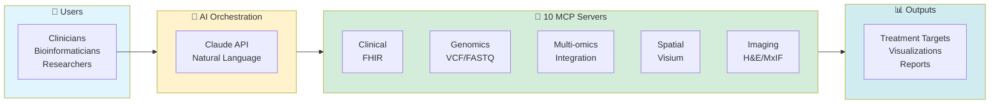

# Precision Medicine MCP Platform

[](https://www.python.org/downloads/)
[](https://modelcontextprotocol.io/)
[](https://claude.ai/download)
[](LICENSE)


> **40 hours of manual bioinformatics → 35 minutes AI-orchestrated**
>
> 10 specialized MCP servers | 55+ analysis tools | Stage IV Ovarian Cancer demo

---

## 💰 For Funders & Decision-Makers

**[See Funding Opportunities →](FUNDING.md)** | **[Executive Summary →](docs/EXECUTIVE_SUMMARY.md)**

**$3,098-3,176 savings per patient** | Production-ready for HIPAA-compliant hospital deployment

---

## 🚀 Quick Start by Role

| You Are... | Start Here | Time to Value |
|------------|------------|---------------|
| 💰 **Funder/Grant Reviewer** | [FUNDING.md](FUNDING.md) | 5 min |
| 🏥 **Hospital IT/Admin** | [Hospital Deployment](docs/for-hospitals/README.md) | 30 min overview |
| 🔬 **Bioinformatician** | [Researcher Guide](docs/for-researchers/README.md) | 25-35 min demo |
| 💻 **MCP Developer** | [Developer Guide](docs/for-developers/README.md) | 1 hour setup |
| 🎓 **Educator/Student** | [Educational Guide](docs/for-educators/README.md) | 25 min tutorial |
| 👥 **Patient/Family** | [Patient Resources](docs/for-patients/README.md) | 10 min read |

---

## Featured Use Case: PatientOne

<kbd></kbd>

**Stage IV High-Grade Serous Ovarian Cancer** - Platinum-resistant, 70% 5-year mortality

**What This Demonstrates:**
- Clinical data (Epic FHIR) + Genomics (VCF) + Multi-omics (RNA/Protein/Phospho)
- Spatial transcriptomics (10x Visium) + Imaging (H&E, MxIF)
- Natural language queries → AI orchestration → 35-minute analysis

**📖 Full Case Study:** [PatientOne Documentation →](docs/test-docs/patient-one-scenario/README.md)

---

## System Overview



**Server Status:** 4 production-ready | 1 at 95% | 5 mocked for demo | [Details →](servers/README.md)

---

## Repository Structure

```
precision-medicine-mcp/
├── ACKNOWLEDGMENTS.md      # Credits & scientific references
├── FUNDING.md              # Investment opportunities & ROI
├── LICENSE                 # Apache 2.0 License
├── README.md               # This file
├── data/                   # Synthetic patient data (100% safe for demos)
├── docs/                   # Documentation organized by audience
│   ├── for-funders/        # ROI analysis, competitive landscape, grant talking points
│   ├── for-hospitals/      # Deployment checklist, security overview
│   ├── for-developers/     # Architecture, contributing guide, quick reference
│   ├── for-researchers/    # Analysis workflows, bioinformatics methods
│   ├── for-educators/      # Classroom guides, learning objectives
│   ├── for-patients/       # Patient-friendly resources
│   ├── demos/              # 90-second pitch, full PatientOne demo
│   ├── prompt-library/     # 20+ ready-to-use clinical prompts
│   ├── getting-started/    # Installation, quick start, desktop-configs
│   ├── architecture/       # System design & modality workflows
│   ├── hospital-deployment/  # HIPAA compliance, operations manual
│   ├── deployment/         # GCP deployment status & guides
│   └── test-docs/          # Testing guides & PatientOne scenarios
├── infrastructure/         # Deployment, audit, environment setup
│   ├── deployment/         # GCP deployment scripts
│   ├── audit/              # Bias detection and audit tools
│   └── hospital-deployment/  # Hospital-specific infrastructure
├── servers/                # 10 MCP servers (Python)
│   ├── mcp-deepcell/       # Cell segmentation
│   ├── mcp-epic/           # Epic FHIR integration
│   ├── mcp-fgbio/          # Reference genomes, FASTQ QC
│   ├── mcp-huggingface/    # AI/ML inference
│   ├── mcp-mockepic/       # Mock Epic for testing
│   ├── mcp-multiomics/     # Multi-omics integration
│   ├── mcp-openimagedata/  # Imaging data (H&E, MxIF)
│   ├── mcp-seqera/         # Workflow orchestration
│   ├── mcp-spatialtools/   # Spatial transcriptomics
│   └── mcp-tcga/           # TCGA cohort data
├── shared/                 # Shared Python packages
│   ├── common/             # Common utilities
│   ├── models/             # Data models
│   ├── schemas/            # JSON schemas (CitL review, etc.)
│   └── utils/              # Helper functions
├── tests/                  # 167 automated tests
├── tools/                  # Automation & reporting tools
│   └── reports/            # Patient report generation, CitL submission
└── ui/                     # Streamlit chat, Jupyter notebook
```

---

## What and Why

**The Problem:** Multi-modal precision medicine is siloed and code-heavy - **too slow** for urgent patient care decisions.

**This Solution:**
- Natural language interface for complex bioinformatics
- AI orchestrates 10 specialized servers automatically
- 40 hours manual work → 35 minutes AI-orchestrated
- Extensible to other cancers and diseases

**What it is NOT:** Not clinically validated yet (research use only)

**See it / Try it:** [<5 minute demo video](https://www.youtube.com/watch?v=LUldOHHX5Yo) | [Code](docs/test-docs/patient-one-scenario)

**Quick Links:**
- 💰 [Funding Opportunities](FUNDING.md)
- 🤔 [Why MCP for Healthcare?](docs/WHY_MCP_FOR_HEALTHCARE.md)
- 📚 [Documentation Hub](docs/README.md)
- 🏗️ [Architecture Details](docs/architecture/README.md)
- 🧪 [Testing Guide](tests/README.md)

---

## License & Acknowledgments

**Apache 2.0 License** - Open source for research and commercial use

This project is dedicated to **PatientOne** - in memory of a dear friend who passed from High-Grade Serous Ovarian Carcinoma in 2025. Her courage inspired the creation of these AI-orchestrated bioinformatics tools.

**For detailed acknowledgments and scientific references:**
- [Complete Acknowledgments](ACKNOWLEDGMENTS.md)
- [Scientific References](docs/architecture/references.md)

---


