# Precision Medicine MCP Platform

[](https://www.python.org/downloads/)
[](https://modelcontextprotocol.io/)
[](https://claude.ai/download)
[](LICENSE)


> **40 hours of manual bioinformatics → 35 minutes AI-orchestrated**
>
> 10 specialized MCP servers | 55+ analysis tools | Stage IV Ovarian Cancer demo

---

## 💰 For Funders & Decision-Makers

**[See Funding Opportunities →](FUNDING.md)** | **[Executive Summary →](docs/EXECUTIVE_SUMMARY.md)**

**$3,098-3,176 savings per patient** | Production-ready for HIPAA-compliant hospital deployment

---

## 🚀 Quick Start by Role

| You Are... | Start Here | Time to Value |
|------------|------------|---------------|
| 💰 **Funder/Grant Reviewer** | [FUNDING.md](FUNDING.md) | 5 min |
| 🏥 **Hospital IT/Admin** | [Hospital Deployment](docs/hospital-deployment/README.md) | 30 min overview |
| 🔬 **Bioinformatician** | [Researcher Guide](docs/guides/for-bioinformaticians.md) | 25-35 min demo |
| 💻 **MCP Developer** | [Developer Guide](docs/guides/for-developers.md) | 1 hour setup |
| 🎓 **Educator/Student** | [Educational Guide](docs/guides/for-researchers.md) | 25 min tutorial |
| 👥 **Patient/Family** | [Patient Resources](docs/guides/for-patients.md) | 10 min read |

---

## Featured Use Case: PatientOne

<kbd></kbd>

**Stage IV High-Grade Serous Ovarian Cancer** - Platinum-resistant, 70% 5-year mortality

**What This Demonstrates:**
- Clinical data (Epic FHIR) + Genomics (VCF) + Multi-omics (RNA/Protein/Phospho)
- Spatial transcriptomics (10x Visium) + Imaging (H&E, MxIF)
- Natural language queries → AI orchestration → 35-minute analysis

**📖 Full Case Study:** [PatientOne Documentation →](docs/test-docs/patient-one-scenario/README.md)

---

## System Overview

```mermaid
graph LR
    subgraph Users["👥 Users"]
        U[Clinicians<br/>Bioinformaticians<br/>Researchers]
    end

    subgraph AI["🤖 AI Orchestration"]
        CLAUDE[Claude API<br/>Natural Language]
    end

    subgraph Servers["🔧 10 MCP Servers"]
        S1[Clinical<br/>FHIR]
        S2[Genomics<br/>VCF/FASTQ]
        S3[Multi-omics<br/>Integration]
        S4[Spatial<br/>Visium]
        S5[Imaging<br/>H&E/MxIF]
    end

    subgraph Output["📊 Outputs"]
        O[Treatment Targets<br/>Visualizations<br/>Reports]
    end

    U --> AI
    AI --> Servers
    Servers --> Output

    style Users fill:#e1f5ff
    style AI fill:#fff3cd
    style Servers fill:#d4edda
    style Output fill:#d1ecf1
```



**Server Status:** 4 production-ready | 1 at 95% | 5 mocked for demo | [Details →](servers/README.md)

---

## Repository Structure

```
precision-medicine-mcp/
├── FUNDING.md           # Investment opportunities & ROI
├── docs/                # Documentation by audience
│   ├── architecture/    # System design & modality workflows
│   ├── guides/          # User guides (for-clinicians, for-developers, etc.)
│   ├── hospital-deployment/  # HIPAA compliance, operations
│   └── test-docs/       # Testing guides & PatientOne scenarios
├── servers/             # 10 MCP servers (Python)
│   ├── mcp-fgbio/       # Reference genomes, FASTQ QC
│   ├── mcp-multiomics/  # Multi-omics integration
│   ├── mcp-spatialtools/  # Spatial transcriptomics
│   └── [7 more servers]
├── data/                # Synthetic patient data (100% safe)
├── infrastructure/      # GCP deployment scripts
├── tests/               # 167 automated tests
└── ui/                  # Streamlit chat, Jupyter notebook
```

---

## What and Why

**The Problem:** Multi-modal precision medicine is siloed and code-heavy - **too slow** for urgent patient care decisions.

**This Solution:**
- Natural language interface for complex bioinformatics
- AI orchestrates 10 specialized servers automatically
- 40 hours manual work → 35 minutes AI-orchestrated
- Extensible to other cancers and diseases

**What it is NOT:** Not clinically validated yet (research use only)

**See it / Try it:** [<5 minute demo video](https://www.youtube.com/watch?v=LUldOHHX5Yo) | [Code](docs/test-docs/patient-one-scenario)

**Quick Links:**
- 💰 [Funding Opportunities](FUNDING.md)
- 📚 [Documentation Hub](docs/README.md)
- 🏗️ [Architecture Details](docs/architecture/README.md)
- 🧪 [Testing Guide](tests/README.md)

---

## License & Acknowledgments

**Apache 2.0 License** - Open source for research and commercial use

This project is dedicated to **PatientOne** - in memory of a dear friend who passed from High-Grade Serous Ovarian Carcinoma in 2025. Her courage inspired the creation of these AI-orchestrated bioinformatics tools.

**For detailed acknowledgments and scientific references:**
- [Complete Acknowledgments](ACKNOWLEDGMENTS.md)
- [Scientific References](docs/architecture/references.md)

---


