# Precision Medicine MCP Platform

> **AI-orchestrated multi-modal synthesis: integrate genomics, transcriptomics, spatial biology, and imaging in a single analysis — capabilities that manual workflows cannot achieve at scale.**
>
> Estimated 40 hours of manual bioinformatics → 2-5 hours (8-20x faster).

What's here?
- Multi-modal integration across 5 data types via natural language — no coding required
- Clinician-in-the-Loop safety: every AI result requires human APPROVE/REVISE/REJECT
- Orchestrated by multi-provider AI (Claude or Gemini) with full audit trails
- Example for Stage IV Ovarian Cancer (synthetic data, HIPAA-safe)

---

## How It Works: The User Experience

```mermaid
graph LR
    A["🔬 Ask a Question<br/><i>natural language</i>"] --> B["🤖 AI Orchestrates<br/><i>selects tools automatically</i>"]
    B --> C["📊 Review Results<br/><i>visualizations + evidence</i>"]
    C --> D{"👨‍⚕️ Clinician Decision"}
    D -->|Approve| E["✅ Use in Care"]
    D -->|Revise| B
    D -->|Reject| F["🚫 Discard"]

    style A fill:#e1f5ff,stroke:#0066cc,stroke-width:2px
    style B fill:#fff3cd,stroke:#ffc107,stroke-width:2px
    style C fill:#d4edda,stroke:#28a745,stroke-width:2px
    style D fill:#f3e5f5,stroke:#9c27b0,stroke-width:2px
    style E fill:#c8e6c9,stroke:#388e3c,stroke-width:2px
    style F fill:#ffcdd2,stroke:#d32f2f,stroke-width:2px
```

> **Example:** *"Integrate PatientOne's RNA, protein, and spatial data to identify concordant pathway activations in platinum-resistant tumor regions"* — the AI selects the right tools, runs the analysis, and presents results for clinician review. No coding required.

---

## Featured Use Case: Patient One

<kbd></kbd>

**Stage IV High-Grade Serous Ovarian Cancer** - Platinum-resistant, 70% 5-year mortality

**What This Demonstrates:**
- **Multi-modal synthesis** — Clinical + Genomic + Multi-omics + Spatial + Imaging analyzed together, not in silos
- **Novel integration** — Spatial transcriptomics correlated with protein phosphorylation and genomic variants in one workflow
- **Natural language access** — Complex bioinformatics tools accessed via plain English, no coding required
- **Clinician authority** — All outputs are recommendations for Molecular Tumor Board APPROVE/REVISE/REJECT, not autonomous decisions

**Learn More**
- 📖 [Full Case Study: PatientOne Documentation](docs/reference/testing/patient-one/README.md)
- 📚 [Prompt Library](https://github.com/lynnlangit/precision-medicine-mcp/tree/main/docs/reference/prompts)
- 🏗️ [Architecture Details](docs/reference/architecture/README.md)
- 📚 [Documentation Hub](docs/INDEX.md)

---

## Safety & Clinical Governance

> **This platform is a clinical decision support tool — AI assists clinicians, never replaces them.**

| Safety Guarantee | What It Means |
|-----------------|---------------|
| **Clinician-in-the-Loop** | Every AI-generated report requires clinician **APPROVE / REVISE / REJECT** before clinical use ([workflow](docs/for-hospitals/citl-workflows/CITL_WORKFLOW_GUIDE.md)) |
| **HIPAA Safe Harbor** | All 18 PHI identifiers removed before data leaves the hospital ([details](docs/for-hospitals/compliance/hipaa.md)) |
| **Immutable Audit Trails** | Every query, tool call, routing decision, and output retained 10 years ([observability](docs/reference/architecture/platform/observability.md)) |
| **Isolated Deployment** | MCP servers run inside hospital VPC; patient data never leaves the controlled network ([security](docs/for-hospitals/SECURITY_OVERVIEW.md)) |
| **Full Traceability** | Every AI routing decision, parameter, and result is logged and visualizable ([details](docs/reference/architecture/platform/observability.md)) |
| **Synthetic Data Only** | No real PHI in this repository |

---

## 💰 For Decision-Makers
-  **[Executive Summary of Precision Medicine MCP](docs/for-funders/EXECUTIVE_SUMMARY.md)**
-  **[Why MCP for Healthcare?](docs/reference/architecture/WHY_MCP_FOR_HEALTHCARE.md)**
-  **[<5 minute demo video - shows a subset of available functionality](https://www.youtube.com/watch?v=LUldOHHX5Yo)**

---

## 🚀 Quick Start by Role

| You Are... | Start Here |
|------------|------------|
| 🏥 **Hospital IT/Admin** | [Hospital Deployment](docs/for-hospitals/README.md) |
| 🔬 **Bioinformatician** | [Researcher Guide](docs/for-researchers/README.md) |
| 💻 **MCP Developer** | [Developer Guide](docs/for-developers/README.md) |
| 🎓 **Educator/Student** | [Educational Guide](docs/for-educators/README.md) |
| 👥 **Patient/Family** | [Patient Resources](docs/for-patients/README.md) |
| 💰 **Funder/Grant Reviewer** | [FUNDING.md](docs/for-funders/FUNDING.md) |

---

## System Architecture

```mermaid
graph LR
    subgraph Users["👥 Users"]
        U[Clinicians<br/>Bioinformaticians<br/>Researchers]
    end

    subgraph AI["🤖 AI Orchestration"]
        CLAUDE[Claude<br/>Native MCP]
        GEMINI[Gemini<br/>SSE-based MCP]
        CUSTOM[Custom<br/>Custom Orchestration MCP]
    end

    subgraph ServerTypes["🔧 MCP ServerTypes"]
        S1[Clinical<br/>FHIR]
        S2[Genomics<br/>VCF/FASTQ]
        S3[Multi-omics<br/>RNA/Protein/Phospho]
        S4[Spatial<br/>Visium]
        S5[Imaging<br/> H&E/MxIF]
        S6[Perturbation<br/>GEARS/GNN + scRNA-seq]
        S7[Quantum<br/>Qiskit + spatial transcriptomics]
        S8[Patient Reports<br/>PDF Generation]
        S9[Genomic Results<br/>Somatic/CNV/HRD]
    end

    subgraph Output["📊 Orchestrated Outputs"]
        O[Treatment Targets<br/>Predictions<br/>Visualizations<br/>Patient Reports]
    end

    U --> CLAUDE
    U --> GEMINI
    U --> CUSTOM
    CLAUDE --> ServerTypes
    GEMINI --> ServerTypes
    CUSTOM --> ServerTypes
    S1 --> Output
    S2 --> Output
    S3 --> Output
    S4 --> Output
    S5 --> Output
    S6 --> Output
    S7 --> Output
    S8 --> Output
    S9 --> Output

    style Users fill:#e1f5ff
    style AI fill:#fff3cd
    style ServerTypes fill:#d4edda
    style Output fill:#d1ecf1
```

Note: Precision Medicine MCP servers are designed to work with external connectors which provide real-world data access: ClinicalTrials.gov, PubMed, bioRxiv, Seqera, cBioPortal, and Hugging Face — [details](docs/for-researchers/CONNECT_EXTERNAL_MCP.md)

