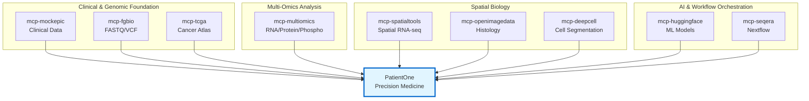

# Precision Medicine MCP Servers

AI-Orchestrated Clinical Bioinformatics for Precision Oncology using Model Context Protocol

[](https://www.python.org/downloads/)
[](https://modelcontextprotocol.io/)
[](https://claude.ai/download)
[](LICENSE)

## Statement of Purpose

**Transform clinical decision-making with AI-orchestrated bioinformatics**
- Analyze complete patient profiles—from genomics to spatial transcriptomics—using natural language
- Demonstrate end-to-end precision medicine workflows for Stage IV Ovarian Cancer across 9 specialized MCP servers and 40 tools
- Named 'Patient-One' in memory of a dear friend who passed away in 2025 due to HGSOC

---

## ⚠️ Important: Production Readiness Status

**Before using these servers for research or production:**

**Production-Ready Servers (2/9):**
- ✅ **mcp-multiomics** - Multi-omics integration (91 tests, 68% coverage)
- ✅ **mcp-fgbio** - Genomic QC (29 tests, 77% coverage)

**Conditionally Ready (1/9):**
- ⚠️ **mcp-spatialtools** (70% real - DEG, Moran's I, deconvolution ready; alignment mocked)

**Mocked/Partial Servers (6/9):**
- ❌ mcp-tcga, mcp-deepcell, mcp-huggingface, mcp-seqera (0% real - fully mocked)
- 🔶 mcp-openimagedata (30% real - basic features only)
- Mock EHR by design: mcp-epic

**📋 Check detailed status before production use:** [Server Implementation Status Matrix →](docs/SERVER_IMPLEMENTATION_STATUS.md)

---

## Featured Use Case: PatientOne

**Comprehensive Precision Medicine Workflow for Stage IV Ovarian Cancer**

<kbd></kbd>

**End-to-end demonstration using all 9 MCP servers:**
- **Patient:** Stage IV HGSOC, platinum-resistant, BRCA1 mutation
- **Data Modalities:** Clinical (Epic) → Genomic (FGbio, TCGA) → Multiomics (RNA/Protein/Phospho) → Spatial (900 spots, 31 genes) → Imaging (H&E, multiplex IF)
- **Cost:** DRY_RUN demo in 25-35 min (~$0.32) or real analysis in 2-4 hours ($15-45)
- **ROI:** Replaces ~40 hours of manual bioinformatics work per patient

**📖 Learn More:** [PatientOne Documentation →](architecture/patient-one/README.md) | [Quick Start →](tests/manual_testing/PatientOne-OvarianCancer/README.md) | [Sample Outputs →](architecture/patient-one/patient-one-outputs/)    

---

## Server Ecosystem Overview



---

## MCP Server Ecosystem (9 Servers, 40 Tools)

| Server | Tools | Purpose | Status |
|--------|-------|---------|--------|
| **mcp-fgbio** | 4 | FASTQ/VCF processing, genome references | ✅ Production |
| **mcp-spatialtools** | 10 | Spatial transcriptomics (QC, DEG, deconvolution, Moran's I) | ⚠️ 70% Real |
| **mcp-openimagedata** | 3 | Histology image retrieval and registration | 🔶 Partial |
| **mcp-multiomics** | 9 | RNA/Protein/Phospho integration (HAllA, Stouffer) | ✅ Production |
| **mcp-tcga** | 5 | Cancer atlas queries, cohort comparisons | ❌ Mocked |
| **mcp-epic** | 3 | Clinical EHR data (mock) | ❌ By design |
| **mcp-deepcell** | 2 | Cell segmentation and classification | ❌ Mocked |
| **mcp-huggingface** | 3 | Genomic language models | ❌ Mocked |
| **mcp-seqera** | 3 | Nextflow workflow orchestration | ❌ Mocked |

**📋 Detailed tool listings:** See individual server READMEs in [servers/](servers/)

---

## Quick Start

IMPORTANT: In this POC all MCP servers are running locally and are expected to use your local Claude Desktop as their client.

```bash
# Install (5 min)
git clone https://github.com/lynnlangit/precision-medicine-mcp.git
cd precision-medicine-mcp/tests/manual_testing/Solution-Testing
./install_dependencies.sh

# Configure Claude Desktop
cp ../../../configs/claude_desktop_config.json ~/Library/Application\ Support/Claude/claude_desktop_config.json

# Verify (restart Claude Desktop first)
./verify_servers.sh
```

**Prerequisites:** Python 3.11+, Claude Desktop, 16GB RAM, 50GB disk

---

## Example Client Usage

**Example of MCP servers in action using Claude Desktop:**
<kbd></kbd>

**Try PatientOne:** [Quick Start Guide →](tests/manual_testing/PatientOne-OvarianCancer/README.md)

---

## Resources

**References:**
- [MCP Specification](https://modelcontextprotocol.io/specification/2025-06-18)
- [FastMCP Docs](https://github.com/modelcontextprotocol/python-sdk)
- [BioinfoMCP Paper](https://arxiv.org/html/2510.02139v1)
- [Spatial Transcriptomics Review](https://academic.oup.com/nar/article/53/12/gkaf536/8174767)

**Cost & Performance Analysis:**
- [Complete Cost Analysis & ROI](docs/COST_ANALYSIS.md) - Detailed breakdown of DRY_RUN vs Real Data costs, time estimates, and return on investment calculations

**Acknowledgments:** Model Context Protocol (Anthropic), BioinfoMCP, FGbio, TCGA, Seqera Platform

---


**Last Updated:** December 29, 2025
**Built for the precision medicine community**
