# Precision Medicine MCP Platform

> **40 hours of manual bioinformatics → 35 minutes AI-orchestrated**
>
> 12 specialized MCP servers | 69 analysis tools | Multi-provider AI (Claude + Gemini) | Stage IV Ovarian Cancer demo

---

## 💰 For Decision-Makers
-  **[Executive Summary of Precision Medicine MCP](docs/EXECUTIVE_SUMMARY.md)**
-  **[Why MCP for Healthcare?](docs/WHY_MCP_FOR_HEALTHCARE.md)**
-  **[<5 minute demo video - shows a subset of available functionality](https://www.youtube.com/watch?v=LUldOHHX5Yo)** 

---

## 🚀 Quick Start by Role

| You Are... | Start Here | Time to Value |
|------------|------------|---------------|
| 🏥 **Hospital IT/Admin** | [Hospital Deployment](docs/for-hospitals/README.md) | 30 min overview |
| 🔬 **Bioinformatician** | [Researcher Guide](docs/for-researchers/README.md) | 25-35 min demo |
| 💻 **MCP Developer** | [Developer Guide](docs/for-developers/README.md) | 1 hour setup |
| 🎓 **Educator/Student** | [Educational Guide](docs/for-educators/README.md) | 25 min tutorial |
| 👥 **Patient/Family** | [Patient Resources](docs/for-patients/README.md) | 10 min read |
| 💰 **Funder/Grant Reviewer** | [FUNDING.md](docs/for-funders/FUNDING.md) | 5 min |

---

## System Overview

```mermaid
graph LR
    subgraph Users["👥 Users"]
        U[Clinicians<br/>Bioinformaticians<br/>Researchers]
    end

    subgraph AI["🤖 AI Orchestration"]
        CLAUDE[Claude<br/>Native MCP]
        GEMINI[Gemini<br/>SSE-based MCP]
        CUSTOM[Custom<br/>Custom Orchestration MCP]
    end

    subgraph ServerTypes["🔧 MCP ServerTypes"]
        S1[Clinical<br/>FHIR]
        S2[Genomics<br/>VCF/FASTQ]
        S3[Multi-omics<br/>RNA/Protein/Phospho]
        S4[Spatial<br/>Visium]
        S5[Imaging<br/> H&E/MxIF]
        S6[Perturbation<br/>GEARS/GNN + scRNA-seq]
        S7[Quantum<br/>Qiskit + spatial transcriptomics]
    end

    subgraph Output["📊 Orchestrated Outputs"]
        O[Treatment Targets<br/>Predictions<br/>Visualizations]
    end

    U --> CLAUDE
    U --> GEMINI
    U --> CUSTOM
    CLAUDE --> ServerTypes
    GEMINI --> ServerTypes
    CUSTOM --> ServerTypes
    S1 --> Output
    S2 --> Output
    S3 --> Output
    S4 --> Output
    S5 --> Output
    S6 --> Output
    S7 --> Output

    style Users fill:#e1f5ff
    style AI fill:#fff3cd
    style ServerTypes fill:#d4edda
    style Output fill:#d1ecf1
```

    
---

## Featured Use Case: PatientOne

<kbd></kbd>

**Stage IV High-Grade Serous Ovarian Cancer** - Platinum-resistant, 70% 5-year mortality

**What This Demonstrates:**
- Clinical data (Epic FHIR) + Genomics (VCF) + Multi-omics (RNA/Protein/Phospho)
- Spatial transcriptomics (10x Visium) + Imaging (H&E, MxIF)
- Natural language queries → AI orchestration → 35-minute analysis

**Learn More**
- 📖 [Full Case Study: PatientOne Documentation →](docs/reference/test-docs/patient-one-scenario/README.md)
- 📚 [Prompt Library](https://github.com/lynnlangit/precision-medicine-mcp/tree/main/docs/prompt-library)
- 🏗️ [Architecture Details](docs/reference/architecture/README.md)
- 📚 [Documentation Hub](docs/INDEX.md)

---

