# Precision Medicine MCP Servers

[](https://www.python.org/downloads/)
[](https://modelcontextprotocol.io/)
[](https://claude.ai/download)
[](LICENSE)

AI-Orchestrated Clinical Bioinformatics for Precision Oncology using Model Context Protocol

- Analyze complete patient profiles—from genomics to spatial transcriptomics—using **natural language**
- Demonstrate end-to-end precision medicine workflows for Stage IV Ovarian Cancer
- Use 9 specialized MCP servers and 40+ analysis tools

---

## Featured Use Case: PatientOne

**Comprehensive Precision Medicine Workflow for Stage IV Ovarian Cancer**

<kbd></kbd>

- **Patient:** Stage IV HGSOC, platinum-resistant, BRCA1 mutation
- **Data Modalities:** Clinical (Epic FHIR) → Genomic (FGbio, TCGA) → Multi-omics (RNA/Protein/Phospho) → Spatial (900 spots, 31 genes) → Imaging (H&E, multiplex IF)
- **Cost:** DRY_RUN demo in 25-35 min (~$0.32) or real analysis in 1-3 hours ($7-29)
- **ROI:** Replaces ~40 hours of manual bioinformatics work per patient

**📖 Learn More:** [PatientOne Documentation →](architecture/patient-one/README.md) | [Quick Start →](tests/manual_testing/PatientOne-OvarianCancer/README.md) | [Sample Outputs →](architecture/patient-one/patient-one-outputs/)

---

> **💼 For Funders & Decision-Makers:**
>
> **See the [Executive Summary](docs/EXECUTIVE_SUMMARY.md)** for:
> - ROI Analysis: $3,187 savings per patient, $288,700 net benefit Year 1
> - Production Readiness: HIPAA-compliant hospital deployment in 3 months
> - Budget: $15,000 pilot (3 months), $30,000/year production - for tokens and cloud services only
> - Risk Assessment: Comprehensive mitigation strategies
> - Success Metrics: Technical, business, and research outcomes

---

## Who is this For?

This repository serves multiple audiences in the precision medicine ecosystem. Find your role below to get started quickly:

<details>
<summary><h3>🔬 Bioinformatics Researchers</h3></summary>

*You want to analyze multi-omics cancer data and validate precision medicine hypotheses*

**What you can do with this repository:**
- Analyze spatial transcriptomics data (STAR alignment, batch correction, pathway enrichment)
- Integrate multi-omics datasets (RNA, protein, phosphoproteomics)
- Map tumor microenvironment heterogeneity
- Identify drug resistance mechanisms

**Quick Start:**
1. [PatientOne Workflow Guide](tests/manual_testing/PatientOne-OvarianCancer/README.md) - Complete analysis in 25-35 min
2. [mcp-spatialtools Quick Start](servers/mcp-spatialtools/QUICKSTART.md) - Batch correction, pathway enrichment (95% real)
3. [Cost Analysis](docs/operations/COST_ANALYSIS.md) - $0.32 demo or $7-29 real analysis

**Example Outputs for Researchers:**
- [PatientOne Results](architecture/patient-one/patient-one-outputs/for-researchers/) - Complete analysis results with visualizations

**Scientific References:**
- [Publications & Datasets](docs/REFERENCES.md) - Peer-reviewed papers, TCGA datasets, spatial transcriptomics resources

**Production-Ready Servers:**

| Server | Tools | Status | Key Features |
|--------|-------|--------|--------------|
| **mcp-multiomics** | 9 | ✅ Production | HAllA integration, Stouffer meta-analysis, upstream regulators |
| **mcp-fgbio** | 4 | ✅ Production | FASTQ/VCF QC, genome reference management |
| **mcp-spatialtools** | 10 | ⚠️ 95% Real | STAR alignment, ComBat batch correction, pathway enrichment, Moran's I |

**Mocked Servers** (workflow demonstration only):
- mcp-tcga, mcp-deepcell, mcp-huggingface, mcp-seqera (0% real)
- mcp-openimagedata (30% real - basic features only)
- mcp-epic (mock FHIR by design)

**Use cases:** PDX model analysis • Tumor microenvironment mapping • Drug resistance mechanisms • Pathway enrichment

</details>

<details>
<summary><h3>📊 Data Scientists / ML Engineers</h3></summary>
    
*You want to work with multi-omics data pipelines or build predictive models*

**What you can analyze:**

**Data Modalities (PatientOne example):**
- **Clinical:** FHIR resources (demographics, conditions, medications, biomarkers)
- **Genomics:** VCF files (TP53, PIK3CA, PTEN, BRCA1 mutations)
- **Multi-omics:** RNA-seq (15 samples) • Proteomics (15 samples) • Phosphoproteomics (15 samples)
- **Spatial:** 900 spots × 31 genes (Visium format)
- **Imaging:** H&E histology, multiplex IF (DAPI, CD3, CD8, Ki67, PanCK)

**Analysis Workflows:**
1. **Differential Expression** - Mann-Whitney U test + FDR correction
2. **Pathway Enrichment** - Fisher's exact test on 44 curated pathways (KEGG, Hallmark, GO_BP, Drug_Resistance)
3. **Spatial Autocorrelation** - Moran's I for spatially variable genes
4. **Cell Type Deconvolution** - Signature-based scoring (tumor, fibroblasts, immune, hypoxic)
5. **Batch Correction** - ComBat for removing technical variation
6. **Multi-omics Integration** - HAllA association analysis, Stouffer meta-analysis

**Start Here:**
- **Synthetic Dataset:** [PAT001-OVC-2025](data/patient-data/PAT001-OVC-2025/README.md) - 100% synthetic, 5 modalities
- **Multi-omics Examples:** [mcp-multiomics](servers/mcp-multiomics/README.md) - HAllA, Stouffer, upstream regulators
- **Batch Correction:** [ComBat Workflow](servers/mcp-spatialtools/tests/test_batch_correction_spatial_format.py)
- **ML Integration:** [mcp-huggingface](servers/mcp-huggingface/) (mocked - extensible for real models)

</details>

<details>
<summary><h3>💻 MCP Developers</h3></summary>
    
*You want to build custom MCP servers or extend existing bioinformatics tools*

**What you can learn:**
- How to architect MCP servers for complex bioinformatics workflows
- Best practices for testing (91 tests in mcp-multiomics, 68% coverage)
- Integration patterns for external tools (STAR, ComBat, HAllA)
- Real vs mocked implementation strategies

**Complete System Architecture:**

```mermaid
graph TB
    subgraph "User Interfaces"
        STREAMLIT[🌐 Streamlit Chat UI<br/>Web Interface<br/>Cloud Run]
        JUPYTER[📓 Jupyter Notebook<br/>Data Science Interface<br/>Cloud Run]
        DESKTOP[💬 Claude Desktop<br/>Local STDIO]
    end

    subgraph "AI Orchestration Layer"
        API[🤖 Claude API<br/>Anthropic Sonnet 4.5<br/>MCP Client Support]
    end

    subgraph "GCP Cloud Run - MCP Servers"
        subgraph "Clinical & Genomic"
            EPIC[mcp-mockepic<br/>Mock FHIR<br/>❌ Demo]
            FGBIO[mcp-fgbio<br/>FASTQ/VCF<br/>✅ Production]
            TCGA[mcp-tcga<br/>Cancer Data<br/>❌ Mocked]
        end

        subgraph "Multi-Omics"
            MULTI[mcp-multiomics<br/>RNA/Protein/Phospho<br/>✅ Production]
        end

        subgraph "Spatial Biology"
            SPATIAL[mcp-spatialtools<br/>Spatial RNA-seq<br/>✅ 95% Real]
            IMAGE[mcp-openimagedata<br/>Histology<br/>🔶 30% Real]
            DEEPCELL[mcp-deepcell<br/>Segmentation<br/>❌ Mocked]
        end

        subgraph "AI & Workflows"
            HF[mcp-huggingface<br/>ML Models<br/>❌ Mocked]
            SEQERA[mcp-seqera<br/>Nextflow<br/>❌ Mocked]
        end
    end

    subgraph "Analysis Workflow"
        PATIENT[🏥 PatientOne<br/>Stage IV HGSOC<br/>Multi-Omics Analysis]
    end

    STREAMLIT ==> API
    JUPYTER ==> API
    DESKTOP --> API

    API ==> FGBIO
    API ==> MULTI
    API --> SPATIAL
    API -.-> EPIC
    API -.-> TCGA
    API -.-> IMAGE
    API -.-> DEEPCELL
    API -.-> HF
    API -.-> SEQERA

    FGBIO ==> PATIENT
    MULTI ==> PATIENT
    SPATIAL --> PATIENT
    EPIC -.-> PATIENT
    TCGA -.-> PATIENT
    IMAGE -.-> PATIENT
    DEEPCELL -.-> PATIENT
    HF -.-> PATIENT
    SEQERA -.-> PATIENT

    style STREAMLIT fill:#d1ecf1,stroke:#0c5460,stroke-width:2px
    style JUPYTER fill:#d1ecf1,stroke:#0c5460,stroke-width:2px
    style DESKTOP fill:#d1ecf1,stroke:#0c5460,stroke-width:2px
    style API fill:#cce5ff,stroke:#004085,stroke-width:3px
    style PATIENT fill:#e1f5ff,stroke:#0066cc,stroke-width:3px
    style FGBIO fill:#d4edda,stroke:#28a745,stroke-width:2px
    style MULTI fill:#d4edda,stroke:#28a745,stroke-width:2px
    style SPATIAL fill:#d4edda,stroke:#28a745,stroke-width:2px
    style IMAGE fill:#fff3cd,stroke:#ffc107,stroke-width:1px
    style TCGA fill:#f8d7da,stroke:#dc3545,stroke-width:1px
    style DEEPCELL fill:#f8d7da,stroke:#dc3545,stroke-width:1px
    style HF fill:#f8d7da,stroke:#dc3545,stroke-width:1px
    style SEQERA fill:#f8d7da,stroke:#dc3545,stroke-width:1px
    style EPIC fill:#e2e3e5,stroke:#6c757d,stroke-width:1px
```



**Architecture Layers:**
- **User Interfaces:** Streamlit UI (web) • Jupyter Notebook (data science) • Claude Desktop (local)
- **AI Orchestration:** Claude API with MCP client support (connects to all 9 servers)
- **MCP Servers:** 9 servers deployed on GCP Cloud Run (SSE transport)
- **Analysis Workflow:** PatientOne precision medicine analysis

**Server Status:**
- ✅ **Production Ready** (2/9): mcp-fgbio, mcp-multiomics
- ⚠️ **95% Real** (1/9): mcp-spatialtools
- 🔶 **30% Real** (1/9): mcp-openimagedata
- ❌ **Mocked** (4/9): mcp-tcga, mcp-deepcell, mcp-huggingface, mcp-seqera
- **Mock by Design** (1/9): mcp-mockepic (intentionally synthetic FHIR data)

**Development Resources:**
- **Architecture:** [System Design](architecture/README.md) • [PatientOne Architecture](architecture/patient-one/README.md)
- **Best Reference:** [mcp-multiomics](servers/mcp-multiomics/README.md) (91 tests, 68% coverage, HAllA integration)
- **95% Real Example:** [mcp-spatialtools](servers/mcp-spatialtools/) ([Implementation Status](servers/mcp-spatialtools/SERVER_IMPLEMENTATION_STATUS.md))
- **Testing Guide:** [Manual Testing Guide](tests/manual_testing/Solution-Testing/MANUAL_TESTING_GUIDE.md)
- **Status Matrix:** [All Server Implementation Details](docs/SERVER_IMPLEMENTATION_STATUS.md)

**Example Outputs for Developers:**
- [Technical Documentation](architecture/patient-one/patient-one-outputs/for-developer/) - Full test prompts, server reference guide, MCP reports

**See It In Action:**

<kbd></kbd>

*MCP servers orchestrating bioinformatics workflows through Claude Desktop*

</details>


<details>
<summary><h3>🛠️ Software Engineers</h3></summary>

*You want to deploy, integrate, or scale this system*

**Quick Start - Local Development (5 minutes):**

```bash
# 1. Clone repository
git clone https://github.com/lynnlangit/precision-medicine-mcp.git
cd precision-medicine-mcp/tests/manual_testing/Solution-Testing

# 2. Install dependencies
./install_dependencies.sh  # Installs 9 MCP servers

# 3. Configure Claude Desktop
cp ../../../desktop-configs/claude_desktop_config.json \
   ~/Library/Application\ Support/Claude/claude_desktop_config.json

# 4. Verify (restart Claude Desktop first)
./verify_servers.sh
```

**Prerequisites:** Python 3.11+, Claude Desktop, 16GB RAM, 50GB disk

**Deployment Scenarios:**

| Environment | Setup | Resources | Use Case |
|-------------|-------|-----------|----------|
| **Local Development** | MacOS/Linux + Claude Desktop | 16GB RAM, 50GB disk | Research, testing, demos |
| **Cloud Research** | GCP Healthcare API + Vertex AI | Custom (scalable) | Production research, multi-patient |
| **HPC Clusters** | Nextflow workflows | 32GB+ RAM, 100GB+ disk | Large-scale spatial analysis with STAR |

**Infrastructure Resources:**
- **Cloud Setup:** [GCP Deployment Guide](infrastructure/GET_STARTED.md) - Healthcare API, FHIR stores, Vertex AI
- **Config Files:** [Claude Desktop Config](desktop-configs/claude_desktop_config.json)
- **Automated Testing:** [Verify All 9 Servers](tests/manual_testing/Solution-Testing/MANUAL_TESTING_GUIDE.md)
- **STAR Installation:** [STAR Aligner Setup](servers/mcp-spatialtools/INSTALL_STAR.md) (for spatial analysis)

**GCP Cloud Run Deployment:**


All 9 servers successfully deployed and tested on Google Cloud Platform:

| Server | Status | Test Result | URL |
|--------|--------|-------------|-----|
| mcp-fgbio | ✅ Running | ✓ PASS | https://mcp-fgbio-ondu7mwjpa-uc.a.run.app |
| mcp-multiomics | ✅ Running | ✓ PASS | https://mcp-multiomics-ondu7mwjpa-uc.a.run.app |
| mcp-spatialtools | ✅ Running | ✓ PASS | https://mcp-spatialtools-ondu7mwjpa-uc.a.run.app |
| mcp-tcga | ✅ Running | ✓ PASS | https://mcp-tcga-ondu7mwjpa-uc.a.run.app |
| mcp-openimagedata | ✅ Running | ✓ PASS | https://mcp-openimagedata-ondu7mwjpa-uc.a.run.app |
| mcp-seqera | ✅ Running | ✓ PASS | https://mcp-seqera-ondu7mwjpa-uc.a.run.app |
| mcp-huggingface | ✅ Running | ✓ PASS | https://mcp-huggingface-ondu7mwjpa-uc.a.run.app |
| mcp-deepcell | ✅ Running | ✓ PASS | https://mcp-deepcell-ondu7mwjpa-uc.a.run.app |
| mcp-mockepic | ✅ Running | ✓ PASS | https://mcp-mockepic-ondu7mwjpa-uc.a.run.app |

**Test Results:** 9/9 servers passed functional testing via Claude API (2025-12-30)

- **Deployment Guide:** [GCP Cloud Run Setup](docs/deployment/DEPLOYMENT_STATUS.md)
- **Test Script:** [Automated Testing](tests/integration/test_all_gcp_servers.py)

**Streamlit Chat UI (Visual Interface):**

Web-based chat interface for testing MCP servers (deployed on Cloud Run):

🌐 **Live App:** https://streamlit-mcp-chat-ondu7mwjpa-uc.a.run.app

**Features:**
- Chat interface (Claude Desktop-like experience)
- Select which MCP servers to use
- Example prompts for common workflows
- Token usage tracking
- Real-time responses from deployed servers

**API Key Security:**
- **Local Development:** API key stored in `.env` file (gitignored, never committed)
- **Cloud Deployment:** API key stored as Cloud Run environment variable (encrypted at rest)
- **Never exposed:** API key not visible in logs, code, or browser
- **Best Practice:** Use separate API keys for dev/prod environments

**Quick Test:**
```bash
# Local testing
cd ui/streamlit-app
pip install -r requirements.txt
export ANTHROPIC_API_KEY=your_key_here
streamlit run app.py

# Access at http://localhost:8501
```

- **UI Documentation:** [Streamlit App Guide](ui/streamlit-app/README.md)
- **Deployment Script:** [deploy.sh](ui/streamlit-app/deploy.sh)

**Jupyter Notebook Client (Data Science Interface):**

Interactive Jupyter notebook for reproducible bioinformatics analysis (deployed on Cloud Run):

🌐 **Live JupyterLab:** https://jupyter-mcp-notebook-305650208648.us-central1.run.app

**Features:**
- Interactive Python notebook environment
- MCPClient helper class for easy MCP server calls
- Pre-built workflows (spatial analysis, pathway enrichment, multi-omics)
- Token usage tracking and cost estimation
- Visualization examples (matplotlib, seaborn, plotly)
- Reproducible analysis - save and share workflows

**Quick Test:**
```bash
# Local testing
cd ui/jupyter-notebook
pip install -r requirements.txt
export ANTHROPIC_API_KEY=your_key_here
jupyter notebook mcp_client.ipynb

# Access at http://localhost:8888
```

**Example Usage:**
```python
from mcp_client import MCPClient

client = MCPClient()
result = client.call_servers(
    prompt="Analyze spatial transcriptomics for Patient-001",
    servers=["spatialtools"]
)
print(result["response"])
print(f"Cost: ${result['usage']['estimated_cost_usd']:.4f}")
```

- **Notebook Documentation:** [Jupyter Notebook Guide](ui/jupyter-notebook/README.md)
- **Deployment Script:** [deploy.sh](ui/jupyter-notebook/deploy.sh)

---

## 🏥 Hospital Deployment Ready

The Precision Medicine MCP system is **production-ready for HIPAA-compliant hospital deployment**:

- ✅ **HIPAA-compliant infrastructure** with 10-year audit logs and encrypted secrets
- ✅ **Azure AD SSO integration** for seamless hospital authentication
- ✅ **Epic FHIR integration** with automatic de-identification (HIPAA Safe Harbor method)
- ✅ **Complete operations manual** and runbooks for IT teams
- ✅ **User guides** for both clinicians and bioinformaticians
- ✅ **Production deployment scripts** for authenticated Cloud Run services

**📖 Learn More:** [Hospital Deployment Guide →](infrastructure/hospital-deployment/README.md)

**📖 Complete Documentation:**
- [Operations Manual](docs/hospital-deployment/OPERATIONS_MANUAL.md) - System architecture and incident response
- [Admin Guide](docs/hospital-deployment/ADMIN_GUIDE.md) - User management and security
- [User Guide](docs/hospital-deployment/USER_GUIDE.md) - For clinicians and researchers
- [HIPAA Compliance](docs/hospital-deployment/HIPAA_COMPLIANCE.md) - Compliance validation
- [Audit Log Guide](docs/hospital-deployment/AUDIT_LOG_GUIDE.md) - 10-year retention procedures

**Deployment Configuration:**
- **Budget**: ~$1,000/month during pilot phase
- **Timeline**: 3 months (MVP → Pilot → Production)
- **Users**: Initial pilot with 5 testers (2 clinicians, 3 bioinformaticians)
- **Data Scope**: 100 patients for ovarian cancer spatial genomics research

**3-Month Deployment Timeline:**


**Key Milestones:**
- 🎯 **Week 4**: Core servers deployed, SSO working, Epic connected
- 🎯 **Week 8**: All 9 servers operational, 5 users trained, security audit passed
- 🎯 **Week 12**: Production launch with 100 patients, full monitoring, IT handoff complete

</details>

---

<details>
<summary><h3>🏥 Clinical Care Teams (Oncologists, Genetic Counselors)</h3></summary>
    
*You want to understand how AI-orchestrated bioinformatics can support clinical decision-making*

**⚠️ IMPORTANT:** This repository is for **RESEARCH USE ONLY**. Not validated for clinical decision-making, FDA/EMA approval, or patient care.

**What this demonstrates:**
- How multi-omics data can identify potential treatment strategies
- Integration of clinical (FHIR), genomic, spatial, and imaging data
- AI orchestration of complex bioinformatics workflows
- Evidence-based pathway analysis (44 curated ovarian cancer pathways)

**Educational Resources:**
- **Case Study:** [PatientOne - Stage IV HGSOC](architecture/patient-one/README.md)
- **Clinical Reports:** [Sample Outputs for Care Teams](architecture/patient-one/patient-one-outputs/for-care-team/) - MCP reports, spatial analysis, multi-omics figures
- **Data Privacy:** [FHIR & De-identification Guide](infrastructure/test-data/MOCK_FHIR_GUIDE.md) - HIPAA Safe Harbor method
- **Workflow Overview:** See PatientOne graphic above for data flow

**Educational value:** Understand precision medicine workflows • Evaluate bioinformatics pipelines • Assess multi-omics integration approaches

**⚠️ Disclaimer:** This is research technology, not clinical care. Always consult qualified oncologists for medical decisions.

</details>

<details>
<summary><h3>👥 Patients & Families</h3></summary>
    
*You want to understand precision medicine for ovarian cancer*

**⚠️ IMPORTANT:** This is a **research demonstration**, not a clinical tool. Always consult qualified oncologists for medical decisions.

**What this demonstrates:**
Precision medicine analyzes your unique cancer profile—genomics, transcriptomics, and imaging—to identify which treatments are most likely to work for you. This repository shows how bioinformatics can process this complex data, but it's research technology, not clinical care.

**PatientOne Story:**
This project is named in memory of a dear friend who passed from High-Grade Serous Ovarian Carcinoma (HGSOC) in 2025. Her journey inspired the development of these tools to help researchers understand and combat this devastating disease.

**Learn More:**
- **PatientOne Background:** [Case Study](architecture/patient-one/README.md)
- **Patient-Friendly Materials:** [Summaries & Infographics](architecture/patient-one/patient-one-outputs/for-patient/) - Simplified reports, medication guides, visual summaries
- **What is Precision Medicine:** [Overview](architecture/patient-one/README.md#what-is-precision-medicine) (coming soon)
- **Educational Resources:** [Scientific References & Publications](docs/REFERENCES.md) - Peer-reviewed articles, clinical resources
- **Clinical Trials:** [ClinicalTrials.gov - Ovarian Cancer](https://clinicaltrials.gov/)

**Important Reminders:**
- This repository is for **RESEARCH ONLY** - not for diagnosing or treating cancer
- All treatment decisions must be made by qualified oncologists
- The synthetic data is for demonstration purposes - not real patient data
- Consult your healthcare team for personalized medical advice

</details>

<details>
<summary><h3>🎓 Students & Educators</h3></summary>
    
*You want to learn or teach precision medicine and bioinformatics*

**Why this is perfect for teaching:**
- ✅ **100% synthetic data** - No patient privacy concerns, safe for classroom use
- ✅ **Low cost** - DRY_RUN mode ~$0.32 per complete analysis
- ✅ **Comprehensive** - Covers all major bioinformatics domains
- ✅ **Well-documented** - Step-by-step guides with expected outputs

**Start Here:**
1. **Tutorials:** [PatientOne Quick Start](tests/manual_testing/PatientOne-OvarianCancer/README.md) - Step-by-step walkthrough
2. **Synthetic Data:** [PAT001-OVC-2025](data/patient-data/PAT001-OVC-2025/README.md) - Clinical, genomics, spatial, imaging
3. **Architecture:** [System Design](architecture/) - Data flow, integration patterns
4. **Hands-on:** Run DRY_RUN mode in 25-35 min for ~$0.32

**Educational Topics Covered:**
- Precision oncology workflows (clinical → genomic → spatial → treatment)
- Multi-omics data integration (RNA, protein, phospho)
- Spatial transcriptomics analysis (batch correction, pathway enrichment)
- AI orchestration in bioinformatics (natural language → tool execution)
- Statistical methods (Fisher's exact, FDR, Moran's I, Mann-Whitney U)
- Cloud deployment (GCP Healthcare API, FHIR)

**Classroom Activities:**
- Analyze PatientOne case study (25-35 min)
- Compare DRY_RUN vs real analysis results
- Design custom precision medicine workflows
- Extend servers with new bioinformatics tools

</details>

---

## Acknowledgments

This project is dedicated to **PatientOne** - in memory of a dear friend who passed from High-Grade Serous Ovarian Carcinoma in 2025. Her courage inspired the creation of these AI-orchestrated bioinformatics tools.

**For detailed acknowledgments, citations, and scientific references:**
- [Complete Acknowledgments](ACKNOWLEDGMENTS.md)
- [Scientific References & Publications](docs/REFERENCES.md)

---
