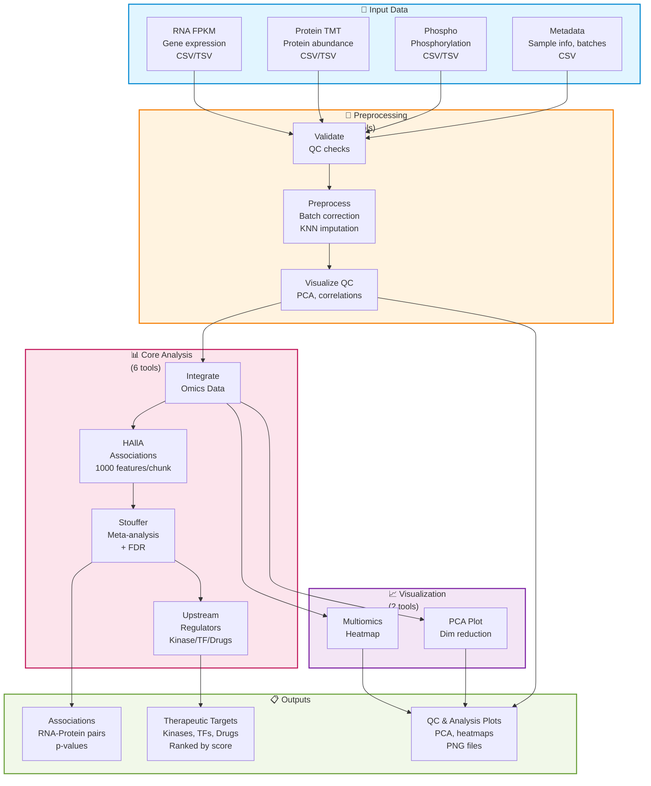

# Multiomics Integration Architecture

**Status:** ✅ Production Ready (10 tools, 91 automated tests, 68% code coverage)
**Last Updated:** 2026-01-10

---

## Executive Summary

The **mcp-multiomics** server integrates RNA, protein, and phosphorylation data from Patient-Derived Xenograft (PDX) models to identify therapeutic resistance mechanisms and predict treatment targets.

**Enhanced Features (2025):**
- ✅ **Preprocessing Pipeline**: Batch correction, imputation, QC visualization
- ✅ **Upstream Regulator Analysis**: Kinase/TF/drug target prediction
- ✅ **Enhanced HAllA**: Chunking strategy for large datasets (1000 features/chunk = 5 min vs days)
- ✅ **Correct FDR Workflow**: Applied AFTER Stouffer's meta-analysis (not before)

**Key Capabilities:**
- Data preprocessing (validation, batch correction, imputation)
- Multi-omics integration (RNA + Protein + Phospho)
- Association testing (HAllA with chunking)
- Meta-analysis (Stouffer's method + FDR)
- Therapeutic target prediction (kinases, transcription factors, drugs)
- Visualization (heatmaps, PCA plots)

---

## System Overview



---

## Clinical Use Case: Platinum-Resistant Ovarian Cancer (PatientOne)

### Research Question
Which molecular pathways drive platinum resistance in High-Grade Serous Ovarian Cancer (HGSOC)?

### Workflow Summary

**STEP 1: Data Preprocessing (Required FIRST)**
```
1. Validate data quality → Check for missing values, batch effects
2. Preprocess → Batch correct, impute missing values (KNN)
3. Visualize QC → PCA plots, correlation heatmaps
```

**STEP 2: Multi-Omics Integration**
```
4. Integrate RNA + Protein + Phospho data → Align samples, normalize
5. Identify concordant features → RNA-Protein correlation > 0.5
```

**STEP 3: Association Analysis**
```
6. Run HAllA → Find RNA-Protein associations (1000 features/chunk)
7. Calculate Stouffer's meta-analysis → Combine p-values across omics
8. Apply FDR correction → Control false discovery rate (AFTER Stouffer)
```

**STEP 4: Therapeutic Target Discovery**
```
9. Predict upstream regulators → Identify kinases, TFs driving resistance
10. Rank drug targets → Score based on druggability and pathway impact
```

**STEP 5: Visualization**
```
11. Generate heatmap → Show top associations across omics layers
12. Create PCA plot → Visualize resistant vs. sensitive sample separation
```

### Expected Findings (PatientOne)

**Resistance Mechanisms:**
- **PI3K/AKT Pathway Activation**
  - RNA: PIK3CA, AKT1, MTOR upregulated
  - Protein: phospho-AKT (Ser473) increased
  - Association: RNA-Protein correlation = 0.85 (p < 0.001)

- **Anti-Apoptotic Signaling**
  - RNA: BCL2, BCL2L1 upregulated
  - Protein: BCL-XL increased
  - Stouffer's combined p-value: 3.2e-8

- **Drug Efflux Pumps**
  - RNA: ABCB1 (MDR1) 4.3× upregulated
  - Protein: P-glycoprotein increased

**Predicted Therapeutic Targets:**
1. **PI3K Inhibitor**: Alpelisib (BYL719) - targets PIK3CA mutation
2. **AKT Inhibitor**: Capivasertib (AZD5363) - blocks phospho-AKT
3. **BCL2 Inhibitor**: Venetoclax - overcomes anti-apoptotic resistance
4. **mTOR Inhibitor**: Everolimus - downstream PI3K/AKT blockade

---

## Server Architecture

### Tools (10 total)

**Preprocessing (3 tools)** - Run FIRST:
1. `validate_multiomics_data` - QC checks for missing values, batch effects
2. `preprocess_multiomics_data` - Batch correction, KNN imputation
3. `visualize_data_quality` - PCA plots, correlation heatmaps

**Core Analysis (5 tools)**:
4. `integrate_omics_data` - Align and normalize RNA, protein, phospho
5. `run_halla_analysis` - Find associations (1000 features/chunk)
6. `calculate_stouffer_meta` - Meta-analysis + FDR correction
7. `predict_upstream_regulators` - Kinase/TF/drug target prediction

**Visualization (2 tools)**:
8. `create_multiomics_heatmap` - Multi-omics association heatmap
9. `run_multiomics_pca` - PCA dimensionality reduction

**Note:** Tool 10 is a duplicate/deprecated tool not counted in primary workflow.

**For detailed tool specifications:** See [mcp-multiomics README](../../servers/mcp-multiomics/README.md)

### Resources (4 total)
- `multiomics://config` - Server configuration and preprocessing settings
- `multiomics://example-data` - Sample PDX datasets for testing
- `multiomics://integrated/all_features` - Integrated omics data matrix
- `multiomics://significant/combined` - Significant associations post-FDR

### Prompts (3 total)
- `analyze_resistance_signature` - Identify platinum resistance mechanisms
- `create_integrated_visualization` - Generate multi-omics heatmaps
- `explore_multimodal_concordance` - Find concordant RNA-Protein features

---

## Workflow Principles

### 1. Preprocessing is MANDATORY
**Why:** Raw omics data contains batch effects, missing values, and technical artifacts that confound biological signals.

**Best Practice:**
- ALWAYS run `validate_multiomics_data` → `preprocess_multiomics_data` → `visualize_data_quality` BEFORE analysis
- Check PCA plots: Samples should cluster by biology (resistant vs. sensitive), NOT by batch
- Impute missing values: KNN imputation for <20% missingness per feature

### 2. Correct FDR Timing (CRITICAL)
**❌ WRONG:** Apply FDR to RNA p-values → Apply FDR to Protein p-values → Combine
**✅ CORRECT:** Calculate Stouffer's combined p-values → THEN apply FDR

**Why:** Applying FDR before meta-analysis inflates false positives by treating each omics layer independently.

### 3. HAllA Chunking for Large Datasets
**Problem:** HAllA with 10,000 features = 50M pairwise tests (computationally infeasible)

**Solution:** Chunk datasets into 1,000 feature blocks
- Runtime: 5 minutes per chunk vs. days for full dataset
- Memory: <8GB vs. >64GB

### 4. Upstream Regulator Analysis
**Goal:** Identify druggable targets (kinases, transcription factors) driving resistance

**Method:**
- Collect significant RNA-Protein associations
- Map to kinase-substrate databases (PhosphoSitePlus)
- Rank by:
  - Enrichment score (how many substrates are dysregulated)
  - Druggability (FDA-approved inhibitors available)
  - Pathway centrality (hub proteins)

---

## Data Requirements

### Input Files
1. **RNA Expression** (CSV/TSV)
   - Rows: Genes (HGNC symbols)
   - Columns: Samples
   - Values: FPKM or TPM (log2-transformed)

2. **Protein Abundance** (CSV/TSV)
   - Rows: Proteins (UniProt IDs or gene names)
   - Columns: Samples
   - Values: TMT intensities (log2-transformed)

3. **Phosphorylation** (CSV/TSV)
   - Rows: Phosphosites (e.g., AKT1_S473)
   - Columns: Samples
   - Values: Phospho intensities (log2-transformed)

4. **Sample Metadata** (CSV)
   - Columns: sample_id, condition (resistant/sensitive), batch, replicate
   - Used for batch correction and grouping

### Output Files
- `associations.csv` - RNA-Protein pairs with p-values, FDR
- `upstream_regulators.csv` - Kinases/TFs ranked by enrichment score
- `multiomics_heatmap.png` - Visualization of top associations
- `pca_plot.png` - Sample separation by resistance status
- `qc_plots.png` - Preprocessing quality control

---

## PatientOne Integration (TEST_2)

### Test Case
**Patient:** PAT001-OVC-2025 (Stage IV HGSOC, platinum-resistant)

**Data Sources:**
- RNA: Tumor biopsy RNA-seq (31 cancer genes)
- Protein: TMT proteomics (protein abundance)
- Phospho: Phosphoproteomics (kinase activity)
- Metadata: Resistant vs. initial sensitive PDX models

**Expected Results:**
- PI3K/AKT pathway activation (RNA + Protein + Phospho concordant)
- BCL2 family upregulation (anti-apoptotic)
- ABCB1 overexpression (drug efflux)
- Predicted targets: Alpelisib (PIK3CA), Venetoclax (BCL2)

**Test File:** [TEST_2_MULTIOMICS.txt](../../tests/manual_testing/PatientOne-OvarianCancer/implementation/TEST_2_MULTIOMICS.txt)

---

## 📖 Detailed Documentation

For detailed implementation information, see:

### Server Documentation
- **mcp-multiomics:** [/servers/mcp-multiomics/README.md](../../servers/mcp-multiomics/README.md)
  - Tool specifications with parameters and returns
  - Installation and configuration
  - Example workflows
  - Data format requirements
  - Testing procedures

### Deployment & Operations
- **Current Status:** [SERVER_IMPLEMENTATION_STATUS.md](../../docs/SERVER_IMPLEMENTATION_STATUS.md)
- **GCP Deployment:** [deployment/DEPLOYMENT_STATUS.md](../../docs/deployment/DEPLOYMENT_STATUS.md)

### Additional Resources
- **Data Governance:** [DATA_GOVERNANCE.md](../../docs/operations/DATA_GOVERNANCE.md)

---

## Quick Start

**For users:** Read the [mcp-multiomics README](../../servers/mcp-multiomics/README.md) → Run [PatientOne TEST_2](../../tests/manual_testing/PatientOne-OvarianCancer/implementation/TEST_2_MULTIOMICS.txt)

**For developers:** See [server README](../../servers/mcp-multiomics/README.md) for tool details and implementation

---

## Related Workflows

- [Spatial Transcriptomics](../spatial-transcriptomics/README.md) - Gene expression spatial patterns (TEST_3)
- [Imaging Analysis](../imaging/README.md) - Histology and cell segmentation (TEST_4)
- [PatientOne Workflow](../../tests/manual_testing/PatientOne-OvarianCancer/README.md) - Complete precision medicine workflow

---

**See also:** [Main Architecture](../README.md) | [PatientOne Workflow](../../tests/manual_testing/PatientOne-OvarianCancer/README.md)
