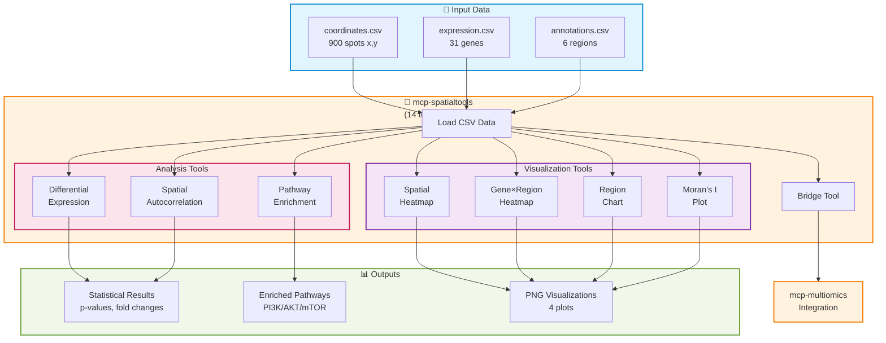

# Spatial Transcriptomics Architecture

**Status:** Production - 2 servers deployed (mcp-spatialtools, mcp-openimagedata)
**Last Updated:** 2026-01-10

---

## System Overview

---

## Quick Navigation

### Core Documentation
- **[OVERVIEW.md](OVERVIEW.md)** - System architecture and design principles
- **[SERVERS.md](SERVERS.md)** - All 9 MCP servers (4 deployed, 5 future)
- **[DEPLOYMENT.md](DEPLOYMENT.md)** - GCP Cloud Run deployment

### Workflows
- **[CSV_WORKFLOW.md](CSV_WORKFLOW.md)** - ⭐ **Current implementation** - Pre-processed tabular data (PatientOne tests)
- **[FASTQ_WORKFLOW.md](FASTQ_WORKFLOW.md)** - Raw sequencing alignment (implemented, not tested)

### Reference
- **[mcp-spatialtools README](../../servers/mcp-spatialtools/README.md)** - All 14 spatialtools tools (10 analysis + 4 visualization)
- **[GLOSSARY.md](GLOSSARY.md)** - Terms and definitions

---

## What This Is

Spatial transcriptomics component of the Precision Medicine MCP system. Processes gene expression data with spatial coordinates for cancer analysis.

**Current implementation:** CSV/tabular workflow (900 spots, 31 genes, 6 regions)
**Server:** mcp-spatialtools (14 tools: 10 analysis + 4 visualization)

---

## Quick Start

**For users:** Read [CSV_WORKFLOW.md](CSV_WORKFLOW.md) → Run [PatientOne TEST_3_SPATIAL.txt](../../tests/manual_testing/PatientOne-OvarianCancer/implementation/TEST_3_SPATIAL.txt)

**For developers:** See [OVERVIEW.md](OVERVIEW.md) for architecture

**For deployers:** See [DEPLOYMENT.md](DEPLOYMENT.md) for GCP procedures

---

**See also:** [Main Architecture](../README.md) | [PatientOne Workflow](../../tests/manual_testing/PatientOne-OvarianCancer/README.md)
