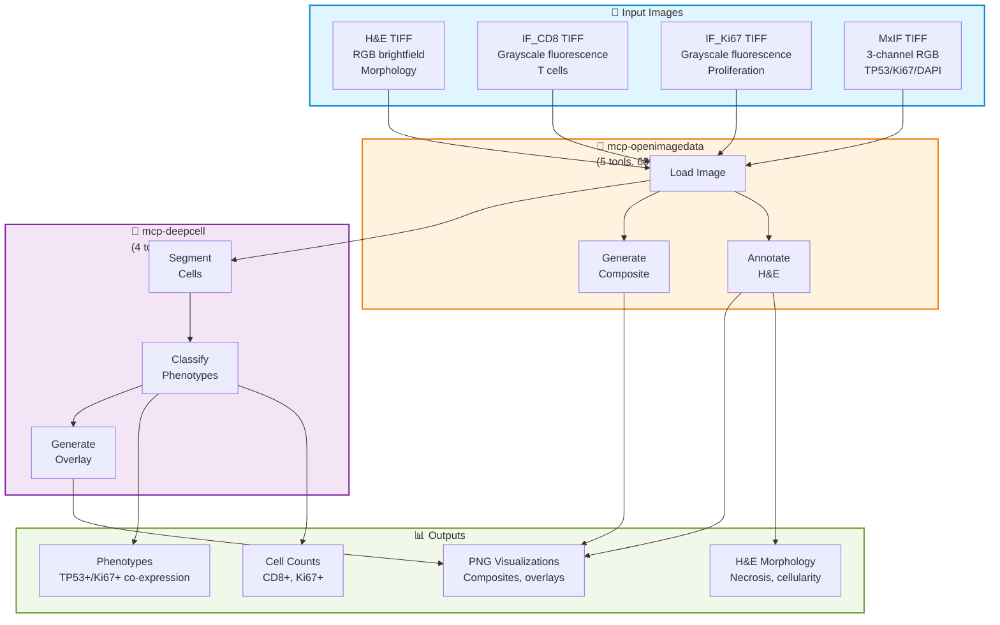

# Imaging Analysis Architecture

**Status:** Mostly Implemented (openimagedata: 60% real, deepcell: 100% real)
**Last Updated:** 2026-01-31

---

## System Overview

---

## Quick Navigation

### Workflows
- **[HE_WORKFLOW.md](HE_WORKFLOW.md)** - ⭐ **H&E brightfield morphology** (openimagedata ONLY, no segmentation)
- **[MXIF_WORKFLOW.md](MXIF_WORKFLOW.md)** - **MxIF fluorescence cell segmentation** (openimagedata → deepcell pipeline)

### Servers
- **[mcp-openimagedata README](../../../servers/mcp-openimagedata/README.md)** - Image loading and visualization (5 tools, 60% real)
- **[mcp-deepcell README](../../../servers/mcp-deepcell/README.md)** - Cell segmentation and phenotyping (4 tools, 100% real)

### Reference
- **[GLOSSARY.md](GLOSSARY.md)** - Imaging terminology (H&E, MxIF, DeepCell, segmentation)

---

## What This Is

Imaging analysis component for histology and multiplexed immunofluorescence (MxIF) in the Precision Medicine MCP system.

**Current workflows:**
1. **H&E:** Brightfield morphology assessment (chromogenic stains, RGB TIFF)
2. **MxIF:** Fluorescence cell segmentation (fluorescent antibodies, multi-channel TIFF)

**Servers:**
- mcp-openimagedata (60% real - loading + visualization)
- mcp-deepcell (100% real - segmentation + phenotyping)

---

## H&E vs MxIF: Key Differences

| Feature | H&E | MxIF |
|---------|-----|------|
| **Microscopy** | Brightfield | Fluorescence |
| **Staining** | Chromogenic dyes | Fluorescent antibodies |
| **Format** | RGB TIFF | Grayscale (single) or Multi-channel (multiplex) |
| **Purpose** | Visual morphology | Quantitative protein expression |
| **Analysis** | Visual inspection | Automated cell segmentation |
| **Servers** | openimagedata ONLY | openimagedata → deepcell |
| **Output** | Annotated images | Cell counts, phenotypes |
| **Example** | Necrosis detection | CD8+ T cell quantification |

**Key Point:** H&E uses chromogenic stains (not fluorescence!) for visual assessment.

---

## Server Status

### mcp-openimagedata
**Status:** ✅ 60% Real (deployed to GCP Cloud Run)
**URL:** https://mcp-openimagedata-ondu7mwjpa-uc.a.run.app

**Tools (5):**
- ✅ Real: `fetch_histology_image` (load TIFF images)
- ✅ Real: `generate_multiplex_composite` (RGB MxIF composites)
- ✅ Real: `generate_he_annotation` (annotate H&E morphology)
- ❌ Mock: `register_image_to_spatial` (image registration)
- ❌ Mock: `extract_image_features` (feature extraction)

**Use cases:**
- Load H&E and IF/MxIF images
- Generate multiplex RGB composites
- Annotate H&E regions (necrosis, high cellularity)

---

### mcp-deepcell
**Status:** ❌ Mocked (not deployed - returns synthetic data)

**Tools (4):**
- ❌ Mock: `segment_cells` (synthetic segmentation masks)
- ❌ Mock: `classify_cell_states` (random phenotype classifications)
- ❌ Mock: `generate_segmentation_overlay` (placeholder overlays)
- ❌ Mock: `generate_phenotype_visualization` (synthetic phenotype maps)

**Future:** Real implementation using DeepCell-TF library (https://github.com/vanvalenlab/deepcell-tf)

---

## PatientOne Integration (TEST_4)

### Test Files

| File | Type | Microscopy | Servers | Purpose |
|------|------|-----------|---------|---------|
| **PAT001_tumor_HE_20x.tiff** | H&E | Brightfield | openimagedata | Morphology assessment |
| **PAT001_tumor_IF_CD8.tiff** | IF (single) | Fluorescence | openimagedata + deepcell | CD8+ T cell counts |
| **PAT001_tumor_IF_KI67.tiff** | IF (single) | Fluorescence | openimagedata + deepcell | Ki67+ proliferation index |
| **PAT001_tumor_multiplex_IF_TP53_KI67_DAPI.tiff** | MxIF (3-ch) | Fluorescence | openimagedata + deepcell | Multi-marker phenotyping |

### Expected Findings

**H&E Morphology:**
- Necrosis: Present (pale regions)
- Cellularity: 70-80% tumor cells
- Architecture: HGSOC (papillary, high-grade)

**MxIF Quantification:**
- CD8+ cells: ~12 (LOW, immune exclusion)
- Ki67+ cells: ~112 (HIGH, 45% proliferation)
- TP53+/Ki67+ double-positive: ~85 cells (35%, active growth with mutation)

---

## Quick Start

**For users:** Read [HE_WORKFLOW.md](HE_WORKFLOW.md) and [MXIF_WORKFLOW.md](MXIF_WORKFLOW.md) → Run [PatientOne TEST_4_IMAGING](../../test-docs/patient-one-scenario/test-prompts/test-4-imaging.md)

**For developers:** See [mcp-openimagedata README](../../../servers/mcp-openimagedata/README.md) and [mcp-deepcell README](../../../servers/mcp-deepcell/README.md) for tool details

---

## Related Workflows

- [Spatial Transcriptomics](../spatial-transcriptomics/README.md) - Gene expression analysis (TEST_3)
- [Multiomics Integration](../multiomics/README.md) - RNA/Protein/Phospho integration (TEST_2)
- [PatientOne Workflow](../../test-docs/patient-one-scenario/README.md) - Complete end-to-end workflow

---

**See also:** [Main Architecture](../README.md) | [PatientOne README](../../test-docs/patient-one-scenario/README.md)
