# The Architecture Problem

> *"How do you orchestrate 69 bioinformatics tools across 12 specialized servers?"*

---

## The Fragmentation Problem

Precision medicine is drowning in tools.

Need to quality-check genomic data? Try FastQC, MultiQC, Picard, or fgbio. Want to analyze spatial transcriptomics? You'll choose between Scanpy, Seurat, Giotto, or Squidpy. Cell segmentation? QuPath, CellProfiler, StarDist, or DeepCell. Each tool has its own:
- Installation requirements (conda environments, Docker containers, R packages)
- Input formats (VCF, BAM, CSV, H5AD, TIFF, OME-TIFF)
- Output formats (JSON, CSV, HDF5, RDS, NPY)
- Parameter configurations (YAML files, command-line flags, config objects)

**The result**: Bioinformaticians spend more time managing tools than analyzing biology.

Let's look at a real example from Sarah's case in Chapter 1. To analyze her spatial transcriptomics data, you'd traditionally need:

```bash
# Install multiple environments and tools
conda create -n spatial python=3.11 && pip install scanpy squidpy
R -e "install.packages('Seurat')"
conda install -c bioconda star && pip install gseapy
```

That's four different programming environments, three package managers, and at least 30 minutes of installation time—*before you write a single line of analysis code*.

Now multiply this by every modality: genomics, proteomics, imaging, clinical data. You end up with:
- 15-20 conda environments
- 50+ installed packages
- Gigabytes of dependencies
- Version conflicts (Python 3.9 for tool A, Python 3.11 for tool B)
- Constant maintenance (package updates break pipelines monthly)

This is the **tool fragmentation problem**, and it's killing productivity.

---

## Why Microservices Aren't Enough

You might think: "Just wrap each tool in a microservice with a REST API!" Many bioinformatics platforms have tried this:

**cBioPortal**: Web interface for cancer genomics data
**Galaxy**: Workflow platform with 9,000+ tools
**Seven Bridges**: Genomics analysis platform

These are valuable systems, but they share a fundamental limitation: **they don't compose naturally**.

Here's what we mean. Suppose you want to:
1. Load clinical data from Epic FHIR
2. Identify somatic mutations from a VCF file
3. Run multi-omics pathway enrichment
4. Overlay results on spatial transcriptomics
5. Generate a treatment recommendation

With traditional REST microservices, you'd write code like this:

```python
# Manual orchestration: call multiple APIs, handle conversions
clinical = requests.post("https://api.hospital.org/epic", json={"patient_id": "PAT001"})
variants = requests.post("https://api.biotools.org/vcf-parse", files={"vcf": open("patient.vcf")})
pathways = requests.post("https://api.biotools.org/multiomics", json={...})
# Full implementation: ui/streamlit-app/providers/gemini_provider.py
```

Full integration code: [`ui/streamlit-app/providers/gemini_provider.py`](https://github.com/lynnlangit/precision-medicine-mcp/blob/main/ui/streamlit-app/providers/gemini_provider.py)

**The problems**:
1. **You're writing orchestration code**. Every new analysis requires custom Python/JavaScript.
2. **Data format conversions**. Epic returns FHIR JSON. The genomics service expects VCF text. Multi-omics wants CSV. You're constantly converting.
3. **No intelligence**. The system doesn't understand what you're trying to accomplish. It just executes HTTP requests.
4. **No error recovery**. If the third API call fails, you manually retry or debug.
5. **No optimization**. The system can't parallelize independent calls or cache repeated queries.

Microservices give you modularity, but you still need an orchestrator. Traditionally, that's been:
- **Nextflow/Snakemake**: Workflow engines with DSL
- **Airflow/Luigi**: Task schedulers
- **Custom Python scripts**: Glue code written by bioinformaticians

All of these require *code*. You define workflows in YAML, Groovy, or Python. Every new analysis needs a new workflow definition.

**What if the orchestrator could understand natural language?**

---

## Enter the Model Context Protocol (MCP)

The Model Context Protocol is an open standard created by Anthropic that enables AI models like Claude to interact with external tools and data sources.

Think of MCP as "USB for AI":
- USB standardized how peripherals connect to computers (keyboards, mice, printers)
- MCP standardizes how AI models connect to tools (databases, APIs, specialized services)

Here's the key insight: **If tools expose an MCP interface, an AI can orchestrate them without you writing orchestration code.**

### How MCP Works

An MCP server exposes:
1. **Tools**: Functions the AI can call (e.g., `parse_vcf`, `run_pathway_enrichment`)
2. **Resources**: Data the AI can read (e.g., patient records, reference genomes)
3. **Prompts**: Pre-defined prompt templates for common tasks

Claude connects to multiple MCP servers simultaneously. When you ask a question, Claude:
1. **Understands intent**: "I need clinical data, genomics, and spatial analysis"
2. **Plans workflow**: "Load clinical → Parse VCF → Run multi-omics → Overlay spatial"
3. **Executes tools**: Calls appropriate functions on each MCP server
4. **Synthesizes results**: Combines outputs into a coherent answer

You don't write code. You describe what you want in plain English.

{width=100%}

**Figure 2.2: Why MCP for Healthcare**
*Visual representation of how MCP enables AI orchestration of bioinformatics tools without custom integration code.*

### MCP vs. Traditional API Calls

| Aspect | REST API | MCP Server |
|--------|----------|------------|
| **Discovery** | Read API docs manually | AI discovers tools automatically |
| **Orchestration** | Write Python/JS code | Natural language prompts |
| **Data Conversion** | Manual (JSON ↔ CSV ↔ VCF) | Automatic (server handles formats) |
| **Error Handling** | try/except blocks | AI retries with backoff |
| **Parallelization** | Manual threading/async | AI optimizes automatically |
| **Caching** | Manual implementation | Built into MCP protocol |

### A Real MCP Tool Definition

Let's look at how the `parse_vcf` tool is defined in the `mcp-fgbio` server:

```python
@mcp.tool()
def parse_vcf(vcf_path: str, min_depth: int = 10) -> dict:
    """Parse VCF file and return somatic variants."""
    # Full implementation: servers/mcp-fgbio/src/mcp_fgbio/server.py:145-187
```

Full implementation: [`servers/mcp-fgbio/src/mcp_fgbio/server.py:145-187`](https://github.com/lynnlangit/precision-medicine-mcp/blob/main/servers/mcp-fgbio/src/mcp_fgbio/server.py#L145-L187)

That's it. The `@mcp.tool()` decorator registers this function with the MCP protocol. When Claude connects to the `mcp-fgbio` server, it automatically discovers:
- Tool name: `parse_vcf`
- Parameters: `vcf_path` (required), `min_depth` (optional, default 10)
- Return type: Dictionary with variants and metrics
- Description: From the docstring

No API documentation to write. No client SDK to maintain. Just Python functions with descriptive docstrings.

---

## The Precision Medicine MCP Architecture

Now let's see how this solves the precision oncology orchestration problem.

```mermaid
graph TB
    subgraph "User Interfaces"
        STREAMLIT[🌐 Streamlit Chat UI<br/>Web Interface<br/>Cloud Run]
        JUPYTER[📓 Jupyter Notebook<br/>Data Science Interface<br/>Cloud Run]
        DESKTOP[💬 Claude Desktop<br/>Local STDIO]
    end

    subgraph "AI Orchestration Layer"
        API[🤖 Claude API<br/>Anthropic Sonnet 4.5<br/>MCP Client Support]
    end

    subgraph "Local-Only Servers"
        REALEPIC[mcp-epic<br/>Real Epic FHIR<br/>✅ Production<br/>🏥 HIPAA-compliant]
    end

    subgraph "GCP Cloud Run - 11 Deployed MCP Servers"
        subgraph "Clinical & Genomic"
            MOCKEPIC[mcp-mockepic<br/>Mock FHIR<br/>🎭 Demo Only]
            FGBIO[mcp-fgbio<br/>FASTQ/VCF<br/>✅ Production]
            TCGA[mcp-tcga<br/>Cancer Data<br/>❌ Mocked]
        end

        subgraph "Multi-Omics"
            MULTI[mcp-multiomics<br/>RNA/Protein/Phospho<br/>✅ Production]
        end

        subgraph "Spatial & Imaging"
            SPATIAL[mcp-spatialtools<br/>Spatial RNA-seq<br/>✅ Production]
            IMAGE[mcp-openimagedata<br/>Histology<br/>🔶 60% Real]
            DEEPCELL[mcp-deepcell<br/>Cell Segmentation<br/>✅ Production]
        end

        subgraph "Advanced Analytics"
            PERTURB[mcp-perturbation<br/>GEARS GNN<br/>✅ Production]
            QUANTUM[mcp-quantum-celltype-fidelity<br/>Quantum PQCs<br/>✅ Production]
        end

        subgraph "AI & Workflows"
            HF[mcp-huggingface<br/>ML Models<br/>❌ Mocked]
            SEQERA[mcp-seqera<br/>Nextflow<br/>❌ Mocked]
        end
    end

    subgraph "Analysis Workflow"
        PATIENT[🏥 PatientOne<br/>Stage IV HGSOC<br/>Multi-Omics Analysis]
    end

    STREAMLIT ==> API
    JUPYTER ==> API
    DESKTOP --> API

    API ==> FGBIO
    API ==> MULTI
    API ==> SPATIAL
    API ==> REALEPIC
    API ==> DEEPCELL
    API ==> PERTURB
    API ==> QUANTUM
    API -.-> MOCKEPIC
    API -.-> TCGA
    API -.-> IMAGE
    API -.-> HF
    API -.-> SEQERA

    FGBIO ==> PATIENT
    MULTI ==> PATIENT
    SPATIAL ==> PATIENT
    REALEPIC ==> PATIENT
    DEEPCELL ==> PATIENT
    PERTURB ==> PATIENT
    QUANTUM ==> PATIENT
    MOCKEPIC -.-> PATIENT
    TCGA -.-> PATIENT
    IMAGE -.-> PATIENT
    HF -.-> PATIENT
    SEQERA -.-> PATIENT

    style STREAMLIT fill:#d1ecf1,stroke:#0c5460,stroke-width:2px
    style JUPYTER fill:#d1ecf1,stroke:#0c5460,stroke-width:2px
    style DESKTOP fill:#d1ecf1,stroke:#0c5460,stroke-width:2px
    style API fill:#cce5ff,stroke:#004085,stroke-width:3px
    style PATIENT fill:#e1f5ff,stroke:#0066cc,stroke-width:3px
    style FGBIO fill:#d4edda,stroke:#28a745,stroke-width:2px
    style MULTI fill:#d4edda,stroke:#28a745,stroke-width:2px
    style SPATIAL fill:#d4edda,stroke:#28a745,stroke-width:2px
    style REALEPIC fill:#d4edda,stroke:#28a745,stroke-width:3px
    style DEEPCELL fill:#d4edda,stroke:#28a745,stroke-width:2px
    style PERTURB fill:#d4edda,stroke:#28a745,stroke-width:2px
    style QUANTUM fill:#d4edda,stroke:#28a745,stroke-width:2px
    style IMAGE fill:#fff3cd,stroke:#ffc107,stroke-width:1px
    style TCGA fill:#f8d7da,stroke:#dc3545,stroke-width:1px
    style HF fill:#f8d7da,stroke:#dc3545,stroke-width:1px
    style SEQERA fill:#f8d7da,stroke:#dc3545,stroke-width:1px
    style MOCKEPIC fill:#e2e3e5,stroke:#6c757d,stroke-width:1px
```



**Figure 2.1: Complete MCP System Architecture**
*12 MCP servers organized by domain (Clinical & Genomic, Multi-Omics, Spatial & Imaging, Advanced Analytics, AI & Workflows). Solid lines indicate production-ready integrations. Dotted lines represent mocked/demo servers. Claude API orchestrates all servers through natural language prompts.*

**Legend:**
- ✅ **Production Ready** (7/12): Real data, comprehensive tests, deployed
- 🔶 **Partial Implementation** (1/12): Some real integrations, some mocked
- ❌ **Mocked** (3/12): Return synthetic data, API calls stubbed
- 🎭 **Mock by Design** (1/12): Intentionally synthetic for demos

### The 12 Specialized Servers

The system has 12 MCP servers, each specialized for a specific bioinformatics domain:

**Production-Ready Servers (7)**:
1. **mcp-epic**: Real FHIR R4 integration with Epic EHR systems
2. **mcp-fgbio**: Genomic QC, variant calling, reference data
3. **mcp-multiomics**: Multi-omics integration (HAllA, Stouffer meta-analysis)
4. **mcp-spatialtools**: Spatial transcriptomics (STAR alignment, ComBat, pathways)
5. **mcp-perturbation**: Treatment response prediction (GEARS GNN)
6. **mcp-quantum-celltype-fidelity**: Quantum fidelity with Bayesian uncertainty
7. **mcp-deepcell**: Cell segmentation (DeepCell-TF models)

**Mock/Partial Servers (5)**:
8. **mcp-mockepic**: Synthetic FHIR data (testing only)
9. **mcp-tcga**: TCGA cohort queries (demo data)
10. **mcp-openimagedata**: Histology imaging (60% real)
11. **mcp-huggingface**: ML model inference (framework ready)
12. **mcp-seqera**: Nextflow orchestration (demo)

**Total**: 69 bioinformatics tools across 12 servers

Full server status: [`docs/architecture/servers.md`](https://github.com/lynnlangit/precision-medicine-mcp/blob/main/docs/architecture/servers.md)

{width=100%}

**Figure 2.3: Claude Desktop with MCP Servers**
*Claude Desktop interface showing connected MCP servers in the sidebar. Users interact with all 12 servers through natural language prompts without writing integration code.*

### Data Flow Example

Let's trace what happens when you ask Claude to analyze Sarah's case:

**Your prompt**:
```
Analyze patient PAT001-OVC-2025. Identify treatment targets based on
genomics, multi-omics, and spatial transcriptomics.
```

**Behind the scenes**:

1. **Claude parses intent**: Needs clinical context, genomics, multi-omics, spatial data. Goal: Treatment recommendations.

2. **Claude discovers available tools**: Connected to 7 MCP servers with 69 tools total (clinical data, genomics, integration, spatial analysis).

3. **Claude plans workflow**: Load clinical → Parse variants → Run meta-analysis → Spatial DE → Integrate findings.

4. **Claude executes (parallelizes where possible)**:
```python
# Parallel execution of independent tasks
clinical_result = await mcp_mockepic.get_patient_summary(patient_id="PAT001-OVC-2025")
genomic_result = await mcp_fgbio.parse_vcf(vcf_path="gs://...")
# Full orchestration: ui/streamlit-app/providers/
```

5. **Claude synthesizes**:
```
Findings:
- Clinical: Platinum-resistant HGSOC, BRCA1 carrier
- Genomics: PIK3CA E545K, TP53 R175H, PTEN loss
- Multi-omics: PI3K/AKT pathway active (protein & phospho confirm)
- Spatial: Immune exclusion, high proliferation in tumor core

Treatment recommendation:
Primary: PI3K inhibitor (alpelisib) targeting PIK3CA E545K
Secondary: Anti-PD-1 to overcome immune exclusion
Clinical trial: NCT03602859 (alpelisib + paclitaxel)
```

You wrote zero lines of code. Claude orchestrated 12+ tool calls across 4 servers, handled data format conversions, parallelized independent calls, and synthesized results into clinical recommendations.

**That's the power of AI orchestration with MCP.**

---

## Why This Architecture Works for Healthcare

### 1. Domain Expertise Encoded in Servers

Each MCP server encapsulates domain-specific knowledge:

**mcp-fgbio** knows:
- How to validate VCF files (check reference allele, fix chromosome naming)
- When to filter variants (depth < 10, VAF < 0.05)
- How to annotate with ClinVar, gnomAD, COSMIC
- Which quality metrics matter (QUAL, DP, AF)

**mcp-spatialtools** knows:
- How to run STAR genome alignment
- When to apply batch correction (ComBat vs. Harmony)
- Which statistical tests for spatial DE (Wilcoxon, Mann-Whitney)
- How to calculate spatial autocorrelation (Moran's I)

**mcp-multiomics** knows:
- How to integrate RNA/protein/phospho data (Stouffer's Z-score)
- When to use FDR correction (Benjamini-Hochberg)
- Which pathways are clinically relevant (44 curated pathways)
- How to handle missing data (imputation strategies)

This knowledge is *implemented* in the server code, not described in documentation for humans to read. Claude can use it directly.

### 2. Separation of Concerns

Each server has a single responsibility:
- **mcp-epic**: Clinical data retrieval (FHIR only)
- **mcp-fgbio**: Genomic QC and variant calling
- **mcp-spatialtools**: Spatial analysis (not imaging, not genomics)

This modularity means:
- Servers can be developed independently
- Testing is focused (unit tests per server)
- Updates don't break other components
- New servers can be added without modifying existing ones

### 3. Cloud-Native Deployment

All servers run on Google Cloud Run (serverless containers):
- **Auto-scaling**: 0 to 1000 instances based on demand
- **Pay-per-use**: $0.02-0.21 per analysis (see Chapter 12 for cost breakdown)
- **No infrastructure management**: Google handles servers, networking, SSL
- **Regional deployment**: us-central1 (low latency for US hospitals)

Deployment command for a new server:

```bash
cd servers/mcp-deepcell
./deploy.sh YOUR_PROJECT_ID us-central1
# Full deployment guide: docs/deployment/GET_STARTED.md
```

Full deployment guide: [`docs/deployment/GET_STARTED.md`](https://github.com/lynnlangit/precision-medicine-mcp/blob/main/docs/deployment/GET_STARTED.md)

### 4. Multi-Provider AI Support

The architecture isn't locked to Claude. You can use:
- **Claude (Anthropic)**: Native MCP support via MCP beta API
- **Gemini (Google)**: Custom MCP client implementation
- **Future models**: Any LLM can implement the MCP protocol

Claude uses Anthropic's native MCP integration:
```python
client.beta.messages.create(
    mcp_servers=[{"type": "url", "url": server_url, "name": "fgbio"}],
    tools=[{"type": "mcp_toolset", "mcp_server_name": "fgbio"}],
    betas=["mcp-client-2025-11-20"]
)
```

Gemini provider implementation: [`ui/streamlit-app/providers/gemini_provider.py:87-245`](https://github.com/lynnlangit/precision-medicine-mcp/blob/main/ui/streamlit-app/providers/gemini_provider.py#L87-L245)

---

## What MCP Doesn't Solve

Let's be honest about limitations:

### 1. Model Errors and Hallucinations

Claude is smart, but it can still:
- Misinterpret complex biological relationships
- Hallucinate connections not supported by data
- Miss subtle patterns in large datasets

**Mitigation**: Human review (Clinician-in-the-Loop workflow, see Chapter 13) and validation against known biology.

### 2. Cost (Though Dramatically Reduced)

AI API calls cost money:
- Claude API: ~$0.50-1.00 per complex analysis (30K tokens)
- Gemini API: ~$0.10-0.30 per analysis (cheaper but requires custom integration)
- Cloud Run compute: ~$0.02-0.21 per analysis

Total: **$1-2 per patient** vs. $3,200 traditional (95% reduction), but not free.

### 3. Latency for Real-Time Needs

Current system: 35 minutes for complete analysis
Real-time requirement: <5 minutes for clinical decisions

**Workaround**: Pre-compute common analyses. Use MCP for novel queries only.

### 4. Complex Workflows Need Refinement

Some multi-step workflows (e.g., iterative spatial clustering with multiple parameter sweeps) require multiple prompts or explicit workflow definition. MCP excels at well-defined tasks, less so at open-ended exploration.

---

## How You'll Use This Architecture

In the remaining chapters, you'll learn to:

**Part 2 (Chapters 4-7)**: Build MCP servers
- Chapter 4: Clinical data (FHIR integration)
- Chapter 5: Genomics (VCF parsing, variant annotation)
- Chapter 6: Multi-omics (HAllA, Stouffer meta-analysis)
- Chapter 7: Spatial transcriptomics (STAR, ComBat, pathways)

**Part 3 (Chapters 8-11)**: Add advanced capabilities
- Chapter 8: Cell segmentation (DeepCell-TF)
- Chapter 9: Treatment response (GEARS GNN)
- Chapter 10: Quantum fidelity (PennyLane, Bayesian UQ)
- Chapter 11: Histopathology imaging

**Part 4 (Chapters 12-14)**: Deploy to production
- Chapter 12: Cloud Run deployment
- Chapter 13: HIPAA-compliant hospital infrastructure
- Chapter 14: Operations and monitoring

Each chapter includes:
- Architecture diagrams
- Code snippets (2-5 lines) with GitHub links
- Jupyter notebooks for hands-on practice
- Real deployment examples

---

## Try It Yourself

Ready to see MCP orchestration in action?

**Option 1: Explore the Architecture**
Open the companion Jupyter notebook: [`docs/book/companion-notebooks/chapter-02-architecture.ipynb`](../companion-notebooks/chapter-02-architecture.ipynb)

This notebook lets you:
- Connect to deployed MCP servers
- Discover available tools programmatically
- Call individual tools to understand their behavior
- Compare sequential vs. parallel orchestration

**Option 2: Query MCP Server Endpoints**
The servers are deployed. You can query them directly:

```bash
# List tools from mcp-fgbio
curl https://mcp-fgbio-ondu7mwjpa-uc.a.run.app/tools
# Returns: JSON array of 9 tools with names, descriptions, parameters
```

All endpoints: [`docs/architecture/servers.md`](https://github.com/lynnlangit/precision-medicine-mcp/blob/main/docs/architecture/servers.md)

**Option 3: Run the PatientOne Workflow**
Deploy the MCP servers locally and use Claude Desktop. See **Appendix: Setup Guide** for complete instructions.

---

## Summary

**Chapter 2 Key Takeaways:**
- Bioinformatics suffers from tool fragmentation (15-20 tools per analysis)
- Microservices help modularity but require orchestration code
- MCP standardizes how AI models interact with tools
- 12 specialized MCP servers encode domain expertise
- Claude coordinates tools via natural language (no code)
- Architecture supports both Claude and Gemini
- 95% cost reduction: $3,200 → $1-2 per analysis

**Companion Resources:**
- 📓 [Jupyter Notebook](../companion-notebooks/chapter-02-architecture.ipynb) - Explore MCP orchestration
- 🏗️ [Architecture Docs](../../architecture/README.md) - Detailed technical specs
- 🔧 [Server Registry](../../architecture/README.md) - All 12 servers and 69 tools
- 🚀 [Deployment Guide](../../deployment/GET_STARTED.md) - Cloud Run setup
- 📚 [Appendix: Setup Guide](appendix-setup-guide.md) - Installation instructions

**GitHub References:**
- MCP server boilerplate: [`servers/mcp-server-boilerplate/`](https://github.com/lynnlangit/precision-medicine-mcp/tree/main/servers/mcp-server-boilerplate)
- fgbio server implementation: [`servers/mcp-fgbio/src/mcp_fgbio/server.py`](https://github.com/lynnlangit/precision-medicine-mcp/blob/main/servers/mcp-fgbio/src/mcp_fgbio/server.py)
- Streamlit multi-provider UI: [`ui/streamlit-app/`](https://github.com/lynnlangit/precision-medicine-mcp/tree/main/ui/streamlit-app)
