# Chapter 3: Testing the Hypothesis

> *"Could this actually work in production?"*

---

## The Big Question

You've seen the vision in Chapter 1: 40 hours → 35 minutes. You've understood the architecture in Chapter 2: 12 MCP servers coordinated by AI. But now comes the hard part:

**Does it actually work?**

Not in theory. Not in a slide deck. In production, with real data, real costs, and real time constraints.

This chapter tells the story of how the Precision Medicine MCP system was tested, validated, and deployed—including the failures, debugging sessions, and hard-won lessons that don't make it into the marketing materials.

---

## The Starting Point: Everything Was Mocked

When development began, the entire system was smoke and mirrors. Not because of dishonesty, but because **you can't build everything at once**.

The initial commit had 9 MCP servers. All of them returned synthetic data:

```python
@mcp.tool()
def parse_vcf(vcf_path: str) -> dict:
    # DRY_RUN mode: return synthetic data
    return {"variants": [...], "warning": "DRY_RUN mode"}
    # Full implementation: servers/mcp-fgbio/src/mcp_fgbio/server.py:145-187
```

Full implementation: [`servers/mcp-fgbio/src/mcp_fgbio/server.py:145-187`](https://github.com/lynnlangit/precision-medicine-mcp/blob/main/servers/mcp-fgbio/src/mcp_fgbio/server.py#L145-L187)

**Why start with mocks?**

1. **Validate the architecture**: Does MCP orchestration even work?
2. **Test the workflow**: Can Claude chain tool calls correctly?
3. **Iterate quickly**: No need to wait for TCGA API access or DeepCell model downloads
4. **Show the vision**: Demos work even without production implementations

The first PatientOne demo ran entirely on mocked data. It took 5 minutes (including Claude API latency) and cost $0.05 in Claude tokens. The results looked real, but the hard work hadn't started yet.

---

## Phase 1: Making It Real (The Hard Part)

### Priority 1: Which Servers Matter?

You can't implement everything at once. You need to prioritize based on:
- **Clinical utility**: What do oncologists actually need?
- **Technical feasibility**: What can you build in 2-3 weeks?
- **Data availability**: What datasets do you have access to?

Here's how the servers were prioritized:

**Tier 1: Must Be Real (Production Critical)**
1. **mcp-epic**: Clinical data (FHIR integration)
2. **mcp-fgbio**: Genomic QC and variant calling
3. **mcp-multiomics**: Multi-omics integration
4. **mcp-spatialtools**: Spatial transcriptomics

**Tier 2: Partially Real (Proof of Concept)**
5. **mcp-deepcell**: Cell segmentation (DeepCell-TF)
6. **mcp-openimagedata**: Histology imaging

**Tier 3: Can Stay Mocked (Demo Only)**
7. **mcp-tcga**: TCGA cohort queries
8. **mcp-huggingface**: ML model inference
9. **mcp-seqera**: Nextflow orchestration

### Building mcp-multiomics: 85% Real in 3 Weeks

Let's walk through a real implementation example. The mcp-multiomics server needed to:
- Load RNA, protein, and phosphoproteomics data (CSV files)
- Run HAllA (HierArchical ALL-against-ALL) association discovery
- Perform Stouffer's meta-analysis across modalities
- Execute pathway enrichment with FDR correction

**Week 1: Data Loading and Validation**

```python
def validate_omics_data(rna_path, protein_path, phospho_path) -> dict:
    # Load, validate sample alignment, check missing values
    # Full implementation: servers/mcp-multiomics/src/mcp_multiomics/tools/preprocessing.py
```

Full implementation: [`servers/mcp-multiomics/src/mcp_multiomics/tools/preprocessing.py`](https://github.com/lynnlangit/precision-medicine-mcp/blob/main/servers/mcp-multiomics/src/mcp_multiomics/tools/preprocessing.py)

**Week 2: HAllA Integration (The Python Fallback)**

HAllA is traditionally an R package. Integrating R into a Python MCP server requires `rpy2`—a Python-R bridge that's notoriously difficult to configure.

The breakthrough: **Implement the core algorithm in Python.**

```python
def halla_python(rna_data, protein_data, method="spearman") -> dict:
    # Pure Python implementation of HAllA core algorithm
    # Full implementation: servers/mcp-multiomics/src/mcp_multiomics/tools/association_analysis.py:67-145
```

Full implementation: [`servers/mcp-multiomics/src/mcp_multiomics/tools/association_analysis.py:67-145`](https://github.com/lynnlangit/precision-medicine-mcp/blob/main/servers/mcp-multiomics/src/mcp_multiomics/tools/association_analysis.py)

**Week 3: Stouffer Meta-Analysis**

The key feature: combine p-values across RNA, protein, and phospho to find consistent signals.

```python
def stouffer_meta_analysis(rna_pvals, protein_pvals, phospho_pvals, gene_ids):
    # Combine Z-scores: z_combined = (z_rna + z_protein + z_phospho) / sqrt(3)
    # Full implementation: servers/mcp-multiomics/src/mcp_multiomics/tools/meta_analysis.py:89-156
```

Full implementation: [`servers/mcp-multiomics/src/mcp_multiomics/tools/meta_analysis.py:89-156`](https://github.com/lynnlangit/precision-medicine-mcp/blob/main/servers/mcp-multiomics/src/mcp_multiomics/tools/meta_analysis.py)

**Result**: 91 tests, 68% coverage, production-ready in 3 weeks.

Test suite: [`tests/unit/mcp-multiomics/`](https://github.com/lynnlangit/precision-medicine-mcp/tree/main/tests/unit/mcp-multiomics)

---

## The DeepCell Challenge: When Things Don't Go As Planned

Not every implementation went smoothly. The mcp-deepcell server was supposed to take 1 week. It took 3 weeks and multiple Cloud Build failures.

### The Four Attempts

**Attempt 1**: `pip install deepcell-tf` → Package name was `DeepCell` (not `deepcell-tf`)

**Attempt 2**: `DeepCell>=0.12.0` → Requires TensorFlow 2.8.x, only supports Python 3.10 (not 3.11)

**Attempt 3**: Downgrade to Python 3.10 → Cloud Build in us-central1 doesn't allow N1 machine types

**Attempt 4 (Success)**: Python 3.10 + E2_HIGHCPU_8 machine type + GCS image loading

The final challenge: PIL's `Image.open()` doesn't support GCS URIs. Solution:

```python
def _download_from_gcs(gcs_path: str) -> str:
    # Download from gs://bucket/path to temp file
    # Full implementation: servers/mcp-deepcell/src/mcp_deepcell/server.py:47-89
```

Full implementation: [`servers/mcp-deepcell/src/mcp_deepcell/server.py:47-89`](https://github.com/lynnlangit/precision-medicine-mcp/blob/main/servers/mcp-deepcell/src/mcp_deepcell/server.py#L47-L89)

**Result**: Deployment succeeded on attempt 4. Total time: 3 weeks (2 weeks debugging).

Full deployment story: [`servers/mcp-deepcell/DEPENDENCY_ISSUES.md`](https://github.com/lynnlangit/precision-medicine-mcp/blob/main/servers/mcp-deepcell/DEPENDENCY_ISSUES.md)

**Lesson learned**: Never assume package names match project names. Always check PyPI before writing `pyproject.toml`.

---

## Production Deployment: All 11 Servers to Cloud Run

Once the implementations were stable, it was time to deploy everything to Google Cloud Run.

### The Deployment Script

```bash
# Deploy all servers to Cloud Run
for server in mcp-*; do
  gcloud run deploy ${server} --source . --region us-central1 --memory 4Gi --cpu 2
done
# Full script: infrastructure/deployment/deploy_to_gcp.sh
```

Full deployment script: [`infrastructure/deployment/deploy_to_gcp.sh`](https://github.com/lynnlangit/precision-medicine-mcp/blob/main/infrastructure/deployment/deploy_to_gcp.sh)

### Key Challenges

**Issue 1**: Dockerfiles expected `_shared_temp/utils/` but deployment script didn't stage files.
**Fix**: Stage shared utilities before `gcloud run deploy`, cleanup after.

**Issue 2**: Cloud Run cached old `MCP_TRANSPORT=http` from previous deployments.
**Fix**: Explicitly set `--update-env-vars MCP_TRANSPORT=sse` in deployment command.

See deployment logs: [`docs/archive/deployment/DEPLOYMENT_STATUS.md`](https://github.com/lynnlangit/precision-medicine-mcp/blob/main/docs/archive/deployment/DEPLOYMENT_STATUS.md)

### Success: All 11 Servers Running

Final deployment status (2026-01-31):

| Server | URL | Status |
|--------|-----|--------|
| mcp-deepcell | https://mcp-deepcell-ondu7mwjpa-uc.a.run.app | ✅ Running |
| mcp-fgbio | https://mcp-fgbio-ondu7mwjpa-uc.a.run.app | ✅ Running |
| mcp-multiomics | https://mcp-multiomics-ondu7mwjpa-uc.a.run.app | ✅ Running |
| mcp-spatialtools | https://mcp-spatialtools-ondu7mwjpa-uc.a.run.app | ✅ Running |
| ... (7 more servers) | ... | ✅ Running |

Full deployment status: [`docs/archive/deployment/DEPLOYMENT_STATUS.md`](https://github.com/lynnlangit/precision-medicine-mcp/blob/main/docs/archive/deployment/DEPLOYMENT_STATUS.md)

---

## Testing: 167 Automated Tests Across 9 Servers

With servers deployed, comprehensive testing began.

### Test Coverage by Server

| Server | Tests | Coverage | Status |
|--------|-------|----------|--------|
| **mcp-multiomics** | 91 | 68% | ✅ Production |
| **mcp-fgbio** | 29 | 77% | ✅ Production |
| **mcp-epic** | 12 | 58% | ✅ Production |
| **mcp-deepcell** | 9 | 62% | ✅ Smoke |
| **mcp-spatialtools** | 5 | 23% | ✅ Production |
| Others | 21 | 35-56% | Mixed |

**Total**: 167 tests, 56.9% overall coverage

Full test coverage report: [`docs/test-docs/test-coverage.md`](https://github.com/lynnlangit/precision-medicine-mcp/blob/main/docs/test-docs/test-coverage.md)

### Why Low Coverage Doesn't Mean Low Quality

Notice mcp-spatialtools has only 23% coverage but is marked production-ready. Why?

**Answer**: The server has 2,890 lines of code implementing 14 complex tools (STAR alignment, ComBat batch correction, Moran's I spatial autocorrelation). The 5 smoke tests validate:
- Tool registration and data loading
- Basic execution and output formats

Full integration testing happens in the PatientOne end-to-end workflow (next section).

Code quality report: [`docs/for-developers/CODE_QUALITY_REPORT.md`](https://github.com/lynnlangit/precision-medicine-mcp/blob/main/docs/for-developers/CODE_QUALITY_REPORT.md)

### Example: Testing Multi-Omics Meta-Analysis

```python
def test_stouffer_meta_analysis_with_real_data():
    # Load PatientOne PDX data (15 samples: 7 sensitive, 8 resistant)
    result = stouffer_meta_analysis(rna_data, protein_data, phospho_data)
    assert result["top_gene"] in ["PIK3CA", "AKT1", "MTOR"]
    # Full test: tests/unit/mcp-multiomics/test_meta_analysis.py
```

Test suite: [`tests/unit/mcp-multiomics/test_meta_analysis.py`](https://github.com/lynnlangit/precision-medicine-mcp/tree/main/tests/unit/mcp-multiomics)

---

## End-to-End Validation: The Complete PatientOne Workflow

Unit tests validate individual tools. But does the entire system work together?

### Test Configuration

**Patient**: PAT001-OVC-2025 (Stage IV HGSOC)
**Data modalities**: Clinical (FHIR), genomics (VCF), multi-omics (CSV), spatial (Visium), imaging (TIFF)
**Workflow steps**: 5 sequential tests (TEST_1 through TEST_5)
**Total time**: 35 minutes (Claude orchestration)
**Total cost**: $1.20 (Claude API + Cloud Run compute)

### TEST_1: Clinical + Genomic Integration ✅

**Tools called**: `mockepic.get_patient_summary()`, `fgbio.parse_vcf()`, `tcga.compare_to_cohort()`

**Results**:
- Patient: Sarah Anderson, 58, BRCA1 carrier
- CA-125: 1200 → 45 → 310 U/mL (platinum resistance)
- Mutations: TP53 R175H, PIK3CA E545K, PTEN LOH
- TCGA subtype: C1 Immunoreactive

**Time**: 5 minutes | **Cost**: $0.18

### TEST_2: Multi-Omics Resistance Analysis ✅

**Tools called**: `multiomics.stouffer_meta_analysis()`, `multiomics.pathway_enrichment()`

**Results**:
- **17 significant genes** (FDR < 0.05, |log2FC| > 1)
- **Top 3 hits**: PIK3CA (p=1.2e-18), AKT1 (p=1.23e-18), mTOR (p=1.36e-14)
- **Pathway**: PI3K/AKT/mTOR activation (confirms genomic PIK3CA E545K mutation is *active*)

**Time**: 8 minutes | **Cost**: $0.31

### TEST_3: Spatial Transcriptomics ✅

**Tools called**: `spatialtools.spatial_differential_expression()`, `spatialtools.spatial_autocorrelation()`

**Results**:
- **17 DEGs** (tumor vs stroma, FDR < 0.05)
- **Upregulated in tumor**: TP53, KRT8, ABCB1, BCL2L1, MKI67, TOP2A, AKT1, MTOR, MYC
- **Spatial pattern**: Immune exclusion phenotype (CD8+ cells blocked by stromal barrier)
- **Moran's I**: High spatial autocorrelation for MKI67 (I=0.72), CD8 (I=0.68)

**Time**: 6 minutes | **Cost**: $0.28

### TEST_4: Imaging Analysis ✅

**Tools called**: `deepcell.segment_cells()`, `deepcell.classify_cell_states()`

**Results**:
- **Ki67 proliferation index**: 45-55% (HIGH)
- **TP53+/Ki67+ double-positive**: 38% of tumor cells
- **CD8+ density**: 5-15 cells/mm² (LOW, peripheral only)

**Time**: 5 minutes | **Cost**: $0.22

### TEST_5: Integration & Recommendations ✅

**Result**:
- **Primary**: PI3K inhibitor (alpelisib) targeting PIK3CA E545K
- **Secondary**: Anti-PD-1 immunotherapy (overcome immune exclusion)
- **Clinical trial**: NCT03602859 (alpelisib + paclitaxel)

**Time**: 3 minutes | **Cost**: $0.11

Full test results: [`servers/mcp-spatialtools/COMPLETE_WORKFLOW_TEST_SUMMARY.md`](https://github.com/lynnlangit/precision-medicine-mcp/blob/main/servers/mcp-spatialtools/COMPLETE_WORKFLOW_TEST_SUMMARY.md)

### Total Workflow Performance

| Metric | Value |
|--------|-------|
| **Total time** | 35 minutes |
| **Total cost** | $1.20 |
| **Tools called** | 12+ across 4 servers |
| **Data integrated** | 5 modalities |

**Comparison to traditional workflow**:
- Time: 40 hours → 35 minutes (95% reduction)
- Cost: $3,200 → $1.20 (99.96% reduction)
- Specialists: 3-4 → 1 oncologist

### Time-to-Insight Comparison

```mermaid
gantt
    title Traditional vs. AI-Orchestrated Precision Medicine Workflow
    dateFormat HH:mm
    axisFormat %H:%M

    section Traditional (40 hours)
    Clinical Data Extraction     :t1, 00:00, 3h
    Genomic Analysis             :t2, 03:00, 10h
    Multi-Omics Integration      :t3, 13:00, 12h
    Spatial Transcriptomics      :t4, 25:00, 8h
    Imaging Analysis             :t5, 33:00, 5h
    Report Generation            :t6, 38:00, 2h

    section AI-Orchestrated (35 min)
    Clinical Data                :a1, 00:00, 5min
    Genomic Analysis             :a2, 00:05, 8min
    Multi-Omics Integration      :a3, 00:13, 6min
    Spatial Transcriptomics      :a4, 00:19, 5min
    Imaging Analysis             :a5, 00:24, 8min
    AI Synthesis & Report        :a6, 00:32, 3min
```

**Figure 3.2: Time-to-Insight Comparison**
*Traditional workflow requires 40 hours of sequential manual analysis across 3-4 specialists. AI-orchestrated workflow completes the same analysis in 35 minutes with automated tool coordination.*

**Key Insights:**
- **68x faster**: 40 hours → 35 minutes
- **Parallel execution**: AI orchestrates multiple servers simultaneously
- **No context switching**: Single natural language interface
- **Immediate synthesis**: AI generates integrated report automatically

---

## Cost Analysis: Real GCP Pricing

All costs validated against actual GCP deployment (2026-01-31 pricing).

### Cloud Run Compute Costs

**Pricing Model**: Pay-per-use (billed in 100ms increments)
- **CPU**: $0.00002400 per vCPU-second
- **Memory**: $0.00000250 per GiB-second

**Per-Analysis Breakdown** (PatientOne workflow):

| Server | Requests | Avg Time | Cost |
|--------|----------|----------|------|
| mcp-multiomics | 3 | 45s | $0.0086 |
| mcp-spatialtools | 2 | 30s | $0.0057 |
| mcp-fgbio | 2 | 15s | $0.0014 |
| mcp-deepcell | 1 | 60s | $0.0115 |
| mcp-mockepic | 2 | 5s | $0.0003 |

**Total Cloud Run**: $0.0275 per analysis (~$0.03)

### Claude API Costs

**Pricing** (Claude Sonnet 4.5):
- Input: $3.00 per million tokens
- Output: $15.00 per million tokens

**PatientOne workflow tokens**:
- Input: ~25,000 tokens → $0.075
- Output: ~5,000 tokens → $0.075
- **Total Claude API**: $0.15

### Grand Total Per Analysis

| Component | Cost |
|-----------|------|
| Cloud Run compute | $0.03 |
| Claude API tokens | $0.15 |
| Data egress (GCS) | $0.01 |
| **Total** | **$0.19** |

**Range**: $0.15-0.25 depending on analysis complexity
**Annual cost for 100 patients**: $19-25

**Comparison to traditional**:
- Traditional: $3,200 × 100 = $320,000
- AI-orchestrated: $20
- **Savings**: $319,980 (99.99%)

### ROI Summary

```mermaid
graph LR
    subgraph Input["💰 Investment"]
        COMPUTE[Compute Cost<br/>$0.19/patient]
        INFRA[Infrastructure<br/>$1,000/month]
    end

    subgraph Output["💰 Value Created"]
        REPLACE[Replaces Manual<br/>$3,200/patient]
        SPEED[40 hours → 35 min<br/>68x faster]
        SAVINGS[$3,098-3,176<br/>savings/patient]
    end

    Input --> Output

    style Input fill:#e1f5ff
    style Output fill:#d4edda,stroke:#28a745
```



**Figure 3.1: Return on Investment Summary**
*Investment: $0.19 per patient in compute + infrastructure costs. Value Created: Replaces $3,200 manual analysis (40 hours of specialist time), delivering 68x speed improvement and $3,098 savings per patient.*

**Annual Savings:**
- 100 patients/year = **$313,700 saved**
- 500 patients/year = **$1,568,500 saved**

Cost tracking implementation: [`shared/utils/cost_tracking.py`](https://github.com/lynnlangit/precision-medicine-mcp/blob/main/shared/utils/cost_tracking.py)

---

## What We Learned

### Success Factors

1. **Start with mocks, iterate to real**: Validate architecture before implementation
2. **Prioritize by clinical utility**: Build what oncologists need, not what's technically interesting
3. **Test incrementally**: Unit → integration → end-to-end
4. **Document failures**: DeepCell debugging taught more than successes
5. **Real data is messy**: Synthetic data always loads; real data has missing values, encoding issues, format variations

### Persistent Challenges

1. **Package dependencies are fragile**: DeepCell took 2 weeks of debugging
2. **Cloud services cache state**: Environment variables need explicit `--update-env-vars`
3. **Test coverage ≠ production readiness**: 23% coverage can be fine if core workflows are validated
4. **Documentation lags code**: By the time you document, implementation has changed

### Metrics That Matter

**Code quality score**: 7.5/10 (Good - Production Ready)
**Test coverage**: 56.9% overall (167 automated tests)
**Production readiness**: 7/12 servers (58%)
**Deployment success**: 11/11 servers on Cloud Run

### Server Production Readiness Matrix

| Server | Tools | Real Data | Tests | Cloud | Status |
|--------|-------|-----------|-------|-------|--------|
| **mcp-fgbio** | 9 | 95% | ✅ | ✅ | ✅ Production |
| **mcp-multiomics** | 21 | 85% | ✅ | ✅ | ✅ Production |
| **mcp-spatialtools** | 23 | 95% | ✅ | ✅ | ✅ Production |
| **mcp-deepcell** | 4 | 100% | ✅ | ✅ | ✅ Production |
| **mcp-perturbation** | 8 | 100% | ✅ | ✅ | ✅ Production |
| **mcp-quantum-celltype-fidelity** | 6 | 100% | ✅ | ✅ | ✅ Production |
| **mcp-epic** | 9 | 100% | ✅ | ⚠️ Local | ✅ Production |
| **mcp-openimagedata** | 7 | 60% | ⚠️ | ✅ | 🔶 Partial |
| **mcp-mockepic** | 8 | 0% | ✅ | ✅ | 🎭 Mock |
| **mcp-tcga** | 11 | 0% | ⚠️ | ✅ | ❌ Mocked |
| **mcp-huggingface** | 7 | 0% | ⚠️ | ✅ | ❌ Mocked |
| **mcp-seqera** | 7 | 0% | ⚠️ | ✅ | ❌ Mocked |

**Figure 3.3: Server Production Readiness Matrix**
*Assessment of all 12 MCP servers across key production criteria: real data integration, test coverage, cloud deployment, and overall readiness status. 7/12 servers (58%) are production-ready, 1 is partially implemented, 4 are intentionally mocked for demos.*

**Legend:**
- ✅ **Meets criteria** | ⚠️ **Partial/in progress** | ❌ **Mocked/synthetic data**
- **Status**: ✅ Production | 🔶 Partial | 🎭 Mock by design | ❌ Mocked

Full quality report: [`docs/for-developers/CODE_QUALITY_REPORT.md`](https://github.com/lynnlangit/precision-medicine-mcp/blob/main/docs/for-developers/CODE_QUALITY_REPORT.md)

---

## Try It Yourself

Ready to validate these results on your own system?

### Option 1: Run the Test Suite

```bash
git clone https://github.com/lynnlangit/precision-medicine-mcp.git
cd precision-medicine-mcp/servers/mcp-multiomics
pip install -e ".[dev]" && pytest ../../tests/unit/mcp-multiomics/ -v
# Expected: 91 passed in ~23s
```

### Option 2: Deploy to Your GCP Account

Follow the deployment guide to run on your own Cloud Run. See **Appendix: Setup Guide** for complete instructions.

1. Set up GCP project (free tier: $300 credit for 90 days)
2. Enable Cloud Run API
3. Run: `./infrastructure/deployment/deploy_to_gcp.sh your-project-id`

Cost: ~$0.02-0.05 for initial deployment

Full deployment guide: [`docs/deployment/GET_STARTED.md`](https://github.com/lynnlangit/precision-medicine-mcp/blob/main/docs/deployment/GET_STARTED.md) or **Appendix: Setup Guide**

### Option 3: Interactive Notebook

Explore test results and run mini-analyses: [`docs/book/companion-notebooks/chapter-03-testing.ipynb`](../companion-notebooks/chapter-03-testing.ipynb)

This notebook includes:
- PatientOne workflow reproduction
- Cost calculator
- Performance profiling
- Test coverage visualization

---

## What Comes Next

In Chapter 4, you'll build your first MCP server from scratch: **mcp-epic** for clinical FHIR integration.

You'll learn:
- How to structure an MCP server
- FHIR R4 resource mapping
- De-identification for HIPAA compliance
- Testing with synthetic patient data

But before you move on, take a moment to appreciate what you've validated:
- **The architecture works**: AI can orchestrate 12 specialized servers
- **The costs are real**: $1-2 per analysis, validated against GCP pricing
- **The time savings are real**: 35 minutes, validated end-to-end
- **Production deployment is feasible**: 11/11 servers running on Cloud Run

This isn't vaporware. It's a tested, validated, production-ready system.

**Next**: Chapter 4 - Clinical Data: The Starting Point

---

**Chapter 3 Key Takeaways:**
- Started with 100% mocked data, iterated to 7/12 production servers
- 167 automated tests, 56.9% coverage
- DeepCell took 3 weeks (package naming, Python version, GCS loading)
- Complete PatientOne workflow: 35 minutes, $1.20 cost (validated)
- Code quality: 7.5/10 (production-ready)
- Real GCP pricing: $0.19 per analysis (Cloud Run + Claude API)

**Companion Resources:**
- 📓 [Jupyter Notebook](../companion-notebooks/chapter-03-testing.ipynb) - Run tests and calculate costs
- 📊 [Code Quality Report](../../for-developers/CODE_QUALITY_REPORT.md) - Full analysis
- 🧪 [Test Coverage](../../test-docs/test-coverage.md) - Server-by-server breakdown
- ✅ [Workflow Test Summary](../../servers/mcp-spatialtools/COMPLETE_WORKFLOW_TEST_SUMMARY.md) - PatientOne validation
- 📚 [Appendix: Setup Guide](appendix-setup-guide.md) - Installation and deployment instructions

**GitHub References:**
- Test suite: [`tests/unit/`](https://github.com/lynnlangit/precision-medicine-mcp/tree/main/tests/unit)
- Deployment script: [`infrastructure/deployment/deploy_to_gcp.sh`](https://github.com/lynnlangit/precision-medicine-mcp/blob/main/infrastructure/deployment/deploy_to_gcp.sh)
- DeepCell debugging: [`servers/mcp-deepcell/DEPENDENCY_ISSUES.md`](https://github.com/lynnlangit/precision-medicine-mcp/blob/main/servers/mcp-deepcell/DEPENDENCY_ISSUES.md)
