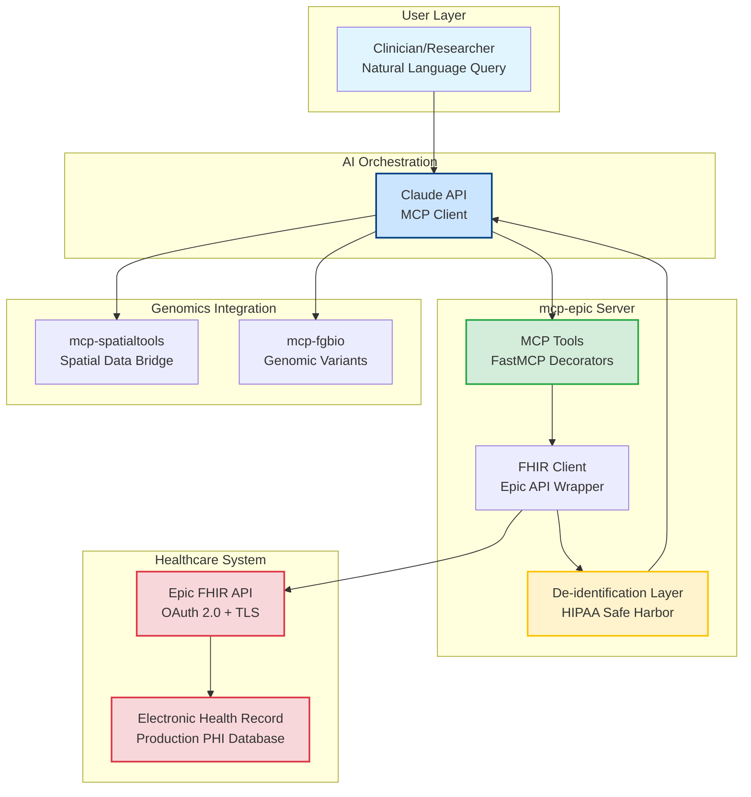

# Chapter 4: Clinical Data—The Starting Point

> *"Every analysis begins with a patient. How do we integrate EHR data?"*

---

## Why Clinical Data Comes First

Before genomics, transcriptomics, or imaging analysis, you need essential clinical context:
- **Demographics**: Age and ancestry (risk factors vary)
- **Diagnosis and staging**: IIIA vs. IV determines treatment approach
- **Treatment history**: Platinum-sensitive vs. platinum-resistant status
- **Lab markers**: CA-125 trends indicate response or progression
- **Medications**: Current treatments and failures

This information lives in the **Electronic Health Record (EHR)** (Epic, Cerner). Without it, genomic analysis lacks actionable context. Sarah's TP53 and PIK3CA mutations (Chapter 1) only become clinically meaningful when combined with her 8-month platinum-free interval, CA-125 trajectory (45→310 U/mL), and BRCA1 status.

This chapter builds **mcp-epic**: an MCP server connecting to Epic FHIR APIs with automatic HIPAA Safe Harbor de-identification.

---

## The FHIR Standard

**HL7 FHIR (Fast Healthcare Interoperability Resources)** is the REST API standard for healthcare data exchange, defining:
- **Resources**: Patient, Condition, Observation, Medication (standardized structures)
- **Terminologies**: ICD-10 (diagnoses), LOINC (labs), RxNorm (drugs)
- **Operations**: HTTP CRUD operations

**FHIR R4** (2019) is supported by Epic, Cerner, Allscripts, athenahealth.

### Example: Patient Resource

```json
{
  "resourceType": "Patient",
  "id": "RESEARCH-PAT001",
  "name": [{"family": "Anderson", "given": ["Sarah"]}],
  "gender": "female",
  "birthDate": "1966-03-15"
}
```

FHIR specification: https://www.hl7.org/fhir/patient.html

**HIPAA Problem**: Name, full birth date, address, MRN are all **Protected Health Information (PHI)** requiring removal before research use.

---

## HIPAA Safe Harbor De-identification

HIPAA defines two de-identification methods:
1. **Safe Harbor**: Remove 18 specific identifiers (mechanical, automatable)
2. **Expert Determination**: Statistical disclosure risk analysis (expensive)

We use **Safe Harbor** for deterministic, automated de-identification.

### The 18 HIPAA Identifiers (Must Remove)

Names, geographic subdivisions smaller than state, dates except year (ages >89 aggregated), phone/fax/email, SSN, MRN, account numbers, license numbers, vehicle/device IDs, URLs, IP addresses, biometrics, photos, unique identifiers.

HIPAA guidance: https://www.hhs.gov/hipaa/for-professionals/privacy/special-topics/de-identification/index.html

### After Safe Harbor De-identification

```json
{
  "resourceType": "Patient",
  "id": "deidentified-a4f9c82b1e3d5f",
  "gender": "female",
  "birthDate": "1966",  // Year only
  "_deidentified": true
}
```

---

## Building mcp-epic: Architecture



**Figure 4.1: FHIR to Genomics Bridge Architecture**
*Clinical data flows from Epic EHR → FHIR API → mcp-epic server → HIPAA de-identification → Claude AI orchestration → integration with genomics (mcp-fgbio) and spatial transcriptomics (mcp-spatialtools) for complete patient analysis.*

**Key Components:**
1. **MCP Tools**: 9 FHIR R4 resource tools with natural language interface
2. **FHIR Client**: Epic API wrapper handling OAuth 2.0 authentication
3. **De-identification**: Automatic HIPAA Safe Harbor compliance (18 identifiers removed)
4. **Integration**: Clinical context bridges to genomics and spatial analysis

Server structure: `servers/mcp-epic/` with `server.py` (9 tools), `epic_fhir_client.py`, `deidentify.py`, `__main__.py`.

Repository: [`servers/mcp-epic/`](https://github.com/lynnlangit/precision-medicine-mcp/tree/main/servers/mcp-epic)

---

## Implementation: De-identification Layer

### Hash Identifiers

```python
def hash_identifier(value: str) -> str:
    """Hash identifier using SHA-256."""
    return f"HASH-{hashlib.sha256(value.encode()).hexdigest()[:16]}"
    # Full implementation: servers/mcp-epic/src/mcp_epic/deidentify.py:69-83
```

### Remove Direct Identifiers

```python
def deidentify_patient(patient: dict) -> dict:
    """Apply HIPAA Safe Harbor de-identification."""
    # Remove: name, telecom, address, photo, contact
    # Full implementation: servers/mcp-epic/src/mcp_epic/deidentify.py:19-110
```

### Date Reduction

```python
def reduce_date_to_year(date_string: str) -> str:
    """Reduce date to year, aggregate ages >89."""
    age = datetime.utcnow().year - datetime.fromisoformat(date_string).year
    return f"{datetime.utcnow().year - 90}" if age > 89 else str(birth_year)
    # Full implementation: servers/mcp-epic/src/mcp_epic/deidentify.py:84-100
```

---

## The Four MCP Tools

### 1. get_patient_demographics

Retrieves age, gender, hashed identifiers with automatic HIPAA de-identification.

```python
@mcp.tool()
async def get_patient_demographics(patient_id: str) -> dict:
    """Retrieve patient demographics from Epic FHIR API."""
    patient = await get_epic_client().get_patient(patient_id)
    return {"status": "success", "data": patient, "deidentified": True}
    # Full implementation: servers/mcp-epic/src/mcp_epic/server.py:40-77
```

**Example output**:
```json
{
  "status": "success",
  "data": {
    "id": "deidentified-a4f9c82b1e3d5f",
    "gender": "female",
    "birthDate": "1966"
  }
}
```

### 2. get_patient_conditions

Retrieves diagnoses with ICD-10 codes and staging.

```python
@mcp.tool()
async def get_patient_conditions(patient_id: str, category: str = None) -> dict:
    """Retrieve patient conditions/diagnoses with ICD-10 codes and staging."""
    # Full implementation: servers/mcp-epic/src/mcp_epic/server.py:79-120
```

**Example output**:
```json
{
  "data": [{
    "code": "C56.9",  // Ovarian cancer
    "display": "Malignant neoplasm of ovary",
    "stage": {"summary": "Stage IV", "type": "TNM"},
    "recordedDate": "2023"  // Year only
  }]
}
```

### 3. get_patient_observations

Retrieves lab results and vital signs.

```python
@mcp.tool()
async def get_patient_observations(patient_id: str, category: str = None, code: str = None) -> dict:
    """Retrieve observations (labs, vitals) with LOINC codes."""
    # Full implementation: servers/mcp-epic/src/mcp_epic/server.py:122-175
```

**Example** (CA-125 tumor marker):
```json
{
  "data": [{
    "code": "10334-1",  // LOINC: CA-125
    "valueQuantity": {"value": 310, "unit": "U/mL"},
    "referenceRange": {"low": 0, "high": 35},
    "interpretation": "High"
  }]
}
```

### 4. get_patient_medications

Retrieves current and historical medications.

```python
@mcp.tool()
async def get_patient_medications(patient_id: str, status: str = None) -> dict:
    """Retrieve patient medications with RxNorm codes."""
    # Full implementation: servers/mcp-epic/src/mcp_epic/server.py:177-210
```

---

## Epic FHIR Client: Authentication

```python
class EpicFHIRClient:
    async def get_access_token(self) -> str:
        """Obtain OAuth 2.0 access token using client credentials flow."""
        # Full implementation: servers/mcp-epic/src/mcp_epic/epic_fhir_client.py
```

**De-identification happens before data leaves FHIR client** to ensure no PHI in logs or responses.

---

## Configuration

```bash
EPIC_FHIR_ENDPOINT="https://hospital.epic.com/api/FHIR/R4/"
EPIC_CLIENT_ID="abc123-your-client-id"
EPIC_CLIENT_SECRET="your-secret-here"
DEIDENTIFY_ENABLED="true"
```

Get Epic credentials: https://fhir.epic.com/Documentation?docId=epiconfhirrequestprocess

---

## Testing with mcp-mockepic

**mcp-mockepic** provides synthetic FHIR data for testing without Epic credentials.

```python
@mcp.tool()
async def query_patient_records(patient_id: str) -> dict:
    """Retrieve synthetic patient (Synthea-based)."""
    # Returns synthetic patient PAT001-OVC-2025
```

Deployed endpoint: https://mcp-mockepic-ondu7mwjpa-uc.a.run.app

Mock server implementation: [`servers/mcp-mockepic/src/mcp_mockepic/server.py`](https://github.com/lynnlangit/precision-medicine-mcp/blob/main/servers/mcp-mockepic/src/mcp_mockepic/server.py)

---

## Integration with Other Servers

Clinical data flows to downstream analysis:

- **mcp-fgbio** (genomics): Uses diagnosis to select relevant gene panels
- **mcp-multiomics**: Uses treatment history to group samples by response
- **mcp-spatialtools**: Links clinical outcomes to spatial patterns
- **mcp-tcga**: Uses diagnosis/staging to select matching cohorts

---

## Deployment: Local Only (HIPAA)

**Critical**: mcp-epic uses **STDIO transport** (not HTTP):
- ✅ Runs locally (hospital workstation/VPN)
- ✅ No network exposure of PHI
- ✅ HIPAA compliant
- ❌ Cannot deploy to Cloud Run

### Claude Desktop Configuration

```json
{
  "mcpServers": {
    "epic": {
      "command": "python",
      "args": ["-m", "mcp_epic"],
      "env": {
        "EPIC_FHIR_ENDPOINT": "https://hospital.epic.com/api/FHIR/R4/",
        "EPIC_CLIENT_ID": "your-client-id",
        "EPIC_CLIENT_SECRET": "your-secret",
        "DEIDENTIFY_ENABLED": "true"
      }
    }
  }
}
```

Setup guide: [`servers/mcp-epic/CLAUDE_DESKTOP_TESTING.md`](https://github.com/lynnlangit/precision-medicine-mcp/blob/main/servers/mcp-epic/CLAUDE_DESKTOP_TESTING.md)

---

## Validation: HIPAA Compliance Checklist

Before production:
- [ ] All 18 HIPAA identifiers removed (run unit tests)
- [ ] Dates reduced to year only
- [ ] Ages >89 aggregated
- [ ] IDs hashed with SHA-256
- [ ] No PHI in logs
- [ ] BAA in place with Google Cloud
- [ ] Audit logging enabled (10-year retention)

Test suite: [`tests/unit/mcp-epic/test_deidentification.py`](https://github.com/lynnlangit/precision-medicine-mcp/tree/main/tests/unit/mcp-epic)

HIPAA compliance documentation: [`docs/for-hospitals/compliance/hipaa.md`](https://github.com/lynnlangit/precision-medicine-mcp/blob/main/docs/for-hospitals/compliance/hipaa.md)

---

## Try It Yourself

### Option 1: Test with mcp-mockepic

```bash
git clone https://github.com/lynnlangit/precision-medicine-mcp.git
cd precision-medicine-mcp/servers/mcp-mockepic
python -m venv venv && source venv/bin/activate
pip install -e . && python -m mcp_mockepic
```

### Option 2: Epic Sandbox

Epic provides public sandbox:
- Endpoint: https://fhir.epic.com/interconnect-fhir-oauth/api/FHIR/R4/
- Register: https://fhir.epic.com/Developer/Apps

### Option 3: Interactive Notebook

Explore FHIR resources: [`docs/book/companion-notebooks/chapter-04-clinical-data.ipynb`](../companion-notebooks/chapter-04-clinical-data.ipynb)

---

## What Comes Next

In Chapter 5, you'll build **mcp-fgbio** for genomic QC and variant calling:
- Parse VCF files (Variant Call Format)
- Validate genomic data quality (depth, allele frequency)
- Annotate variants with ClinVar and gnomAD
- Filter for clinically relevant mutations

**Next**: Chapter 5 - Genomic Foundations

---

**Chapter 4 Key Takeaways:**
- Clinical data provides essential patient context for precision medicine
- FHIR R4 is the standard for healthcare data interoperability
- HIPAA Safe Harbor removes 18 identifiers (names, dates, addresses, etc.)
- mcp-epic: 4 tools for demographics, conditions, observations, medications
- De-identification happens automatically before data leaves FHIR client
- Local STDIO deployment (not Cloud Run) for HIPAA compliance

**Companion Resources:**
- 📓 [Jupyter Notebook](../companion-notebooks/chapter-04-clinical-data.ipynb)
- 🏥 [HIPAA Compliance Guide](../../for-hospitals/compliance/hipaa.md)
- 📋 [Clinical Architecture](../../architecture/clinical/README.md)
- 🔧 [Epic Setup Guide](../../servers/mcp-epic/CLAUDE_DESKTOP_TESTING.md)

**GitHub References:**
- mcp-epic server: [`servers/mcp-epic/src/mcp_epic/server.py`](https://github.com/lynnlangit/precision-medicine-mcp/blob/main/servers/mcp-epic/src/mcp_epic/server.py)
- De-identification: [`servers/mcp-epic/src/mcp_epic/deidentify.py`](https://github.com/lynnlangit/precision-medicine-mcp/blob/main/servers/mcp-epic/src/mcp_epic/deidentify.py)
- mcp-mockepic: [`servers/mcp-mockepic/src/mcp_mockepic/server.py`](https://github.com/lynnlangit/precision-medicine-mcp/blob/main/servers/mcp-mockepic/src/mcp_mockepic/server.py)
