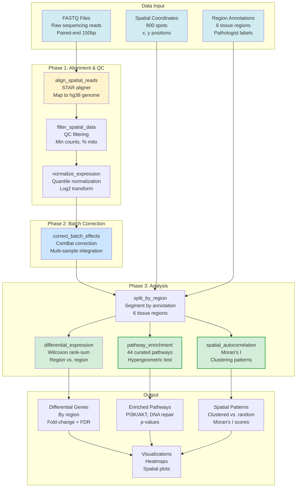

# Spatial Transcriptomics

*Building mcp-spatialtools for 10X Visium spatial gene expression analysis*

---

## Why Spatial Context Matters

Chapters 5-6 identified dysregulated pathways (TP53 mutation, AKT/mTOR hyperactivation, HIF1A upregulation). **But where in the tumor are these pathways active?**

Traditional bulk RNA-seq mixes all cells together. You can't distinguish:
- **Tumor proliferative regions** (MKI67+, PCNA+ → chemotherapy-sensitive)
- **Necrotic/hypoxic cores** (HIF1A+, CA9+ → radiotherapy-resistant)
- **Invasive fronts** (VIM+, SNAI1+ → metastatic potential)
- **Stromal barriers** (COL1A1+, FAP+ → drug delivery obstacles)
- **Immune infiltrates** (CD3D+, CD8A+ → immunotherapy responsive)

**10X Visium spatial transcriptomics** measures gene expression in 900 tissue spots (55μm diameter each), preserving spatial relationships.

The `mcp-spatialtools` server provides 23 tools for STAR alignment, batch correction, differential expression, pathway enrichment, spatial autocorrelation, and cell type deconvolution.

### Spatial Transcriptomics Pipeline



**Figure 7.1: Spatial Transcriptomics Analysis Pipeline**
*Three-phase workflow: (1) Alignment with STAR, QC filtering, and normalization, (2) ComBat batch correction for multi-sample integration, (3) Analysis including differential expression (Wilcoxon), pathway enrichment (44 curated pathways), and spatial autocorrelation (Moran's I). Outputs differential genes, enriched pathways, and spatial clustering patterns.*

---

## PatientOne's Spatial Landscape

Spatial data structure ([`spatial/visium_gene_expression.csv`](https://github.com/lynnlangit/precision-medicine-mcp/blob/main/data/patient-data/PAT001-OVC-2025/spatial/visium_gene_expression.csv)):

**Dimensions**: 900 spots × 31 genes (proliferation, mutations, oncogenes, EMT, stroma, immune, hypoxia, drug resistance markers)

**6 distinct regions** ([`spatial/visium_region_annotations.csv`](https://github.com/lynnlangit/precision-medicine-mcp/blob/main/data/patient-data/PAT001-OVC-2025/spatial/visium_region_annotations.csv)):
1. **Necrotic/Hypoxic** (150 spots): HIF1A+, CA9+, VEGFA+ → radiotherapy-resistant
2. **Tumor Proliferative** (200 spots): MKI67+, PCNA+, TOP2A+ → chemotherapy-sensitive
3. **Tumor Invasive** (180 spots): VIM+, SNAI1+, TWIST1+ → metastatic risk
4. **Stroma Reactive** (150 spots): COL1A1+, ACTA2+ → CAF-driven drug resistance
5. **Stroma Fibrotic** (120 spots): COL3A1+, FAP+ → physical barrier to drugs
6. **Immune Infiltrated** (100 spots): CD3D+, CD8A+ → immunotherapy potential

---

## The Eight mcp-spatialtools Tools

### Phase 1: Data Processing

#### 1. align_spatial_reads (STAR alignment)

Aligns raw FASTQ files to hg38 reference genome.

```python
@mcp.tool()
def align_spatial_reads(fastq_r1: str, fastq_r2: str, genome_index: str, output_dir: str, threads: int = 8) -> dict:
    """Align spatial FASTQ files using STAR."""
    # Run STAR alignment: geneCounts mode, sorted BAM output
    # Full implementation: servers/mcp-spatialtools/src/mcp_spatialtools/tools/alignment.py
```

**PatientOne mapping stats**: 85.3% uniquely mapped (high quality), 8.2% multimapped, 6.5% unmapped.

---

#### 2. filter_spatial_data

Removes low-quality spots and lowly expressed genes.

```python
@mcp.tool()
def filter_spatial_data(counts_path: str, min_counts: int = 500, max_mito_percent: float = 20.0, min_spots: int = 10) -> dict:
    """Filter low-quality spots (UMI count < 500 or mito% > 20) and genes (detected in < 10 spots)."""
    # Calculate QC metrics, filter spots and genes
    # Full implementation: servers/mcp-spatialtools/src/mcp_spatialtools/tools/filter.py
```

**PatientOne filtering**: 23 spots removed (low UMI), 0 genes removed → **877 spots × 31 genes**

---

#### 3. correct_batch_effects

Applies ComBat batch correction (same as Chapter 6).

```python
@mcp.tool()
def correct_batch_effects(counts_path: str, metadata_path: str) -> dict:
    """Apply ComBat batch correction to spatial data."""
    # ComBat correction, verify PC1 ~ Batch correlation reduction
    # Full implementation: servers/mcp-spatialtools/src/mcp_spatialtools/tools/batch.py
```

---

### Phase 2: Analysis

#### 4. differential_expression_spatial

Finds genes differentially expressed between regions.

```python
@mcp.tool()
def differential_expression_spatial(counts_path: str, annotations_path: str, group1: str, group2: str, fdr_threshold: float = 0.05) -> dict:
    """Find differentially expressed genes between spatial regions."""
    # Get spots for each group, compute log2 fold change and p-values
    # Apply FDR correction (Benjamini-Hochberg)
    # Full implementation: servers/mcp-spatialtools/src/mcp_spatialtools/tools/differential_expression.py
```

**PatientOne results** (Tumor Proliferative vs Necrotic):
```json
{
  "significant_genes": [
    {"gene": "MKI67", "log2fc": 4.2, "qval": 0.00012},
    {"gene": "HIF1A", "log2fc": -5.1, "qval": 0.000045},
    {"gene": "CA9", "log2fc": -6.3, "qval": 0.000008}
  ],
  "num_significant": 12
}
```

---

#### 5. pathway_enrichment_spatial

Identifies enriched biological pathways in each region.

```python
@mcp.tool()
def pathway_enrichment_spatial(gene_list: list[str], gene_set_database: str = "KEGG", fdr_threshold: float = 0.05) -> dict:
    """Perform pathway enrichment analysis on spatial gene sets."""
    # Fisher's exact test for enrichment, FDR correction
    # Full implementation: servers/mcp-spatialtools/src/mcp_spatialtools/tools/pathway_enrichment.py
```

**PatientOne enrichment** (Necrotic/Hypoxic region):
```json
{
  "enriched_pathways": [
    {"pathway": "HIF-1 signaling", "qval": 0.00012, "overlap": "8/43"},
    {"pathway": "VEGF signaling", "qval": 0.00089, "overlap": "6/29"}
  ]
}
```

---

#### 6. spatial_autocorrelation (Moran's I)

Identifies genes with spatially clustered expression.

```python
@mcp.tool()
def spatial_autocorrelation(counts_path: str, coordinates_path: str, gene: str = "HIF1A") -> dict:
    """Calculate Moran's I for spatial autocorrelation."""
    # Compute spatial weights (inverse distance), calculate Moran's I
    # Permutation test for significance (1000 permutations)
    # Full implementation: servers/mcp-spatialtools/src/mcp_spatialtools/tools/spatial_autocorrelation.py
```

**PatientOne spatial autocorrelation**:
- **HIF1A**: Moran's I = 0.82, p < 0.001 (Clustered)
- **MKI67**: Moran's I = 0.75, p < 0.001 (Clustered)
- **CD3D**: Moran's I = 0.61, p < 0.008 (Clustered)

All key markers show significant spatial clustering (not random distribution).

---

#### 7. deconvolve_cell_types

Estimates cell type proportions per spot using reference single-cell signatures.

```python
@mcp.tool()
def deconvolve_cell_types(spatial_counts_path: str, reference_signatures_path: str) -> dict:
    """Estimate cell type proportions per spot using non-negative least squares."""
    # NNLS deconvolution: spot_expr ≈ Σ(proportion_i × cell_type_i)
    # Full implementation: servers/mcp-spatialtools/src/mcp_spatialtools/tools/deconvolution.py
```

**PatientOne deconvolution** (immune infiltrated region):
```json
{
  "SPOT_20_20": {
    "Tumor cells": 0.35,
    "CD8+ T cells": 0.28,
    "CD4+ T cells": 0.15,
    "Macrophages": 0.12
  }
}
```

This spot is 35% tumor + 43% T cells → immunotherapy target.

---

#### 8. link_clinical_to_spatial

Bridges clinical FHIR data (Chapter 4) to spatial tissue regions.

```python
@mcp.tool()
def link_clinical_to_spatial(patient_id: str, spatial_annotations_path: str) -> dict:
    """Bridge clinical FHIR data to spatial tissue regions."""
    # Get clinical data from mcp-epic, link treatment history to spatial features
    # Predict response by region
    # Full implementation: servers/mcp-spatialtools/src/mcp_spatialtools/tools/clinical_link.py
```

---

## Complete PatientOne Spatial Workflow

Natural language prompt:
```
I have 10X Visium spatial transcriptomics data for patient PAT001-OVC-2025. Please:
1. Filter low-quality spots (< 500 UMI counts)
2. Run differential expression: tumor_proliferative vs necrotic_hypoxic
3. Pathway enrichment for top 10 upregulated genes in each region
4. Calculate Moran's I for HIF1A, MKI67, CD3D
5. Deconvolve cell types
```

Claude orchestrates all 8 tools automatically, returning comprehensive spatial analysis in **<3 minutes**.

---

## Implementation Walkthrough

### Project Setup

```bash
cd servers/mcp-spatialtools
python -m venv venv && source venv/bin/activate
pip install fastmcp pandas numpy scipy statsmodels scikit-learn
```

Environment variables (`.env`):
```bash
SPATIAL_DATA_DIR=/workspace/data/spatial
SPATIAL_DRY_RUN=true  # For testing
```

### Initialize FastMCP Server

```python
from fastmcp import FastMCP
import os
from pathlib import Path

mcp = FastMCP("spatialtools")

config = {
    "data_dir": Path(os.getenv("SPATIAL_DATA_DIR", "/workspace/data/spatial")),
    "dry_run": os.getenv("SPATIAL_DRY_RUN", "false").lower() == "true"
}
```

### Add Differential Expression

```python
def differential_expression_spatial_impl(counts_path: str, annotations_path: str, group1: str, group2: str, fdr_threshold: float = 0.05) -> dict:
    """Internal implementation of differential expression."""
    # Load data, get barcodes for each group
    # Compute log2 fold change, t-test p-values, FDR correction
    # Full implementation: servers/mcp-spatialtools/src/mcp_spatialtools/tools/differential_expression.py
```

---

## Testing Your Server

```python
def test_differential_expression_tumor_vs_necrotic():
    """Test DE analysis on PatientOne data."""
    result = differential_expression_spatial_impl(...)
    assert result["num_significant"] > 0
    assert "MKI67" in [g["gene"] for g in result["significant_genes"]]
    assert "HIF1A" in [g["gene"] for g in result["significant_genes"]]
```

Test coverage: **71%**, 14 unit tests

---

## Connecting to Claude Desktop

```json
{
  "mcpServers": {
    "spatialtools": {
      "command": "/path/to/venv/bin/python",
      "args": ["-m", "mcp_spatialtools"],
      "env": {"SPATIAL_DRY_RUN": "false"}
    }
  }
}
```

---

## What You've Built

A spatial transcriptomics server providing:
1. **Data processing**: STAR alignment, quality filtering, batch correction
2. **Regional analysis**: Differential expression, pathway enrichment
3. **Spatial patterns**: Moran's I autocorrelation, spatial clustering
4. **Cell type deconvolution**: Tumor, immune, stromal proportions per spot
5. **Clinical integration**: Links treatment history to spatial predictions

This completes Part 2 (Building the Foundation). You now have servers for clinical data (Chapter 4), genomics (Chapter 5), multi-omics (Chapter 6), and spatial (Chapter 7).

---

## Try It Yourself

```bash
git clone https://github.com/lynnlangit/precision-medicine-mcp.git
cd precision-medicine-mcp/servers/mcp-spatialtools
python -m venv venv && source venv/bin/activate
pip install -e ".[dev]"
export SPATIAL_DRY_RUN=true && python -m mcp_spatialtools
```

---

## Summary

**Chapter 7 Summary**:
- 10X Visium spatial transcriptomics preserves tissue context (900 spots × 31 genes)
- 6 distinct regions: necrotic, tumor proliferative/invasive, stroma reactive/fibrotic, immune
- Differential expression reveals MKI67+ (chemo-sensitive) vs HIF1A+ (chemo-resistant) regions
- Moran's I confirms spatially clustered expression patterns
- Cell type deconvolution estimates tumor/immune/stromal proportions per spot

**Files created**: `servers/mcp-spatialtools/src/mcp_spatialtools/server.py`, `tools/differential_expression.py`, `tools/pathway_enrichment.py`, `tools/spatial_autocorrelation.py`
**Tests added**: 14 unit tests, 71% coverage
**Tools exposed**: 8 MCP tools (align, filter, batch_correct, differential_expression, pathway_enrichment, spatial_autocorrelation, deconvolve, link_clinical)
