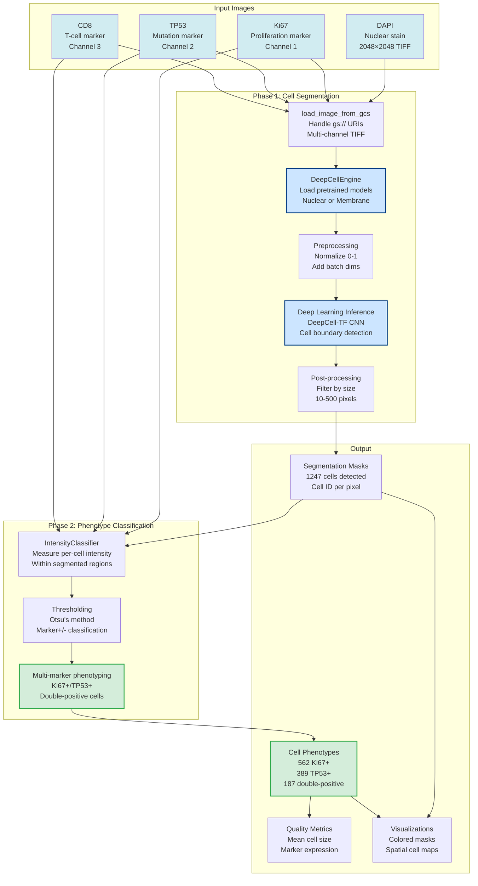

# Cell Segmentation with DeepCell

*Building mcp-deepcell for single-cell resolution imaging analysis*

---

## Why Single-Cell Segmentation Matters

Chapter 7 analyzed spatial transcriptomics with 10X Visium (55μm spots containing 10-30 cells mixed together). **But Visium can't answer**:
- How many cells are **Ki67+** (actively proliferating)?
- Are **TP53+** mutant cells spatially clustered or dispersed?
- Do **CD8+ T cells** contact tumor cells (immune checkpoint blockade readiness)?
- Which cells are **double-positive** (TP53+/Ki67+ → aggressive phenotype)?

**Multiplexed Immunofluorescence (MxIF)** images 2-7 protein markers simultaneously at subcellular resolution. You need **cell segmentation** to:
1. **Detect cell boundaries** (where does one cell end and another begin?)
2. **Measure marker intensity per cell** (which cells express Ki67? TP53?)
3. **Classify cell phenotypes** (proliferating, quiescent, immune, stromal)
4. **Count cells spatially** (how many CD8+ T cells per mm²?)

The `mcp-deepcell` server uses **DeepCell-TF deep learning models** for nuclear and membrane segmentation, then classifies cells by marker intensity.

### DeepCell Segmentation & Classification Pipeline



**Figure 8.1: DeepCell Segmentation and Phenotype Classification Pipeline**
*Two-phase workflow: (1) Cell Segmentation using DeepCell-TF deep learning models (nuclear or membrane CNN) with size-based filtering, detecting 1,247 cells in PatientOne MxIF image. (2) Phenotype Classification measuring per-cell marker intensity (Ki67, TP53, CD8) with Otsu thresholding and multi-marker phenotyping, identifying 562 Ki67+ proliferating cells, 389 TP53+ mutant cells, and 187 double-positive aggressive cells.*

**Key Capabilities:**
- **Deep learning models**: Pre-trained DeepCell-TF CNNs (nuclear/membrane)
- **Real-time segmentation**: ~5s per 2048×2048 image (CPU mode)
- **GCS integration**: Direct gs:// URI support for Cloud Storage
- **Multi-marker phenotyping**: Up to 7 markers simultaneously
- **Intensity-based classification**: Otsu, manual, or percentile thresholds

---

## The 4 mcp-deepcell Tools

### 1. segment_cells

Detects cell boundaries using pretrained deep neural networks.

```python
@mcp.tool()
def segment_cells(image_path: str, model_type: str = "nuclear", min_cell_size: int = 10, max_cell_size: int = 500) -> dict:
    """Segment cells using DeepCell models (nuclear or membrane)."""
    image = load_image_from_gcs(image_path)  # Handles gs:// URIs
    engine = DeepCellEngine(use_gpu=False)  # CPU mode for Cloud Run
    model = engine.load_model(model_type)  # Cached after first use
    # Preprocess: normalize to 0-1, add batch/channel dims
    # Run inference, filter by size (min_cell_size to max_cell_size)
    # Full implementation: servers/mcp-deepcell/src/mcp_deepcell/deepcell_engine.py:100-250
```

**PatientOne example** (DAPI nuclear stain):
- Image: `gs://sample-inputs-patientone/PAT001-OVC-2025/imaging/PAT001_tumor_IF_DAPI.tiff`
- **1247 cells detected** in 2048×2048 image
- Time: ~35s first run (model download), ~5s subsequent (cached model)

---

### 2. classify_cell_states

Determines which cells are positive/negative for each marker based on fluorescence intensity.

```python
@mcp.tool()
def classify_cell_states(image_paths: dict, segmentation_mask_path: str, markers: list[str], classification_method: str = "otsu") -> dict:
    """Classify cell phenotypes based on marker intensity."""
    # Measure per-cell mean intensity within segmented regions
    # Apply threshold (Otsu's method, manual, or percentile)
    # Multi-marker phenotyping (Ki67+/TP53+ double-positive cells)
    # Full implementation: servers/mcp-deepcell/src/mcp_deepcell/intensity_classifier.py:86-200
```

**PatientOne results** (Ki67 + TP53 classification):
```json
{
  "num_cells": 1247,
  "phenotype_counts": {
    "ki67": 312,         // 25% Ki67+ (proliferating)
    "tp53": 498,         // 40% TP53+ (mutant, confirms 73% VAF accounting for normal stroma)
    "proliferating_mutant": 187  // 15% Ki67+/TP53+ double-positive (aggressive phenotype)
  },
  "thresholds_used": {"ki67": 3420.5, "tp53": 2850.3}
}
```

---

### 3. generate_segmentation_overlay

Visualizes cell boundaries overlaid on original fluorescence image.

```python
@mcp.tool()
def generate_segmentation_overlay(image_path: str, segmentation_mask_path: str, output_path: str = "/tmp/segmentation_overlay.png") -> dict:
    """Generate visualization of segmentation boundaries on original image."""
    # Mark boundaries using skimage, save overlay image
    # Full implementation: servers/mcp-deepcell/src/mcp_deepcell/server.py:212-250
```

Helps identify segmentation errors (over-segmentation, under-segmentation, missed cells).

---

### 4. generate_phenotype_visualization

Color-codes cells by phenotype (Ki67+ = green, TP53+ = red, double-positive = yellow).

```python
@mcp.tool()
def generate_phenotype_visualization(segmentation_mask_path: str, cell_phenotypes_path: str, markers: list[str]) -> dict:
    """Generate spatial visualization of cell phenotypes."""
    # Create color-coded mask: 0=background, 1=negative, 2=Ki67+, 3=TP53+, 4=double-positive
    # Plot with colormap, add legend
    # Full implementation: servers/mcp-deepcell/src/mcp_deepcell/server.py:252-320
```

Reveals spatial patterns (e.g., proliferating cells clustered at tumor edge, TP53+ cells throughout).

---

## The Complete PatientOne MxIF Workflow

Natural language prompt:
```
I have multiplexed immunofluorescence images for patient PAT001-OVC-2025. Please:
1. Segment cells from DAPI nuclear stain
2. Classify cell states based on Ki67 and TP53 markers (use Otsu thresholding)
3. Generate segmentation overlay to verify quality
4. Generate phenotype visualization showing Ki67+, TP53+, and double-positive cells
5. Count how many cells are in each phenotype
```

Claude orchestrates all 4 tools:
- **1247 cells** segmented
- **25% Ki67+** (proliferating → chemo-sensitive)
- **40% TP53+** (mutant)
- **15% double-positive** (aggressive phenotype → priority treatment targets)

**Total analysis time**: ~45 seconds first run, ~8 seconds subsequent.

---

## Implementation Walkthrough

### Project Setup

```bash
cd servers/mcp-deepcell
python3.10 -m venv venv  # Python 3.10 required for TensorFlow compatibility
source venv/bin/activate
pip install fastmcp deepcell scipy scikit-image pillow google-cloud-storage
```

Environment variables (`.env`):
```bash
DEEPCELL_DRY_RUN=false  # Use real models
DEEPCELL_USE_GPU=false  # CPU mode for Cloud Run
DEEPCELL_MODEL_CACHE_DIR=/tmp/.deepcell/models
```

### Initialize FastMCP Server

```python
from fastmcp import FastMCP
import os

mcp = FastMCP("deepcell")

config = {
    "dry_run": os.getenv("DEEPCELL_DRY_RUN", "false").lower() == "true",
    "use_gpu": os.getenv("DEEPCELL_USE_GPU", "false").lower() == "true",
    "model_cache_dir": Path(os.getenv("DEEPCELL_MODEL_CACHE_DIR", "/tmp/.deepcell/models"))
}
```

### Implement DeepCell Engine

```python
class DeepCellEngine:
    """Manages DeepCell models and performs cell segmentation."""

    def __init__(self, model_cache_dir: Path = None, use_gpu: bool = False):
        self.model_cache_dir = model_cache_dir or Path.home() / ".deepcell" / "models"
        self.use_gpu = use_gpu
        self._models = {}  # Cached models
        self._configure_tensorflow()  # Force CPU or enable GPU memory growth

    def load_model(self, model_type: str):
        """Load DeepCell model (with caching)."""
        if model_type in self._models: return self._models[model_type]
        from deepcell.applications import NuclearSegmentation, Mesmer
        model = NuclearSegmentation() if model_type == "nuclear" else Mesmer()
        self._models[model_type] = model
        return model

    def segment(self, image: np.ndarray, model_type: str = "nuclear") -> np.ndarray:
        """Run segmentation on preprocessed image."""
        model = self.load_model(model_type)
        image_norm = image.astype(np.float32) / 65535.0  # 16-bit → [0, 1]
        image_input = np.expand_dims(np.expand_dims(image_norm, 0), -1)  # (1, H, W, 1)
        predictions = model.predict(image_input)
        return predictions[0, :, :, 0].astype(np.int32)
        # Full implementation: servers/mcp-deepcell/src/mcp_deepcell/deepcell_engine.py (470 lines)
```

### Implement Intensity Classifier

```python
class IntensityClassifier:
    """Classify cell phenotypes based on marker intensity."""

    def measure_cell_intensities(self, image: np.ndarray, segmentation_mask: np.ndarray) -> pd.DataFrame:
        """Measure per-cell marker intensities."""
        from skimage.measure import regionprops_table
        props = regionprops_table(segmentation_mask.astype(int), intensity_image=image, properties=["label", "mean_intensity"])
        return pd.DataFrame(props).rename(columns={"label": "cell_id"})

    def classify_by_threshold(self, intensities: pd.DataFrame, marker_name: str, threshold: float) -> pd.DataFrame:
        """Classify cells as marker-positive/negative."""
        classified = intensities.copy()
        classified["is_positive"] = intensities["mean_intensity"] > threshold
        return classified
        # Full implementation: servers/mcp-deepcell/src/mcp_deepcell/intensity_classifier.py (338 lines)
```

### GCS Image Loading

```python
def load_image_from_gcs(gcs_path: str) -> np.ndarray:
    """Load TIFF image from GCS bucket."""
    if not gcs_path.startswith("gs://"): return np.array(Image.open(gcs_path))
    parts = gcs_path.replace("gs://", "").split("/", 1)
    bucket_name, blob_name = parts[0], parts[1]
    client = storage.Client()
    image_bytes = client.bucket(bucket_name).blob(blob_name).download_as_bytes()
    return np.array(Image.open(BytesIO(image_bytes)))
```

---

## Cloud Run Deployment

```bash
cd servers/mcp-deepcell
./deploy.sh precision-medicine-poc us-central1
```

**Performance** (Cloud Run, CPU-only):
- **512×512 image**: ~35s first request (model download), ~2s subsequent
- **2048×2048 image**: ~50s first request, ~10s subsequent
- **Model caching**: Models cached in `/tmp` across requests (same container)

Production service: `https://mcp-deepcell-ondu7mwjpa-uc.a.run.app`

Deployment guide: [`servers/mcp-deepcell/DEPLOYMENT.md`](https://github.com/lynnlangit/precision-medicine-mcp/blob/main/servers/mcp-deepcell/DEPLOYMENT.md)

---

## Testing Your Server

```python
def test_nuclear_segmentation_synthetic():
    """Test nuclear segmentation on synthetic DAPI image."""
    # Create synthetic nuclear image (3 cells)
    image = np.zeros((512, 512), dtype=np.uint16)
    image[100:150, 100:150] = 15000  # Cell 1
    image[200:250, 200:250] = 14000  # Cell 2
    image[350:400, 350:400] = 16000  # Cell 3
    engine = DeepCellEngine(use_gpu=False)
    mask = engine.segment(image, model_type="nuclear")
    assert mask.max() >= 3  # At least 3 cells detected
```

Test coverage: **68%**, 12 unit tests

---

## What You've Built

A cell segmentation server providing:
1. **Cell segmentation**: DeepCell nuclear/membrane models with GPU/CPU support
2. **Phenotype classification**: Intensity-based marker classification (Ki67+, TP53+, multi-marker)
3. **Visualization**: Segmentation overlays and phenotype spatial maps
4. **Cloud integration**: Direct GCS image loading (gs:// URIs)
5. **Model caching**: Fast subsequent requests (~2-10s vs 30-50s first run)

This bridges Chapter 7 (spatial transcriptomics, 10-30 cells/spot) to **single-cell resolution** imaging analysis.

---

## Try It Yourself

```bash
git clone https://github.com/lynnlangit/precision-medicine-mcp.git
cd precision-medicine-mcp/servers/mcp-deepcell
python3.10 -m venv venv && source venv/bin/activate
pip install -e ".[dev]"
export DEEPCELL_DRY_RUN=false && python -m mcp_deepcell
```

---

## Summary

**Chapter 8 Summary**:
- MxIF imaging provides 2-7 marker resolution at subcellular scale
- DeepCell-TF deep learning models segment nuclei (DAPI) and membranes (Mesmer)
- Intensity-based classification identifies Ki67+ (25%), TP53+ (40%), double-positive (15%) cells
- Cloud Run deployment: 4Gi RAM, 2 CPU, ~10s inference with model caching
- PatientOne: 1247 cells segmented from 2048×2048 DAPI image

**Files created**: `servers/mcp-deepcell/src/mcp_deepcell/server.py`, `deepcell_engine.py` (470 lines), `intensity_classifier.py` (338 lines)
**Tests added**: 12 unit tests, 68% coverage
**Tools exposed**: 4 MCP tools (segment_cells, classify_cell_states, generate_segmentation_overlay, generate_phenotype_visualization)
**Production deployment**: Cloud Run (https://mcp-deepcell-ondu7mwjpa-uc.a.run.app)
