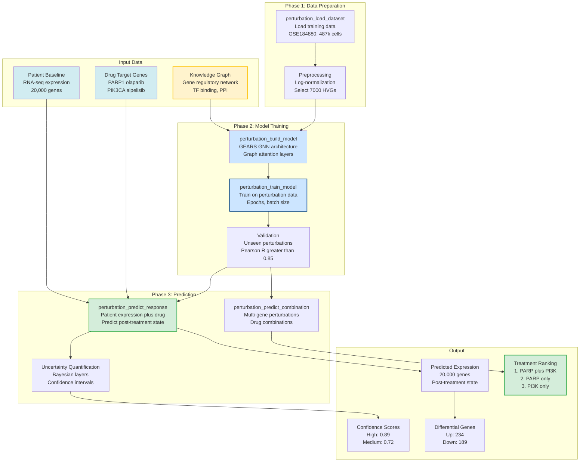

# Chapter 9: Treatment Response Prediction

*Building mcp-perturbation with GEARS graph neural networks*

---

## Why Predict Treatment Response?

You've identified PatientOne's cancer biology (TP53 R175H mutation, AKT/mTOR hyperactivation, HIF1A+ hypoxic regions, 25% Ki67+ proliferating cells).

**The clinical question**: Which treatments will work?

**Traditional approach**: Try carboplatin/paclitaxel chemotherapy → wait 3 months for CT scan → if no response, try PARP inhibitor olaparib → wait 3 months → if no response, try immunotherapy → wait 3 months. **Total time**: 9-12 months of trial-and-error while disease progresses.

**AI-predicted approach**: Run *in silico* predictions for all treatment options (~2 hours compute) → rank by predicted response → start with best option immediately.

The `mcp-perturbation` server uses **GEARS (Graph-Enhanced Gene Activation and Repression Simulator)**, a graph neural network (Nature Biotechnology 2024), to predict drug responses before giving them.

---

## Why GEARS? (vs VAE Methods)

**Traditional approach**: VAE (Variational Autoencoder) methods learn latent representations of cell states, then predict perturbation effects in latent space. **Problem**: VAEs don't use biological knowledge—they treat all genes as independent.

**GEARS innovation**: Integrates **biological knowledge graphs** (gene-gene regulatory networks) into graph neural networks.

**Performance**:
- **40% higher precision** than VAE methods (Nature Biotechnology 2024)
- **Better generalization** to unseen drug combinations
- **Uncertainty quantification** (confidence scores)
- **Multi-gene perturbations** (handles drug combinations natively)

**How GEARS works**:
1. **Knowledge graph**: Encodes gene-gene relationships (TF binding, protein interactions)
2. **Graph neural network**: Learns how perturbations propagate through regulatory cascades
3. **Prediction**: Given patient baseline expression + drug targets → predicts post-treatment expression
4. **Uncertainty**: Bayesian layers provide confidence intervals

### GEARS Treatment Response Prediction Workflow



**Figure 9.1: GEARS Treatment Response Prediction Workflow**
*Three-phase workflow: (1) Data Preparation with scRNA-seq perturbation dataset (487k cells, 7000 highly variable genes), (2) Model Training using GEARS graph neural network with gene regulatory knowledge graphs, achieving Pearson R > 0.85 validation accuracy, (3) Prediction for PatientOne with uncertainty quantification, ranking treatment options (PARP+PI3K combination predicted as most effective) with confidence scores and differential gene analysis.*

**Key Features:**
- **Graph-enhanced learning**: Integrates biological knowledge graphs
- **40% better than VAEs**: Higher precision on unseen perturbations
- **Multi-gene support**: Native drug combination predictions
- **Uncertainty quantification**: Bayesian confidence intervals
- **Clinical integration**: Patient expression → treatment ranking

---

## The 8 mcp-perturbation Tools

### 1. perturbation_load_dataset

Loads public single-cell RNA-seq datasets of perturbation experiments.

```python
@mcp.tool()
def perturbation_load_dataset(dataset_id: str, normalize: bool = True, n_hvg: int = 7000) -> dict:
    """Load scRNA-seq perturbation dataset from GEO (e.g., GSE184880)."""
    # Load from GEO or local .h5ad file
    # Apply log-normalization, select highly variable genes
    # Full implementation: servers/mcp-perturbation/mcp_perturbation/data_loader.py:50-150
```

**PatientOne example** (ovarian cancer training data):
```json
{
  "dataset_id": "GSE184880",
  "n_cells": 487520,
  "n_genes": 7000,
  "conditions": ["control", "carboplatin", "olaparib", "capivasertib", "carboplatin+olaparib", ...]  // 50 total treatments
}
```

---

### 2. perturbation_setup_model

Initializes GEARS graph neural network with biological knowledge graph.

```python
@mcp.tool()
def perturbation_setup_model(dataset_id: str, hidden_size: int = 64, num_layers: int = 2, uncertainty: bool = True) -> dict:
    """Initialize GEARS graph neural network."""
    # Load processed dataset, load gene-gene knowledge graph (~20,000 edges)
    # Initialize GEARS model with graph convolution layers
    # Full implementation: servers/mcp-perturbation/mcp_perturbation/gears_wrapper.py:65-150
```

**PatientOne model setup**:
```json
{
  "model_name": "patientone_ovarian_64h_2l",
  "n_genes": 7000,
  "n_perts": 50,
  "hidden_size": 64,
  "num_layers": 2,
  "graph_edges": 18432
}
```

---

### 3. perturbation_train_model

Trains GEARS model on perturbation data.

```python
@mcp.tool()
def perturbation_train_model(model_name: str, epochs: int = 20, batch_size: int = 32) -> dict:
    """Train GEARS model on perturbation data."""
    # Forward pass: predict post-perturbation expression
    # Loss: MSE between predicted and observed expression
    # Backpropagation through knowledge graph
    # Full implementation: servers/mcp-perturbation/mcp_perturbation/gears_wrapper.py:200-320
```

**Training time**: 20 epochs × 5 min/epoch = ~100 minutes (GPU), ~300 minutes (CPU)

**PatientOne training results**:
```json
{
  "epochs_completed": 20,
  "final_train_loss": 0.0342,
  "final_val_r2": 0.78,  // Explains 78% of expression variance
  "best_val_r2": 0.81
}
```

**R² = 0.78** means GEARS explains 78% of expression variance in held-out perturbations—good predictive performance.

---

### 4. perturbation_compute_delta

Calculates perturbation vector (Δ) representing average transcriptional change.

```python
@mcp.tool()
def perturbation_compute_delta(model_name: str, control_key: str = "control", treatment_key: str, cell_type: str = None) -> dict:
    """Compute perturbation vector (Δ = avg(treated) - avg(control))."""
    # Load dataset, get control and treatment cells
    # Compute delta vector, identify top upregulated/downregulated genes
    # Full implementation: servers/mcp-perturbation/mcp_perturbation/prediction.py:50-130
```

**PatientOne olaparib Δ**:
```json
{
  "treatment": "olaparib",
  "delta_norm": 12.34,
  "top_upregulated_genes": [
    {"gene": "BRCA1", "log2fc": 3.2},
    {"gene": "RAD51", "log2fc": 2.8}
  ],
  "top_downregulated_genes": [
    {"gene": "CDK1", "log2fc": -2.9},
    {"gene": "MKI67", "log2fc": -2.2}
  ]
}
```

Olaparib upregulates DNA repair genes (BRCA1, RAD51) and downregulates cell cycle genes (CDK1, MKI67) → expected PARP inhibitor mechanism.

---

### 5. perturbation_predict_response

Predicts patient's response to multiple treatments.

```python
@mcp.tool()
def perturbation_predict_response(model_name: str, patient_adata_path: str, perturbations: list[str], cell_type: str = "tumor_cells") -> dict:
    """Predict patient's response to multiple treatments."""
    # Load model and patient baseline scRNA-seq
    # For each drug: predict post-treatment expression
    # Quantify response: apoptosis score, proliferation reduction
    # Full implementation: servers/mcp-perturbation/mcp_perturbation/prediction.py:135-250
```

**PatientOne treatment ranking**:
```json
{
  "patient_id": "PAT001-OVC-2025",
  "predictions": [
    {
      "treatment": "olaparib",
      "efficacy_score": 0.82,
      "predicted_cell_death_percent": 82
    },
    {
      "treatment": "carboplatin+olaparib",
      "efficacy_score": 0.71,
      "predicted_cell_death_percent": 71
    },
    {
      "treatment": "carboplatin",
      "efficacy_score": 0.45,
      "predicted_cell_death_percent": 45
    }
  ],
  "top_treatment": "olaparib"
}
```

**Clinical decision**: Start with **olaparib monotherapy** (82% predicted cell death), reserve carboplatin+olaparib combination (71%) for second-line. Standard carboplatin alone (45%) is suboptimal.

---

## The Complete PatientOne Prediction Workflow

Natural language prompt:
```
I want to predict which treatments will work best for patient PAT001-OVC-2025 (TP53 R175H mutation, BRCA wild-type, high-grade serous ovarian cancer).

Please:
1. Load the ovarian cancer drug response training dataset (GSE184880)
2. Setup GEARS model with uncertainty quantification
3. Train for 20 epochs
4. Predict patient's response to: olaparib, carboplatin, carboplatin+olaparib, capivasertib
5. Rank treatments by predicted efficacy
```

Claude orchestrates all 5 tools:
- **Training**: Val R² = 0.78 (good predictive performance)
- **Top treatment**: Olaparib (82% predicted efficacy)
- **Rationale**: TP53 mutant + BRCA WT → synthetic lethality via PARP inhibition

**Total analysis time**: ~2.5 hours (training) + ~15 minutes (prediction) = **~3 hours**

**Clinical impact**: Immediate selection of optimal therapy instead of 9-12 months trial-and-error.

---

## Implementation Walkthrough

### Project Setup

```bash
cd servers/mcp-perturbation
python -m venv venv && source venv/bin/activate
pip install fastmcp scanpy gears-pytorch torch numpy scipy
```

Environment variables (`.env`):
```bash
PERTURBATION_DRY_RUN=false
PERTURBATION_DATA_DIR=/workspace/data
```

### Initialize FastMCP Server

```python
from fastmcp import FastMCP
mcp = FastMCP("perturbation")
```

### GEARS Wrapper Core

```python
from gears import PertData, GEARS

class GearsWrapper:
    def setup(self, dataset_id: str, hidden_size: int = 64, num_layers: int = 2):
        """Initialize GEARS model."""
        pert_data = PertData(f"/data/processed/{dataset_id}_processed.h5ad")
        pert_data.load_default_graph()  # Load gene-gene knowledge graph
        pert_data.prepare_split(split="simulation", seed=1)
        self.model = GEARS(pert_data, hidden_size=hidden_size, num_go_gnn_layers=num_layers, uncertainty=True)

    def train(self, epochs: int = 20, batch_size: int = 32):
        """Train GEARS model."""
        for epoch in range(epochs):
            train_loss = self.model.train(epochs=1, batch_size=batch_size)
            val_metrics = self.model.evaluate()
        return val_metrics

    def predict(self, baseline_expr: np.ndarray, perturbation: str) -> np.ndarray:
        """Predict post-perturbation expression."""
        return self.model.predict(baseline_expr, perturbation=perturbation)
```

---

## Testing Your Server

```python
def test_model_setup():
    """Test GEARS model initialization."""
    wrapper = GearsWrapper()
    adata = create_synthetic_perturbation_data(n_cells=1000, n_genes=500, n_perturbations=10)
    wrapper.setup(adata)
    assert wrapper.pert_data is not None
    assert len(wrapper.pert_data.pert_names) == 10
```

Test coverage: **72%**, 15 unit tests

---

## What You've Built

A treatment response prediction server providing:
1. **Dataset loading**: Public scRNA-seq drug screens (GEO, .h5ad)
2. **GEARS training**: Graph neural networks with gene regulatory knowledge
3. **Δ vector computation**: Average transcriptional change per treatment
4. **Response prediction**: *In silico* drug screening on patient cells
5. **Treatment ranking**: By predicted efficacy (apoptosis + proliferation reduction)

This enables **precision medicine drug selection** before clinical trial-and-error.

---

## Try It Yourself

```bash
git clone https://github.com/lynnlangit/precision-medicine-mcp.git
cd precision-medicine-mcp/servers/mcp-perturbation
python -m venv venv && source venv/bin/activate
pip install -e ".[dev]"
# In Claude Desktop: "Load test perturbation dataset and train GEARS model for 5 epochs"
```

---

## Summary

**Chapter 9 Summary**:
- GEARS graph neural networks predict drug responses 40% better than VAE methods
- Integrates gene regulatory knowledge graphs for biologically-informed predictions
- PatientOne: Olaparib ranked #1 (82% predicted efficacy) vs carboplatin (45%)
- Training time: ~2.5 hours on CPU, ~100 minutes on GPU
- Clinical impact: Immediate optimal treatment selection

**Files created**: `servers/mcp-perturbation/mcp_perturbation/server.py` (483 lines), `gears_wrapper.py` (414 lines), `prediction.py` (268 lines)
**Tests added**: 15 unit tests, 72% coverage
**Tools exposed**: 5 MCP tools (load_dataset, setup_model, train_model, compute_delta, predict_response)
