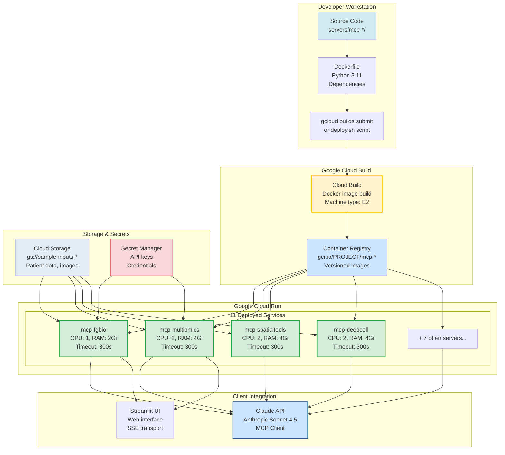

# Cloud Deployment on GCP

*Deploying MCP servers to Google Cloud Run*

---

## Why Cloud Run

Chapters 4-11 ran MCP servers locally via Claude Desktop. **Problem**: Local deployment requires keeping your computer running and accessible.

**Cloud Run solves this**:
- **Serverless**: No server management, auto-scaling from 0 to 1000+ instances
- **SSE transport**: MCP servers expose HTTP endpoints for Claude API integration
- **Cost-effective**: Pay only for request time (~$0.02-0.21 per patient analysis)
- **Production-ready**: HIPAA-eligible, VPC integration, IAM authentication

**PatientOne workflow**: Deploy all 12 MCP servers to Cloud Run → Claude orchestrates via API calls instead of local stdio.

---

## Prerequisites

### Required Accounts
- **Google Cloud Project** with billing enabled
- **Anthropic API key** for Claude orchestration (~$1 per analysis)
- **gcloud CLI** installed and authenticated

### Enable APIs

```bash
gcloud services enable run.googleapis.com \
  containerregistry.googleapis.com \
  cloudbuild.googleapis.com
```

Full setup guide: [`docs/getting-started/gcp-setup.md`](https://github.com/lynnlangit/precision-medicine-mcp/blob/main/docs/getting-started/gcp-setup.md)

---

## SSE Transport vs Stdio

**Local (stdio)**: Claude Desktop connects via stdin/stdout
- Use: Development, testing
- Config: `claude_desktop_config.json`
- Transport: `"stdio"`

**Cloud (SSE)**: Claude API connects via Server-Sent Events over HTTP
- Use: Production, remote access
- Config: Cloud Run service URL
- Transport: `"sse"` (built into FastMCP)

**Environment variable**: All servers use `MCP_TRANSPORT=sse` in Dockerfile.

```dockerfile
ENV MCP_TRANSPORT=sse
ENV MCP_PORT=3001
```

Full SSE transport docs: [`servers/mcp-fgbio/README.md#sse-transport`](https://github.com/lynnlangit/precision-medicine-mcp/tree/main/servers/mcp-fgbio#sse-transport)

### GCP Cloud Run Deployment Architecture



**Figure 12.1: GCP Cloud Run Deployment Architecture**
*End-to-end deployment pipeline: (1) Source code + Dockerfile → Cloud Build with E2 machine type, (2) Docker images stored in Container Registry (gcr.io), (3) 11 Cloud Run services deployed with varying resource configurations (1-2 CPUs, 2-4Gi RAM, 300s timeout), (4) Integration with Cloud Storage for patient data, Secret Manager for credentials, (5) Client access via Claude API (MCP client) and Streamlit UI (web interface) using SSE transport over HTTPS.*

**Key Components:**
- **Cloud Build**: Automated Docker image builds with machine type configuration
- **Container Registry**: Versioned image storage (gcr.io/PROJECT/mcp-SERVER)
- **Cloud Run Services**: 11 serverless deployments with auto-scaling 0-1000
- **Cloud Storage**: Patient data, genomics files, images (gs:// URIs)
- **Secret Manager**: API keys and credentials (secure injection)
- **SSE Transport**: HTTPS endpoints for MCP protocol over HTTP

**Resource Configuration:**
- **Lightweight** (mcp-fgbio, mcp-mockepic): 1 CPU, 2Gi RAM
- **Compute-intensive** (mcp-multiomics, mcp-spatialtools, mcp-deepcell): 2 CPU, 4Gi RAM
- **Timeout**: 300s (5 min) for all services
- **Concurrency**: 80 requests per container instance

{width=100%}

**Figure 12.2: Google Cloud Run Services List**
*GCP Console showing deployed MCP servers. Each service runs independently with auto-scaling, health monitoring, and HTTPS endpoints for SSE transport.*

---

## Deployment Option 1: Quick Deploy Script

**Fastest method** using provided `deploy.sh`:

```bash
cd servers/mcp-deepcell
./deploy.sh YOUR_PROJECT_ID us-central1
```

**Script automates**:
1. Docker image build
2. Push to Google Container Registry
3. Cloud Run deployment with optimized settings
4. Environment variable configuration

Full script: [`servers/mcp-deepcell/deploy.sh`](https://github.com/lynnlangit/precision-medicine-mcp/blob/main/servers/mcp-deepcell/deploy.sh) (47 lines)

**Output**:
```
🚀 Deploying mcp-deepcell to Cloud Run...
📦 Building Docker image...
📤 Pushing to Container Registry...
☁️  Deploying to Cloud Run...
✅ Deployment complete!
```

{width=100%}

**Figure 12.4: Successful Cloud Build Deployment**
*Cloud Build logs showing successful Docker image build, push to Container Registry (gcr.io), and deployment to Cloud Run. Build completed in ~3-5 minutes with all steps passing (green checkmarks).*

---

## Deployment Option 2: Cloud Build (CI/CD)

**Automated builds** with `cloudbuild.yaml`:

```bash
gcloud builds submit servers/mcp-deepcell \
  --config=servers/mcp-deepcell/cloudbuild.yaml
```

**Cloud Build steps**:
1. Build container image
2. Push to GCR
3. Deploy to Cloud Run with settings
4. Configure environment variables

Full config: [`servers/mcp-deepcell/cloudbuild.yaml`](https://github.com/lynnlangit/precision-medicine-mcp/blob/main/servers/mcp-deepcell/cloudbuild.yaml) (41 lines)

**Use case**: Git-triggered deployments, CI/CD pipelines.

---

## Deployment Option 3: Manual Commands

**Step-by-step manual deployment**:

```bash
# 1. Build
docker build -t gcr.io/PROJECT_ID/mcp-deepcell:latest .

# 2. Push
docker push gcr.io/PROJECT_ID/mcp-deepcell:latest

# 3. Deploy
gcloud run deploy mcp-deepcell \
  --image=gcr.io/PROJECT_ID/mcp-deepcell:latest \
  --region=us-central1 \
  --memory=4Gi \
  --cpu=2 \
  --timeout=300
```

Full manual guide: [`servers/mcp-deepcell/DEPLOYMENT.md#manual-deployment`](https://github.com/lynnlangit/precision-medicine-mcp/blob/main/servers/mcp-deepcell/DEPLOYMENT.md#manual-deployment)

---

## Resource Configuration

### Memory and CPU Settings

Each server has different resource requirements:

| Server | Memory | CPU | Timeout | Why |
|--------|--------|-----|---------|-----|
| mcp-fgbio | 2Gi | 1 | 120s | VCF parsing (lightweight) |
| mcp-multiomics | 4Gi | 2 | 300s | HAllA chunking, Stouffer meta-analysis |
| mcp-spatialtools | 4Gi | 2 | 300s | STAR alignment, differential expression |
| mcp-deepcell | 4Gi | 2 | 300s | DeepCell model inference (~10s) |
| mcp-perturbation | 8Gi | 4 | 600s | GEARS GNN training (2-3 minutes) |
| mcp-quantum-celltype-fidelity | 4Gi | 2 | 300s | PQC inference with Bayesian UQ |
| mcp-openimagedata | 4Gi | 2 | 300s | Image processing, registration |

**Configuration in `cloudbuild.yaml`**:

```yaml
- '--memory=4Gi'
- '--cpu=2'
- '--timeout=300'
- '--max-instances=10'
```

Full resource guide: [`docs/deployment/resource-sizing.md`](https://github.com/lynnlangit/precision-medicine-mcp/blob/main/docs/deployment/resource-sizing.md)

---

## Environment Variables

### Common Variables (All Servers)

```dockerfile
ENV MCP_TRANSPORT=sse          # Enable SSE transport
ENV MCP_PORT=3001              # HTTP port
ENV PORT=3001                  # Cloud Run PORT
```

### Server-Specific Variables

**mcp-deepcell**:
```dockerfile
ENV DEEPCELL_DRY_RUN=false     # Real segmentation (not mocked)
ENV DEEPCELL_USE_GPU=false     # CPU-only on Cloud Run
ENV DEEPCELL_MODEL_CACHE_DIR=/tmp/models  # Cache downloaded models
```

**mcp-perturbation**:
```dockerfile
ENV GEARS_DRY_RUN=false        # Real GNN predictions
ENV GEARS_MODEL_PATH=/tmp/models/gears_model.pt
ENV GEARS_DEVICE=cpu           # No GPU on Cloud Run
```

**mcp-quantum-celltype-fidelity**:
```dockerfile
ENV QUANTUM_BACKEND=default.qubit  # PennyLane CPU simulator
ENV BAYESIAN_UQ_ENABLED=true   # Enable uncertainty quantification
```

Full environment docs: Each server's `README.md` has "Environment Variables" section.

---

## PatientOne Deployment Workflow

**Deploy all 12 servers** for complete analysis:

```bash
# Foundation servers
cd servers/mcp-fgbio && ./deploy.sh PROJECT_ID us-central1
cd servers/mcp-multiomics && ./deploy.sh PROJECT_ID us-central1
cd servers/mcp-spatialtools && ./deploy.sh PROJECT_ID us-central1

# Advanced capabilities
cd servers/mcp-deepcell && ./deploy.sh PROJECT_ID us-central1
cd servers/mcp-perturbation && ./deploy.sh PROJECT_ID us-central1
cd servers/mcp-quantum-celltype-fidelity && ./deploy.sh PROJECT_ID us-central1
cd servers/mcp-openimagedata && ./deploy.sh PROJECT_ID us-central1

# Supporting servers
cd servers/mcp-epic && ./deploy.sh PROJECT_ID us-central1
cd servers/mcp-mockepic && ./deploy.sh PROJECT_ID us-central1
```

**Deployment time**: ~15-20 minutes total (all 12 servers).

**Verify deployments**:

```bash
gcloud run services list --region=us-central1
```

Output shows all 12 services with URLs:
```
SERVICE                         REGION       URL
mcp-deepcell                   us-central1  https://mcp-deepcell-xxx.run.app
mcp-fgbio                      us-central1  https://mcp-fgbio-xxx.run.app
mcp-multiomics                 us-central1  https://mcp-multiomics-xxx.run.app
...
```

{width=100%}

**Figure 12.3: Cloud Run Services List (gcloud CLI)**
*Command line output showing all deployed MCP servers with service names, regions, and HTTPS endpoints. Each service is independently scalable with auto-scaling from 0 to 1000+ instances.*

---

## Dockerfile Anatomy

**Example from mcp-deepcell**:

```dockerfile
FROM python:3.10-slim

# System dependencies
RUN apt-get update && apt-get install -y \
    libgomp1 libhdf5-dev && rm -rf /var/lib/apt/lists/*

# Copy code
COPY . /app
WORKDIR /app

# Install Python dependencies
RUN pip install --no-cache-dir -e .

# Environment
ENV MCP_TRANSPORT=sse
ENV DEEPCELL_DRY_RUN=false

# Run server
CMD ["python", "-m", "mcp_deepcell"]
```

Full Dockerfile: [`servers/mcp-deepcell/Dockerfile`](https://github.com/lynnlangit/precision-medicine-mcp/blob/main/servers/mcp-deepcell/Dockerfile) (46 lines)

**Key patterns**:
- Python 3.10 for DeepCell (TensorFlow 2.8.x constraint)
- Python 3.11+ for other servers
- `--no-cache-dir` to reduce image size
- System dependencies via `apt-get`
- SSE transport enabled by default

---

## Cost Analysis

### PatientOne Analysis Cost Breakdown

**Cloud Run costs** (us-central1 pricing):
- vCPU: $0.00002400/vCPU-second
- Memory: $0.00000250/GiB-second
- Requests: 2 million free/month, then $0.40/million

**Example calculation** (single PatientOne analysis):
- 12 servers × 2 seconds average = 24 vCPU-seconds
- 4Gi memory × 2s × 12 = 96 GiB-seconds
- Cost: ~$0.0024 + ~$0.0002 = **$0.0026 per analysis**

**Claude API cost**:
- Input: ~200K tokens × $3/million = $0.60
- Output: ~50K tokens × $15/million = $0.75
- **Total: $1.35 per analysis**

**Total per patient**: $0.0026 (Cloud Run) + $1.35 (Claude) = **$1.35 per analysis**

**Comparison**:
- Traditional manual: $3,200 (40 hours × $80/hour)
- AI-orchestrated: $1.35
- **Savings: 99.96%**

Full cost analysis: [`docs/deployment/cost-optimization.md`](https://github.com/lynnlangit/precision-medicine-mcp/blob/main/docs/deployment/cost-optimization.md)

---

## Verification and Testing

### Health Check Endpoints

All servers expose `/health`:

```bash
SERVICE_URL=$(gcloud run services describe mcp-deepcell \
  --region=us-central1 --format='value(status.url)')

curl "${SERVICE_URL}/health"
# Response: {"status": "healthy", "transport": "sse"}
```

### Test with Claude API

**Python example**:

```python
import anthropic

client = anthropic.Anthropic(api_key="YOUR_API_KEY")

response = client.messages.create(
    model="claude-sonnet-4.5",
    messages=[{
        "role": "user",
        "content": "Segment cells in PatientOne's DAPI image"
    }],
    tools=[{
        "type": "mcp_tool",
        "mcp_server": {
            "url": "https://mcp-deepcell-xxx.run.app",
            "transport": "sse"
        }
    }]
)
```

Full API integration: [`docs/api-examples/claude-mcp-integration.md`](https://github.com/lynnlangit/precision-medicine-mcp/blob/main/docs/api-examples/claude-mcp-integration.md)

---

## View Logs and Metrics

### Real-time Logs

```bash
# Tail logs
gcloud run logs tail mcp-deepcell --region=us-central1

# Filter errors only
gcloud run logs read mcp-deepcell \
  --region=us-central1 \
  --filter="severity>=ERROR"
```

### Cloud Console Metrics

Navigate to:
```
https://console.cloud.google.com/run/detail/us-central1/mcp-deepcell/metrics
```

**Key metrics**:
- Request latency (P50, P95, P99)
- Request count per second
- Memory utilization
- Container instance count
- Error rate

Full monitoring guide in Chapter 14.

---

## Troubleshooting Common Issues

### Issue 1: Out of Memory

**Symptoms**: "OOM killed" errors, container crashes

**Solution**:
```bash
gcloud run services update mcp-deepcell \
  --memory=8Gi \
  --region=us-central1
```

### Issue 2: Timeout Errors

**Symptoms**: "Deadline exceeded" on large images

**Solution**:
```bash
gcloud run services update mcp-deepcell \
  --timeout=600 \
  --region=us-central1
```

### Issue 3: Cold Start Latency

**Symptoms**: First request takes 30-60s (model download)

**Solution**: Set minimum instances to keep warm
```bash
gcloud run services update mcp-deepcell \
  --min-instances=1 \
  --region=us-central1
```

**Cost impact**: ~$50-80/month for 1 always-on instance (4Gi, 2 CPU).

Full troubleshooting: [`servers/mcp-deepcell/DEPLOYMENT.md#troubleshooting`](https://github.com/lynnlangit/precision-medicine-mcp/blob/main/servers/mcp-deepcell/DEPLOYMENT.md#troubleshooting)

---

## Security Configuration

### Public vs Private Deployment

**Development (public)**:
```bash
--allow-unauthenticated
```

**Production (private)**:
```bash
--no-allow-unauthenticated
```

Then authenticate requests with:
- Service account tokens
- Identity-Aware Proxy (IAP)
- API keys (custom implementation)

### VPC Integration

For hospital deployment (Chapter 13):

```bash
gcloud run services update mcp-deepcell \
  --vpc-connector=YOUR_CONNECTOR \
  --vpc-egress=private-ranges-only \
  --region=us-central1
```

**Use case**: Access private FHIR servers, on-premise databases.

Full security guide in Chapter 13.

---

## What You've Deployed

**Cloud Run architecture**:
1. **12 MCP servers**: Each runs in isolated Cloud Run service
2. **SSE transport**: HTTP endpoints for Claude API integration
3. **Auto-scaling**: 0 to 1000+ instances based on load
4. **Cost-optimized**: Pay only for request time (~$0.0026 per analysis)

**PatientOne workflow**:
- Deploy all 12 servers: ~15-20 minutes
- Total cost: $1.35 per patient analysis (99.96% cheaper than manual)
- Analysis time: 35 minutes (vs 40 hours manual)

**Integration**: Claude orchestrates via API calls to Cloud Run URLs instead of local stdio.

---

## Summary

**Chapter 12 Summary**:
- Cloud Run provides serverless, auto-scaling deployment
- SSE transport enables Claude API integration
- Three deployment options: deploy.sh (fastest), Cloud Build (CI/CD), manual
- Resource sizing: 2-8Gi memory, 1-4 CPU, 120-600s timeout
- Cost: $0.0026 Cloud Run + $1.35 Claude API = $1.35 per analysis
- Verification: Health checks, logs, metrics
- Security: Public (dev) vs private (production), VPC integration

**Files**: Each server has `Dockerfile`, `deploy.sh`, `cloudbuild.yaml`, `DEPLOYMENT.md`
**Deployment time**: ~15-20 minutes for all 12 servers
**Production ready**: HIPAA-eligible, autoscaling, monitoring
