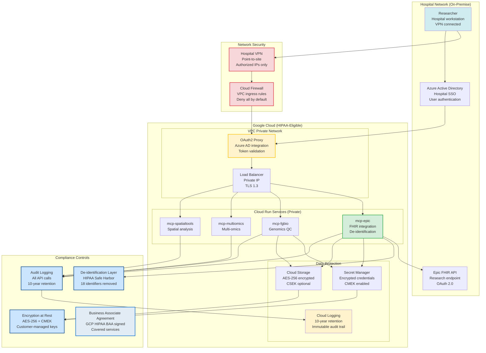

# Hospital Production Deployment

*HIPAA-compliant deployment for research hospitals*

---

## Why Hospital Deployment Differs

Chapter 12 deployed MCP servers to public Cloud Run with `--allow-unauthenticated`. **This won't work for hospitals**.

**Hospital requirements**:
- **HIPAA compliance**: Business Associate Agreement (BAA), de-identification, audit logs
- **Private networking**: VPC integration, no public access
- **SSO authentication**: Hospital Active Directory (Azure AD)
- **Epic FHIR integration**: OAuth 2.0 to research endpoint
- **10-year audit logs**: Immutable compliance records
- **IRB approval**: Research patient data access

**Architecture change**: Public internet → Hospital VPN → VPC → Cloud Run → Epic FHIR (research endpoint only).

{width=\textwidth}

**Figure 13.1: Clinical User Personas**
*Hospital deployment serves multiple user types with different access needs: clinical researchers, bioinformaticians, oncologists, and administrators. Each role has specific permissions and workflows within the HIPAA-compliant infrastructure.*

### HIPAA-Compliant Hospital Deployment Architecture



**Figure 13.2: HIPAA-Compliant Hospital Deployment Architecture**
*Multi-layer security architecture: (1) Network Security: Hospital VPN + Cloud Firewall restricts access to authorized IPs only, (2) Authentication: Azure AD SSO with OAuth2 Proxy for token validation, (3) Private Networking: VPC-isolated Cloud Run services with private IPs and internal load balancer (no public internet access), (4) Data Protection: Secret Manager for credentials, AES-256 encrypted Cloud Storage with optional CSEK, 10-year immutable audit logs, (5) Compliance Controls: HIPAA Safe Harbor de-identification (18 identifiers removed), comprehensive audit logging, customer-managed encryption keys (CMEK), and signed Google Cloud HIPAA BAA.*

**HIPAA Compliance Layers:**

1. **Legal**: Google Cloud HIPAA BAA signed + IRB approval
2. **Network Isolation**: VPC private network, no public access, hospital VPN only
3. **Authentication**: Azure AD SSO with OAuth 2.0 tokens
4. **Encryption at Rest**: AES-256 (GCP default) + CMEK (customer keys)
5. **Encryption in Transit**: TLS 1.3 for all connections
6. **De-identification**: Automatic HIPAA Safe Harbor (18 identifiers removed)
7. **Audit Logging**: All API calls logged, 10-year retention, immutable
8. **Access Control**: IAM roles, least privilege principle
9. **Epic Integration**: Research endpoint only (not production EHR)
10. **Data Minimization**: Only approved researchers, IRB-authorized data

**Critical: No Public Internet Access**
- All Cloud Run services: `--no-allow-unauthenticated`
- VPC-only ingress: `--ingress=internal`
- Load balancer: Private IP only (10.x.x.x range)
- Researcher access: Hospital VPN → VPC → Cloud Run

---

## Prerequisites

### Legal and Compliance

**HIPAA Business Associate Agreement (BAA)**:
- Sign Google Cloud HIPAA BAA (free, available through GCP Console)
- Documents: `Settings → Legal → Business Associate Agreement`
- Enables: HIPAA-eligible services (Cloud Run, Secret Manager, Cloud Logging)

**IRB Approval**:
- Institutional Review Board approval for research patient data
- Informed consent from participants
- Data Use Agreement (DUA) templates

Full HIPAA guide: [`docs/for-hospitals/compliance/hipaa.md`](https://github.com/lynnlangit/precision-medicine-mcp/blob/main/docs/for-hospitals/compliance/hipaa.md)

### Technical Prerequisites

**Hospital IT must provide**:
1. **GCP Organization ID**: Hospital's existing GCP organization
2. **Billing Account**: Grant-funded billing account
3. **Azure AD tenant**: For SSO authentication
4. **Epic FHIR credentials**: Research endpoint (NOT production)
5. **VPC network**: Existing hospital VPC or create new
6. **VPN access**: Hospital VPN for deployment team

### Azure AD App Registration

**Register Azure AD app** (before deployment):

```
App Name: "Precision Medicine MCP"
Supported accounts: Single tenant (hospital only)
Redirect URIs: https://{oauth2-proxy-url}/oauth2/callback
```

**API permissions**:
- `User.Read` (delegated)
- `Directory.Read.All` (application)

Full Azure AD setup: [`infrastructure/hospital-deployment/README.md#azure-ad-setup`](https://github.com/lynnlangit/precision-medicine-mcp/blob/main/infrastructure/hospital-deployment/README.md#azure-ad-setup)

---

## Deployment Scripts Overview

Hospital deployment uses **5 setup scripts** in order:

```bash
cd infrastructure/hospital-deployment

1. ./setup-project.sh      # GCP project, APIs, billing
2. ./setup-vpc.sh           # VPC networking, firewall rules
3. ./setup-secrets.sh       # Secret Manager (Epic, Azure AD, Claude API)
4. ./setup-audit-logging.sh # 10-year audit log retention
5. ./deploy-oauth2-proxy.sh # Azure AD SSO authentication
```

Full scripts: [`infrastructure/hospital-deployment/`](https://github.com/lynnlangit/precision-medicine-mcp/tree/main/infrastructure/hospital-deployment)

**Deployment time**: 1-2 days (Week 1 of 3-month phased rollout).

---

## Script 1: GCP Project Setup

**Creates**: GCP project in hospital organization with HIPAA-compliant configuration.

```bash
./setup-project.sh
```

**What it does**:
- Creates project in hospital's GCP Organization
- Links grant-funded billing account
- Enables APIs: Cloud Run, Compute, VPC Access, Secret Manager, Logging
- Sets budget alerts: $1,000/month with 50%, 75%, 90%, 100% thresholds
- Configures HIPAA-eligible regions (us-central1, us-east4)

**Configuration** (edit variables in script):

```bash
ORG_ID="123456789012"              # Hospital's GCP org ID
BILLING_ACCOUNT_ID="00B597-..."    # PI's billing account
PROJECT_ID="precision-medicine-poc"
REGION="us-central1"
```

Full script: [`infrastructure/hospital-deployment/setup-project.sh`](https://github.com/lynnlangit/precision-medicine-mcp/blob/main/infrastructure/hospital-deployment/setup-project.sh)

---

## Script 2: VPC Networking

**Creates**: Private VPC with Serverless VPC Connector for Cloud Run.

```bash
./setup-vpc.sh
```

**What it does**:
- Creates subnet: `10.10.0.0/24` (256 IPs for MCP servers)
- Creates Serverless VPC Connector (Cloud Run to VPC bridge)
- Enables Private Google Access (secure GCS/API access)
- Configures firewall rules:
  - Allow health checks from Google
  - Allow internal traffic between servers
  - **Deny all external ingress** (requires VPN)

**Network architecture**:

```
Hospital VPN → VPC (10.10.0.0/24) → Serverless VPC Connector → Cloud Run
                                  → Epic FHIR (research endpoint)
```

**Use case**: Cloud Run services access Epic FHIR without public internet exposure.

Full script: [`infrastructure/hospital-deployment/setup-vpc.sh`](https://github.com/lynnlangit/precision-medicine-mcp/blob/main/infrastructure/hospital-deployment/setup-vpc.sh)

---

## Script 3: Secret Manager

**Creates**: Encrypted secret storage for credentials.

```bash
./setup-secrets.sh --interactive
```

**7 secrets created**:
1. `anthropic-api-key` - Claude API access
2. `epic-fhir-endpoint` - Epic FHIR base URL (research endpoint)
3. `epic-client-id` - Epic OAuth client ID
4. `epic-client-secret` - Epic OAuth secret
5. `azure-ad-client-id` - Azure AD app ID
6. `azure-ad-client-secret` - Azure AD app secret
7. `azure-ad-tenant-id` - Hospital's Azure AD tenant

**Security features**:
- Automatic encryption at rest (Google-managed keys)
- IAM bindings (service accounts only, no users)
- Version history (rotate secrets without downtime)
- Audit logging (who accessed what, when)

**Example usage**:

```bash
# Populate secret
echo -n "sk-ant-..." | gcloud secrets versions add anthropic-api-key --data-file=-

# Verify
gcloud secrets list --project=precision-medicine-poc
```

Full script: [`infrastructure/hospital-deployment/setup-secrets.sh`](https://github.com/lynnlangit/precision-medicine-mcp/blob/main/infrastructure/hospital-deployment/setup-secrets.sh)

---

## Script 4: Audit Logging

**Creates**: 10-year immutable audit logs (HIPAA requirement).

```bash
./setup-audit-logging.sh
```

**What it does**:
- Creates log bucket with **3,650-day retention** (10 years)
- Sets up log sinks:
  - All Cloud Run requests (user queries, MCP tool calls)
  - Authentication events (login, logout, failed attempts)
  - Epic FHIR API calls
  - De-identification operations
- Creates custom metrics:
  - De-identification success rate
  - Epic FHIR failure rate
  - User access events

**Log immutability**: Cannot be deleted before 10 years, even by admins.

**Accessing logs**:

```bash
# View user queries
gcloud logging read "jsonPayload.event=\"mcp_query\"" --limit=50

# Export for compliance report
gcloud logging read "jsonPayload.event=\"mcp_query\"" --format=csv > report.csv
```

Full script: [`infrastructure/hospital-deployment/setup-audit-logging.sh`](https://github.com/lynnlangit/precision-medicine-mcp/blob/main/infrastructure/hospital-deployment/setup-audit-logging.sh)

---

## Script 5: OAuth2 Proxy (SSO)

**Deploys**: Azure AD authentication layer for Cloud Run services.

```bash
./deploy-oauth2-proxy.sh
```

**What it does**:
- Builds OAuth2 Proxy container with Azure AD configuration
- Deploys to Cloud Run as authentication gateway
- Configures:
  - Provider: Azure AD
  - Email domains: `@hospital.org` (only hospital users)
  - Session expiry: 1 day
  - CSRF protection (SameSite cookies)
- Sits in front of Streamlit/JupyterHub

**Authentication flow**:

```
User → OAuth2 Proxy → Azure AD login → OAuth2 Proxy (cookie) → MCP servers
```

**Testing**:

```bash
PROXY_URL=$(gcloud run services describe oauth2-proxy \
  --region=us-central1 --format='value(status.url)')

curl -I $PROXY_URL
# Returns: 302 redirect to Azure AD login
```

Full script: [`infrastructure/hospital-deployment/deploy-oauth2-proxy.sh`](https://github.com/lynnlangit/precision-medicine-mcp/blob/main/infrastructure/hospital-deployment/deploy-oauth2-proxy.sh)

---

## De-identification: HIPAA Safe Harbor

**All patient data** must be de-identified before analysis (HIPAA requirement).

**HIPAA Safe Harbor removes 18 identifiers**:
1. Names
2. Geographic subdivisions smaller than state
3. Dates (except year)
4. Telephone/fax numbers
5. Email addresses
6. SSNs
7. Medical record numbers (MRNs)
8. Health plan beneficiary numbers
9. Account numbers
10. Certificate/license numbers
11. Vehicle identifiers
12. Device identifiers/serial numbers
13. URLs
14. IP addresses
15. Biometric identifiers
16. Full-face photos
17. Any other unique identifying number/characteristic/code

**Implementation** (mcp-epic server):

```python
def deidentify_patient(patient: dict) -> dict:
    """Apply HIPAA Safe Harbor de-identification."""
    # Remove identifiers
    for field in ["name", "telecom", "address", "photo"]:
        patient.pop(field, None)

    # Hash patient ID
    patient["id"] = hash_identifier(patient["id"])

    # Reduce birthDate to year only
    if "birthDate" in patient:
        patient["birthDate"] = reduce_to_year(patient["birthDate"])

    return patient
```

Full implementation: [`servers/mcp-epic/src/mcp_epic/deidentify.py`](https://github.com/lynnlangit/precision-medicine-mcp/blob/main/servers/mcp-epic/src/mcp_epic/deidentify.py) (110 lines)

**Validation**: Privacy officer reviews de-identification results quarterly.

---

## Epic FHIR Integration

**Hospital IT provides**:
- **Research FHIR endpoint**: `https://hospital-research.epic.com/api/FHIR/R4/` (NOT production)
- **OAuth 2.0 credentials**: Client ID, client secret
- **Authorized scopes**: `patient/*.read`, `Observation.read`, `Condition.read`

**Test Epic connection**:

```bash
# Test OAuth token
curl -X POST "${EPIC_FHIR_ENDPOINT}/oauth2/token" \
  -d "grant_type=client_credentials" \
  -d "client_id=${EPIC_CLIENT_ID}" \
  -d "client_secret=${EPIC_CLIENT_SECRET}"

# Test metadata endpoint
curl -H "Authorization: Bearer $TOKEN" \
  "${EPIC_FHIR_ENDPOINT}/metadata"
```

**Store credentials** in Secret Manager:

```bash
echo -n "$EPIC_FHIR_ENDPOINT" | gcloud secrets versions add epic-fhir-endpoint --data-file=-
echo -n "$EPIC_CLIENT_ID" | gcloud secrets versions add epic-client-id --data-file=-
echo -n "$EPIC_CLIENT_SECRET" | gcloud secrets versions add epic-client-secret --data-file=-
```

Full Epic setup: [`infrastructure/hospital-deployment/README.md#epic-fhir-setup`](https://github.com/lynnlangit/precision-medicine-mcp/blob/main/infrastructure/hospital-deployment/README.md#epic-fhir-setup)

---

## Deploy MCP Servers (Private Mode)

**Deploy to VPC** with authentication required:

```bash
cd servers/mcp-deepcell

gcloud run deploy mcp-deepcell \
  --image=gcr.io/PROJECT_ID/mcp-deepcell:latest \
  --region=us-central1 \
  --no-allow-unauthenticated \
  --vpc-connector=mcp-connector \
  --vpc-egress=private-ranges-only \
  --service-account=mcp-deepcell-sa@PROJECT_ID.iam.gserviceaccount.com
```

**Key differences from public deployment**:
- `--no-allow-unauthenticated` (requires authentication)
- `--vpc-connector` (routes traffic through VPC)
- `--vpc-egress=private-ranges-only` (no public internet from container)
- `--service-account` (least-privilege IAM)

**Access**: Only via hospital VPN → OAuth2 Proxy → Cloud Run.

---

## PatientOne Hospital Workflow

**Deploy all 12 servers** for HIPAA-compliant analysis:

**Week 1**: Infrastructure setup
```bash
./setup-project.sh
./setup-vpc.sh
./setup-secrets.sh --interactive
./setup-audit-logging.sh
./deploy-oauth2-proxy.sh
```

**Week 2**: Core MCP servers
```bash
cd ../../servers
./deploy-all-servers.sh --vpc-mode --no-public-access
```

**Week 3**: Epic FHIR integration
```bash
cd servers/mcp-epic
./deploy.sh PROJECT_ID us-central1 --epic-endpoint=$EPIC_FHIR_ENDPOINT
```

**Deployment time**: 3 weeks (includes testing, validation).

**Verification**:

```bash
# All servers deployed
gcloud run services list --region=us-central1

# All services require auth
gcloud run services describe mcp-deepcell \
  --region=us-central1 --format='value(spec.template.spec.serviceAccountName)'
```

---

## Cost Management

### Monthly Cost Breakdown (Hospital Deployment)

**Infrastructure**:
- VPC Connector: $72/month (always-on, 2 instances)
- Secret Manager: $0.60/month (7 secrets × 2 versions)
- Audit logging: $50/month (100GB logs/month)

**Compute** (9 servers, moderate usage):
- Cloud Run: $400/month
- OAuth2 Proxy: $25/month (min-instances=1)

**API costs**:
- Claude API: $500/month (5 users, optimized)
- Epic FHIR: $0 (included in hospital contract)

**Total**: ~$1,047/month

**Budget alerts**: $500 (50%), $750 (75%), $900 (90%), $1,000 (100%).

Full cost guide: [`docs/deployment/cost-optimization.md`](https://github.com/lynnlangit/precision-medicine-mcp/blob/main/docs/deployment/cost-optimization.md)

---

## Security Configuration

### Authentication

**OAuth2 Proxy enforces**:
- Azure AD SSO (hospital Active Directory)
- Email domain restriction: `@hospital.org`
- User group membership: `precision-medicine-users`
- Session expiry: 1 day
- CSRF protection (SameSite cookies)

### Network Security

**VPC firewall rules**:
- Allow: Health checks from Google (`130.211.0.0/22`, `35.191.0.0/16`)
- Allow: Internal traffic between MCP servers
- **Deny**: All external ingress

**Access**: Only via hospital VPN.

### Data Security

**De-identification**: All patient data auto-de-identified via HIPAA Safe Harbor
**Encryption**: TLS 1.3 in transit, AES-256 at rest
**Secrets**: Encrypted in Secret Manager (Google-managed keys)
**Audit logs**: Immutable 10-year retention

Full security guide: [`docs/for-hospitals/compliance/data-governance.md#access-controls-security`](https://github.com/lynnlangit/precision-medicine-mcp/blob/main/docs/for-hospitals/compliance/data-governance.md#access-controls-security)

---

## Verification and Testing

### 1. VPC Connectivity

```bash
# SSH to test VM in VPC
gcloud compute ssh test-vm --zone=us-central1-a

# Test Cloud Run internal access
curl https://mcp-deepcell-xxx.run.app/health
# Should return 200 OK
```

### 2. Authentication

```bash
# Test OAuth2 Proxy
curl -I https://{oauth2-proxy-url}
# Should return 302 redirect to Azure AD
```

### 3. Epic FHIR Connection

```bash
# From Cloud Run container
gcloud run services update mcp-epic \
  --update-env-vars TEST_EPIC_CONNECTION=true

# Check logs
gcloud run logs read mcp-epic --limit=20
# Should show: "Epic FHIR connection: SUCCESS"
```

### 4. De-identification

```bash
# Fetch patient data (auto-de-identified)
# Via Claude Desktop or API, run:
# "Fetch patient PAT001 from Epic FHIR"

# Verify in logs: No MRNs, names, or full addresses appear
gcloud logging read "resource.type=cloud_run_revision" --limit=100
```

Full testing guide: [`docs/for-hospitals/USER_GUIDE.md#testing-deployment`](https://github.com/lynnlangit/precision-medicine-mcp/blob/main/docs/for-hospitals/USER_GUIDE.md#testing-deployment)

---

## Troubleshooting

### Issue 1: OAuth2 Login Fails

**Symptoms**: Redirect to Azure AD, but returns error

**Solutions**:
- Check Azure AD redirect URIs match deployed OAuth2 Proxy URL
- Verify `azure-ad-client-secret` not expired (24 months max)
- Confirm user in `precision-medicine-users` Azure AD group

Full runbook: [`docs/for-hospitals/RUNBOOKS/sso-issues.md`](https://github.com/lynnlangit/precision-medicine-mcp/blob/main/docs/for-hospitals/RUNBOOKS/sso-issues.md)

### Issue 2: Epic FHIR Connection Fails

**Symptoms**: "401 Unauthorized" or "403 Forbidden"

**Solutions**:
- Verify Epic credentials in Secret Manager
- Check OAuth token endpoint URL correct
- Ensure service account has `secretAccessor` role

Full runbook: [`docs/for-hospitals/RUNBOOKS/epic-connection-failure.md`](https://github.com/lynnlangit/precision-medicine-mcp/blob/main/docs/for-hospitals/RUNBOOKS/epic-connection-failure.md)

### Issue 3: VPC Egress Blocked

**Symptoms**: Cloud Run cannot access Epic FHIR or Google APIs

**Solutions**:
```bash
# Check VPC egress setting
gcloud run services describe mcp-epic \
  --region=us-central1 --format='value(spec.template.spec.vpcAccess.egress)'

# Should be: private-ranges-only
# If all-traffic, redeploy with correct setting
```

---

## What You've Deployed

**Hospital-compliant architecture**:
1. **HIPAA compliance**: BAA signed, 10-year audit logs, de-identification
2. **Private networking**: VPC with no public access, VPN required
3. **SSO authentication**: Azure AD via OAuth2 Proxy
4. **Epic FHIR integration**: Research endpoint with OAuth 2.0
5. **Secret management**: Encrypted credentials in Secret Manager
6. **Audit logging**: Immutable 10-year retention

**PatientOne workflow**:
- Deployment time: 3 weeks (infrastructure + servers + Epic integration)
- Cost: ~$1,047/month (VPC + compute + API)
- Access: Hospital VPN → Azure AD login → MCP servers → Epic FHIR (research)

**Compliance**: HIPAA-eligible, IRB-approved, privacy officer validated.

---

## Summary

**Chapter 13 Summary**:
- Hospital deployment requires HIPAA compliance, VPC, SSO
- 5 setup scripts: project, VPC, secrets, audit logs, OAuth2 Proxy
- De-identification: HIPAA Safe Harbor (18 identifiers removed)
- Epic FHIR: Research endpoint only, OAuth 2.0, auto-de-identification
- Private deployment: No public access, VPN required, authentication enforced
- Cost: ~$1,047/month (infrastructure + compute + Claude API)

**Files**: [`infrastructure/hospital-deployment/`](https://github.com/lynnlangit/precision-medicine-mcp/tree/main/infrastructure/hospital-deployment) (5 scripts + docs)
**Deployment time**: 3 weeks (phased rollout)
**Compliance**: HIPAA-eligible, IRB-approved, 10-year audit logs
