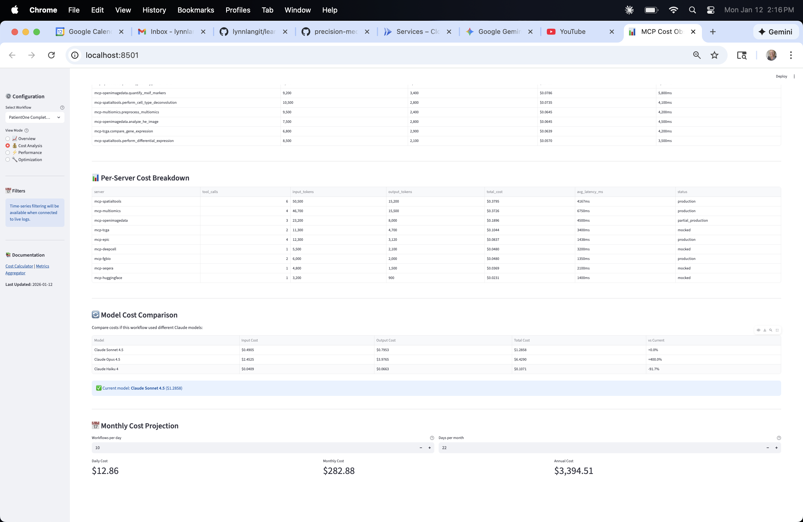
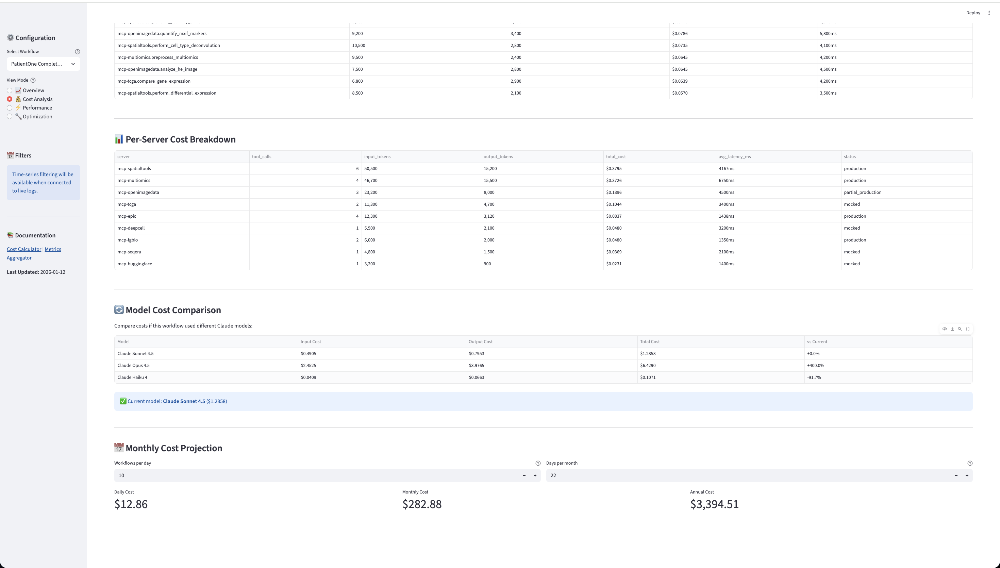
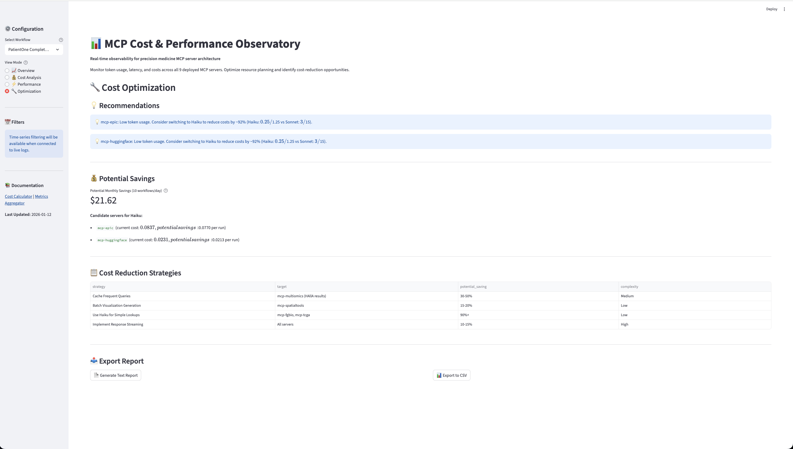

# Operations and Monitoring

*Production monitoring, alerting, and runbooks*

---

## Why Monitoring Matters

Chapters 12-13 deployed MCP servers to production. **Now what?**

**Without monitoring, you're blind**:
- Is the system working? (Health checks)
- Are users getting errors? (Error rate tracking)
- Is Epic FHIR accessible? (Integration monitoring)
- Are de-identification operations succeeding? (Compliance validation)
- What's the monthly cost? (Budget tracking)

**Monitoring enables**:
- **Proactive response**: Alerts before users notice problems
- **Compliance**: 10-year audit logs (HIPAA requirement)
- **Cost control**: Budget alerts, usage optimization
- **Performance tuning**: Identify bottlenecks, optimize resources

**PatientOne workflow**: Monitor all 12 MCP servers with dashboards, alerts, and runbooks.

---

## Cloud Logging (10-Year Audit Trail)

**All production logs** stored with 10-year immutable retention (HIPAA requirement).

**Log types**:
1. **Cloud Run requests**: User queries, MCP tool calls, response codes
2. **Authentication events**: Login, logout, failed attempts (Azure AD)
3. **Epic FHIR calls**: Patient data access, de-identification operations
4. **Application logs**: Structured logs from MCP servers
5. **System logs**: Container startup, crashes, out-of-memory events

**Access logs**:

```bash
# View recent user queries
gcloud logging read "jsonPayload.event=\"mcp_query\"" --limit=50

# View Epic FHIR calls
gcloud logging read "jsonPayload.event=\"epic_fhir_call\"" --limit=50

# View errors only
gcloud logging read "severity>=ERROR" --limit=100

# Export for compliance report
gcloud logging read "timestamp>=\"2026-01-01T00:00:00Z\"" \
  --format=csv > audit_report.csv
```

**Structured logging format**:

```json
{
  "severity": "INFO",
  "timestamp": "2026-01-31T10:15:30Z",
  "event": "mcp_query",
  "user_id": "user@hospital.org",
  "server": "mcp-spatialtools",
  "tool": "run_differential_expression",
  "duration_ms": 5432,
  "success": true
}
```

Full logging guide: [`docs/for-hospitals/AUDIT_LOG_GUIDE.md`](https://github.com/lynnlangit/precision-medicine-mcp/blob/main/docs/for-hospitals/AUDIT_LOG_GUIDE.md)

---

## Key Metrics to Monitor

### 1. Request Latency

**Metric**: `run.googleapis.com/request_latencies`

**Thresholds**:
- P50 < 10s (warm requests)
- P95 < 60s (includes cold starts)
- P99 < 120s (large images + cold starts)

**Alert if**: P95 > 120s for 15 minutes

### 2. Error Rate

**Metric**: `run.googleapis.com/request_count` (filtered by response code)

**Thresholds**:
- 5xx errors < 1% (server errors)
- 4xx errors < 5% (client errors acceptable)

**Alert if**: 5xx error rate > 2% for 5 minutes

### 3. Memory Utilization

**Metric**: `run.googleapis.com/container/memory/utilizations`

**Thresholds**:
- Average < 70% (of allocated memory)
- Peak < 90%

**Alert if**: Memory > 85% for 10 minutes

**Action**:
```bash
gcloud run services update mcp-deepcell --memory=8Gi
```

### 4. CPU Utilization

**Metric**: `run.googleapis.com/container/cpu/utilizations`

**Thresholds**:
- Average < 80% during processing
- Idle < 10% when not processing

**Alert if**: CPU > 90% for 10 minutes

### 5. Epic FHIR Failures

**Metric**: Custom log-based metric from Epic FHIR call logs

**Threshold**: Epic failure rate < 1%

**Alert if**: Epic failures > 5% for 5 minutes

### 6. De-identification Success

**Metric**: Custom log-based metric from de-identification operations

**Threshold**: De-identification success rate > 99%

**Alert if**: De-identification failures > 1% (CRITICAL - privacy risk)

Full metrics guide: [`servers/mcp-deepcell/MONITORING.md#key-metrics-to-monitor`](https://github.com/lynnlangit/precision-medicine-mcp/blob/main/servers/mcp-deepcell/MONITORING.md#key-metrics-to-monitor)

---

## Monitoring Dashboards

**Create dashboard** with Cloud Monitoring:

```bash
gcloud monitoring dashboards create \
  --config-from-file=dashboard-config.json
```

**Dashboard widgets**:
1. **Server Health**: Request count, error rate, latency (P50/P95/P99)
2. **Resource Usage**: Memory utilization, CPU utilization, instance count
3. **User Activity**: Queries per hour, active users, top tools used
4. **Epic FHIR**: Connection status, API calls, failure rate
5. **De-identification**: Success rate, processing time
6. **Cost Tracking**: Daily spend, projected monthly cost, budget burn rate

### Production Dashboard Examples

{width=100%}

**Figure 14.1: Main Operations Dashboard**
*Real-time overview of MCP server health, request rates, error rates, and latency percentiles (P50, P95, P99) across all 12 services.*

{width=100%}

**Figure 14.2: Cost Tracking Dashboard**
*Daily and monthly cost breakdown by service, projected spend, and budget burn rate with alerting thresholds.*

{width=100%}

**Figure 14.3: Performance Metrics**
*Memory and CPU utilization, instance counts, cold start frequency, and throughput optimization metrics.*

{width=100%}

**Figure 14.4: Server Health Monitoring**
*Individual server status, uptime, response times, and integration health (Epic FHIR, de-identification pipelines).*

**Dashboard URL**:
```
https://console.cloud.google.com/monitoring/dashboards/custom/{dashboard-id}
```

**Example dashboard config**: [`infrastructure/hospital-deployment/monitoring/dashboard-config.json`](https://github.com/lynnlangit/precision-medicine-mcp/blob/main/infrastructure/hospital-deployment/monitoring/dashboard-config.json)

---

## Alerting Policies

**Create 6 critical alerts**:

### 1. High Error Rate (P0)

```yaml
Condition: 5xx error rate > 2% for 5 minutes
Severity: Critical
Action: Page on-call engineer
```

```bash
gcloud alpha monitoring policies create \
  --notification-channels=CHANNEL_ID \
  --display-name="MCP High Error Rate" \
  --condition-threshold-value=0.02 \
  --condition-threshold-duration=300s
```

### 2. Server Down (P0)

```yaml
Condition: Service status != Ready for 2 minutes
Severity: Critical
Action: Page on-call engineer, run "Server Down" runbook
```

### 3. Epic FHIR Failure (P1)

```yaml
Condition: Epic failure rate > 5% for 5 minutes
Severity: High
Action: Email team, run "Epic Connection Failure" runbook
```

### 4. High Memory Usage (P2)

```yaml
Condition: Memory utilization > 85% for 10 minutes
Severity: Medium
Action: Email team, consider scaling up
```

### 5. De-identification Failure (P0)

```yaml
Condition: De-identification failure rate > 1%
Severity: Critical (privacy risk)
Action: Page privacy officer, halt Epic data access
```

### 6. Budget Threshold Exceeded (P2)

```yaml
Condition: Daily cost > 90% of monthly budget / 30 days
Severity: Medium
Action: Email team, review cost drivers
```

Full alert policies: [`infrastructure/hospital-deployment/monitoring/alert-policies.yaml`](https://github.com/lynnlangit/precision-medicine-mcp/blob/main/infrastructure/hospital-deployment/monitoring/alert-policies.yaml)

---

## Runbooks (Troubleshooting Guides)

**3 critical runbooks** for common issues:

### Runbook 1: Server Down

**Symptoms**: "Connection refused", 5xx errors, health check failures

**Diagnosis**:
```bash
# Check server status
gcloud run services describe mcp-deepcell \
  --region=us-central1 \
  --format='value(status.conditions[0].status)'

# Check logs
gcloud run logs read mcp-deepcell --limit=50 | grep ERROR
```

**Resolution**:
1. **Restart container** (force new revision):
```bash
gcloud run services update mcp-deepcell \
  --update-env-vars=RESTART_TIMESTAMP=$(date +%s)
```

2. **Rollback to previous revision** (if recent deployment):
```bash
gcloud run services update-traffic mcp-deepcell \
  --to-revisions=PREVIOUS_REVISION=100
```

3. **Redeploy from source** (if corruption):
```bash
cd servers/mcp-deepcell
./deploy.sh PROJECT_ID us-central1
```

Full runbook: [`docs/for-hospitals/RUNBOOKS/server-down.md`](https://github.com/lynnlangit/precision-medicine-mcp/blob/main/docs/for-hospitals/RUNBOOKS/server-down.md)

### Runbook 2: SSO/Authentication Issues

**Symptoms**: Azure AD redirect fails, "Access denied", cookie errors

**Diagnosis**:
```bash
# Check OAuth2 Proxy logs
gcloud run logs read oauth2-proxy --limit=50

# Verify Azure AD redirect URIs
# Check Azure Portal → App registrations → Redirect URIs
```

**Resolution**:
1. **Verify redirect URIs** match deployed OAuth2 Proxy URL
2. **Check Azure AD secret expiry** (24 months max):
```bash
# Update secret in Secret Manager
echo -n "NEW_SECRET" | gcloud secrets versions add azure-ad-client-secret --data-file=-
```

3. **Verify user in Azure AD group** `precision-medicine-users`

Full runbook: [`docs/for-hospitals/RUNBOOKS/sso-issues.md`](https://github.com/lynnlangit/precision-medicine-mcp/blob/main/docs/for-hospitals/RUNBOOKS/sso-issues.md)

### Runbook 3: Epic FHIR Connection Failure

**Symptoms**: "401 Unauthorized", "Epic connection failed", no patient data

**Diagnosis**:
```bash
# Test Epic connection
gcloud run logs read mcp-epic --limit=50 | grep "epic_fhir_call"

# Verify Epic credentials
gcloud secrets versions access latest --secret=epic-client-id
```

**Resolution**:
1. **Verify Epic credentials** in Secret Manager (not expired)
2. **Test OAuth token endpoint**:
```bash
curl -X POST "${EPIC_ENDPOINT}/oauth2/token" \
  -d "grant_type=client_credentials" \
  -d "client_id=${EPIC_CLIENT_ID}" \
  -d "client_secret=${EPIC_CLIENT_SECRET}"
```

3. **Check service account IAM permissions** (needs `secretAccessor` role)
4. **Contact hospital IT** (Epic FHIR endpoint may be down)

Full runbook: [`docs/for-hospitals/RUNBOOKS/epic-connection-failure.md`](https://github.com/lynnlangit/precision-medicine-mcp/blob/main/docs/for-hospitals/RUNBOOKS/epic-connection-failure.md)

---

## Cost Tracking and Optimization

### View Current Costs

```bash
# View daily costs (last 7 days)
gcloud billing accounts get-spend \
  --billing-account=BILLING_ACCOUNT_ID \
  --start-date=$(date -d '7 days ago' -I) \
  --end-date=$(date -I)

# View by service
gcloud billing accounts get-spend \
  --billing-account=BILLING_ACCOUNT_ID \
  --groupBy=service
```

### Budget Alerts

**Set budget** with 50%, 75%, 90%, 100% thresholds:

```bash
gcloud billing budgets create \
  --billing-account=BILLING_ACCOUNT_ID \
  --display-name="MCP Monthly Budget" \
  --budget-amount=1000USD \
  --threshold-rule=percent=50,basis=current-spend \
  --threshold-rule=percent=75,basis=current-spend \
  --threshold-rule=percent=90,basis=current-spend \
  --threshold-rule=percent=100,basis=current-spend
```

**Alert notification**: Email to team when threshold exceeded.

### Cost Optimization Strategies

1. **Scale to zero**: Set `min-instances=0` for all non-critical servers
2. **Reduce concurrency**: Lower concurrency = fewer instances = lower cost
3. **Use Haiku for simple queries**: ~10× cheaper than Sonnet
4. **Cache MCP responses**: Avoid redundant API calls
5. **Right-size resources**: Monitor actual usage, reduce over-provisioned memory/CPU

**Example**: Reducing mcp-deepcell memory from 8Gi → 4Gi saves ~$50/month.

Full cost guide: [`docs/deployment/cost-optimization.md`](https://github.com/lynnlangit/precision-medicine-mcp/blob/main/docs/deployment/cost-optimization.md)

---

## Performance Optimization

### Baseline Performance (CPU-only, 4Gi RAM, 2 vCPU)

| Server | Cold Start | Warm Request | Optimization |
|--------|------------|--------------|--------------|
| mcp-fgbio | ~5s | ~1s | None needed |
| mcp-multiomics | ~8s | ~3s | None needed |
| mcp-spatialtools | ~10s | ~5s | Consider min-instances=1 |
| mcp-deepcell | ~35s | ~5s | **High cold start** |
| mcp-perturbation | ~12s | ~8s | None needed |

### Optimization Techniques

**1. Reduce cold starts** (for mcp-deepcell):
```bash
gcloud run services update mcp-deepcell --min-instances=1
```
- Cost: ~$50/month for always-on instance
- Benefit: Eliminates 30s cold start latency

**2. Increase throughput** (for high-traffic servers):
```bash
gcloud run services update mcp-spatialtools \
  --cpu=4 \
  --max-instances=20
```
- Cost: +50% per request
- Benefit: 2× faster processing, more concurrent requests

**3. Optimize concurrency** (better caching):
```bash
gcloud run services update mcp-deepcell --concurrency=1
```
- Ensures one request per instance (better model caching)
- More predictable performance

Full performance guide: [`servers/mcp-deepcell/MONITORING.md#performance-optimization-recommendations`](https://github.com/lynnlangit/precision-medicine-mcp/blob/main/servers/mcp-deepcell/MONITORING.md#performance-optimization-recommendations)

---

## Quarterly Bias Audits

**HIPAA and NIH require** quarterly bias audits for AI/ML systems.

**Audit process** (every 3 months):

1. **Extract analysis data** (last 3 months):
```bash
gcloud logging read "jsonPayload.event=\"mcp_query\" AND timestamp>\"2026-01-01T00:00:00Z\"" \
  --format=csv > q1_2026_queries.csv
```

2. **Run bias audit script**:
```bash
python3 scripts/audit/audit_bias.py \
  --workflow patientone \
  --genomics-data /data/genomics_results.csv \
  --clinical-data /data/fhir_patients.json \
  --output /reports/q1_2026_bias_audit.html
```

3. **Review audit report**:
- Data representation (ancestry distribution)
- Fairness metrics (demographic parity, equalized odds)
- Proxy feature detection (age, ZIP code)
- Confidence scoring (ancestry-aware)

4. **Submit to IRB** (required quarterly compliance report)

**Example bias metrics**:
- European ancestry: 45% of dataset (vs 40% US population) ✓
- African ancestry: 12% of dataset (vs 13% US population) ✓
- Asian ancestry: 8% of dataset (vs 6% US population) ✓
- Latino ancestry: 35% of dataset (vs 19% US population) ⚠️ Over-represented

**Action**: Document over-representation, adjust recruitment if needed.

Full bias audit guide: [`docs/for-hospitals/ethics/BIAS_AUDIT_CHECKLIST.md`](https://github.com/lynnlangit/precision-medicine-mcp/blob/main/docs/for-hospitals/ethics/BIAS_AUDIT_CHECKLIST.md)

---

## PatientOne Monitoring Example

**Scenario**: Monitor PatientOne analysis (35 minutes, 12 MCP servers).

**Before analysis starts**:
```bash
# Check all servers healthy
gcloud run services list --region=us-central1
# All should show "Ready: True"

# Check Epic FHIR connection
gcloud run logs read mcp-epic --limit=5 | grep "epic_fhir_call"
# Should show recent successful calls
```

**During analysis** (monitor in real-time):
```bash
# Tail logs from all servers
gcloud run logs tail \
  --region=us-central1 \
  --filter="resource.labels.service_name:(mcp-)"

# Watch metrics dashboard
# https://console.cloud.google.com/monitoring/dashboards/custom/{dashboard-id}
```

**After analysis completes**:
```bash
# View total requests by server
gcloud logging read "jsonPayload.event=\"mcp_query\" AND timestamp>\"$(date -u -d '1 hour ago' -Iseconds)\"" \
  --format=json | jq '.[] | .jsonPayload.server' | sort | uniq -c

# Output:
#   15 mcp-fgbio
#   8 mcp-multiomics
#   12 mcp-spatialtools
#   7 mcp-deepcell
#   ...

# Calculate total cost
gcloud billing accounts get-spend \
  --billing-account=BILLING_ACCOUNT_ID \
  --start-date=$(date -I) \
  --end-date=$(date -I)
# Expected: ~$1.35 for PatientOne analysis
```

**Success criteria**:
- ✓ All servers responded (no 5xx errors)
- ✓ Epic FHIR calls succeeded (de-identification applied)
- ✓ Analysis completed in 35 minutes
- ✓ Cost within budget (~$1.35 vs $3,200 manual)

---

## What You've Configured

**Monitoring infrastructure**:
1. **Cloud Logging**: 10-year immutable audit trail (HIPAA compliant)
2. **Key metrics**: Latency, errors, memory, CPU, Epic FHIR, de-identification
3. **Dashboards**: Server health, resource usage, user activity, cost tracking
4. **Alerting policies**: 6 critical alerts (error rate, server down, Epic failure, memory, de-identification, budget)
5. **Runbooks**: 3 troubleshooting guides (server down, SSO issues, Epic connection)
6. **Cost tracking**: Budget alerts, daily spend monitoring, optimization strategies
7. **Performance tuning**: Cold start reduction, throughput optimization, concurrency tuning
8. **Quarterly bias audits**: Automated compliance reporting

**PatientOne workflow**:
- Real-time monitoring during 35-minute analysis
- Alerts if errors occur (page on-call engineer)
- Audit logs for compliance reporting
- Cost tracking ($1.35 per analysis vs $3,200 manual)

**Compliance**: 10-year logs, quarterly bias audits, IRB reporting.

---

## Next Steps

**Part 4 Complete!** You've deployed and configured operations for production:
- Chapter 12: Cloud Run deployment with SSE transport
- Chapter 13: Hospital production deployment with HIPAA compliance
- Chapter 14: Monitoring, alerting, and runbooks

**Part 5: Research and Education** (Chapters 15-16) covers:
- Chapter 15: For researchers (exploratory analysis, prompt engineering)
- Chapter 16: Teaching precision medicine (educational workflows, student access)

---

**Chapter 14 Summary**:
- Cloud Logging: 10-year immutable audit trail (HIPAA requirement)
- Key metrics: Latency (P50/P95/P99), error rate, memory, CPU, Epic FHIR, de-identification
- Dashboards: Server health, user activity, cost tracking
- Alerting: 6 critical policies (P0/P1/P2 severity)
- Runbooks: Server down, SSO issues, Epic connection failure
- Cost tracking: $1,047/month budget with 50%/75%/90%/100% alerts
- Performance optimization: Cold start reduction, throughput tuning
- Quarterly bias audits: Automated compliance reporting

**Files**: [`docs/for-hospitals/OPERATIONS_MANUAL.md`](https://github.com/lynnlangit/precision-medicine-mcp/blob/main/docs/for-hospitals/OPERATIONS_MANUAL.md), [`docs/for-hospitals/RUNBOOKS/`](https://github.com/lynnlangit/precision-medicine-mcp/tree/main/docs/for-hospitals/RUNBOOKS). 
**Monitoring**: Cloud Logging + Monitoring, 6 alert policies, 3 runbooks. 
**Compliance**: 10-year logs, quarterly bias audits, IRB reporting. 
