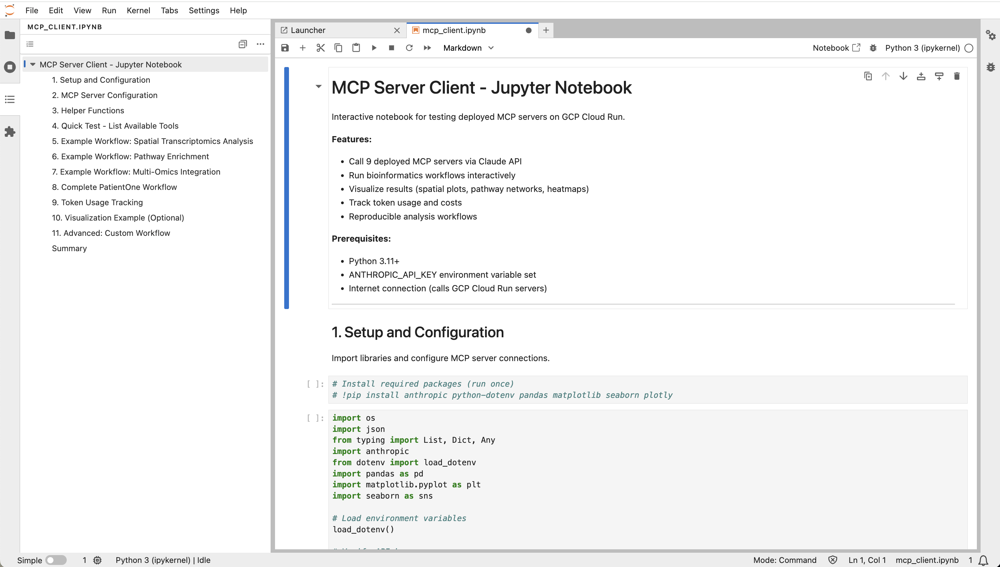

# Teaching Precision Medicine

*Educational workflows, classroom exercises, and student access*

---

## Why Teach With This Platform

Chapter 15 focused on research. **Educators have different needs**:

**Research use**: Hypothesis testing, publications, grant-funded analysis
**Teaching use**: Learning concepts, hands-on exercises, cost-effective student access

**Educator requirements**:
- **Low cost**: $0.32 per student analysis (DRY_RUN mode) vs $6,000 traditional
- **Safe data**: PatientOne 100% synthetic (no IRB needed, safe to share)
- **Scaffolded learning**: Beginner → Intermediate → Advanced prompts
- **Reproducible**: Same results every time (no random variation in DRY_RUN)
- **Hands-on**: Real tools, real workflows (not simulations)

**PatientOne for teaching**: Perfect educational dataset (Stage IV ovarian cancer, multi-modal data, treatment decisions).

---

## Educational Prompts (10 Prompts)

**Curated prompts** organized by difficulty level:

### Beginner Level (Prompts 1-3)

**Time**: 5-10 minutes each
**Prerequisites**: None (intro to bioinformatics)

#### Prompt 1: Introduction to MCP

**Learning objectives**:
- Understand MCP server architecture
- Know which servers handle which data types
- See how servers connect in workflows

**Prompt**:
```
Welcome to Precision Medicine MCP!

Task 1: List all available MCP servers.
For each server, tell me:
- Server name
- What type of data it handles
- How many tools it provides

Task 2: Explore mcp-spatialtools in detail.
List all its tools and explain what each does.

Task 3: Explain how servers work together.
Which servers would I use to analyze a cancer patient's data?
```

**Expected output**: 10 servers listed, 14 spatialtools tools explained, workflow diagram.

**Time**: 5 minutes
**Cost**: $0.05 (minimal API usage)

#### Prompt 2: First Analysis - Gene Expression

**Learning objectives**:
- Load and explore gene expression data
- Compare expression across regions
- Interpret biological meaning

**Prompt**:
```
Let's run your first analysis!

Step 1: Load PatientOne spatial transcriptomics data.
How many spots (tissue locations) are there? How many genes?

Step 2: Find MKI67 gene expression (proliferation marker).
What is the average expression? Highest? Lowest?

Step 3: Compare MKI67 in different regions:
- tumor_core
- tumor_proliferative
- stroma (normal tissue)

Which region has highest MKI67? What does this tell us about cell division?
```

**Expected output**: 900 spots, 31 genes, MKI67 highest in tumor_proliferative (5.91 vs 0.85 in stroma).

**Time**: 5 minutes
**Cost**: $0.10

#### Prompt 3: Statistical Significance

**Learning objectives**:
- Understand p-values and statistical significance
- Learn why multiple testing correction is crucial
- Distinguish statistical vs biological significance

**Prompt**:
```
Let's learn about statistical significance!

Step 1: Compare MKI67 expression (tumor vs stroma).
Use Mann-Whitney U test. What is the p-value?

Step 2: Interpret the result.
Is MKI67 significantly different? How confident are you?
What does p = 0.001 mean in simple terms?

Step 3: Test ALL 31 genes (not just MKI67).
How many are significant at p < 0.05 without correction?
How many after FDR correction (q < 0.05)?
Why do we need correction?
```

**Expected output**: MKI67 p = 8.3e-12 (highly significant), 28 genes significant uncorrected → 17 after FDR.

**Time**: 10 minutes
**Cost**: $0.15

Full beginner prompts: [`docs/prompt-library/educational-prompts.md#beginner-level`](https://github.com/lynnlangit/precision-medicine-mcp/blob/main/docs/prompt-library/educational-prompts.md#beginner-level)

### Intermediate Level (Prompts 4-6)

**Time**: 15-20 minutes each
**Prerequisites**: Basic statistics, genomics concepts

#### Prompt 4: Pathway Enrichment

**Learning objectives**:
- Understand pathway enrichment concept
- Calculate fold enrichment
- Interpret clinical implications

**Prompt**:
```
Learn pathway enrichment analysis!

Step 1: Your gene list (10 upregulated genes):
TP53, PIK3CA, AKT1, MTOR, PTEN, BRCA1, MYC, VEGFA, HIF1A, BCL2L1

Step 2: Run pathway enrichment (GO Biological Process, FDR < 0.05).
For each enriched pathway:
- How many of your genes are in it?
- What does the pathway do biologically?
- Why is it relevant to cancer?

Step 3: Clinical implications.
Which pathways could be drug targets? Are there FDA-approved drugs?
```

**Expected output**: PI3K/Akt pathway (8/10 genes, 5.33× enriched), apoptosis regulation, hypoxia response.

**Time**: 15 minutes
**Cost**: $0.20

#### Prompt 5: Batch Effects and Preprocessing

**Learning objectives**:
- Visualize batch effects with PCA
- Apply ComBat batch correction
- Validate correction effectiveness

**Prompt**:
```
Learn about batch effects!

Step 1: Load PatientOne spatial data with batch labels.
Create PCA plot colored by batch. Do you see clustering by batch?

Step 2: Apply ComBat batch correction.
Create PCA plot after correction. Did batch effect disappear?

Step 3: Validate correction.
Run differential expression before and after correction.
How many genes change significance status?
```

**Expected output**: Clear batch clustering before correction, uniform distribution after, 3-5 genes change significance.

**Time**: 15 minutes
**Cost**: $0.25

#### Prompt 6: Multi-Omics Integration

**Learning objectives**:
- Understand multi-modal evidence concept
- Learn Stouffer meta-analysis
- Interpret combined confidence levels

**Prompt**:
```
Learn multi-omics integration!

Step 1: Load PatientOne RNA, protein, phospho data (15 samples).
How many features in each modality?

Step 2: Integrate using Stouffer's method.
Identify pathways activated concordantly across all 3 modalities (FDR < 0.05).

Step 3: Compare single-modality vs multi-modal evidence.
How does multi-modal evidence increase confidence?
Which pathways appear in all 3 modalities?
```

**Expected output**: PI3K/Akt activated in all 3 modalities (combined p = 2.1e-5), stronger evidence than any single modality.

**Time**: 20 minutes
**Cost**: $0.30

Full intermediate prompts: [`docs/prompt-library/educational-prompts.md#intermediate-level`](https://github.com/lynnlangit/precision-medicine-mcp/blob/main/docs/prompt-library/educational-prompts.md#intermediate-level)

### Advanced Level (Prompts 7-10)

**Time**: 20-45 minutes each
**Prerequisites**: Advanced bioinformatics, statistics

#### Prompt 7: Spatial Transcriptomics

**Learning objectives**:
- Analyze spatial patterns with Moran's I
- Understand spatial autocorrelation
- Interpret treatment implications

**Expected output**: Immune exclusion zones identified, spatial heterogeneity quantified, treatment strategy informed.

**Time**: 20 minutes
**Cost**: $0.35

#### Prompt 8: Clinician-in-the-Loop Workflow

**Learning objectives**:
- Understand AI oversight and safety
- Learn quality gates and approval process
- Recognize human accountability in AI systems

**Expected output**: Draft report generated, quality gates passed, clinician review and approval, final signed report.

**Time**: 15 minutes
**Cost**: $0.40

#### Prompt 9: Cost-Effectiveness Analysis

**Learning objectives**:
- Calculate cost savings and ROI
- Understand value-based healthcare
- Balance cost vs outcomes

**Expected output**: $3,200 → $1.35 per analysis (99.96% savings), 3,942 hours saved annually, 2-3 patient payback period.

**Time**: 10 minutes
**Cost**: $0.10

#### Prompt 10: Final Project - Complete Patient Analysis

**Learning objectives**:
- Apply all concepts in integrated workflow
- Synthesize multi-modal evidence
- Generate treatment recommendations

**Scenario**: Hypothetical breast cancer patient (HER2+, ER+, Stage III).

**Expected output**: Complete multi-modal analysis (clinical, genomic, multiomics, spatial), treatment recommendations with evidence, cost and time comparison to traditional methods.

**Time**: 45 minutes
**Cost**: $0.50

Full advanced prompts: [`docs/prompt-library/educational-prompts.md#advanced-level`](https://github.com/lynnlangit/precision-medicine-mcp/blob/main/docs/prompt-library/educational-prompts.md#advanced-level)

---

## Companion Jupyter Notebooks

**Each book chapter has a corresponding notebook with hands-on exercises**:

{width=100%}

**Figure 16.1: Jupyter Notebook Teaching Interface**
*Interactive Python notebooks for hands-on learning with executable code cells, visualizations, and explanatory markdown. Students can modify parameters, run analyses, and see results in real-time.*

**IMPORTANT**: These notebooks require you to deploy your own MCP servers to GCP Cloud Run. See **Appendix: Setup Guide** for complete deployment instructions.

### All 18 Notebooks

| Part | Chapter | Notebook | Topics |
|------|---------|----------|--------|
| **Part 1** | 1 | `chapter-01-patientone-story.ipynb` | PatientOne workflow demo, time/cost savings |
| | 2 | `chapter-02-architecture.ipynb` | MCP orchestration, server discovery |
| | 3 | `chapter-03-testing-the-hypothesis.ipynb` | Test coverage, cost analysis, production metrics |
| **Part 2** | 4 | `chapter-04-clinical-data.ipynb` | FHIR integration, de-identification |
| | 5 | `chapter-05-genomic-foundations.ipynb` | VCF parsing, variant annotation |
| | 6 | `chapter-06-multi-omics-integration.ipynb` | HAllA, Stouffer meta-analysis |
| | 7 | `chapter-07-spatial-transcriptomics.ipynb` | Spatial transcriptomics, Moran's I |
| **Part 3** | 8 | `chapter-08-cell-segmentation.ipynb` | DeepCell segmentation, phenotype classification |
| | 9 | `chapter-09-treatment-response.ipynb` | GEARS GNN, treatment prediction |
| | 10 | `chapter-10-quantum-fidelity.ipynb` | Quantum circuits, Bayesian UQ |
| | 11 | `chapter-11-imaging.ipynb` | H&E, MxIF histology analysis |
| **Part 4** | 12 | `chapter-12-cloud-deployment.ipynb` | Docker, Cloud Run, SSE transport |
| | 13 | `chapter-13-hospital-deployment.ipynb` | HIPAA compliance, VPC, Azure AD SSO |
| | 14 | `chapter-14-operations.ipynb` | Logging, monitoring, cost tracking |
| **Part 5** | 15 | `chapter-15-for-researchers.ipynb` | Research workflows, exploratory analysis |
| | 16 | `chapter-16-teaching.ipynb` | Educational prompts and exercises |
| **Part 6** | 17 | `chapter-17-funding.ipynb` | ROI calculator, grant budgets |
| | 18 | `chapter-18-lessons-learned.ipynb` | Production insights, future roadmap |

**Total**: 18 companion notebooks

### Quick Setup

```bash
# Clone repository
git clone https://github.com/lynnlangit/precision-medicine-mcp.git
cd precision-medicine-mcp/docs/book/companion-notebooks

# Install dependencies
pip install -r requirements.txt

# Deploy MCP servers to YOUR GCP project (REQUIRED)
# See Appendix: Setup Guide for complete instructions
./infrastructure/deployment/deploy_to_gcp.sh YOUR_PROJECT_ID us-central1

# Configure API keys in .env file
# ANTHROPIC_API_KEY=your_key  OR  GOOGLE_API_KEY=your_key
# MCP_FGBIO_URL=https://mcp-fgbio-YOUR_PROJECT.run.app/sse
# ... (add all your server URLs)

# Launch Jupyter
jupyter lab
```

**Cost**: ~$10-20 total (Claude/Gemini API + Cloud Run for all 18 notebooks)

Full notebooks guide and troubleshooting: [`docs/book/companion-notebooks/README.md`](https://github.com/lynnlangit/precision-medicine-mcp/blob/main/docs/book/companion-notebooks/README.md)

---

## Classroom Exercises

### Exercise 1: Gene Expression Basics (Week 1)

**Learning objectives**: Data loading, basic statistics, biological interpretation

**Assignment**:
1. Load PatientOne spatial data
2. Identify top 10 most variable genes
3. Compare gene expression in tumor vs stroma
4. Create visualization (heatmap or volcano plot)
5. Write 1-paragraph biological interpretation

**Time**: 1 hour
**Due**: End of week 1
**Grading**: Correctness (50%), visualization (25%), interpretation (25%)

### Exercise 2: Pathway Analysis (Week 3)

**Learning objectives**: Pathway enrichment, statistical significance, drug targets

**Assignment**:
1. Run differential expression (tumor vs normal, FDR < 0.05)
2. Perform pathway enrichment on upregulated genes
3. Identify top 3 enriched pathways
4. Research FDA-approved drugs targeting these pathways
5. Write 2-page report: findings, clinical implications, drug recommendations

**Time**: 2 hours
**Due**: End of week 3
**Grading**: Analysis (40%), drug research (30%), report quality (30%)

### Exercise 3: Multi-Modal Integration (Week 6)

**Learning objectives**: Multi-omics integration, meta-analysis, evidence synthesis

**Assignment**:
1. Load PatientOne RNA, protein, phospho data
2. Run Stouffer meta-analysis
3. Compare single-modality vs multi-modal evidence
4. Identify pathways concordant across all 3 modalities
5. Explain why multi-modal evidence is stronger
6. Create presentation (5-7 slides)

**Time**: 3 hours
**Due**: End of week 6
**Grading**: Technical correctness (50%), presentation (30%), explanation (20%)

### Exercise 4: Final Project - Complete Patient Analysis (Week 12)

**Learning objectives**: Integrate all concepts, clinical decision-making, reproducibility

**Assignment**:
1. Analyze hypothetical patient (provided case study: breast cancer, lung cancer, or melanoma)
2. Perform multi-modal analysis (clinical, genomic, multiomics, spatial)
3. Generate treatment recommendations with evidence
4. Calculate cost and time comparison to traditional methods
5. Write methods section (for publication reproducibility)
6. Present findings (10-minute presentation)

**Time**: 6-8 hours
**Due**: End of semester
**Grading**: Technical analysis (40%), treatment recommendations (30%), presentation (20%), methods documentation (10%)

---

## Cost-Effective Student Access

### DRY_RUN Mode (Demonstration)

**Cost**: $0.32 per student per analysis

**How it works**:
- Servers return realistic synthetic data (not real analysis)
- Fast responses (~2-5 seconds)
- Reproducible results (same every time)
- No cloud compute costs
- Only Claude/Gemini API tokens charged

**Use case**: Introductory courses, concept learning, large classrooms (50+ students).

**Example**: 50 students × 10 assignments × $0.32 = **$160 total** (entire semester).

### Production Mode (Real Analysis)

**Cost**: $25-104 per student per analysis (varies by dataset size)

**How it works**:
- Real bioinformatics analysis (not mocked)
- Longer processing times (10-30 minutes)
- Variable results (depends on actual data)
- Cloud compute costs included
- Higher API token usage

**Use case**: Advanced courses, graduate seminars, capstone projects.

**Example**: 15 students × 3 projects × $50 avg = **$2,250 total** (vs $90,000 traditional).

**Savings**: 97.5% reduction

### Hybrid Approach (Recommended)

**Structure**:
- Weeks 1-8: DRY_RUN mode for concept learning ($0.32 per assignment)
- Weeks 9-12: Production mode for final projects ($50 per project)

**Total cost per student**: ~$53 (semester)
**Total cost for 30 students**: ~$1,590

**Traditional alternative**: $6,000 per student × 30 = $180,000
**Savings**: $178,410 (99.1% reduction)

---

## Classroom Setup

### Option 1: Claude Desktop (Local)

**Setup** (per student):
```bash
# Install Claude Desktop
# Download from: https://claude.com/claude-desktop

# Configure MCP servers
# Edit: ~/Library/Application Support/Claude/claude_desktop_config.json
```

**Pros**: Free (students use own API keys), no deployment needed
**Cons**: Students need own computers, API keys cost $5-20/semester

### Option 2: Jupyter Notebooks (Cloud)

**Setup** (instructor):
```bash
# Deploy to JupyterHub
# Use GCP deployment scripts from Chapter 13

# Students access via browser (no local installation)
```

**Pros**: Centralized (instructor controls), no student setup
**Cons**: Requires instructor cloud deployment, $1,000-2,000/semester infrastructure

### Option 3: Google Colab (Free)

**Setup**: Students click "Open in Colab" links in notebooks

**Pros**: Completely free (Google-provided compute), zero setup
**Cons**: Limited to Gemini API (not Claude), session timeouts

**Recommended for**: Large intro courses (100+ students), budget-constrained institutions.

---

## Learning Outcomes Assessment

### Beginner Level (Weeks 1-4)

**Skills assessed**:
- ✓ Load and explore genomic datasets
- ✓ Perform basic statistical tests
- ✓ Interpret p-values and FDR
- ✓ Create visualizations (plots, heatmaps)

**Assessment method**: Weekly quizzes + Exercise 1

### Intermediate Level (Weeks 5-8)

**Skills assessed**:
- ✓ Run pathway enrichment analysis
- ✓ Apply batch correction techniques
- ✓ Integrate multi-modal data
- ✓ Interpret biological significance

**Assessment method**: Exercise 2 + Exercise 3

### Advanced Level (Weeks 9-12)

**Skills assessed**:
- ✓ Design complete analysis workflows
- ✓ Generate treatment recommendations
- ✓ Write reproducible methods sections
- ✓ Present findings to clinical audience

**Assessment method**: Final project (Exercise 4)

---

## What You've Configured

**Educational platform**:
1. **10 educational prompts**: Beginner (3) → Intermediate (3) → Advanced (4)
2. **18 Jupyter notebooks**: Hands-on exercises for each chapter
3. **4 classroom exercises**: Gene expression, pathways, multi-omics, final project
4. **Cost-effective access**: $0.32 (DRY_RUN) to $104 (production) per student per analysis
5. **Hybrid approach**: Concept learning (DRY_RUN) + final projects (production) = $53/student/semester

**Student learning**:
- PatientOne synthetic dataset (100% safe, no IRB needed)
- Real tools, real workflows (not simulations)
- Reproducible results (DRY_RUN mode)
- Hands-on bioinformatics concepts
- Clinical decision-making experience

**Cost comparison**:
- Traditional: $6,000 per student (manual analysis time)
- This platform: $53 per student (hybrid approach)
- Savings: $5,947 per student (99.1% reduction)

---

## Summary

**Chapter 16 Summary**:
- Educational prompts: 10 prompts (beginner → intermediate → advanced)
- Companion notebooks: 18 Jupyter notebooks for hands-on learning
- Classroom exercises: 4 assignments (gene expression, pathways, multi-omics, final project)
- Cost-effective access: $0.32 (DRY_RUN) to $104 (production) per analysis
- Hybrid approach: $53/student/semester (vs $6,000 traditional)
- PatientOne dataset: 100% synthetic, safe to share, no IRB needed
- Learning outcomes: Basic stats → Pathway analysis → Multi-omics → Complete workflows

**Files**: [`docs/prompt-library/educational-prompts.md`](https://github.com/lynnlangit/precision-medicine-mcp/blob/main/docs/prompt-library/educational-prompts.md), [`docs/book/companion-notebooks/`](https://github.com/lynnlangit/precision-medicine-mcp/tree/main/docs/book/companion-notebooks). 
**Student cost**: $53/semester (99.1% savings vs traditional)  
**Setup options**: Claude Desktop (local), JupyterHub (cloud), Google Colab (free). 
