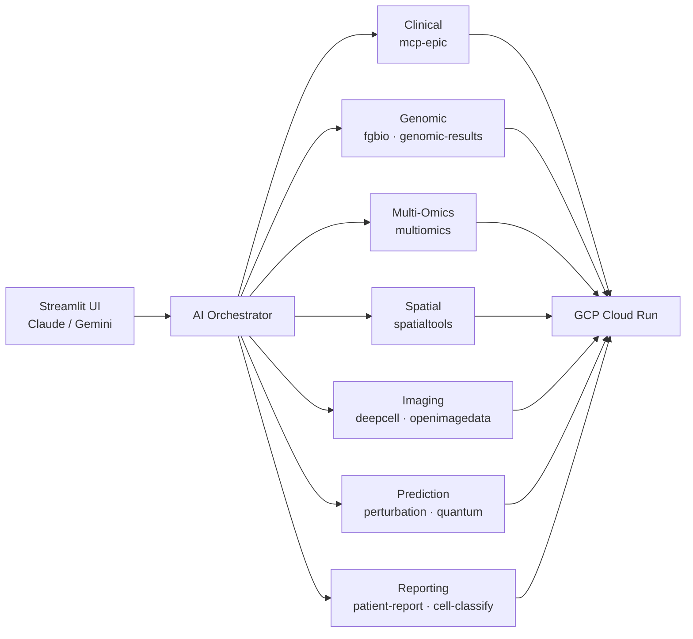

# Precision Medicine MCP System - Quick Summary

**For sharing via email or quick reference**

---

## System Overview

An AI-orchestrated platform for precision oncology that integrates clinical, genomic, multi-omics, spatial transcriptomics, and imaging data through **15 MCP servers (80 tools)** on GCP Cloud Run — reducing production analysis from an estimated 40 hours to 2-5 hours at a projected $324-702 per patient (compute + personnel) vs. $6,000-9,000 traditional (~$3,137 modeled avg savings, pending clinical validation). DRY_RUN demos complete in 25-35 minutes at ~$1. The system has HIPAA-compliant architecture, supports Claude and Gemini via a multi-provider Streamlit UI, and includes a live monitoring dashboard, comprehensive audience-specific documentation, and a validated end-to-end workflow on synthetic data (**PatientOne**: Stage IV ovarian cancer). Reduces minimum precision medicine team from ~10 FTEs to ~3.

---

## MCP Servers (15 Total, 80 Tools)

11 production-ready, 1 local-only (Epic FHIR), 1 mock by design, 3 framework/utility. Covers genomics, multi-omics, spatial transcriptomics, imaging, cell segmentation, perturbation prediction, quantum computing, and patient reporting.

> **Full details:** See [Server Registry](reference/shared/server-registry.md)

---

## Key Metrics

- **Time Reduction:** 40 hours → 2-5 hours production (estimated 8-20x faster with AI orchestration)
- **Cost per Patient:** $24-104 compute + $300-600 personnel = $324-702 total (projected) vs. $6,000-9,000 traditional
- **Team Compression:** Minimum precision medicine team from ~10 FTEs to ~3
- **At Scale:** $16/patient at 500 patients/month (~$8,000/month total)
- **Data Integration:** 5 modalities (clinical, genomic, multi-omics, spatial, imaging)
- **HIPAA Compliant:** De-identification, 10-year audit logs, VPC isolation
- **Deployment:** 15 servers on GCP Cloud Run (us-central1), scale-to-zero
- **UI:** Streamlit with Claude & Gemini 3 support + live monitoring dashboard

---

## Live Demo

- **Streamlit UI (Developer):** streamlit app — Multi-provider (Claude + Gemini), 14 example prompts, 13 of 15 servers selectable (excludes local-only mcp-epic and mcp-genomic-results)
- **Streamlit UI (Student):** student streamlit app -  for 6-week bioinformatics course (Gemini-only, 6 tested prompts, 3 default servers). URL shared with enrolled students only.
- **PatientOne Scenario:** Stage IV ovarian cancer complete analysis
- **Test Data:** Available in GCS at `gs://sample-inputs-patientone/`
- **6-Week Course:** [Study group curriculum](../ui/streamlit-app-students/for-instructors/6-wk-course.md) for bioinformatics educators

---

## Documentation

- **For Hospitals:** [docs/for-hospitals/](for-hospitals/)
- **For Researchers:** [docs/for-researchers/](for-researchers/)
- **For Developers:** [docs/for-developers/](for-developers/)
- **Executive Summary:** [docs/EXECUTIVE_SUMMARY.md](for-funders/EXECUTIVE_SUMMARY.md)
- **Architecture:** [docs/architecture/](reference/architecture)

---

**Repository:** https://github.com/lynnlangit/precision-medicine-mcp

**Status:** POC validated on synthetic data; 11 of 15 servers production-ready; 6-month deployment path to hospital pilot (February 2026). Includes dedicated student app for 6-week bioinformatics course.

**License:** Apache 2.0
