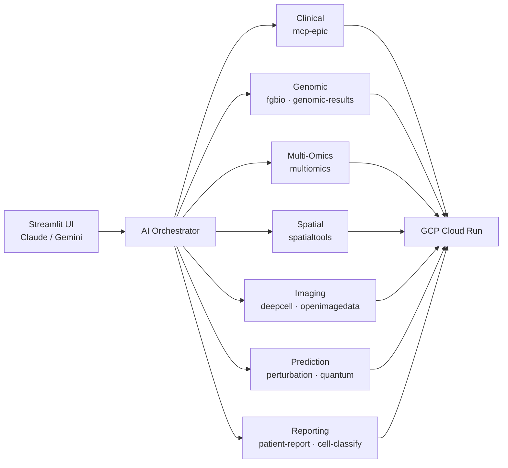

# Precision Medicine MCP System - Quick Summary

**For sharing via email or quick reference**

---

## System Overview

An AI-orchestrated platform for precision oncology that enables **multi-modal synthesis** — integrating clinical, genomic, multi-omics, spatial transcriptomics, and imaging data in ways manual workflows cannot achieve at scale. All tools are accessible via natural language (no coding required), and every AI-generated result requires **clinician APPROVE/REVISE/REJECT** before clinical use. Built on **MCP servers and tools** ([Server Registry](reference/shared/server-registry.md)) deployed on GCP Cloud Run with HIPAA-compliant architecture (de-identification, 10-year audit trails, VPC isolation). Reduces production analysis from an estimated 40 hours to 2-5 hours ([Value Proposition](reference/shared/value-proposition.md)). DRY_RUN demos complete in 25-35 minutes at ~$1. Supports Claude and Gemini via a multi-provider Streamlit UI with live monitoring dashboard. Validated end-to-end on synthetic data (**PatientOne**: Stage IV ovarian cancer).

---

## MCP Servers

Most production-ready; covers genomics, multi-omics, spatial transcriptomics, imaging, cell segmentation, perturbation prediction, quantum computing, and patient reporting.

> **Full details:** See [Server Registry](reference/shared/server-registry.md)

---

## Key Metrics

- **Clinician-in-the-Loop:** Every AI result requires clinician APPROVE/REVISE/REJECT — no autonomous decisions
- **HIPAA Compliant:** Safe Harbor de-identification, 10-year immutable audit trails, VPC isolation
- **Multi-Modal Synthesis:** 5 modalities (clinical, genomic, multi-omics, spatial, imaging) analyzed together
- **Natural Language Access:** All tools accessible via plain English — no coding required
- **Time Reduction:** Estimated 8-20x faster with AI orchestration ([Value Proposition](reference/shared/value-proposition.md))
- **Cost per Patient:** Significant per-patient cost reduction vs. traditional methods ([Cost Analysis](reference/shared/cost-analysis.md))
- **Team Compression:** Minimum precision medicine team from ~10 FTEs to ~3
- **Deployment:** MCP servers on GCP Cloud Run (us-central1), scale-to-zero
- **UI:** Streamlit with Claude & Gemini support + live monitoring dashboard

---

## Live Demo

- **Streamlit UI (Developer):** streamlit app — Multi-provider (Claude + Gemini), 14 example prompts, most servers selectable (excludes local-only mcp-epic and mcp-genomic-results)
- **Streamlit UI (Student):** student streamlit app -  for 6-week bioinformatics course (Gemini-only, 6 tested prompts, 3 default servers). URL shared with enrolled students only.
- **PatientOne Scenario:** Stage IV ovarian cancer complete analysis
- **Test Data:** Available in GCS at `gs://sample-inputs-patientone/`
- **6-Week Course:** [Study group curriculum](../ui/streamlit-app-students/for-instructors/6-wk-course.md) for bioinformatics educators

---

## Documentation

- **For Hospitals:** [docs/for-hospitals/](for-hospitals/)
- **For Researchers:** [docs/for-researchers/](for-researchers/)
- **For Developers:** [docs/for-developers/](for-developers/)
- **Executive Summary:** [docs/EXECUTIVE_SUMMARY.md](for-funders/EXECUTIVE_SUMMARY.md)
- **Architecture:** [docs/architecture/](reference/architecture)

---

**Repository:** https://github.com/lynnlangit/precision-medicine-mcp

**Status:** POC validated on synthetic data; most servers production-ready ([Server Registry](reference/shared/server-registry.md)); 6-month deployment path to hospital pilot (February 2026). Includes dedicated student app for 6-week bioinformatics course.

**License:** Apache 2.0
