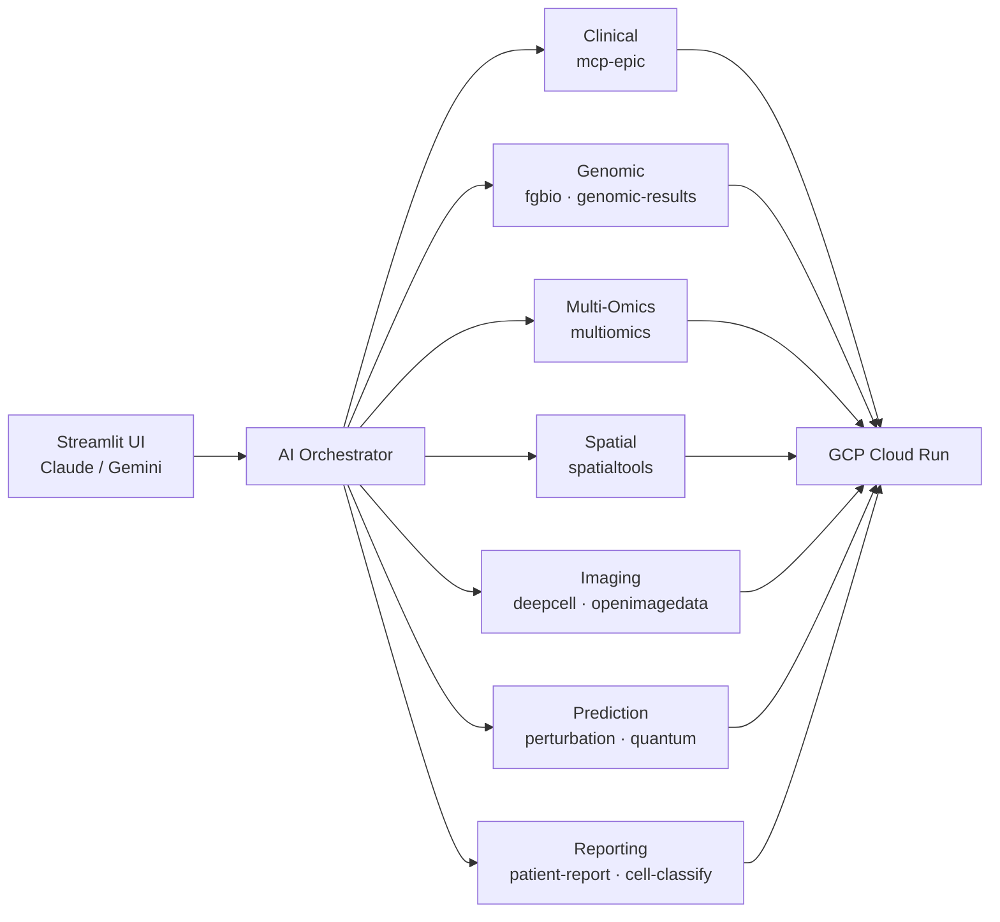

# Precision Medicine MCP System - Quick Summary

**For sharing via email or quick reference**

---

## System Overview

A production-ready AI-orchestrated platform for precision oncology that integrates clinical, genomic, multi-omics, spatial transcriptomics, and imaging data through **15 MCP servers (90 tools)** on GCP Cloud Run — reducing analysis from 40 hours to 35 minutes at ~$24-102 per patient vs. $3,200 traditional. The system is HIPAA-compliant, supports Claude and Gemini via a multi-provider Streamlit UI, and includes a live monitoring dashboard, comprehensive audience-specific documentation, and a validated end-to-end demo (**PatientOne**: Stage IV ovarian cancer).

---

## MCP Servers (15 Total)

### Production Servers (11 deployed)
1. **mcp-fgbio** - Genomic reference validation
2. **mcp-multiomics** - Multi-omics data integration
3. **mcp-spatialtools** - Spatial transcriptomics analysis
4. **mcp-perturbation** - Treatment response prediction (GEARS)
5. **mcp-quantum-celltype-fidelity** - Quantum computing cell analysis (Qiskit)
6. **mcp-deepcell** - Cell segmentation (DeepCell-TF)
7. **mcp-cell-classify** - Cell phenotype classification
8. **mcp-openimagedata** - Histology image processing (registration, feature extraction, MxIF compositing)
9. **mcp-patient-report** - Patient-facing PDF report generation
10. **mcp-genomic-results** - Somatic variant/CNV parsing with clinical annotations and HRD scoring

### Local Only (1)
11. **mcp-epic** - Clinical FHIR data (Epic integration)

### Mock by Design (1)
12. **mcp-mockepic** - Mock FHIR data (intentionally synthetic for demos)

### Mock Servers (3)
13. **mcp-tcga** - Cancer genomics data
14. **mcp-seqera** - Workflow automation platform
15. **mcp-huggingface** - AI model inference

**Total:** 90 bioinformatics tools across all servers (including Bayesian uncertainty quantification for quantum predictions)

---

## Key Metrics

- **Time Reduction:** 40 hours → 2-5 hours production (95% faster with AI orchestration)
- **Cost per Patient:** $324-702 production (incl. infrastructure) vs. $6,000-9,000 traditional
- **At Scale:** $16/patient at 500 patients/month (~$8,000/month total)
- **Data Integration:** 5 modalities (clinical, genomic, multi-omics, spatial, imaging)
- **HIPAA Compliant:** De-identification, 10-year audit logs, VPC isolation
- **Deployment:** 15 servers on GCP Cloud Run (us-central1), scale-to-zero
- **UI:** Streamlit with Claude & Gemini 3 support + live monitoring dashboard

---

## Live Demo

- **Streamlit UI (Developer):** streamlit app — Multi-provider (Claude + Gemini), 14 example prompts, all 13 servers selectable
- **Streamlit UI (Student):** student streamlit app -  for 6-week bioinformatics course (Gemini-only, 6 tested prompts, 3 default servers). URL shared with enrolled students only.
- **PatientOne Scenario:** Stage IV ovarian cancer complete analysis
- **Test Data:** Available in GCS at `gs://sample-inputs-patientone/`
- **6-Week Course:** [Study group curriculum](../ui/streamlit-app-students/for-instructors/6-wk-course.md) for bioinformatics educators

---

## Documentation

- **For Hospitals:** [docs/for-hospitals/](for-hospitals/)
- **For Researchers:** [docs/for-researchers/](for-researchers/)
- **For Developers:** [docs/for-developers/](for-developers/)
- **Executive Summary:** [docs/EXECUTIVE_SUMMARY.md](for-funders/EXECUTIVE_SUMMARY.md)
- **Architecture:** [docs/architecture/](reference/architecture)

---

**Repository:** https://github.com/lynnlangit/precision-medicine-mcp

**Status:** Production-ready, validated deployment (February 2026). Includes dedicated student app for 6-week bioinformatics course.

**License:** Apache 2.0
