# For MCP Developers & Software Engineers

**This section is for:** MCP developers, software engineers, and platform builders who want to extend the precision-medicine-mcp platform with new servers or contribute to existing codebase.

---

## What You Can Accomplish Here

```mermaid
graph LR
    A["📐 Learn<br/>architecture"] --> B["🔨 Build<br/>new servers"] --> C["🧪 Test<br/>validate"] --> D["🚀 Deploy<br/>production"] --> E["🤝 Contribute<br/>upstream"]

    style A fill:#e1f5ff,stroke:#0066cc,stroke-width:2px
    style B fill:#fff3cd,stroke:#ffc107,stroke-width:2px
    style C fill:#e8f5e9,stroke:#4caf50,stroke-width:2px
    style D fill:#f3e5f5,stroke:#9c27b0,stroke-width:2px
    style E fill:#fce4ec,stroke:#e91e63,stroke-width:2px
```



> **Learn:** FastMCP patterns, Claude + Gemini orchestration ([Server Registry](../reference/shared/server-registry.md)) | **Build:** Custom MCP servers for new modalities (metabolomics, radiomics, single-cell) | **Test:** 91 tests in mcp-multiomics, 68% coverage target | **Deploy:** GCP Cloud Run, Docker, SSE transport | **Contribute:** Coding standards, PR guidelines

---

## Quick Start (3 Paths)

### 1. Building a New Modality Server (4-8 hours)
**Goal:** Add a new server for metabolomics/radiomics/other modalities

1. **Read the guide** → [ADD_NEW_MODALITY_SERVER.md](ADD_NEW_MODALITY_SERVER.md) (20 min)
2. **Copy boilerplate template** → `/servers/mcp-server-boilerplate/` (5 min)
3. **Implement tools** → Use FastMCP patterns from mcp-multiomics (3-5 hours)
4. **Write tests** → 50%+ coverage for production servers (1-2 hours)
5. **Deploy** → GCP Cloud Run with `./infrastructure/deployment/deploy_to_gcp.sh` (30 min)

**Total Time:** 4-8 hours from template to deployed server

### 2. Understanding the Architecture (30-60 min)
**Goal:** Understand how the MCP servers orchestrate precision medicine workflows

1. **System overview** → [ARCHITECTURE.md](ARCHITECTURE.md) (15 min)
2. **Best reference implementation** → [mcp-multiomics README](../../servers/mcp-multiomics/README.md) (15 min)
3. **Architecture details** → [Architecture docs](../reference/architecture/README.md) (30 min)

**Total Time:** 30-60 minutes for full understanding

### 3. Contributing to Existing Servers (varies)
**Goal:** Fix bugs, add features, improve tests

1. **Read CONTRIBUTING.md** → [CONTRIBUTING.md](CONTRIBUTING.md) (10 min)
2. **Pick a server** → See [Server Status](../../servers/README.md#-server-status) (5 min)
3. **Read codebase** → Study existing implementation patterns (30 min)
4. **Make changes** → Follow coding standards and testing requirements
5. **Submit PR** → Include tests and documentation

---

## Documents in This Section

### Getting Started
- **[README.md](README.md)** *(this file)* - Navigation hub for developers
- **[ARCHITECTURE.md](ARCHITECTURE.md)** - System architecture overview (data flow, integration)
- **[QUICK_REFERENCE.md](QUICK_REFERENCE.md)** - Cheat sheet for common tasks

### Building New Servers
- **[ADD_NEW_MODALITY_SERVER.md](ADD_NEW_MODALITY_SERVER.md)** - Comprehensive guide (planning → deployment)

### Contributing
- **[CONTRIBUTING.md](CONTRIBUTING.md)** - PR guidelines, coding standards, review process

---

## System Architecture ([Server Registry](../reference/shared/server-registry.md))

```mermaid
graph TB
    subgraph "User Interfaces"
        STREAMLIT[🌐 Streamlit Chat UI<br/>Web Interface<br/>Cloud Run]
        JUPYTER[📓 Jupyter Notebook<br/>Data Science Interface<br/>Cloud Run]
        DESKTOP[💬 Claude Desktop<br/>Local STDIO]
    end

    subgraph "AI Orchestration Layer"
        API[🤖 Claude API<br/>Anthropic Sonnet 4.5<br/>MCP Client Support]
    end

    subgraph "Local-Only Servers"
        REALEPIC[mcp-epic<br/>Real Epic FHIR<br/>✅ Production<br/>🏥 HIPAA-compliant]
    end

    subgraph "GCP Cloud Run - 14 Deployed MCP Servers"
        subgraph "Clinical & Genomic"
            MOCKEPIC[mcp-mockepic<br/>Mock FHIR<br/>🎭 Demo Only]
            FGBIO[mcp-fgbio<br/>FASTQ/VCF<br/>✅ Production]
            TCGA[mcp-tcga<br/>Cancer Data<br/>🔧 Framework]
        end

        subgraph "Multi-Omics"
            MULTI[mcp-multiomics<br/>RNA/Protein/Phospho<br/>✅ Production]
        end

        subgraph "Spatial & Imaging"
            SPATIAL[mcp-spatialtools<br/>Spatial RNA-seq<br/>✅ Production]
            IMAGE[mcp-openimagedata<br/>Histology<br/>✅ Production]
            DEEPCELL[mcp-deepcell<br/>Cell Segmentation<br/>✅ Production]
            CELLCLASS[mcp-cell-classify<br/>Phenotyping<br/>✅ Production]
        end

        subgraph "Genomic Results & Reporting"
            GENOMICRES[mcp-genomic-results<br/>Somatic/CNV/HRD<br/>✅ Production]
            PATREPORT[mcp-patient-report<br/>PDF Reports<br/>✅ Production]
        end

        subgraph "Advanced Analytics"
            PERTURB[mcp-perturbation<br/>GEARS GNN<br/>✅ Production]
            QUANTUM[mcp-quantum-celltype-fidelity<br/>Quantum PQCs<br/>✅ Production]
        end

    end

    subgraph "Analysis Workflow"
        PATIENT[🏥 PatientOne<br/>Stage IV HGSOC<br/>Multi-Omics Analysis]
    end

    STREAMLIT ==> API
    JUPYTER ==> API
    DESKTOP --> API

    API ==> FGBIO
    API ==> MULTI
    API ==> SPATIAL
    API ==> REALEPIC
    API ==> DEEPCELL
    API ==> PERTURB
    API ==> QUANTUM
    API -.-> MOCKEPIC
    API -.-> TCGA
    API ==> IMAGE
    API ==> CELLCLASS
    API ==> GENOMICRES
    API ==> PATREPORT
    FGBIO ==> PATIENT
    MULTI ==> PATIENT
    SPATIAL ==> PATIENT
    REALEPIC ==> PATIENT
    DEEPCELL ==> PATIENT
    PERTURB ==> PATIENT
    QUANTUM ==> PATIENT
    MOCKEPIC -.-> PATIENT
    TCGA -.-> PATIENT
    IMAGE ==> PATIENT
    CELLCLASS ==> PATIENT
    GENOMICRES ==> PATIENT
    PATREPORT ==> PATIENT
    style STREAMLIT fill:#d1ecf1,stroke:#0c5460,stroke-width:2px
    style JUPYTER fill:#d1ecf1,stroke:#0c5460,stroke-width:2px
    style DESKTOP fill:#d1ecf1,stroke:#0c5460,stroke-width:2px
    style API fill:#cce5ff,stroke:#004085,stroke-width:3px
    style PATIENT fill:#e1f5ff,stroke:#0066cc,stroke-width:3px
    style FGBIO fill:#d4edda,stroke:#28a745,stroke-width:2px
    style MULTI fill:#d4edda,stroke:#28a745,stroke-width:2px
    style SPATIAL fill:#d4edda,stroke:#28a745,stroke-width:2px
    style REALEPIC fill:#d4edda,stroke:#28a745,stroke-width:3px
    style DEEPCELL fill:#d4edda,stroke:#28a745,stroke-width:2px
    style PERTURB fill:#d4edda,stroke:#28a745,stroke-width:2px
    style QUANTUM fill:#d4edda,stroke:#28a745,stroke-width:2px
    style IMAGE fill:#d4edda,stroke:#28a745,stroke-width:2px
    style CELLCLASS fill:#d4edda,stroke:#28a745,stroke-width:2px
    style GENOMICRES fill:#d4edda,stroke:#28a745,stroke-width:2px
    style PATREPORT fill:#d4edda,stroke:#28a745,stroke-width:2px
    style TCGA fill:#fff3cd,stroke:#ffc107,stroke-width:1px
    style MOCKEPIC fill:#e2e3e5,stroke:#6c757d,stroke-width:1px
```



**Legend:**
- ✅ **Production**: Real data, comprehensive tests, deployed
- 🔧 **Framework**: API stubs ready for integration (tcga)
- 🎭 **Mock by Design**: Intentionally synthetic for demos (mockepic)

See [Server Registry](../reference/shared/server-registry.md) for current counts and status.

---

## Server Status Overview

**Production Status:** Most servers production-ready.

**Total:** See [Server Registry](../reference/shared/server-registry.md) for current server and tool counts.

📋 **[Complete Server Implementation Status →](../reference/architecture/README.md)** - Comprehensive documentation including:
- Detailed tool-by-tool implementation status
- Real vs. mocked capability breakdown
- Test coverage metrics and production readiness
- DRY_RUN mode behavior for each server
- GCP Cloud Run deployment status
- Production deployment checklists

---

## Why Two Epic Servers?

**mcp-epic (Real FHIR):** 100% production-ready Epic integration
- 🏥 Runs **locally only** (STDIO transport) for HIPAA compliance
- ✅ Real patient data with built-in de-identification
- 🔐 Requires hospital credentials (Epic FHIR API + GCP Healthcare API)
- 4 tools: `get_patient_demographics`, `get_patient_conditions`, `get_patient_observations`, `get_patient_medications`
- **Use for:** Production hospital deployment with real patient data

**mcp-mockepic (Mock FHIR):** Intentional mock for demonstration/education
- 🌐 Deployed to **GCP Cloud Run** (public SSE endpoint)
- 🎭 Synthetic patient data by design (no real PHI)
- 🚀 No credentials needed - instant demos
- 3 tools: `query_patient_records`, `link_spatial_to_clinical`, `search_diagnoses`
- **Use for:** Public demos, workflow development, education

---

## Key Technologies

### MCP Protocol
- **What:** Model Context Protocol - standard for AI-tool integration
- **Why:** Enables Claude to discover and call tools across multiple servers
- **Transport:** STDIO (local) or SSE (cloud)
- **Spec:** https://modelcontextprotocol.io/

### FastMCP Framework
- **What:** Python framework for building MCP servers
- **Why:** Simplifies tool registration, input validation, error handling
- **Docs:** https://gofastmcp.com
- **Pattern:** `@mcp.tool()` decorator for each tool

### GCP Cloud Run
- **What:** Serverless container platform
- **Why:** Auto-scales, pay-per-use, easy deployment
- **Transport:** SSE (Server-Sent Events) for MCP
- **Deployment:** `./infrastructure/deployment/deploy_to_gcp.sh`

### Claude API
- **What:** Anthropic's Sonnet 4.5 model with MCP client support
- **Why:** Orchestrates multi-server workflows via natural language
- **Integration:** Claude Desktop (local) or Claude API (production)

---

## Development Resources

### Best Reference Implementations
1. **mcp-multiomics** ([README](../../servers/mcp-multiomics/README.md)) - Production-ready, 91 tests, 68% coverage, HAllA integration
2. **mcp-spatialtools** ([README](../../servers/mcp-spatialtools/README.md)) - 95% real, comprehensive spatial analysis
3. **mcp-fgbio** ([README](../../servers/mcp-fgbio/README.md)) - Simple, focused, excellent for learning basics

### Architecture Documentation
- **System Design:** [Architecture Overview](../reference/architecture/README.md)
- **Data Flow:** [Clinical-Spatial Integration](../reference/architecture/clinical/clinical-spatial-bridge.md)

### Testing Resources
- **Unit Tests:** [Test Examples](../../tests/unit/)
- **Integration Tests:** [GCP Testing](../../tests/integration/)

### Code Examples
- **Server Template:** [Boilerplate](../../servers/mcp-server-boilerplate/)

---

## Common Development Tasks

### 1. Add a New Tool to Existing Server

```python
# In servers/mcp-{server}/src/mcp_{server}/server.py

@mcp.tool()
async def my_new_tool(
    param1: str,
    param2: int = 10
) -> dict:
    """
    Clear description of what this tool does.

    Args:
        param1: Description of param1
        param2: Description of param2 (default: 10)

    Returns:
        Dictionary with:
        - result: The computed result
        - metadata: Additional context

    Example:
        >>> result = await my_new_tool(param1="test")
    """
    if DRY_RUN:
        return {"status": "DRY_RUN", "result": "simulated"}

    # Real implementation
    result = do_computation(param1, param2)
    return {"status": "success", "result": result}
```

### 2. Run Tests Locally

```bash
# Test single server
cd tests/unit/mcp-{server}
pytest -v --cov=../../../servers/mcp-{server}/src/mcp_{server}

# Test all servers
pytest tests/unit/ -v

# Test with real data (not DRY_RUN)
SERVER_DRY_RUN=false pytest tests/unit/mcp-{server}
```

### 3. Deploy to GCP Cloud Run

```bash
# Development deployment (DRY_RUN=true)
./infrastructure/deployment/deploy_to_gcp.sh --development --server mcp-{server}

# Production deployment (DRY_RUN=false)
./infrastructure/deployment/deploy_to_gcp.sh --production --server mcp-{server}

# Test deployment
curl https://mcp-{server}-{hash}.run.app/health
```

### 4. Debug with Claude Desktop

```json
// In claude_desktop_config.json
{
  "mcpServers": {
    "myserver": {
      "command": "uv",
      "args": [
        "run",
        "--directory",
        "/path/to/servers/mcp-myserver",
        "python",
        "-m",
        "mcp_myserver"
      ],
      "env": {
        "MYSERVER_DRY_RUN": "true",
        "MYSERVER_DATA_DIR": "/path/to/data"
      }
    }
  }
}
```

Restart Claude Desktop and test:
- "What tools are available from myserver?"
- "Use myserver to [do something]"

---

## Code Quality Standards

### Testing Requirements
- **Production servers:** ≥50% code coverage
- **Demo/mocked servers:** ≥35% code coverage
- **All servers:** 100% smoke tests (imports, tool registration, DRY_RUN)

### Documentation Requirements
- Clear docstrings for all tools (Claude reads these!)
- Server README with usage examples
- Architecture document showing integration points
- Update central documentation tables

### Code Style
- Python 3.11+
- Type hints for all function parameters
- Async/await for all MCP tools
- Error handling with actionable messages

---

## Frequently Asked Questions

### "Can I use a different Python framework (not FastMCP)?"
**A:** Yes, but FastMCP is strongly recommended. It handles MCP protocol details, input validation, and error handling. Raw MCP implementation requires 3-5x more boilerplate code.

### "Do all tools need to support DRY_RUN mode?"
**A:** Yes for public demos. No for hospital-only servers. DRY_RUN mode allows instant demos without real data or API keys.

### "Can I call external APIs (NCBI, KEGG, etc.)?"
**A:** Yes! Use `requests` or async libraries. Add retry logic and error handling. Cache responses when possible. Mock API calls in DRY_RUN mode.

### "How do I handle large data files (>1GB)?"
**A:**
- Store in GCS (Google Cloud Storage) or S3
- Pass file paths (not file contents) between tools
- Use streaming for analysis (don't load entire file into memory)
- Return summary results, not full datasets

### "Can servers call other servers?"
**A:** Not directly. Claude API orchestrates all inter-server communication. This prevents circular dependencies and makes debugging easier.

### "What if my tool takes >30 seconds?"
**A:**
- Break into smaller tools (e.g., "start_analysis" → "get_results")
- Use GCP Cloud Run timeout (max 60 minutes)
- Return partial results with status updates
- Consider background job pattern

---

## Example Workflow: Adding Metabolomics Server

**Goal:** Add a new server for LC-MS metabolomics data analysis

**Steps:**
1. **Plan** (1 hour) - Define 5-8 tools, dependencies, data formats
2. **Implement** (3-4 hours) - Use boilerplate template, add tools
3. **Test** (1-2 hours) - Write unit tests, achieve 50%+ coverage
4. **Document** (1 hour) - Server README + architecture doc
5. **Deploy** (30 min) - GCP Cloud Run deployment
6. **Integrate** (30 min) - Test with other servers (multiomics integration)

**Total Time:** 4-8 hours from start to deployed server

**See:** [ADD_NEW_MODALITY_SERVER.md](ADD_NEW_MODALITY_SERVER.md) for complete walkthrough

---

## See It In Action

<kbd></kbd>

*MCP servers orchestrating bioinformatics workflows through Claude Desktop*

---

**Related Resources:**
- 🏥 [Hospital Operations Manual](../for-hospitals/OPERATIONS_MANUAL.md) - For IT teams deploying to production
- 🔬 [Researcher Guide](../for-researchers/README.md) - For bioinformaticians using the platform
- 📊 [Architecture Documentation](../reference/architecture/README.md) - Deep technical dive
- 🏠 [Back to Main Documentation](../README.md)

---

**Last Updated:** 2026-02-01
