# Competitive Landscape Analysis

How the Precision Medicine MCP Platform compares to existing solutions in the precision oncology market.

---

## Market Overview

**Total Addressable Market (TAM):**
- **$12.9B precision medicine market** (2024) growing at 9.8% CAGR
- **1.9M cancer diagnoses/year** in US (2024 est.)
- **21% require comprehensive multi-omics** analysis (~400K patients/year)

**Serviceable Addressable Market (SAM):**
- **71 NCI-designated cancer centers** in US
- **~300 academic medical centers** with precision oncology programs
- **Target:** 50-100 institutions in first 5 years

---

## Competitive Positioning

```mermaid
graph TD
    subgraph "High Cost / High Capability"
        TEMP[Tempus<br/>$5,000-7,500]
        FOUND[Foundation Medicine<br/>$3,000-7,500]
    end

    subgraph "Medium Cost / Medium Capability"
        THIS[MCP Platform<br/>$324-702<br/>⭐ You Are Here]
    end

    subgraph "Low Automation / Variable Cost"
        MANUAL[Manual Analysis<br/>$6,000+<br/>40 hours labor]
        OPEN[Open Source Tools<br/>$0 software<br/>requires expertise]
    end

    style THIS fill:#d4edda,stroke:#28a745,stroke-width:3px
    style TEMP fill:#f8d7da,stroke:#dc3545
    style FOUND fill:#f8d7da,stroke:#dc3545
    style MANUAL fill:#fff3cd,stroke:#ffc107
    style OPEN fill:#fff3cd,stroke:#ffc107
```

**Key Differentiators:**
- ✅ **Lowest cost** for comprehensive multi-modal analysis ($324-702 vs. $6,000-9,000)
- ✅ **Fastest** results (2-5 hours production vs. 5-8 days commercial; 25-35 min DRY_RUN demo)
- ✅ **Natural language interface** (no coding required)
- ✅ **Open source** (transparent algorithms)
- ❌ Not yet clinically validated (FDA approval pending)

---

## Competitor Analysis

### 1. Commercial Genomic Testing Companies

#### Foundation Medicine
**What They Do:**
- Comprehensive genomic profiling (CGP)
- FoundationOne CDx: 324 genes + genomic signatures
- CLIA/CAP certified, FDA-approved

**Strengths:**
- Clinically validated
- Widely reimbursed by insurance
- Integrated with EHR systems

**Limitations:**
- **Genomics only** (no spatial transcriptomics, no imaging integration)
- **$3,000-7,500 per test**
- **14-21 day turnaround time**
- **Black-box algorithms** (not open source)

**Our Advantage:** Multi-modal integration at 1/10th the cost

#### Tempus
**What They Do:**
- Multi-omic profiling (DNA, RNA, protein)
- AI-driven treatment matching
- Clinical trial matching

**Strengths:**
- Large multi-omic dataset (5M+ patients)
- AI/ML models for treatment prediction
- EHR integration

**Limitations:**
- **$5,000-7,500 per patient**
- **10-14 day turnaround**
- **Proprietary platform** (not accessible for research)
- **No spatial transcriptomics** or imaging analysis

**Our Advantage:** Natural language interface, spatial + imaging integration

#### Guardant Health
**What They Do:**
- Liquid biopsy (circulating tumor DNA)
- Guardant360: 74 genes
- Minimal invasive testing

**Strengths:**
- Non-invasive (blood test)
- Fast turnaround (5-7 days)
- FDA-approved for lung cancer

**Limitations:**
- **Limited to circulating tumor DNA** (misses spatial heterogeneity)
- **$3,500-5,000 per test**
- **74 genes only** (vs. whole exome sequencing)

**Our Advantage:** Tissue-based analysis with spatial context

---

### 2. Academic/Open Source Solutions

#### Galaxy Project
**What They Do:**
- Open-source bioinformatics workflow platform
- 9,000+ tools, 200+ workflows
- Free to use

**Strengths:**
- Free and open source
- Large community support
- Highly customizable

**Limitations:**
- **Steep learning curve** (requires bioinformatics expertise)
- **No AI orchestration** (manual workflow design)
- **No natural language interface**
- **40+ hours** per patient analysis

**Our Advantage:** AI orchestration reduces 40 hours → 2-5 hours (production)

#### Nextflow/nf-core
**What They Do:**
- Workflow orchestration for bioinformatics
- 90+ production-ready pipelines
- Portable and reproducible

**Strengths:**
- Industry-standard workflow language
- Excellent reproducibility
- Cloud-native

**Limitations:**
- **Requires coding expertise** (Groovy/Nextflow language)
- **Manual pipeline selection and configuration**
- **No multi-modal integration** (each modality separate)

**Our Advantage:** Single natural language interface for all modalities

---

### 3. Hospital In-House Bioinformatics Teams

**What They Do:**
- Custom analysis pipelines
- Manual data wrangling
- Case-by-case analysis

**Strengths:**
- Highly customized to institutional needs
- Direct collaboration with clinicians
- No external dependencies

**Limitations:**
- **40 hours per patient** (manual bottleneck)
- **$6,000-9,000 per patient** (labor costs)
- **Requires PhD-level bioinformaticians**
- **Hard to scale** (limited personnel)

**Our Advantage:** 8-20x faster (production), $3,137 average savings per patient

---

### 4. Emerging AI-Driven Platforms

#### PathAI
**What They Do:**
- AI-powered pathology analysis
- H&E slide analysis
- Disease detection and quantification

**Strengths:**
- FDA-approved algorithms
- Automated pathology workflows
- Integration with digital pathology systems

**Limitations:**
- **Imaging only** (no genomics, no spatial transcriptomics)
- **Focused on H&E slides** (no multi-modal integration)
- **$500-1,500 per slide** analysis

**Our Advantage:** Integrates imaging with genomics and spatial data

#### Paige.AI
**What They Do:**
- AI-assisted pathology diagnosis
- Prostate and breast cancer focus
- FDA-cleared platform

**Strengths:**
- FDA clearance
- Integration with clinical workflows
- Real-time AI assistance during slide review

**Limitations:**
- **Pathology-focused** (no genomics integration)
- **Limited to specific cancer types**
- **Requires pathologist review** (not standalone)

**Our Advantage:** Full multi-modal integration, not limited to specific cancers

---

## Competitive Matrix

| Feature | MCP Platform | Foundation Medicine | Tempus | Galaxy/Open Source | In-House Teams |
|---------|--------------|---------------------|--------|-------------------|----------------|
| **Cost per Patient** | $324-702 | $3,000-7,500 | $5,000-7,500 | $0 (labor intensive) | $6,000-9,000 |
| **Time to Results** | 2-5 hours (production) | 14-21 days | 10-14 days | 40+ hours | 40+ hours |
| **Natural Language** | ✅ Yes | ❌ No | ❌ No | ❌ No | ❌ No |
| **Multi-Modal** | ✅ Yes (5 modalities) | ❌ Genomics only | ⚠️ DNA/RNA/Protein | ⚠️ Separate pipelines | ⚠️ Case-by-case |
| **Spatial Transcriptomics** | ✅ Yes (10x Visium) | ❌ No | ❌ No | ⚠️ Manual | ⚠️ Manual |
| **Imaging Integration** | ✅ Yes (H&E, MxIF) | ❌ No | ❌ No | ❌ No | ⚠️ Separate teams |
| **Open Source** | ✅ Yes | ❌ No | ❌ No | ✅ Yes | N/A |
| **FDA Approved** | ❌ Not yet | ✅ Yes | ⚠️ Partial | ❌ No | ❌ No |
| **CLIA/CAP** | ❌ Not yet | ✅ Yes | ✅ Yes | ❌ No | ⚠️ Lab-dependent |
| **Ease of Use** | ⭐⭐⭐⭐⭐ | ⭐⭐⭐ | ⭐⭐⭐ | ⭐ | ⭐⭐ |

---

## Market Entry Strategy

### Phase 1: Academic Research (Current)
**Target:** NCI-designated cancer centers, research hospitals
**Value Prop:** Low cost, multi-modal integration, research flexibility
**Timeline:** 0-12 months

### Phase 2: Clinical Validation
**Target:** IRB-approved clinical trials at 3-5 partner institutions
**Value Prop:** Demonstrate clinical utility, build validation dataset
**Timeline:** 12-24 months

### Phase 3: FDA Approval
**Target:** FDA 510(k) clearance for decision support
**Value Prop:** Clinical validation data from Phase 2
**Timeline:** 24-36 months

### Phase 4: Commercial Scale
**Target:** 50-100 academic medical centers, commercial partnerships
**Value Prop:** FDA-cleared, cost-effective, multi-modal platform
**Timeline:** 36-60 months

---

## Barriers to Entry

### For Competitors Replicating This Approach

**Technical Barriers:**
- Requires deep expertise in bioinformatics, AI/ML, MCP protocol
- Complex multi-modal data integration (5 modalities)
- Natural language orchestration is novel

**Data Barriers:**
- Synthetic PatientOne dataset (100+ GB) not easily replicated
- Real patient cohorts require IRB approval and years of collection

**Regulatory Barriers:**
- FDA approval pathway for multi-modal AI/ML system unclear
- CLIA/CAP certification expensive and time-consuming

**Our Head Start:** 15 servers deployed, 80 tools, comprehensive documentation

---

## Strategic Partnerships

### Potential Partners

**Clinical Partners:**
- **Epic Systems** - FHIR integration for clinical data
- **10x Genomics** - Spatial transcriptomics data formats
- **Illumina** - Genomic sequencing data standards

**Technology Partners:**
- **Anthropic** - Claude API for natural language orchestration
- **Google Cloud** - GCP infrastructure and healthcare APIs
- **Seqera** - Nextflow workflow orchestration integration

**Research Partners:**
- **NCI** - Access to TCGA and other cancer datasets
- **Human Cell Atlas** - Spatial transcriptomics reference data
- **ClinVar** - Variant interpretation databases

---

## Competitive Risks

### Risk 1: Foundation Medicine Expands to Multi-Modal
**Likelihood:** Medium (they have resources but focused on genomics)
**Mitigation:** Move fast, establish partnerships with academic centers

### Risk 2: Tempus Adds Spatial Transcriptomics
**Likelihood:** Medium (they're building multi-omic capabilities)
**Mitigation:** Open source advantage, natural language interface differentiation

### Risk 3: In-House Teams Adopt AI Orchestration
**Likelihood:** Low (requires significant technical investment)
**Mitigation:** Offer white-label licensing for hospitals

### Risk 4: Regulatory Delays
**Likelihood:** High (FDA pathway for multi-modal AI unclear)
**Mitigation:** Start with research-use-only, build clinical validation dataset

---

## Market Opportunity

### Addressable Market Sizing

**Tier 1: NCI-Designated Cancer Centers (71 institutions)**
- Average 5,000 cancer patients/year
- 20% require multi-omics analysis = 1,000 patients/institution
- Revenue potential: $325K - $704K per institution/year
- **Total: $23M - $50M/year**

**Tier 2: Academic Medical Centers (300 institutions)**
- Average 2,000 cancer patients/year
- 15% require multi-omics analysis = 300 patients/institution
- Revenue potential: $97K - $211K per institution/year
- **Total: $29M - $63M/year**

**Tier 3: Large Community Hospitals (1,500 institutions)**
- Average 500 cancer patients/year
- 10% require multi-omics analysis = 50 patients/institution
- Revenue potential: $16K - $35K per institution/year
- **Total: $24M - $52M/year**

**Total Addressable Market: $76M - $165M/year** (US only)

---

## Recommended Positioning

**Primary Message:**
> "The fastest, most affordable way to perform comprehensive multi-modal precision medicine analysis"

**Key Proof Points:**
- 8-20x faster than manual analysis (40 hours → 2-5 hours production)
- 10-18x cheaper than traditional analysis ($324-702 vs. $6,000-9,000)
- Only platform integrating 5 modalities with natural language interface

**Target Personas:**
1. **Hospital CFOs** - Focus on cost savings ($3,137 per patient)
2. **Research Directors** - Focus on multi-modal capabilities and speed
3. **Bioinformaticians** - Focus on ease of use and open source nature

---

**Related Resources:**
- 💰 [ROI Analysis](ROI_ANALYSIS.md)
- 📊 [Executive Summary](EXECUTIVE_SUMMARY.md)
- 🏥 [Hospital Deployment Guide](../for-hospitals/README.md)

---

**Last Updated:** 2026-01-14
