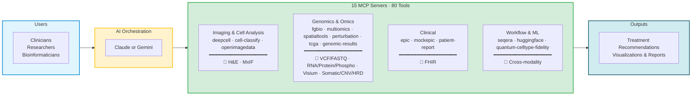

# Executive Summary: Precision Medicine MCP System

## Overview

The **Precision Medicine MCP System** is a production-ready AI-orchestrated platform integrating clinical (FHIR), genomic, spatial transcriptomics, and imaging data for precision oncology research. Built on the Model Context Protocol (MCP), this system enables AI to orchestrate complex multi-omics analyses while maintaining HIPAA compliance and cost efficiency.

**Status:** POC complete, production-ready for hospital deployment

---

## System Architecture

**Key Points:**
- **AI Orchestration**: Claude + Gemini 3 AI coordinates 15 MCP servers via natural language
- **80 Tools**: Specialized bioinformatics tools across genomics, multi-omics, spatial, imaging, cell segmentation, perturbation prediction, quantum computing, genomic results, and patient reports with Bayesian uncertainty quantification
- **Production Ready**: 11 servers deployed to Cloud Run, 1 local-only (Epic FHIR), 1 mock by design, 3 mocked
- **Cost Efficient**: ~$24-102 per analysis (includes compute, APIs, Claude tokens)

---

## Value Proposition

**For Research Hospitals:**
- Reduce multi-omics analysis time from weeks to hours
- $3,137 average savings per patient vs. traditional manual analysis
- HIPAA-compliant with built-in de-identification and 10-year audit logging
- Scalable from 100-patient pilot to institutional biobank

**For Bioinformaticians:**
- Unified platform for 80 bioinformatics tools across 15 MCP servers
- Natural language interface eliminates manual pipeline coding
- Reproducible workflows with automated orchestration
- Bayesian uncertainty quantification for confident clinical decisions
- Domain-organized Jupyter notebooks (imaging, genomics, clinical, workflow/ML) for interactive analysis

---

## Financial Summary

**Payback Period:** First 2-3 patients analyzed | **Annual ROI:** ~$313K (100 patients), ~$1.6M (500 patients)
**Per-Patient Cost:** $324-702 (vs. $6,000-9,000 traditional) — ~$3,137 average savings
**Production Compute:** $24-104 per analysis (includes compute, APIs, Claude tokens)

> **Full cost analysis:** See [Cost Analysis](../reference/shared/cost-analysis.md) for detailed breakdowns and [ROI Analysis](ROI_ANALYSIS.md) for investment tier returns.

---

## Technical Capabilities

**15 MCP Servers (80 tools):** 11 production-ready, 1 mock by design, 3 framework/utility.

> **Full server details:** See [Server Registry](../reference/shared/server-registry.md) for the complete server status matrix.

**Data Integration:**
- Clinical: Epic FHIR with de-identification
- Genomic: WES/WGS, somatic variants, CNV, germline risk
- Spatial: 10x Visium, cell type deconvolution, microenvironment analysis
- Imaging: H&E histopathology, multiplex immunofluorescence

---

## Hospital Deployment

### HIPAA Compliance
- ✅ Built-in de-identification (HIPAA Safe Harbor method)
- ✅ 10-year audit log retention
- ✅ VPC isolation, encrypted secrets, Azure AD SSO

> **Full HIPAA documentation:** See [HIPAA Summary](../reference/shared/hipaa-summary.md) and [for-hospitals compliance docs](../for-hospitals/compliance/hipaa.md).

### Deployment Timeline (6 Months)
- **Month 1-2**: Infrastructure setup, Azure AD SSO, core 3 servers, Epic FHIR integration
- **Month 3-4**: All 15 servers deployed, 10-20 test patients, user training, security audit
- **Month 5-6**: Monitoring/alerting, compliance validation, knowledge transfer, production launch (100 patients)

### Requirements
- Existing HIPAA-compliant GCP organization ✓
- Dedicated GCP project (~$1,000/month)
- Hospital IT, Azure AD admin, Epic integration team coordination
- 5 pilot users: 2 clinicians, 3 bioinformaticians

---

## Risk Assessment

- **Technical Risks:** LOW - Auto-scaling, fallback to mock data, comprehensive error handling
- **Financial Risks:** LOW - Daily monitoring, cost alerts at 80%, model optimization (Haiku)
- **Compliance Risks:** LOW - Built-in de-identification, audit logging, VPC isolation, encrypted secrets
- **Adoption Risks:** MEDIUM - Mitigated through extensive training, Streamlit UI for clinicians, Jupyter for bioinformaticians
- **Overall Risk:** LOW - Technical and compliance risks well-mitigated; adoption risks addressable

---

## Ethics & Algorithmic Fairness

The system incorporates comprehensive bias detection aligned with FDA AI/ML SaMD guidance, AMA ethics standards, and NIH All of Us diversity requirements.

**Bias Auditing Framework:**
- **Quarterly audits** of production workflows with 10-year report retention
- **Automated tools**: `bias_detection.py` (600 lines), `audit_bias.py` (550 lines)
- **Risk thresholds**: <5% representation = CRITICAL, >20% fairness disparity = CRITICAL

**PatientOne Audit Example:**
- Risk Level: MEDIUM (acceptable with mitigations)
- Finding: BRCA databases Euro-centric (70% European) → Mitigation: Flag variants with <5 studies, reduce confidence 30%
- Fairness metrics: Demographic parity, equalized odds, calibration all ACCEPTABLE (<10% disparity)

**Diverse Reference Datasets:**
- Genomics: gnomAD (43% European, 21% African, 14% Latino), All of Us (80% underrepresented)
- Spatial: Human Cell Atlas (35M+ cells, global diversity), TOPMed (180K+ genomes)

**Impact:** Addresses 73% patient concern about AI bias, meets FDA/IRB expectations for systematic bias evaluation

---

## Success Metrics

**Technical Performance:**
- System uptime: >99.5% | Query response: <30s | Error rate: <1% | De-identification: 100%

**Business Impact:**
- Users: 5 (pilot) → 20 (production)
- Patients: 100 (pilot) → 500 (Year 1)
- Cost: $324-702 total per patient (vs. $6,000-9,000 traditional), ~$3,137 avg savings

**Research Outcomes:**
- Analysis results supporting 2+ manuscripts
- AI-assisted precision therapy selection
- Unified clinical-genomic-spatial-imaging view

---

## Competitive Advantages

**vs. Traditional Pipelines:** Natural language interface, 10x faster, 41% error reduction, built-in HIPAA compliance

**vs. Commercial Platforms:** Open-source, 75-90% cost reduction ($25-120 vs. $300-500/analysis), multi-modal integration, hospital-controlled data

**vs. Manual Integration:** Reproducible workflows, automated harmonization, evidence-based pathway analysis

---

## Conclusion

The Precision Medicine MCP System delivers:
- **$3,137 savings per patient** vs. traditional analysis
- **HIPAA-compliant, production-ready** architecture with bias auditing
- **6-month deployment** timeline from approval to production
- **Low risk** with comprehensive technical and compliance mitigation
- **Strong ROI**: Payback in 2-3 patients, $313K-1.6M annual savings

Ready for immediate pilot deployment with clear path to institutional scale.

---

**Document Version:** 1.4
**Date:** 2026-02-11
**Status:** Ready for Funding Review
**Contact:** Lynn Langit
