# Executive Summary: Precision Medicine MCP System

## Overview

The **Precision Medicine MCP System** is an AI-orchestrated platform integrating clinical (FHIR), genomic, spatial transcriptomics, and imaging data for precision oncology research. Built on the Model Context Protocol (MCP), this system enables AI to orchestrate complex multi-omics analyses while maintaining HIPAA compliance and cost efficiency.

**Status:** POC validated on synthetic data; most servers production-ready ([Server Registry](../reference/shared/server-registry.md)); 6-month deployment path to hospital pilot

---

## System Architecture

```mermaid
graph LR
    subgraph Users["Users"]
        U[Clinicians<br/>Researchers<br/>Bioinformaticians]
    end

    subgraph AI["AI Orchestration"]
        LLM[Claude or Gemini]
    end

    subgraph Servers["MCP Servers & Tools"]
        direction TB
        IMAGING["Imaging & Cell Analysis<br/>deepcell · cell-classify · openimagedata<br/>━━━━━━━━━━━━━━━━━━━<br/>📁 H&E · MxIF"]
        GENOMICS["Genomics & Omics<br/>fgbio · multiomics · spatialtools · perturbation · tcga · genomic-results<br/>━━━━━━━━━━━━━━━━━━━<br/>📁 VCF/FASTQ · RNA/Protein/Phospho · Visium · Somatic/CNV/HRD"]
        CLINICAL["Clinical<br/>epic · mockepic · patient-report<br/>━━━━━━━━━━━━━━━━━━━<br/>📁 FHIR"]
        WORKFLOW["Workflow & ML<br/>seqera · huggingface · quantum-celltype-fidelity<br/>━━━━━━━━━━━━━━━━━━━<br/>📁 Cross-modality"]
    end

    subgraph Output["Outputs"]
        O[Treatment Recommendations<br/>Visualizations & Reports]
    end

    Users --> AI
    AI --> Servers
    Servers --> Output

    style Users fill:#e1f5ff,stroke:#0288d1,stroke-width:2px
    style AI fill:#fff3cd,stroke:#ffc107,stroke-width:2px
    style Servers fill:#d4edda,stroke:#28a745,stroke-width:2px
    style Output fill:#d1ecf1,stroke:#0c5460,stroke-width:2px
```

**Key Points:**
- **AI Orchestration**: Claude + Gemini 3 AI coordinates MCP servers via natural language ([Server Registry](../reference/shared/server-registry.md))
- **Specialized Tools**: Bioinformatics tools across genomics, multi-omics, spatial, imaging, cell segmentation, perturbation prediction, quantum computing, genomic results, and patient reports with Bayesian uncertainty quantification
- **Production Ready**: Most servers deployed to Cloud Run; 1 local-only (Epic FHIR), 1 mock by design, 3 mocked
- **Cost Efficient**: Low per-analysis compute cost; significant per-patient cost reduction vs. traditional methods (see Financial Summary and [Cost Analysis](../reference/shared/cost-analysis.md))

---

## Value Proposition

**For Research Hospitals:**
- Reduce minimum viable precision medicine team from ~10 FTEs to ~3 (2 clinicians + 1-2 bioinformaticians)
- Reduce multi-omics analysis time from weeks to hours
- Significant projected savings per patient vs. traditional manual analysis ([Value Proposition](../reference/shared/value-proposition.md))
- HIPAA-compliant with built-in de-identification and 10-year audit logging
- Scalable from 100-patient pilot to institutional biobank
- Enables community hospitals and mid-size cancer centers to offer precision oncology programs that previously required large academic medical center teams

**For Bioinformaticians:**
- Unified platform for bioinformatics tools across MCP servers ([Server Registry](../reference/shared/server-registry.md))
- Natural language interface reduces manual pipeline coding (bioinformatician oversight still required for clinical interpretation)
- Reproducible workflows with automated orchestration
- Bayesian uncertainty quantification for confident clinical decisions
- Domain-organized Jupyter notebooks (imaging, genomics, clinical, workflow/ML) for interactive analysis

---

## Financial Summary

Projected payback within first few patients analyzed. Significant annual ROI at both pilot (100-patient) and production (500-patient) scale.

Per-patient costs represent a significant reduction vs. traditional methods (compute + personnel). Savings estimates are modeled, not yet validated in a clinical pilot (see Validation Status below).

> **Full cost analysis:** See [Cost Analysis](../reference/shared/cost-analysis.md) for detailed breakdowns and [ROI Analysis](ROI_ANALYSIS.md) for investment tier returns.

---

## Technical Capabilities

**MCP Servers and Tools** ([Server Registry](../reference/shared/server-registry.md)): most production-ready, 1 mock by design, 3 framework/utility.

> **Full server details:** See [Server Registry](../reference/shared/server-registry.md) for the complete server status matrix.

**Data Integration:**
- Clinical: Epic FHIR with de-identification
- Genomic: WES/WGS, somatic variants, CNV, germline risk
- Spatial: 10x Visium, cell type deconvolution, microenvironment analysis
- Imaging: H&E histopathology, multiplex immunofluorescence

---

## Hospital Deployment

### HIPAA Compliance
- ✅ Built-in de-identification (HIPAA Safe Harbor method)
- ✅ 10-year audit log retention
- ✅ VPC isolation, encrypted secrets, Azure AD SSO
- ⚠️ Epic FHIR integration (mcp-epic) runs local-only, not on Cloud Run — PHI never leaves the hospital network. This is by design but requires separate infrastructure from the other servers.

> **Full HIPAA documentation:** See [HIPAA Summary](../reference/shared/hipaa-summary.md) and [for-hospitals compliance docs](../for-hospitals/compliance/hipaa.md).

### Deployment Timeline (6 Months)
- **Month 1-2**: Infrastructure setup, Azure AD SSO, core 3 servers, Epic FHIR integration
- **Month 3-4**: All servers deployed, 10-20 test patients, user training, security audit
- **Month 5-6**: Monitoring/alerting, compliance validation, knowledge transfer, production launch (100 patients)

### Requirements

**Prerequisites (must exist before the 6-month timeline starts):**
- Existing HIPAA-compliant GCP organization (if not in place, add 3-6 months)
- Azure AD federation configured for SSO
- Epic integration team available for FHIR API access

**Deployment resources:**
- Dedicated GCP project (modest monthly infrastructure cost — see [Cost Analysis](../reference/shared/cost-analysis.md))
- Hospital IT, Azure AD admin, Epic integration team coordination
- 5 pilot users: 2 clinicians, 3 bioinformaticians

---

## Risk Assessment

- **Technical Risks:** LOW — Auto-scaling, fallback to mock data, comprehensive error handling
- **Financial Risks:** LOW — Daily monitoring, cost alerts at 80%, model optimization (Haiku)
- **Compliance Risks:** LOW — Built-in de-identification, audit logging, VPC isolation, encrypted secrets
- **AI Vendor Dependency:** MEDIUM — The orchestration layer depends on commercial APIs from Anthropic (Claude) and Google (Gemini). Mitigations: dual-provider support (if one changes pricing or deprecates models, the other provides fallback), MCP server layer is provider-agnostic (servers work with any LLM that supports tool calling), and no PHI is sent to AI providers (only de-identified data)
- **Adoption Risks:** MEDIUM-HIGH — Multi-stakeholder hospital coordination (IT, Azure AD admins, Epic team, clinicians, bioinformaticians) is historically the top failure mode for health IT projects. Mitigated through phased rollout, Streamlit UI for clinicians, Jupyter for bioinformaticians, and dedicated training sessions
- **Overall Risk:** MEDIUM — Technical and compliance risks well-mitigated; adoption and vendor dependency require active management

---

## Ethics & Algorithmic Fairness

The system incorporates comprehensive bias detection aligned with FDA AI/ML SaMD guidance, AMA ethics standards, and NIH All of Us diversity requirements.

**Bias Auditing Framework:**
- **Quarterly audits** of production workflows with 10-year report retention
- **Automated tools**: `bias_detection.py` (600 lines), `audit_bias.py` (550 lines)
- **Risk thresholds**: <5% representation = CRITICAL, >20% fairness disparity = CRITICAL

**PatientOne Audit Example:**
- Risk Level: MEDIUM (acceptable with mitigations)
- Finding: BRCA databases Euro-centric (70% European) → Mitigation: Flag variants with <5 studies, reduce confidence 30%
- Fairness metrics: Demographic parity, equalized odds, calibration all ACCEPTABLE (<10% disparity)

**Diverse Reference Datasets:**
- Genomics: gnomAD (43% European, 21% African, 14% Latino), All of Us (80% underrepresented)
- Spatial: Human Cell Atlas (35M+ cells, global diversity), TOPMed (180K+ genomes)

**Impact:** Addresses 73% patient concern about AI bias, meets FDA/IRB expectations for systematic bias evaluation

---

## Validation Status

**What has been validated:**
- End-to-end workflow on synthetic data (PatientOne: PAT001-OVC-2025, 100% synthetic)
- Most MCP servers passing automated test suites ([Server Registry](../reference/shared/server-registry.md))
- Cloud Run deployment and scaling on GCP
- Dual-provider orchestration (Claude and Gemini both calling MCP tools)
- DRY_RUN mode for safe testing without real data or costly compute

**What has NOT yet been validated:**
- Real patient data in a clinical setting (no pilot with actual patients to date)
- Cost savings estimates ([Value Proposition](../reference/shared/value-proposition.md)) — modeled from traditional workflow comparisons, not measured in production
- Clinical concordance — AI-generated treatment recommendations have not been compared against oncologist decisions in a prospective study
- The "41% error reduction" cited in Competitive Advantages is an estimate based on reproducibility improvements from automated vs. manual pipelines, not a clinical trial result

**Validation roadmap (during pilot):**
- Month 3-4: Run 10-20 de-identified patients through the system alongside standard clinical workflow
- Month 5-6: Compare AI-assisted analysis time, cost, and concordance with clinician-generated reports
- Post-pilot: Publish validation results; establish baseline metrics for production monitoring

---

## Clinical Governance

**Regulatory posture:** This system is designed as a **clinical decision support tool**, not a diagnostic device. Under the FDA's 21st Century Cures Act exemptions, CDS tools that present information for clinician review (without replacing clinical judgment) are exempt from FDA device clearance, provided they meet four criteria: (1) not intended to acquire or process signals from the patient, (2) intended for clinician use, (3) intended to enable the clinician to independently review the basis for recommendations, (4) not intended to replace clinical judgment. This system is designed to satisfy all four criteria. Hospitals should confirm this classification with their regulatory counsel prior to deployment.

**Clinical override workflow:** All analysis outputs are presented as recommendations for clinician review — the system does not make autonomous treatment decisions. Clinicians can accept, modify, or reject any recommendation. All decisions (including overrides) are logged in the audit trail.

**When the system is wrong:** Bayesian uncertainty quantification flags low-confidence results. Bias auditing identifies population-specific limitations. However, ultimate clinical responsibility rests with the treating physician. Hospitals deploying this system should establish:
- Clear documentation that AI outputs are advisory, not prescriptive
- A review process for cases where AI and clinician disagree
- Incident reporting procedures for incorrect or misleading AI outputs

---

## Success Metrics

**Technical Performance:**
- System uptime: >99.5% | Query response: <30s | Error rate: <1% | De-identification: 100%

**Business Impact:**
- Users: 5 (pilot) → 20 (production)
- Patients: 100 (pilot) → 500 (Year 1)
- Cost: Significant per-patient cost reduction vs. traditional methods ([Cost Analysis](../reference/shared/cost-analysis.md))

**Research Outcomes:**
- Analysis results supporting 2+ manuscripts
- AI-assisted precision therapy selection
- Unified clinical-genomic-spatial-imaging view

---

## Competitive Advantages

**vs. Traditional Pipelines:** Natural language interface, 8-20x faster (estimated), improved reproducibility through automated orchestration, built-in HIPAA compliance

**vs. Commercial Platforms:** Open-source (Apache 2.0), 75-90% compute cost reduction ([Cost Analysis](../reference/shared/cost-analysis.md)), multi-modal integration, hospital-controlled data — no vendor lock-in on the server layer

**vs. Manual Integration:** Reproducible workflows, automated harmonization, evidence-based pathway analysis, reduced minimum team size

---

## Conclusion

The Precision Medicine MCP System delivers:
- **Team compression**: Reduces minimum precision medicine team from ~10 FTEs to ~3, making precision oncology feasible for mid-size hospitals
- **Significant modeled savings per patient** vs. traditional analysis ([Value Proposition](../reference/shared/value-proposition.md)), to be validated during pilot
- **HIPAA-compliant architecture** with bias auditing, de-identification, and clinical governance framework
- **6-month deployment** timeline from approval to production (assumes GCP and Azure AD prerequisites in place)
- **Medium overall risk** with technical and compliance risks well-mitigated; adoption and AI vendor dependency require active management
- **Strong projected ROI**: Payback in first few patients, significant annual savings ([Value Proposition](../reference/shared/value-proposition.md))

**Next step:** Fund a 6-month pilot at a single site to validate cost savings, clinical concordance, and adoption feasibility with real (de-identified) patient data.

---

**Document Version:** 1.5
**Date:** 2026-02-16
**Status:** Ready for Funding Review
**Contact:** Lynn Langit
