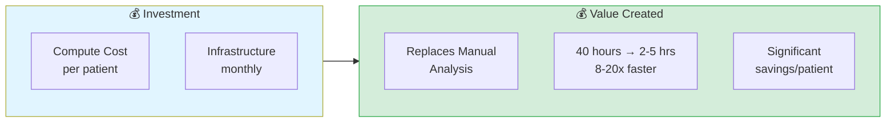

# Precision Medicine MCP: Funding & Partnership Opportunities

> **AI-orchestrated multi-modal synthesis for precision oncology — integrating genomics, transcriptomics, spatial biology, and imaging in a single analysis. Every result requires clinician APPROVE/REVISE/REJECT before clinical use.**

---

## 💡 The Opportunity

The Precision Medicine MCP Platform enables **multi-modal synthesis** that manual workflows cannot achieve at scale — correlating spatial gene expression with protein phosphorylation, genomic variants, and clinical data in a single analysis. All tools are accessible via natural language (no coding required). Reduces production analysis from 40 hours to 2-5 hours, with modeled savings of **$3,098-3,176 per patient**. DRY_RUN demos complete in 25-35 minutes with synthetic data. Savings estimates are projected from workflow comparisons; clinical pilot validation is the next step.

**The Problem:** Stage IV ovarian cancer patients face platinum resistance with limited treatment options. Comprehensive multi-omics analysis (genomics + spatial transcriptomics + imaging) could identify personalized targets, but data lives in silos and the 40-hour manual analysis time makes integrated analysis clinically impractical.

**This Solution:** AI (Claude + Gemini) orchestrates specialized bioinformatics MCP servers ([Server Registry](../reference/shared/server-registry.md)) via natural language, enabling cross-modality insights previously infeasible at scale. Every AI-generated result requires **clinician APPROVE/REVISE/REJECT** before clinical use — the system assists, never replaces.

> **Detailed metrics:** See [Value Proposition](../reference/shared/value-proposition.md) for complete ROI analysis.

---

## ROI Summary

**Annual Savings:** Significant projected savings at both pilot (100-patient) and production (500-patient) scale. See [Value Proposition](../reference/shared/value-proposition.md) for details.

---

## Investment Tiers

### Tier 1: Pilot Deployment ($50,000)
**Deliverables:**
- 3 production-ready servers (multiomics, spatial, fgbio) deployed on GCP
- HIPAA-compliant infrastructure with de-identification
- 6-month pilot with 5 users, 100 patients
- Training and documentation

**Timeline:** 6 months
**Projected ROI:** ~$313K modeled savings (100 patients) = **6.3x return** (to be validated during pilot)

### Tier 2: Production Deployment ($75,000/year)
**Deliverables:**
- Full 13-server deployment on hospital infrastructure
- Epic FHIR integration (real clinical data)
- 20 trained users (clinicians + bioinformaticians)
- 500 patients/year capacity
- HIPAA compliance validation
- Quarterly bias audits

**ROI:** $1.6M savings - $51K annual cost = **$1.55M net savings/year**

### Tier 3: Research Partnership ($150,000)
- Multi-site deployment (3-5 hospitals)
- Custom modality servers (proteomics, metabolomics)
- IRB-approved research protocol
- Publication support and co-authorship

---

## Why This Matters

**Dedicated to PatientOne** - a dear friend who passed from High-Grade Serous Ovarian Carcinoma in 2025. Her courage inspired the creation of these AI-orchestrated bioinformatics tools.

**The Clinical Problem:**
- **Stage IV ovarian cancer** has a 5-year survival rate of only 17-30%
- **Treatment resistance** develops in 70% of patients after initial platinum-based chemotherapy
- Traditional precision medicine analysis takes **40 hours of manual work** per patient, often delaying treatment decisions when time is critical

**The Technical Problem:**
- **Data fragmentation**: Clinical (EHR), genomic (VCF/FASTQ), spatial transcriptomics, imaging data exist in silos
- **Manual analysis bottleneck**: 40 hours of bioinformatics work per patient, $3,200-6,000 in labor costs
- **Limited access**: Only available at academic medical centers with dedicated bioinformatics teams

**This Solution:**
- **Multi-modal synthesis** — genomics, spatial, multi-omics, imaging, and clinical data analyzed together, not in silos
- **Clinician-in-the-Loop safety** — every AI result requires APPROVE/REVISE/REJECT before clinical use
- **Natural language access** — complex bioinformatics tools accessible without coding
- **HIPAA-compliant** architecture with de-identification, 10-year audit trails, VPC isolation
- Reduces analysis from 40 hours → 2-5 hours; modeled savings of $3,098-3,176 per patient (to be validated during pilot)
- Reduces minimum precision medicine team from ~10 FTEs to ~3 (2 clinicians + 1-2 bioinformaticians)
- Demonstrated with synthetic PatientOne case study (Stage IV HGSOC)

**Impact:**
- Faster identification of actionable therapeutic targets
- Real-time treatment response monitoring
- Broader access to precision medicine (more patients, more hospitals)

**Every patient deserves precision medicine analysis, not just those at academic medical centers.**

---

## Technical Validation

### Technical Readiness
- ✅ **MCP servers deployed** — most production-ready ([Server Registry](../reference/shared/server-registry.md))
- ✅ **Live monitoring dashboard** on Cloud Run — real-time health polling + Cloud Logging metrics
- ✅ **HIPAA-compliant architecture** ready (de-identification, audit logging, VPC isolation)
- ✅ **End-to-end workflow** validated with synthetic PatientOne ovarian cancer case
- ⚠️ **Not yet validated** on real patient data — clinical pilot is the proposed next step
- ⚠️ **AI vendor dependency** — orchestration depends on Claude/Gemini APIs; mitigated by dual-provider support and provider-agnostic MCP server layer

> **Full cost analysis:** See [Cost Analysis](../reference/shared/cost-analysis.md).

---

## Quick Demo

**See the platform in action in under 2 minutes:**

- **[90-Second Funding Demo →](NINETY_SECOND_PITCH.md)** - Copy-paste prompts to demonstrate ROI
- **[5-Minute Video Demo →](https://www.youtube.com/watch?v=LUldOHHX5Yo)** - Watch the full PatientOne analysis
- **[Full Prompt Library →](../reference/prompts/README.md)** - 20+ ready-to-use clinical prompts

**Try it yourself:**
1. Install Claude Desktop with MCP servers ([Setup Guide](../getting-started/installation.md))
2. Use synthetic PatientOne data (100% safe, no PHI)
3. Run the 90-second demo prompts
4. See 40 hours → 25-35 minutes in DRY_RUN demo mode

---
