# Precision Medicine MCP: Funding & Partnership Opportunities

> **Transform 40 hours of manual bioinformatics into 35 minutes of AI-orchestrated analysis**

---

## 💡 The Opportunity

The Precision Medicine MCP Platform reduces multi-omics precision medicine analysis from **40 hours of manual work** to **35 minutes** of AI-orchestrated analysis, saving **$3,098-3,176 per patient** while maintaining HIPAA compliance.

**The Problem:** Stage IV ovarian cancer patients face platinum resistance with limited treatment options. Comprehensive multi-omics analysis (genomics + spatial transcriptomics + imaging) could identify personalized targets, but the 40-hour manual analysis time makes it clinically impractical.

**This Solution:** AI orchestrates 12 specialized bioinformatics servers via natural language, completing analysis in 35 minutes.

---

## ROI Summary

```mermaid
graph LR
    subgraph Input["💰 Investment"]
        COMPUTE[Compute Cost<br/>$24-102/patient]
        INFRA[Infrastructure<br/>$1,000/month]
    end

    subgraph Output["💰 Value Created"]
        REPLACE[Replaces Manual<br/>$6,000-9,000]
        SPEED[40 hours → 35 min<br/>68x faster]
        SAVINGS[$3,098-3,176<br/>savings/patient]
    end

    Input --> Output

    style Input fill:#e1f5ff
    style Output fill:#d4edda,stroke:#28a745
```

**Annual Savings:**
- 100 patients/year = **$313,700 saved**
- 500 patients/year = **$1,568,500 saved**

---

## Investment Tiers

### Tier 1: Pilot Deployment ($50,000)
**Deliverables:**
- 3 production-ready servers (multiomics, spatial, fgbio) deployed on GCP
- HIPAA-compliant infrastructure with de-identification
- 6-month pilot with 5 users, 100 patients
- Training and documentation

**Timeline:** 6 months
**ROI:** ~$313K savings (100 patients) = **6.3x return**

### Tier 2: Production Deployment ($75,000/year)
**Deliverables:**
- Full 10-server deployment on hospital infrastructure
- Epic FHIR integration (real clinical data)
- 20 trained users (clinicians + bioinformaticians)
- 500 patients/year capacity
- HIPAA compliance validation
- Quarterly bias audits

**ROI:** $1.6M savings - $51K annual cost = **$1.55M net savings/year**

### Tier 3: Research Partnership ($150,000)
- Multi-site deployment (3-5 hospitals)
- Custom modality servers (proteomics, metabolomics)
- IRB-approved research protocol
- Publication support and co-authorship

---

## Why This Matters

**Dedicated to PatientOne** - a dear friend who passed from High-Grade Serous Ovarian Carcinoma in 2025. Her courage inspired the creation of these AI-orchestrated bioinformatics tools.

**The Clinical Problem:**
- **Stage IV ovarian cancer** has a 5-year survival rate of only 17-30%
- **Treatment resistance** develops in 70% of patients after initial platinum-based chemotherapy
- Traditional precision medicine analysis takes **40 hours of manual work** per patient, often delaying treatment decisions when time is critical

**The Technical Problem:**
- **Data fragmentation**: Clinical (EHR), genomic (VCF/FASTQ), spatial transcriptomics, imaging data exist in silos
- **Manual analysis bottleneck**: 40 hours of bioinformatics work per patient, $3,200-6,000 in labor costs
- **Limited access**: Only available at academic medical centers with dedicated bioinformatics teams

**This Solution:**
- Natural language AI orchestration reduces **40 hours → 35 minutes**
- **$3,098-3,176 savings per patient**
- HIPAA-compliant, production-ready for hospital deployment
- Demonstrated with PatientOne case study (Stage IV HGSOC)

**Impact:**
- Faster identification of actionable therapeutic targets
- Real-time treatment response monitoring
- Broader access to precision medicine (more patients, more hospitals)

**Every patient deserves precision medicine analysis, not just those at academic medical centers.**

---

## Technical Validation

### Production Readiness
- ✅ **12 MCP servers deployed** (7 production-ready, 1 partial, 4 mocked for demo)
- ✅ **69 tools** across all servers with comprehensive test coverage (239 automated tests)
- ✅ **Live monitoring dashboard** on Cloud Run — real-time health polling + Cloud Logging metrics
- ✅ **HIPAA-compliant infrastructure** ready (de-identification, audit logging, VPC isolation)
- ✅ **End-to-end demo** tested with synthetic PatientOne ovarian cancer case

### Deployment Status

| Server | Tools | Status | GCP Deployed |
|--------|-------|--------|--------------|
| mcp-fgbio | 9 | ✅ Production (95% real) | Yes |
| mcp-multiomics | 21 | ✅ Production (85% real) | Yes |
| mcp-spatialtools | 23 | ✅ Production (95% real) | Yes |
| mcp-deepcell | 4 | ✅ Production (100% real) | Yes |
| mcp-perturbation | 8 | ✅ Production (100% real) | Yes |
| mcp-quantum-celltype-fidelity | 6 | ✅ Production (100% real) | Yes |
| mcp-epic | 9 | ✅ Production (Local only, HIPAA) | No |
| mcp-openimagedata | 7 | ⚠️ Partial (60% real) | Yes |
| mcp-mockepic | 8 | 🎭 Mock (by design) | Yes |
| mcp-tcga | 11 | ❌ Mocked | Yes |
| mcp-huggingface | 7 | ❌ Mocked | Yes |
| mcp-seqera | 7 | ❌ Mocked | Yes |

**Total: 12 servers, 124 tools**

---

## Quick Demo

**See the platform in action in under 2 minutes:**

- **[90-Second Funding Demo →](../demos/NINETY_SECOND_PITCH.md)** - Copy-paste prompts to demonstrate ROI
- **[5-Minute Video Demo →](https://www.youtube.com/watch?v=LUldOHHX5Yo)** - Watch the full PatientOne analysis
- **[Full Prompt Library →](../prompt-library/README.md)** - 20+ ready-to-use clinical prompts

**Try it yourself:**
1. Install Claude Desktop with MCP servers ([Setup Guide](../getting-started/installation.md))
2. Use synthetic PatientOne data (100% safe, no PHI)
3. Run the 90-second demo prompts
4. See 40 hours → 35 minutes in action

---
