# For Hospital IT & Administrators

**This section is for:** Hospital CIOs, IT directors, security officers, and administrators evaluating this platform for production deployment.

---

## What You Can Accomplish Here

- ✅ **Understand deployment requirements** (GCP, Epic FHIR, Azure AD)
- ✅ **Review security & HIPAA compliance** (de-identification, audit logging, encryption)
- ✅ **Plan 6-month deployment timeline** (infrastructure → pilot → production)
- ✅ **Assess operational costs** ($1,000/month infrastructure + $24-102/patient)
- ✅ **Access deployment checklist** and runbooks for common issues

---

## Quick Start (5 Steps)

1. **Review security overview** → [SECURITY_OVERVIEW.md](SECURITY_OVERVIEW.md) (10 min)
2. **Check deployment requirements** → [DEPLOYMENT_CHECKLIST.md](DEPLOYMENT_CHECKLIST.md) (15 min)
3. **Review existing hospital deployment guides** → [Operations Manual](../for-hospitals/OPERATIONS_MANUAL.md) (30 min)
4. **Assess HIPAA compliance** → [HIPPA_DETAILS](https://github.com/lynnlangit/precision-medicine-mcp/blob/main/docs/for-hospitals/compliance/hipaa.md) (20 min)
5. **Schedule technical Q&A** → Contact information below

**Total Time Investment:** 75 minutes to full evaluation

---

## Documents in This Section

### Deployment Planning
- **[SECURITY_OVERVIEW.md](SECURITY_OVERVIEW.md)** - One-page security architecture summary
- **[DEPLOYMENT_CHECKLIST.md](DEPLOYMENT_CHECKLIST.md)** - Step-by-step deployment requirements
- **[Operations Manual](../for-hospitals/OPERATIONS_MANUAL.md)** - Day-to-day operations guide
- **[Production Roadmap](../deployment/roadmap.md)** - 6-month deployment timeline

### Security & Compliance
- **[HIPAA Compliance](https://github.com/lynnlangit/precision-medicine-mcp/blob/main/docs/for-hospitals/compliance/hipaa.md)** - De-identification, audit logging, encryption
- **[Data Governance](https://github.com/lynnlangit/precision-medicine-mcp/blob/main/docs/for-hospitals/compliance/data-governance.md)** - Data retention, privacy policies
- **[Security Guide](../reference/deployment/security.md)** - API keys, secrets management, GCP Secret Manager

### User Management
- **[Admin Guide](../for-hospitals/ADMIN_GUIDE.md)** - User management, monitoring, backups
- **[User Guide](../for-hospitals/USER_GUIDE.md)** - For clinicians and researchers
- **[Audit Log Guide](../for-hospitals/AUDIT_LOG_GUIDE.md)** - 10-year retention compliance

### Troubleshooting
- **[Runbooks](../for-hospitals/RUNBOOKS/)** - Incident response procedures
  - [Server Down](../for-hospitals/RUNBOOKS/server-down.md)
  - [Epic Connection Failure](../for-hospitals/RUNBOOKS/epic-connection-failure.md)
  - [SSO Issues](../for-hospitals/RUNBOOKS/sso-issues.md)

---

## Deployment Requirements

### Infrastructure

| Component | Requirement | Notes |
|-----------|-------------|-------|
| **Cloud Platform** | GCP organization | Existing HIPAA-compliant setup preferred |
| **Compute** | Cloud Run (serverless) | Auto-scales based on demand |
| **Storage** | Cloud Storage + BigQuery | For FHIR data, analysis results |
| **Networking** | VPC, Cloud NAT | Private networking for security |
| **Monitoring** | Cloud Logging + Monitoring | 10-year audit log retention |

### Integration Points

| System | Purpose | Status |
|--------|---------|--------|
| **Epic FHIR** | Clinical data retrieval | Requires Epic integration team |
| **Azure AD** | User authentication (SSO) | Requires Azure AD admin |
| **Sequencing Systems** | Genomic data (VCF, FASTQ) | Existing bioinformatics infrastructure |
| **PACS** | Imaging data (H&E, MxIF) | Optional integration |

### Personnel

| Role | Involvement | Timeline |
|------|------------|----------|
| **Hospital IT Lead** | Infrastructure setup | Months 1-2 |
| **Security Officer** | HIPAA compliance validation | Months 3-4 |
| **Epic Integration Team** | FHIR API configuration | Months 2-3 |
| **Azure AD Admin** | SSO setup | Month 2 |
| **Bioinformatics Lead** | Data pipeline validation | Months 2-4 |

---

## 6-Month Deployment Timeline

### Month 1-2: Infrastructure Setup
- [ ] GCP project creation and VPC configuration
- [ ] Azure AD SSO integration
- [ ] Deploy core 3 servers (fgbio, multiomics, spatialtools)
- [ ] Epic FHIR sandbox connection

**Deliverable:** Test queries working with synthetic data

### Month 3-4: Pilot Deployment
- [ ] Deploy all 9 production servers
- [ ] Epic FHIR production connection (read-only)
- [ ] 10-20 test patients analyzed
- [ ] User training (5 pilot users: 2 clinicians, 3 bioinformaticians)
- [ ] Security audit and HIPAA compliance validation

**Deliverable:** Pilot users successfully analyzing real patient data

### Month 5-6: Production Launch
- [ ] Monitoring and alerting configuration
- [ ] Backup and disaster recovery testing
- [ ] Scale to 100 patients
- [ ] Knowledge transfer and documentation
- [ ] Production go-live

**Deliverable:** Self-sustaining production system

---

## Security Architecture Overview

```mermaid
graph TB
    subgraph Internet["🌐 Internet"]
        USER[Clinician<br/>Azure AD]
    end

    subgraph GCP["🔒 GCP (VPC)"]
        subgraph Auth["🔐 Authentication"]
            IAP[Identity-Aware Proxy]
            SSO[Azure AD SSO]
        end

        subgraph Servers["🔧 MCP Servers"]
            EPIC[mcp-epic<br/>FHIR Data]
            MULTI[mcp-multiomics]
            SPATIAL[mcp-spatialtools]
        end

        subgraph Data["📁 Encrypted Storage"]
            FHIR[FHIR Store<br/>De-identified]
            FILES[Cloud Storage<br/>Encrypted]
        end

        subgraph Logs["📊 Audit Logs"]
            LOGGING[Cloud Logging<br/>10-year retention]
        end
    end

    USER -->|HTTPS| IAP
    IAP -->|Verified| SSO
    SSO -->|Authenticated| Servers
    Servers --> FHIR
    Servers --> FILES
    Servers --> LOGGING

    style Internet fill:#e1f5ff
    style Auth fill:#fff3cd
    style Servers fill:#d4edda
    style Data fill:#f3e5f5
    style Logs fill:#d1ecf1
```

**Key Security Features:**
- ✅ **VPC Isolation** - No public IPs, all traffic through Cloud NAT
- ✅ **Encryption** - At rest (AES-256) and in transit (TLS 1.3)
- ✅ **De-identification** - HIPAA Safe Harbor method built-in
- ✅ **Audit Logging** - All API calls logged, 10-year retention
- ✅ **Azure AD SSO** - Centralized user management
- ✅ **Secret Management** - GCP Secret Manager, no hardcoded keys

---

## Cost Breakdown

### Monthly Infrastructure Costs

| Component | Cost | Notes |
|-----------|------|-------|
| **Cloud Run** | $400-800 | 9 servers, auto-scales with usage |
| **Cloud Storage** | $100-200 | Patient data, analysis results |
| **BigQuery** | $50-100 | FHIR data warehouse |
| **Cloud Logging** | $200-400 | 10-year audit log retention |
| **Networking** | $100-200 | VPC, Cloud NAT, egress |
| **Secret Manager** | $10-20 | API keys, credentials |
| **Total** | **$860-1,720/month** | ~$1,000/month average |

### Per-Patient Analysis Costs

| Component | Cost | Notes |
|-----------|------|-------|
| **GCP Compute** | $24-102 | Varies by data size (3-8 GB) |
| **Claude API Tokens** | $1-2 | ~1M tokens per analysis |
| **Total** | **$25-104/patient** | vs. $6,000 traditional |

### Annual Total (500 Patients)

- Infrastructure: $12,000-20,640/year
- Per-patient: $12,500-52,000/year (500 patients)
- **Total: $24,500-72,640/year**

**Savings:** $3,000,000 (traditional) - $72,640 (MCP) = **$2,927,360/year**

---

## HIPAA Compliance Summary

### De-Identification
- ✅ **Safe Harbor Method** - Removes all 18 HIPAA identifiers
- ✅ **Automated** - Built into mcp-epic server
- ✅ **Validated** - Tested with synthetic patient data

### Audit Logging
- ✅ **10-year retention** - GCP Cloud Logging + FHIR AuditEvent
- ✅ **Comprehensive** - All API calls, data access, analysis requests logged
- ✅ **Immutable** - Logs cannot be modified or deleted

### Access Control
- ✅ **Azure AD SSO** - Centralized user authentication
- ✅ **Role-based access** - Clinician, bioinformatician, admin roles
- ✅ **Identity-Aware Proxy** - All traffic authenticated before reaching servers

### Encryption
- ✅ **At rest** - AES-256 encryption for all Cloud Storage data
- ✅ **In transit** - TLS 1.3 for all API calls
- ✅ **Key management** - GCP Secret Manager with automatic rotation

### Incident Response
- ✅ **Documented procedures** - [Runbooks](../for-hospitals/RUNBOOKS/)
- ✅ **Breach notification** - 60-day HIPAA timeline compliance
- ✅ **Audit trail** - All incidents logged and tracked

---

## Risk Assessment

| Risk Category | Level | Mitigation |
|--------------|-------|------------|
| **Technical** | LOW | Auto-scaling, comprehensive error handling, 167 tests |
| **Security** | LOW | VPC isolation, encryption, de-identification, audit logging |
| **Compliance** | LOW | HIPAA Safe Harbor, 10-year logs, Azure AD SSO |
| **Financial** | LOW | Daily cost monitoring, budget alerts at 80%, Haiku model optimization |
| **Adoption** | MEDIUM | Training program, Streamlit UI, natural language interface |

**Overall Risk:** LOW - Well-mitigated across all dimensions

---

## Support & Escalation

### Normal Business Hours (9am-5pm ET)
- **Email:** [support placeholder]
- **Response Time:** 4 hours
- **Slack Channel:** #precision-medicine-mcp (optional)

### After Hours / Urgent (Severity 1)
- **On-Call:** [phone placeholder]
- **Severity 1:** Production system down, patient safety impact
- **Response Time:** 1 hour

### Escalation Path
1. **L1 Support:** General questions, user training
2. **L2 Support:** Technical issues, deployment problems
3. **L3 Support:** Architecture changes, security incidents

---

## Frequently Asked Questions

### "Can we use AWS or Azure instead of GCP?"
**A:** Technically yes (MCP servers are cloud-agnostic), but current deployment scripts and HIPAA-compliant infrastructure are GCP-focused. AWS/Azure ports would require 2-3 months additional development.

### "Do we need Epic? Can we use Cerner/MEDITECH?"
**A:** mcp-epic server is designed for Epic FHIR R4 API. Other EHR systems (Cerner, MEDITECH, Allscripts) require custom FHIR adapters. Development time: 4-8 weeks per EHR system.

### "What about on-premise deployment?"
**A:** Possible but not recommended. Cloud Run serverless architecture is optimized for GCP. On-premise would require:
- Kubernetes cluster setup and management
- Manual scaling configuration
- Higher operational overhead
**Estimate:** 3-4x higher infrastructure costs

### "How long does user training take?"
**A:** Depends on role:
- **Clinicians:** 2 hours (Streamlit UI, basic queries)
- **Bioinformaticians:** 4 hours (advanced queries, result interpretation)
- **Administrators:** 8 hours (deployment, monitoring, troubleshooting)

### "What if we want to add new data modalities?"
**A:** System is extensible by design. See: [Add New Modality Server Guide](../for-developers/ADD_NEW_MODALITY_SERVER.md)
**Timeline:** 4-8 hours from template to deployed server

---

**Related Resources:**
- 💰 [ROI Analysis](../for-funders/ROI_ANALYSIS.md) - Cost-benefit analysis for CFOs
- 🔬 [Researcher Guide](../for-researchers/README.md) - For bioinformaticians
- 📊 [Executive Summary](../EXECUTIVE_SUMMARY.md) - Comprehensive technical overview
- 🏠 [Back to Main Documentation](../README.md)

---

**Last Updated:** 2026-01-14
