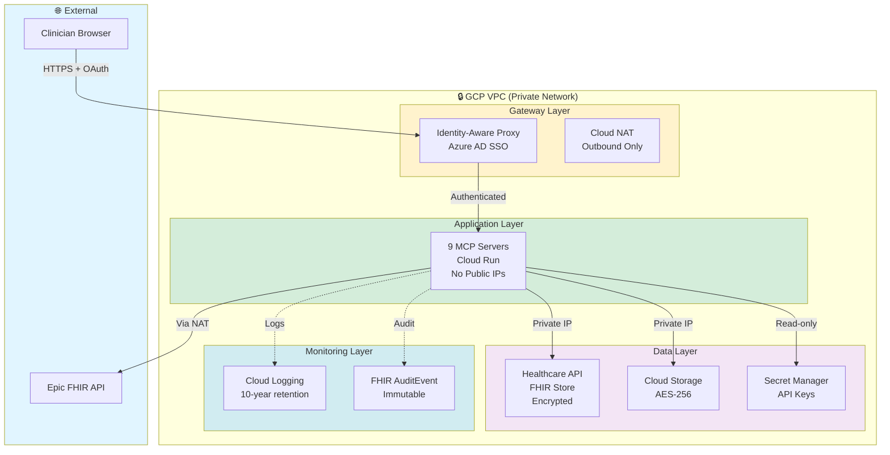

# Security Overview

One-page summary of security architecture for hospital IT and security officers.

---

## Architecture Diagram

---

## Security Controls (HIPAA Compliance)

### 1. Network Security
| Control | Implementation | HIPAA Requirement |
|---------|----------------|-------------------|
| **VPC Isolation** | All servers in private VPC, no public IPs | § 164.312(a)(1) - Access Control |
| **Firewall Rules** | Ingress only via Identity-Aware Proxy | § 164.312(a)(1) - Access Control |
| **Cloud NAT** | Outbound traffic only (Epic FHIR, APIs) | § 164.312(e)(1) - Transmission Security |
| **TLS 1.3** | All traffic encrypted in transit | § 164.312(e)(2)(i) - Encryption |

### 2. Authentication & Authorization
| Control | Implementation | HIPAA Requirement |
|---------|----------------|-------------------|
| **Azure AD SSO** | Centralized user authentication | § 164.312(d) - Person/Entity Authentication |
| **MFA** | Required for all users | § 164.312(a)(2)(i) - Unique User Identification |
| **RBAC** | Role-based access (clinician, bioinformatician, admin) | § 164.308(a)(4)(i) - Access Authorization |
| **Session Timeout** | 30-minute idle timeout | § 164.312(a)(2)(iii) - Automatic Logoff |

### 3. Data Encryption
| Control | Implementation | HIPAA Requirement |
|---------|----------------|-------------------|
| **At Rest** | AES-256 encryption (Cloud Storage, FHIR Store) | § 164.312(a)(2)(iv) - Encryption |
| **In Transit** | TLS 1.3 for all API calls | § 164.312(e)(2)(i) - Encryption |
| **Key Management** | GCP Secret Manager with automatic rotation | § 164.308(b)(2) - Key Management |
| **De-identification** | HIPAA Safe Harbor method (18 identifiers removed) | § 164.514(b)(2) - Safe Harbor |

### 4. Audit Logging
| Control | Implementation | HIPAA Requirement |
|---------|----------------|-------------------|
| **10-Year Retention** | Cloud Logging + FHIR AuditEvent | § 164.316(b)(2)(i) - Retention |
| **Immutable Logs** | Logs cannot be modified or deleted | § 164.308(a)(1)(ii)(D) - Information System Activity Review |
| **Comprehensive Logging** | All API calls, data access, user actions | § 164.312(b) - Audit Controls |
| **Real-time Monitoring** | Cloud Monitoring alerts on anomalies | § 164.308(a)(5)(ii)(B) - Log Reviews |

### 5. Incident Response
| Control | Implementation | HIPAA Requirement |
|---------|----------------|-------------------|
| **Breach Notification** | 60-day timeline compliance | § 164.408 - Notification by Covered Entity |
| **Runbooks** | Documented procedures for common issues | § 164.308(a)(6)(ii) - Response and Reporting |
| **Backup & Recovery** | Daily backups, 30-day retention | § 164.308(a)(7)(ii)(A) - Data Backup Plan |

---

## De-Identification (Safe Harbor Method)

### 18 Identifiers Removed

mcp-epic server automatically removes all HIPAA-defined identifiers:

1. ✅ Names
2. ✅ Geographic subdivisions smaller than state
3. ✅ Dates (except year) - Birth, admission, discharge, death
4. ✅ Telephone numbers
5. ✅ Fax numbers
6. ✅ Email addresses
7. ✅ Social Security numbers
8. ✅ Medical record numbers
9. ✅ Health plan beneficiary numbers
10. ✅ Account numbers
11. ✅ Certificate/license numbers
12. ✅ Vehicle identifiers
13. ✅ Device identifiers/serial numbers
14. ✅ Web URLs
15. ✅ IP addresses
16. ✅ Biometric identifiers (fingerprints, retinal scans)
17. ✅ Full-face photos
18. ✅ Any other unique identifying number, characteristic, or code

**Result:** De-identified data can be used for research without additional patient consent

---

## Access Control Matrix

| Role | FHIR Data | Genomic Data | Analysis Results | Admin Functions |
|------|-----------|--------------|------------------|-----------------|
| **Clinician** | Read (de-identified) | Read | Read/Write (own analyses) | None |
| **Bioinformatician** | Read (de-identified) | Read/Write | Read/Write (all analyses) | None |
| **Admin** | None (audit logs only) | None | None (audit logs only) | Full |
| **Security Officer** | None (audit logs only) | None | None (audit logs only) | Audit logs only |

**Principle of Least Privilege:** Each role has minimum necessary access

---

## Encryption Specifications

### Data at Rest
- **Algorithm:** AES-256-GCM
- **Key Management:** GCP-managed encryption keys (automatic rotation every 90 days)
- **Scope:** Cloud Storage buckets, FHIR Store, BigQuery datasets

### Data in Transit
- **Protocol:** TLS 1.3
- **Cipher Suites:** TLS_AES_128_GCM_SHA256, TLS_AES_256_GCM_SHA384
- **Certificate:** Google-managed SSL certificates (automatic renewal)

### API Keys & Secrets
- **Storage:** GCP Secret Manager
- **Access:** Service accounts only (no user access)
- **Rotation:** Manual on-demand + automatic alerts at 90 days

---

## Audit Log Retention

### What Gets Logged

**Cloud Logging (GCP):**
- All API calls to MCP servers (who, what, when)
- Authentication events (login, logout, failed attempts)
- Data access (FHIR queries, file reads/writes)
- Configuration changes (user permissions, server deployments)

**FHIR AuditEvent (Healthcare API):**
- Patient data access (specific patient IDs, data types)
- User actions (create, read, update, delete)
- De-identification operations (pre/post data hashes)

**Retention:** 10 years (HIPAA § 164.316(b)(2)(i))

### Log Analysis

**Automated Alerts:**
- Unusual access patterns (>100 patient records in 1 hour)
- Failed authentication attempts (>5 in 5 minutes)
- Off-hours access (9pm-6am)
- Bulk data exports (>1GB)

**Monthly Reviews:**
- User access patterns
- De-identification audit (sample 10 random patients)
- Failed query analysis
- System performance metrics

---

## Security Testing & Validation

### Before Production Launch

- [ ] **Penetration Testing** - External security firm assessment
- [ ] **HIPAA Compliance Audit** - Internal or external audit
- [ ] **Vulnerability Scanning** - GCP Security Command Center
- [ ] **Disaster Recovery Test** - Restore from backup, verify functionality
- [ ] **Load Testing** - Simulate 100 concurrent users

### Ongoing (Quarterly)

- [ ] **Access Control Review** - Verify user permissions still appropriate
- [ ] **Log Analysis** - Review 90 days of audit logs for anomalies
- [ ] **Backup Testing** - Restore random backup, verify data integrity
- [ ] **Security Patching** - Apply OS and library updates
- [ ] **Compliance Validation** - Re-check HIPAA controls

---

## Incident Response Procedures

### Severity Definitions

| Severity | Definition | Response Time | Example |
|----------|------------|---------------|---------|
| **1 - Critical** | Patient safety risk, data breach | 1 hour | PHI exposure, system down |
| **2 - High** | Service degradation, security incident | 4 hours | Failed de-identification, unauthorized access attempt |
| **3 - Medium** | Performance issues, non-critical bugs | 1 business day | Slow queries, minor data errors |
| **4 - Low** | Enhancement requests, questions | 3 business days | Feature requests, documentation clarifications |

### Response Workflow

1. **Detection** - Automated alert or manual report
2. **Triage** - Assess severity, assign owner
3. **Investigation** - Review logs, reproduce issue
4. **Containment** - Stop data exposure, isolate affected systems
5. **Resolution** - Fix root cause, restore service
6. **Notification** - Inform stakeholders (60-day HIPAA timeline for breaches)
7. **Post-Mortem** - Document lessons learned, update runbooks

---

## Security Contacts

**Security Officer:** [Name, email placeholder]
**HIPAA Compliance:** [Name, email placeholder]
**Technical Lead:** [Name, email placeholder]

**Incident Reporting:** security@[domain].org (monitored 24/7)

---

## Certification & Attestation

- ☐ **HIPAA Compliance:** Attested by [Name, Title] on [Date]
- ☐ **SOC 2 Type II:** GCP Cloud Run platform (Google attestation)
- ☐ **HITRUST CSF:** Planned for Year 2 (optional)

---

**Related Resources:**
- 📖 [HIPAA Compliance Guide](compliance/hipaa.md) - Full compliance details
- 🔧 [Deployment Guide](../reference/deployment/security.md) - Technical implementation
- 📋 [Admin Guide](../for-hospitals/ADMIN_GUIDE.md) - User management

---

**Last Updated:** 2026-01-14
