# For Researchers & Bioinformaticians

**This section is for:** Bioinformaticians, computational biologists, translational researchers, and cancer researchers who want to use the precision-medicine-mcp platform for multi-modal data analysis.

---

## What You Can Accomplish Here

```mermaid
graph LR
    A["📁 Load Data<br/>5 modalities"] --> B["🔬 Analyze<br/>6 workflows"] --> C["🔗 Integrate<br/>cross-modal"] --> D["📊 Publish<br/>reproducible results"]

    style A fill:#e1f5ff,stroke:#0066cc,stroke-width:2px
    style B fill:#fff3cd,stroke:#ffc107,stroke-width:2px
    style C fill:#e8f5e9,stroke:#4caf50,stroke-width:2px
    style D fill:#f3e5f5,stroke:#9c27b0,stroke-width:2px
```



> **Load:** Clinical, Genomic, Multi-omics, Spatial, Imaging  
> **Analyze:** Diff expression, pathway enrichment, cell deconvolution, batch correction, spatial autocorrelation, multi-omics integration  
> **Integrate:** RNA + Protein + Spatial + Clinical in one analysis  
> **Publish:** Visualizations, statistical tests, treatment targets, reproducible methods  

---

## Data Modalities

```mermaid
graph LR
    A[📁 Multi-Modal Data] --> B[🔧 Analysis Workflows]
    B --> C[📊 Insights]

    A1[Clinical<br/>FHIR] --> A
    A2[Genomics<br/>VCF] --> A
    A3[RNA/Protein<br/>Phospho] --> A
    A4[Spatial<br/>Visium] --> A
    A5[Imaging<br/>H&E/MxIF] --> A

    B --> B1[Diff Expression]
    B --> B2[Pathway Enrichment]
    B --> B3[Cell Deconvolution]
    B --> B4[Batch Correction]
    B --> B5[Multi-omics Integration]

    C --> C1[Treatment Targets]
    C --> C2[Resistance Mechanisms]
    C --> C3[Biomarkers]

    style A fill:#e1f5ff,stroke:#0066cc,stroke-width:2px
    style B fill:#fff3cd,stroke:#ffc107,stroke-width:2px
    style C fill:#d4edda,stroke:#28a745,stroke-width:2px
```



### Synthetic Patient Datasets

**Two synthetic patient datasets are available:**

| Patient | Cancer Type | Stage | Key Mutations | Use Case |
|---------|-------------|-------|---------------|----------|
| **PAT001-OVC-2025** | Ovarian (HGSOC) | IV | BRCA1, TP53, PIK3CA | Advanced refractory cancer |
| **PAT002-BC-2026** | Breast (IDC) | IIA | BRCA2, PIK3CA, ER+/PR+ | Adjuvant therapy surveillance |

**PatientOne (PAT001) Example Datasets:**

| Modality | Demonstration Mode | Production Mode |
|----------|-------------------|-----------------|
| **Clinical** | FHIR resources (demographics, conditions, medications, CA-125) | Real Epic FHIR (HIPAA-compliant) |
| **Genomics** | VCF: TP53, PIK3CA, PTEN, BRCA1 variants | Whole exome sequencing (WES) |
| **Multi-omics** | 15 samples, 38 KB matrices | 15 samples, 2.7 GB raw (15-20 MB processed) |
| **Spatial** | 900 spots × 31 genes (315 KB) | 3,000-5,000 spots × 18,000-30,000 genes (100-500 MB) |
| **Imaging** | H&E, MxIF placeholders (4.1 MB) | Full resolution slides (500 MB - 2 GB) |

**PatientTwo (PAT002)** adds pre/post treatment comparison, BRCA2 germline testing, and ER/PR/HER2 receptor workflows. See [PAT002 README](../../data/patient-data/PAT002-BC-2026/README.md).

**Synthetic Data:** 100% synthetic, no patient privacy concerns, safe for publication

---


## Quick Start (3 Paths)

### 1. Try PatientOne Demo (25-35 minutes)
**Goal:** Comprehensive multi-modal analysis of Stage IV ovarian cancer case

1. **Set up environment** → [Installation Guide](../getting-started/installation.md) (10 min)
2. **Run PatientOne workflow** → [PatientOne Guide](../reference/testing/patient-one/README.md) (25-35 min)
3. **Review results** → results depend on which mcp servers are used in analysis, see detail below  

**What you'll analyze:**
- Clinical: Stage IV HGSOC, platinum-resistant
- Genomic: TP53 mutation, BRCA1 variant
- Multi-omics: RNA + Protein + Phospho (Stouffer meta-analysis)
- Spatial: Visium spatial transcriptomics with pathway enrichment
- Imaging: H&E slides, cell segmentation

**Cost:** ~$87 (compute + API tokens)

### 2. Explore Specific Modalities (varies)
**Goal:** Deep dive into spatial, multi-omics, or genomic analysis

**Spatial Transcriptomics:**
- **Server:** mcp-spatialtools (95% real, 14 tools)
- **Quick start:** [Spatial Quick Start](../../servers/mcp-spatialtools/QUICKSTART.md) (15 min)
- **Capabilities:** STAR alignment, ComBat batch correction, pathway enrichment, Moran's I
- **Example:** "Perform spatial pathway enrichment on PatientOne tumor regions"

**Multi-Omics Integration:**
- **Server:** mcp-multiomics (95% real, 10 tools)
- **Examples:** [Multi-omics README](../../servers/mcp-multiomics/README.md) (10 min)
- **Capabilities:** HAllA integration, Stouffer meta-analysis, upstream regulators
- **Example:** "Integrate RNA, protein, and phospho data using Stouffer's method"

**Genomic Variants:**
- **Server:** mcp-fgbio (95% real, 4 tools)
- **Examples:** [fgbio README](../../servers/mcp-fgbio/README.md) (10 min)
- **Capabilities:** VCF validation, variant annotation, reference genome management
- **Example:** "Identify pathogenic variants in PatientOne VCF file"

### 3. Design Custom Workflows (varies)
**Goal:** Build reproducible analysis pipelines for your research

1. **Understand architecture** → [System Overview](../for-developers/ARCHITECTURE.md) (30 min)
2. **Study server capabilities** → [Server Status Matrix](../../servers/README.md#-server-status) (15 min)
3. **Design workflow** → Chain tools via natural language prompts
4. **Test with synthetic data** → Use DRY_RUN mode ($0.32/analysis)
5. **Scale to real data** → Switch to production mode

**Example workflows:**
- Tumor microenvironment characterization (Spatial + Imaging + Deconvolution)
- Drug resistance mechanisms (Multi-omics + Pathway enrichment + Variant analysis)
- Biomarker discovery (Cohort analysis + Differential expression + Validation)


## Analysis Workflows

### 1. Differential Expression Analysis

**Method:** Mann-Whitney U test + Benjamini-Hochberg FDR correction

**Prompt:**
```
Identify differentially expressed genes between PatientOne tumor and normal samples
using mcp-spatialtools, with FDR < 0.05 threshold.
```

**Output:**
- List of significant genes (q-value < 0.05)
- Log2 fold changes
- Visualization (volcano plot, heatmap)

**Statistical rigor:**
- Non-parametric test (no normality assumption)
- Multiple testing correction (FDR control)
- Effect size (log2 FC) reported

### 2. Pathway Enrichment

**Method:** Fisher's exact test on 44 curated pathways (KEGG, Hallmark, GO_BP, Drug_Resistance)

**Prompt:**
```
Perform pathway enrichment analysis on PatientOne spatial transcriptomics data
focusing on cancer-related pathways.
```

**Output:**
- Enriched pathways (p < 0.05)
- Gene lists per pathway
- Overlap statistics

**Pathways included:**
- KEGG: PI3K/AKT, MAPK, p53, Cell cycle
- Hallmark: EMT, Hypoxia, Angiogenesis
- GO_BP: DNA repair, Apoptosis
- Drug_Resistance: Platinum, PARP inhibitor

### 3. Spatial Autocorrelation

**Method:** Moran's I for spatially variable genes

**Prompt:**
```
Identify spatially variable genes in PatientOne tumor regions using Moran's I
spatial autocorrelation test.
```

**Output:**
- Genes with significant spatial patterns (p < 0.05)
- Moran's I statistic per gene
- Spatial expression maps

**Use cases:**
- Tumor-normal boundary identification
- Microenvironment heterogeneity mapping
- Immune infiltration patterns

### 4. Cell Type Deconvolution

**Method:** Signature-based scoring (tumor, fibroblasts, immune cells, hypoxic regions)

**Prompt:**
```
Perform cell type deconvolution on PatientOne spatial data to quantify
tumor cell fraction and immune infiltration.
```

**Output:**
- Cell type proportions per spot
- Spatial distribution maps
- Cell type co-localization analysis

**Signatures:**
- Tumor: Epithelial markers (EPCAM, KRT7)
- Fibroblasts: Stromal markers (FAP, COL1A1)
- Immune: T-cells (CD3D, CD8A), Macrophages (CD68)
- Hypoxic: HIF1A, CA9, VEGFA

### 5. Batch Correction

**Method:** ComBat (Empirical Bayes) for removing technical variation

**Prompt:**
```
Apply ComBat batch correction to PatientOne spatial data to remove
technical variation between tissue regions.
```

**Output:**
- Corrected expression matrix
- PCA plots (before/after)
- Batch effect assessment

**When to use:**
- Multiple tissue sections
- Multi-site studies
- Technical replicates

### 6. Multi-Omics Integration

**Method:** HAllA association analysis + Stouffer meta-analysis

**Prompt:**
```
Integrate PatientOne RNA, protein, and phospho data using Stouffer's method
to identify concordant pathway activations.
```

**Output:**
- Combined p-values across modalities
- Concordant pathway list
- Cross-modal correlation analysis

**Statistical approach:**
- Stouffer's Z-score method
- FDR correction across modalities
- Directionality preserved

---

## Production-Ready Servers

> **Full server details:** See [Platform Overview](../reference/shared/README.md) for the complete server status matrix.

**Quick Summary:** Most servers production-ready.

📋 **[See Server Registry →](../reference/shared/server-registry.md)** for complete status matrix, tool-by-tool details, test coverage, and DRY_RUN mode behavior.

### Production Roadmap

**Current:** Most servers production-ready — see [Server Registry](../reference/shared/server-registry.md) for details

**Next (3-6 months):**
- mcp-mocktcga → mcp-tcga: Wire up real GDC API for TCGA cohort data

**Future (6-12 months):**
- New servers: Metabolomics, radiomics, single-cell

---

## Estimated Cost Analysis

Per-patient cost ranges from minimal (DRY_RUN demo) to low per-analysis compute cost (production), representing a significant modeled cost reduction vs. traditional methods (pending clinical validation).

> **Full cost analysis:** See [Cost Analysis](../reference/shared/cost-analysis.md) and [Value Proposition](../reference/shared/value-proposition.md) for detailed breakdowns.

---

## Research Use Cases

### 1. Tumor Microenvironment Characterization

**Objective:** Map spatial organization of tumor, stromal, and immune compartments

**Data requirements:**
- Spatial transcriptomics (Visium or similar)
- H&E histology (optional, for validation)
- Clinical annotations

**Workflow:**
```
1. Load spatial data → mcp-spatialtools.get_spatial_data_for_patient()
2. Cell type deconvolution → mcp-spatialtools.deconvolve_cell_types()
3. Spatial autocorrelation → mcp-spatialtools.calculate_spatial_autocorrelation()
4. Pathway enrichment by region → mcp-spatialtools.perform_pathway_enrichment()
5. Visualization → mcp-spatialtools.generate_spatial_heatmap()
```

**Publications enabled:**
- Spatial heterogeneity studies
- Immune infiltration patterns
- Tumor-stroma interactions
- Treatment response prediction

### 2. Drug Resistance Mechanisms

**Objective:** Identify pathways and genes associated with treatment resistance

**Data requirements:**
- Multi-omics (RNA, protein, phospho)
- Clinical treatment history
- Genomic variants (optional)

**Workflow:**
```
1. Load multi-omics → mcp-multiomics.integrate_omics_data()
2. Stratify by response → Use clinical data to group responders vs. non-responders
3. Association analysis → mcp-multiomics.run_halla_analysis()
4. Pathway analysis → mcp-multiomics.predict_upstream_regulators()
5. Validate with genomics → mcp-fgbio.query_gene_annotations()
```

**Publications enabled:**
- Resistance biomarker discovery
- Mechanism-of-action studies
- Combination therapy rationale
- Clinical trial stratification

### 3. Biomarker Discovery & Validation

**Objective:** Identify prognostic or predictive biomarkers for clinical outcomes

**Data requirements:**
- Discovery cohort (multi-modal data)
- Validation cohort (independent dataset)
- Clinical outcomes (survival, response)

**Workflow:**
```
Discovery:
1. Feature selection → mcp-multiomics.run_halla_analysis()
2. Pathway analysis → mcp-multiomics.predict_upstream_regulators()
3. Candidate biomarkers → Top genes/pathways

Validation:
4. Load validation cohort → mcp-mocktcga.query_tcga_cohorts()
5. Test biomarkers → Statistical validation
6. Clinical correlation → Link to outcomes
```

**Publications enabled:**
- Biomarker validation studies
- Prognostic signature development
- Clinical utility assessment
- Regulatory submission support

### 4. Patient Stratification & Subtyping

**Objective:** Identify molecular subtypes for precision treatment

**Data requirements:**
- Cohort of 50-200 patients
- Multi-modal data (clinical, genomic, multi-omics)
- Treatment and outcome data

**Workflow:**
```
1. Load cohort data → mcp-multiomics.integrate_omics_data()
2. Dimensionality reduction → PCA, UMAP
3. Clustering → Identify subtypes
4. Characterize subtypes → Pathway enrichment per cluster
5. Clinical association → Link subtypes to outcomes
```

**Publications enabled:**
- Molecular subtype discovery
- Precision treatment stratification
- Clinical trial design
- Companion diagnostic development

---

## Reproducibility & Methods

### Reproducible Workflows

**All analyses include:**
- Tool versions (server commits, library versions)
- Parameters used (thresholds, methods, corrections)
- Random seeds (where applicable)
- Data provenance (file paths, checksums)

**Example methods section:**
```markdown
Spatial pathway enrichment was performed using mcp-spatialtools
(version 0.3.0, commit abc123) with Fisher's exact test on 44
curated pathways (KEGG, Hallmark, GO_BP, Drug_Resistance).
FDR correction was applied using the Benjamini-Hochberg method
with α = 0.05. Spatial graphs were constructed using k=6
nearest neighbors.
```

### Statistical Methods

**All analyses use peer-reviewed statistical methods:**
- Differential expression: Mann-Whitney U (non-parametric)
- Multiple testing: Benjamini-Hochberg FDR
- Pathway enrichment: Fisher's exact test
- Spatial autocorrelation: Moran's I
- Meta-analysis: Stouffer's Z-score method
- Batch correction: ComBat (Empirical Bayes)


### Data Availability

**Synthetic data (PatientOne):**
- Fully available in repository
- 100% synthetic, no patient identifiers
- Safe for publication and sharing
- DOI: [To be assigned upon publication]

**Real patient data:**
- Not included in repository
- Comply with institutional IRB requirements
- HIPAA de-identification built-in (mcp-epic)
- Follow FAIR principles (Findable, Accessible, Interoperable, Reusable)

---

## Example Prompts for Researchers

### Basic Queries

```
"What tools are available for spatial transcriptomics analysis?"

"Load PatientOne spatial data and summarize the dataset (number of spots, genes, tissue regions)."

"Identify the top 10 most variable genes in PatientOne spatial data."
```

### Analysis Prompts

```
"Perform differential expression analysis comparing PatientOne tumor vs. normal regions,
using Mann-Whitney U test with FDR < 0.05."

"Run pathway enrichment on upregulated genes in PatientOne tumor, focusing on
cancer-related KEGG pathways."

"Integrate PatientOne RNA and protein data using Stouffer meta-analysis to identify
concordant pathway activations."

"Apply ComBat batch correction to PatientOne spatial data to remove technical variation
between tissue sections."

"Identify spatially variable genes in PatientOne tumor using Moran's I spatial
autocorrelation (p < 0.05)."
```

### Advanced Workflows

```
"Perform comprehensive multi-modal analysis for PatientOne:
1. Load clinical data (demographics, diagnoses, medications)
2. Analyze genomic variants (TP53, BRCA1 status)
3. Integrate multi-omics (RNA, protein, phospho)
4. Analyze spatial transcriptomics (pathway enrichment)
5. Synthesize results into treatment recommendations"

"Compare PatientOne's spatial pathway enrichment profile to TCGA ovarian cancer cohort
to identify shared and unique pathway activations."

"Perform cell type deconvolution on PatientOne spatial data and correlate immune
infiltration with spatial pathway enrichment scores."
```

---

## Frequently Asked Questions

### "Can I use this for my research publication?"
**A:** Yes! The platform is designed for research use. Synthetic PatientOne data is 100% safe to publish. For real patient data, ensure IRB approval and follow institutional guidelines.

### "What statistical methods are used?"
**A:** All methods are peer-reviewed and documented:
- Differential expression: Mann-Whitney U
- Multiple testing: Benjamini-Hochberg FDR
- Pathway enrichment: Fisher's exact test
- Spatial autocorrelation: Moran's I
- Meta-analysis: Stouffer's Z-score
- Batch correction: ComBat

See: Statistical Methods

### "How do I cite this platform?"
**A:** Citation information will be provided upon publication. For now, reference the GitHub repository and specific tool versions used.

### "Can I add custom pathways or gene signatures?"
**A:** Yes! See [Extending Servers](../for-developers/ADD_NEW_MODALITY_SERVER.md) for how to add custom analysis tools. Current pathway databases: KEGG, Hallmark, GO_BP, Drug_Resistance.

### "What data formats are supported?"
**A:**
- Clinical: FHIR JSON
- Genomics: VCF, BAM, FASTQ
- Multi-omics: CSV matrices (samples × features)
- Spatial: 10x Visium format, Seurat objects
- Imaging: TIFF, PNG


### "How do I ensure reproducibility?"
**A:** Platform automatically tracks:
- Tool versions (server commits)
- Parameters used
- Data provenance (file paths, checksums)
- Random seeds


---

