# 🔬 Bioinformaticians

*You want to analyze multi-omics cancer data, build data pipelines, or develop predictive models*

```mermaid
graph LR
    A[📁 Multi-Omics Data] --> B[🔧 Analysis Workflows]
    B --> C[📊 Insights]

    A1[Clinical<br/>FHIR] --> A
    A2[Genomics<br/>VCF] --> A
    A3[RNA/Protein<br/>Phospho] --> A
    A4[Spatial<br/>Visium] --> A
    A5[Imaging<br/>H&E/IF] --> A

    B --> B1[Diff Expression]
    B --> B2[Pathway Enrichment]
    B --> B3[Cell Deconvolution]
    B --> B4[Batch Correction]
    B --> B5[Multi-omics Integration]

    C --> C1[Treatment Targets]
    C --> C2[Resistance Mechanisms]
    C --> C3[Biomarkers]

    style A fill:#e1f5ff,stroke:#0066cc,stroke-width:2px
    style B fill:#fff3cd,stroke:#ffc107,stroke-width:2px
    style C fill:#d4edda,stroke:#28a745,stroke-width:2px
```

## What You Can Do

- Analyze spatial transcriptomics data (STAR alignment, batch correction, pathway enrichment)
- Integrate multi-omics datasets (RNA, protein, phosphoproteomics)
- Map tumor microenvironment heterogeneity
- Identify drug resistance mechanisms
- Build reproducible data pipelines and ML workflows

## Data Modalities (PatientOne Example)

- **Clinical:** FHIR resources (demographics, conditions, medications, biomarkers)
- **Genomics:** VCF files (TP53, PIK3CA, PTEN, BRCA1 mutations)
- **Multi-omics:**
  - **Demonstration:** 15 samples, 38 KB processed matrices
  - **Production:** 15 samples, 2.7 GB raw or 15-20 MB processed
- **Spatial:**
  - **Demonstration:** 900 spots × 31 genes (315 KB)
  - **Production:** 3,000-5,000 spots × 18,000-30,000 genes (100-500 MB)
- **Imaging:**
  - **Demonstration:** H&E, multiplex IF (4.1 MB placeholders)
  - **Production:** Full resolution H&E, multiplex IF (500 MB - 2 GB)

## Analysis Workflows

1. **Differential Expression** - Mann-Whitney U test + FDR correction
2. **Pathway Enrichment** - Fisher's exact test on 44 curated pathways (KEGG, Hallmark, GO_BP, Drug_Resistance)
3. **Spatial Autocorrelation** - Moran's I for spatially variable genes
4. **Cell Type Deconvolution** - Signature-based scoring (tumor, fibroblasts, immune, hypoxic)
5. **Batch Correction** - ComBat for removing technical variation
6. **Multi-omics Integration** - HAllA association analysis, Stouffer meta-analysis

## Quick Start

1. [PatientOne Workflow Guide](../../../tests/manual_testing/PatientOne-OvarianCancer/README.md) - Complete analysis in 25-35 min
2. [Synthetic Dataset: PAT001-OVC-2025](../../../data/patient-data/PAT001-OVC-2025/README.md) - 100% synthetic, 5 modalities
3. [mcp-spatialtools Quick Start](../../../servers/mcp-spatialtools/QUICKSTART.md) - Batch correction, pathway enrichment (95% real)
4. [mcp-multiomics Examples](../../../servers/mcp-multiomics/README.md) - HAllA, Stouffer, upstream regulators
5. [Cost Analysis](../../operations/COST_ANALYSIS.md) - ~$1 demo, $7-29 small files, or $24-102 production (tokens stay low!)

## Production-Ready Servers

| Server | Tools | Status | Key Features |
|--------|-------|--------|--------------|
| **mcp-multiomics** | 9 | ✅ Production | HAllA integration, Stouffer meta-analysis, upstream regulators |
| **mcp-fgbio** | 4 | ✅ Production | FASTQ/VCF QC, genome reference management |
| **mcp-spatialtools** | 14 | ✅ 95% Real | STAR alignment, ComBat batch correction, pathway enrichment, Moran's I, 4 visualizations |

**Additional Production-Ready Servers:**
- mcp-epic (100% real - Epic FHIR with de-identification)

**Mocked Servers** (workflow demonstration only):
- mcp-tcga, mcp-deepcell, mcp-huggingface, mcp-seqera (0% real)
- mcp-openimagedata (60% real - image loading, visualization; registration/features mocked)
- mcp-mockepic (intentional mock EHR by design)

## Resources

- **Example Outputs:** [PatientOne Results](../../../tests/manual_testing/PatientOne-OvarianCancer/architecture/patient-one-outputs/for-researchers/) - Complete analysis with visualizations
- **Scientific References:** [Publications & Datasets](../../REFERENCES.md) - Peer-reviewed papers, TCGA datasets
- **Batch Correction Workflow:** [ComBat Example](../../../servers/mcp-spatialtools/tests/test_batch_correction_spatial_format.py)
- **ML Integration:** [mcp-huggingface](../../../servers/mcp-huggingface/) (mocked - extensible for real models)

## Use Cases

PDX model analysis • Tumor microenvironment mapping • Drug resistance mechanisms • Pathway enrichment • Multi-omics integration
