# 💻 MCP Developers

*You want to build custom MCP servers or extend existing bioinformatics tools*

## What You Can Learn

- How to architect MCP servers for complex bioinformatics workflows
- Best practices for testing (91 tests in mcp-multiomics, 68% coverage)
- Integration patterns for external tools (STAR, ComBat, HAllA)
- Real vs mocked implementation strategies

## 🚀 Building Your Own Modality Server

**NEW:** Complete guide for extending this architecture with new data modalities (metabolomics, radiomics, single-cell, etc.)

📖 **[ADD_NEW_MODALITY_SERVER.md](../ADD_NEW_MODALITY_SERVER.md)** - Comprehensive 500+ line guide with:
- Step-by-step implementation (planning → deployment)
- Reusable boilerplate template ([mcp-server-boilerplate](../../mcp-server-boilerplate/))
- Integration checklist
- Testing requirements
- Example: Adding an 11th server (metabolomics)

**What you get:**
- ✅ FastMCP patterns and best practices
- ✅ DRY_RUN mode implementation
- ✅ Testing framework with pytest
- ✅ GCP Cloud Run deployment guide
- ✅ Documentation templates
- ✅ Integration with existing 10 servers

**Time to add new server:** 4-8 hours from template to deployed

## Complete System Architecture (10 MCP Servers)

```mermaid
graph TB
    subgraph "User Interfaces"
        STREAMLIT[🌐 Streamlit Chat UI<br/>Web Interface<br/>Cloud Run]
        JUPYTER[📓 Jupyter Notebook<br/>Data Science Interface<br/>Cloud Run]
        DESKTOP[💬 Claude Desktop<br/>Local STDIO]
    end

    subgraph "AI Orchestration Layer"
        API[🤖 Claude API<br/>Anthropic Sonnet 4.5<br/>MCP Client Support]
    end

    subgraph "Local-Only Servers"
        REALEPIC[mcp-epic<br/>Real Epic FHIR<br/>✅ Production<br/>🏥 HIPAA-compliant]
    end

    subgraph "GCP Cloud Run - 9 Deployed MCP Servers"
        subgraph "Clinical & Genomic"
            MOCKEPIC[mcp-mockepic<br/>Mock FHIR<br/>🎭 Demo Only]
            FGBIO[mcp-fgbio<br/>FASTQ/VCF<br/>✅ Production]
            TCGA[mcp-tcga<br/>Cancer Data<br/>❌ Mocked]
        end

        subgraph "Multi-Omics"
            MULTI[mcp-multiomics<br/>RNA/Protein/Phospho<br/>✅ Production]
        end

        subgraph "Spatial Biology"
            SPATIAL[mcp-spatialtools<br/>Spatial RNA-seq<br/>✅ 95% Real]
            IMAGE[mcp-openimagedata<br/>Histology<br/>🔶 60% Real]
            DEEPCELL[mcp-deepcell<br/>Segmentation<br/>❌ Mocked]
        end

        subgraph "AI & Workflows"
            HF[mcp-huggingface<br/>ML Models<br/>❌ Mocked]
            SEQERA[mcp-seqera<br/>Nextflow<br/>❌ Mocked]
        end
    end

    subgraph "Analysis Workflow"
        PATIENT[🏥 PatientOne<br/>Stage IV HGSOC<br/>Multi-Omics Analysis]
    end

    STREAMLIT ==> API
    JUPYTER ==> API
    DESKTOP --> API

    API ==> FGBIO
    API ==> MULTI
    API --> SPATIAL
    API ==> REALEPIC
    API -.-> MOCKEPIC
    API -.-> TCGA
    API -.-> IMAGE
    API -.-> DEEPCELL
    API -.-> HF
    API -.-> SEQERA

    FGBIO ==> PATIENT
    MULTI ==> PATIENT
    SPATIAL --> PATIENT
    REALEPIC ==> PATIENT
    MOCKEPIC -.-> PATIENT
    TCGA -.-> PATIENT
    IMAGE -.-> PATIENT
    DEEPCELL -.-> PATIENT
    HF -.-> PATIENT
    SEQERA -.-> PATIENT

    style STREAMLIT fill:#d1ecf1,stroke:#0c5460,stroke-width:2px
    style JUPYTER fill:#d1ecf1,stroke:#0c5460,stroke-width:2px
    style DESKTOP fill:#d1ecf1,stroke:#0c5460,stroke-width:2px
    style API fill:#cce5ff,stroke:#004085,stroke-width:3px
    style PATIENT fill:#e1f5ff,stroke:#0066cc,stroke-width:3px
    style FGBIO fill:#d4edda,stroke:#28a745,stroke-width:2px
    style MULTI fill:#d4edda,stroke:#28a745,stroke-width:2px
    style SPATIAL fill:#d4edda,stroke:#28a745,stroke-width:2px
    style REALEPIC fill:#d4edda,stroke:#28a745,stroke-width:3px
    style IMAGE fill:#fff3cd,stroke:#ffc107,stroke-width:1px
    style TCGA fill:#f8d7da,stroke:#dc3545,stroke-width:1px
    style DEEPCELL fill:#f8d7da,stroke:#dc3545,stroke-width:1px
    style HF fill:#f8d7da,stroke:#dc3545,stroke-width:1px
    style SEQERA fill:#f8d7da,stroke:#dc3545,stroke-width:1px
    style MOCKEPIC fill:#e2e3e5,stroke:#6c757d,stroke-width:1px
```

## Architecture Layers

- **User Interfaces:** Streamlit UI (web) • Jupyter Notebook (data science) • Claude Desktop (local)
- **AI Orchestration:** Claude API with MCP client support (connects to 10 MCP servers)
- **MCP Servers:** 9 deployed on GCP Cloud Run (SSE transport) + mcp-epic local-only (STDIO)
- **Analysis Workflow:** PatientOne precision medicine analysis

## Why Two Epic Servers?

**mcp-epic (Real FHIR):** 100% production-ready Epic integration via Google Cloud Healthcare API
- 🏥 Runs **locally only** (STDIO transport) for HIPAA compliance
- ✅ Real patient data with built-in de-identification
- 🔐 Requires hospital credentials (Epic FHIR API + GCP Healthcare API)
- 4 tools: get_patient_demographics, get_patient_conditions, get_patient_observations, get_patient_medications
- **Use for:** Production hospital deployment with real patient data

**mcp-mockepic (Mock FHIR):** Intentional mock for demonstration/education
- 🌐 Deployed to **GCP Cloud Run** (public SSE endpoint)
- 🎭 Synthetic patient data by design (no real PHI)
- 🚀 No credentials needed - instant demos
- 3 tools: query_patient_records, link_spatial_to_clinical, search_diagnoses
- **Use for:** Public demos, workflow development, education

## Server Status

- ✅ **Production Ready** (4/10): mcp-fgbio, mcp-multiomics, mcp-spatialtools, mcp-epic (local)
- 🔶 **60% Real** (1/10): mcp-openimagedata
- ❌ **Mocked** (4/10): mcp-tcga, mcp-deepcell, mcp-huggingface, mcp-seqera
- 🎭 **Mock by Design** (1/10): mcp-mockepic (intentionally synthetic for public demos)

## Development Resources

- **Architecture:** [System Design](../../../architecture/README.md) • [PatientOne Architecture](../../../tests/manual_testing/PatientOne-OvarianCancer/architecture/README.md)
- **Best Reference:** [mcp-multiomics](../../../servers/mcp-multiomics/README.md) (91 tests, 68% coverage, HAllA integration)
- **95% Real Example:** [mcp-spatialtools](../../../servers/mcp-spatialtools/) ([Implementation Status](../../../servers/mcp-spatialtools/SERVER_IMPLEMENTATION_STATUS.md))
- **Testing Guide:** [Manual Testing Guide](../../../tests/manual_testing/Solution-Testing/MANUAL_TESTING_GUIDE.md)
- **Status Matrix:** [All Server Implementation Details](../../SERVER_IMPLEMENTATION_STATUS.md)

## Example Outputs for Developers

[Technical Documentation](../../../tests/manual_testing/PatientOne-OvarianCancer/architecture/patient-one-outputs/for-developer/) - Full test prompts, server reference guide, MCP reports

## See It In Action

<kbd></kbd>

*MCP servers orchestrating bioinformatics workflows through Claude Desktop*
