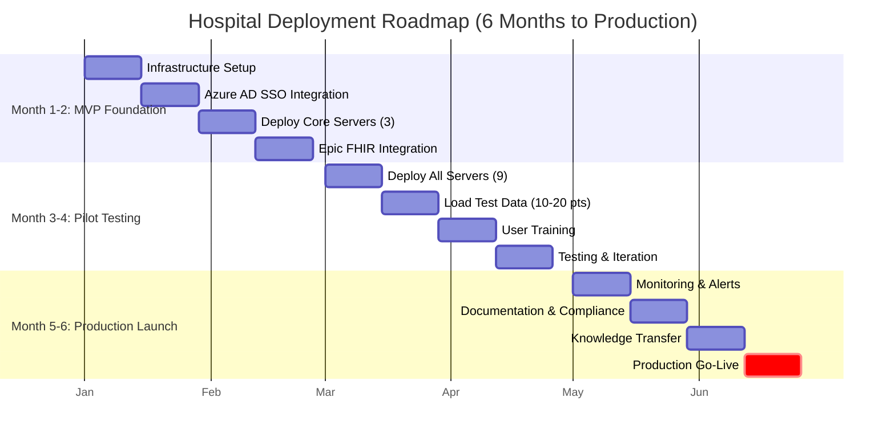

# 🛠️ Software Engineers

*You want to deploy, integrate, or scale this system*

## Quick Start - Local Development (5 Minutes)

```bash
# 1. Clone repository
git clone https://github.com/lynnlangit/precision-medicine-mcp.git
cd precision-medicine-mcp/tests/manual_testing/Solution-Testing

# 2. Install dependencies
./install_dependencies.sh  # Installs 10 MCP servers

# 3. Configure Claude Desktop
cp ../../../desktop-configs/claude_desktop_config.json \
   ~/Library/Application\ Support/Claude/claude_desktop_config.json

# 4. Verify (restart Claude Desktop first)
./verify_servers.sh
```

**Prerequisites:** Python 3.11+, Claude Desktop, 16GB RAM, 50GB disk

## Deployment Scenarios

| Environment | Setup | Resources | Use Case |
|-------------|-------|-----------|----------|
| **Local Development** | MacOS/Linux + Claude Desktop | 16GB RAM, 50GB disk | Research, testing, demos |
| **Cloud Research** | GCP Healthcare API + Vertex AI | Custom (scalable) | Production research, multi-patient |
| **HPC Clusters** | Nextflow workflows | 32GB+ RAM, 100GB+ disk | Large-scale spatial analysis with STAR |

## Infrastructure Resources

- **Cloud Setup:** [GCP Deployment Guide](../../../infrastructure/GET_STARTED.md) - Healthcare API, FHIR stores, Vertex AI
- **Config Files:** [Claude Desktop Config](../../../desktop-configs/claude_desktop_config.json)
- **Automated Testing:** [Verify Server Installation](../../../tests/manual_testing/Solution-Testing/MANUAL_TESTING_GUIDE.md)
- **STAR Installation:** [STAR Aligner Setup](../../../servers/mcp-spatialtools/INSTALL_STAR.md) (for spatial analysis)

## GCP Cloud Run Deployment


9 servers successfully deployed and tested on Google Cloud Platform (mcp-epic runs locally):

| Server | Status | Test Result | URL |
|--------|--------|-------------|-----|
| mcp-fgbio | ✅ Running | ✓ PASS | https://mcp-fgbio-ondu7mwjpa-uc.a.run.app |
| mcp-multiomics | ✅ Running | ✓ PASS | https://mcp-multiomics-ondu7mwjpa-uc.a.run.app |
| mcp-spatialtools | ✅ Running | ✓ PASS | https://mcp-spatialtools-ondu7mwjpa-uc.a.run.app |
| mcp-tcga | ✅ Running | ✓ PASS | https://mcp-tcga-ondu7mwjpa-uc.a.run.app |
| mcp-openimagedata | ✅ Running | ✓ PASS | https://mcp-openimagedata-ondu7mwjpa-uc.a.run.app |
| mcp-seqera | ✅ Running | ✓ PASS | https://mcp-seqera-ondu7mwjpa-uc.a.run.app |
| mcp-huggingface | ✅ Running | ✓ PASS | https://mcp-huggingface-ondu7mwjpa-uc.a.run.app |
| mcp-deepcell | ✅ Running | ✓ PASS | https://mcp-deepcell-ondu7mwjpa-uc.a.run.app |
| mcp-mockepic | ✅ Running | ✓ PASS | https://mcp-mockepic-ondu7mwjpa-uc.a.run.app |

**Test Results:** 9/9 deployed servers passed functional testing via Claude API (2025-12-30)
**Note:** mcp-epic (real Epic FHIR) runs locally only - not deployed to GCP

- **Deployment Guide:** [GCP Cloud Run Setup](../../deployment/DEPLOYMENT_STATUS.md)
- **Test Script:** [Automated Testing](../../../tests/integration/test_all_gcp_servers.py)

## Streamlit Chat UI (Visual Interface)

Web-based chat interface for testing MCP servers (deployed on Cloud Run):

🌐 **Live App:** https://streamlit-mcp-chat-ondu7mwjpa-uc.a.run.app

**Features:**
- Chat interface (Claude Desktop-like experience)
- Select which MCP servers to use
- Example prompts for common workflows
- Token usage tracking
- Real-time responses from deployed servers

**API Key Security:**
- **Local Development:** API key stored in `.env` file (gitignored, never committed)
- **Cloud Deployment:** API key stored as Cloud Run environment variable (encrypted at rest)
- **Never exposed:** API key not visible in logs, code, or browser
- **Best Practice:** Use separate API keys for dev/prod environments

**Quick Test:**
```bash
# Local testing
cd ui/streamlit-app
pip install -r requirements.txt
export ANTHROPIC_API_KEY=your_key_here
streamlit run app.py

# Access at http://localhost:8501
```

- **UI Documentation:** [Streamlit App Guide](../../../ui/streamlit-app/README.md)
- **Deployment Script:** [deploy.sh](../../../ui/streamlit-app/deploy.sh)

## Jupyter Notebook Client (Data Science Interface)

Interactive Jupyter notebook for reproducible bioinformatics analysis (deployed on Cloud Run):

🌐 **Live JupyterLab:** https://jupyter-mcp-notebook-305650208648.us-central1.run.app

**Features:**
- Interactive Python notebook environment
- MCPClient helper class for easy MCP server calls
- Pre-built workflows (spatial analysis, pathway enrichment, multi-omics)
- Token usage tracking and cost estimation
- Visualization examples (matplotlib, seaborn, plotly)
- Reproducible analysis - save and share workflows

**Quick Test:**
```bash
# Local testing
cd ui/jupyter-notebook
pip install -r requirements.txt
export ANTHROPIC_API_KEY=your_key_here
jupyter notebook mcp_client.ipynb

# Access at http://localhost:8888
```

**Example Usage:**
```python
from mcp_client import MCPClient

client = MCPClient()
result = client.call_servers(
    prompt="Analyze spatial transcriptomics for Patient-001",
    servers=["spatialtools"]
)
print(result["response"])
print(f"Cost: ${result['usage']['estimated_cost_usd']:.4f}")
```

- **Notebook Documentation:** [Jupyter Notebook Guide](../../../ui/jupyter-notebook/README.md)
- **Deployment Script:** [deploy.sh](../../../ui/jupyter-notebook/deploy.sh)

## Hospital Deployment Ready

The Precision Medicine MCP system is **production-ready for HIPAA-compliant hospital deployment**:

- ✅ **HIPAA-compliant infrastructure** with 10-year audit logs and encrypted secrets
- ✅ **Azure AD SSO integration** for seamless hospital authentication
- ✅ **Epic FHIR integration** with automatic de-identification (HIPAA Safe Harbor method)
- ✅ **Complete operations manual** and runbooks for IT teams
- ✅ **User guides** for both clinicians and bioinformaticians
- ✅ **Production deployment scripts** for authenticated Cloud Run services

**📖 Learn More:** [Hospital Deployment Guide →](../../../infrastructure/hospital-deployment/README.md)

**📖 Complete Documentation:**
- [Operations Manual](../../hospital-deployment/OPERATIONS_MANUAL.md) - System architecture and incident response
- [Admin Guide](../../hospital-deployment/ADMIN_GUIDE.md) - User management and security
- [User Guide](../../hospital-deployment/USER_GUIDE.md) - For clinicians and researchers
- [HIPAA Compliance](../../hospital-deployment/HIPAA_COMPLIANCE.md) - Compliance validation
- [Audit Log Guide](../../hospital-deployment/AUDIT_LOG_GUIDE.md) - 10-year retention procedures

## 6-Month Deployment Timeline



**Key Milestones:**
- 🎯 **Week 8**: Core servers deployed, SSO working, Epic connected
- 🎯 **Week 16**: All 10 servers operational (9 GCP + mcp-epic local), 5 users trained, security audit passed
- 🎯 **Week 24**: Production launch with 100 patients, full monitoring, IT handoff complete
