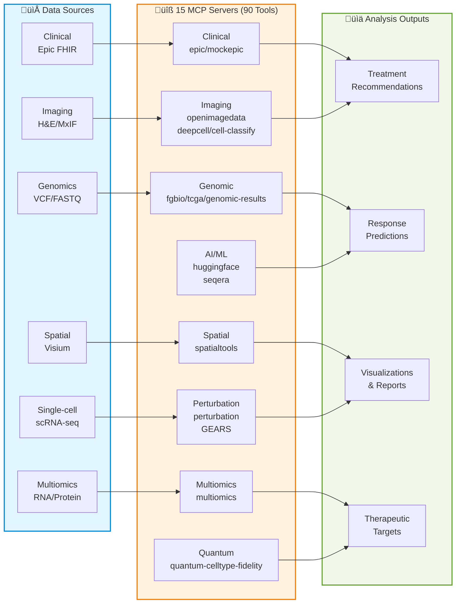
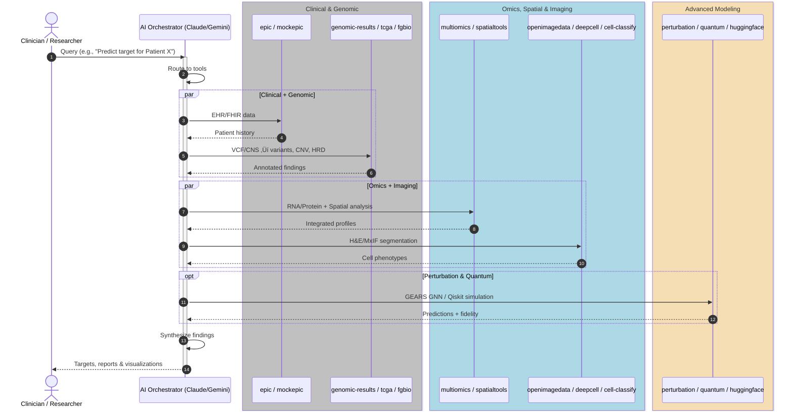

# 🏗️ Precision Medicine MCP Server Architectures

Architecture documentation for the Precision Medicine MCP system, covering both modality-specific workflows and cross-cutting system design.

---

## System Overview

```mermaid
graph LR
    subgraph Input["📁 Data Sources"]
        EHR[Clinical<br/>Epic FHIR]
        SEQ[Genomics<br/>VCF/FASTQ]
        OMICS[Multiomics<br/>RNA/Protein]
        SPATIAL[Spatial<br/>Visium]
        IMG[Imaging<br/>H&E/MxIF]
        SCRNA[Single-cell<br/>scRNA-seq]
    end

    subgraph MCP["üîß 15 MCP Servers (90 Tools)"]
        direction TB
        S1[Clinical<br/>epic/mockepic]
        S2[Genomic<br/>fgbio/tcga/genomic-results]
        S3[Spatial<br/>spatialtools]
        S4[Multiomics<br/>multiomics]
        S5[Imaging<br/>openimagedata<br/>deepcell/cell-classify]
        S6[AI/ML<br/>huggingface<br/>seqera]
        S7[Perturbation<br/>perturbation<br/>GEARS]
        S8[Quantum<br/>quantum-celltype-fidelity]
    end

    subgraph Output["üìä Analysis Outputs"]
        TREAT[Treatment<br/>Recommendations]
        PREDICT[Response<br/>Predictions]
        VIZ[Visualizations<br/>& Reports]
        INSIGHTS[Therapeutic<br/>Targets]
    end

    EHR --> S1
    SEQ --> S2
    OMICS --> S4
    SPATIAL --> S3
    IMG --> S5
    SCRNA --> S7

    S1 --> TREAT
    S2 --> PREDICT
    S3 --> VIZ
    S4 --> INSIGHTS
    S5 --> TREAT
    S6 --> PREDICT
    S7 --> VIZ
    S8 --> INSIGHTS

    style Input fill:#e1f5ff,stroke:#0288d1,stroke-width:2px
    style MCP fill:#fff3e0,stroke:#f57c00,stroke-width:2px
    style Output fill:#f1f8e9,stroke:#689f38,stroke-width:2px
```

---

## üìä Architecture by Analysis Modality

10 analysis modalities, 15 specialized servers, 90 tools:

| Modality | Servers | Tools | Status | Documentation |
|----------|---------|-------|--------|---------------|
| 🧬 **Clinical Data** | mcp-epic, mcp-mockepic | 7 (4+3) | ✅ Production/Mock | [clinical.md](clinical.md) |
| üß™ **Genomic Cohorts** | mcp-tcga | 5 | ‚ùå Mocked (GDC-ready) | [genomic.md](genomic.md) |
| 🧬 **Genomic Results** | mcp-genomic-results | 4 | ✅ Production (100%) | [genomic-results.md](genomic-results.md) |
| 🖼️ **Imaging** | mcp-openimagedata, mcp-deepcell, mcp-cell-classify | 11 (5+3+3) | ✅ Production (100%) | [imaging/README.md](imaging/README.md) |
| 🔬 **Multiomics** | mcp-multiomics | 10 | ✅ Production (95%) | [multiomics.md](multiomics.md) |
| üìç **Spatial Transcriptomics** | mcp-fgbio, mcp-spatialtools | 18 (4+14) | ‚úÖ Production (95%) | [spatial/README.md](spatial/README.md) |
| 🎯 **Perturbation Prediction** | mcp-perturbation | 8 | ✅ Production (GEARS) | [perturbation.md](perturbation.md) |
| ⚛️ **Quantum Cell Type Fidelity** | mcp-quantum-celltype-fidelity | 6 | ✅ Production (Qiskit + Bayesian UQ) | [quantum.md](quantum.md) |
| 🤖 **AI/ML Inference** | mcp-huggingface | 3 | ❌ Mocked (HF-ready) | [ai-ml.md](ai-ml.md) |
| ⚙️ **Workflow Orchestration** | mcp-seqera | 3 | ❌ Mocked (Seqera-ready) | [workflow.md](workflow.md) |

---

## 🧬 1. Clinical Data Retrieval

**EHR integration for patient clinical context**

**Servers:** mcp-epic (real FHIR, local only) • mcp-mockepic (synthetic, GCP deployed)

**Key Features:**
- FHIR R4 data retrieval (demographics, diagnoses, labs, medications)
- HIPAA Safe Harbor de-identification
- Clinical-spatial outcome linkage

**Workflow:** `Patient EHR ‚Üí FHIR API ‚Üí De-identification ‚Üí Clinical Data`

üìñ **[Detailed Architecture ‚Üí](clinical.md)**

---

## üß™ 2. Genomic Cohort Analysis

**TCGA cohort comparison for population-level genomic context**

**Server:** mcp-tcga (33 cancer types, 11,000+ samples)

**Key Features:**
- Gene expression comparison (z-scores, percentiles, p-values)
- Somatic mutation frequency queries
- Survival stratification (Kaplan-Meier, hazard ratios)

**Workflow:** `TCGA Database ‚Üí Statistical Comparison ‚Üí Survival Analysis ‚Üí Integration`

üìñ **[Detailed Architecture ‚Üí](genomic.md)**

---

## 🧬 3. Genomic Results

**Somatic variant and copy number parsing with clinical annotation for individual patients**

**Server:** mcp-genomic-results (4 tools, 100% real)

**Key Features:**
- VCF parsing with ClinVar/COSMIC annotation (TP53, PIK3CA, PTEN)
- CNVkit .cns segment classification (amplifications/deletions)
- Simplified HRD scoring (LOH+TAI+LST) with PARP inhibitor eligibility
- Comprehensive genomic report aggregating all findings with therapy recommendations

**Workflow:** `Seqera/sarek ‚Üí VCF + CNS ‚Üí Parse & Annotate ‚Üí HRD Score ‚Üí Genomic Report ‚Üí Patient Report`

üìñ **[Detailed Architecture ‚Üí](genomic-results.md)**

---

## 🖼️ 4. Imaging Analysis

**Histology and multiplexed immunofluorescence (MxIF) image processing**

**Servers:** mcp-openimagedata (100% real) • mcp-deepcell (100% real) • mcp-cell-classify (100% real)

**Key Workflows:**
- **H&E (Brightfield):** Morphology assessment, necrosis identification
- **MxIF (Fluorescence):** Cell segmentation (deepcell) ‚Üí quantification (deepcell) ‚Üí classification (cell-classify)

üìñ **[Detailed Architecture ‚Üí](imaging/README.md)**

---

## 🔬 5. Multiomics Integration

**PDX multi-omics data integration with preprocessing and therapeutic target prediction**

**Server:** mcp-multiomics (10 tools, 95% real)

**Key Features:**
- Preprocessing pipeline (batch correction, KNN imputation, QC visualization)
- Association testing (HAllA with chunking)
- Meta-analysis (Stouffer's method)
- Therapeutic targets (kinase/TF/drug prediction)

**Workflow:** `RNA/Protein/Phospho ‚Üí Validate ‚Üí Preprocess ‚Üí Integrate ‚Üí HAllA ‚Üí Meta-Analysis ‚Üí Upstream Regulators`

üìñ **[Detailed Architecture ‚Üí](multiomics.md)**

---

## üìç 6. Spatial Transcriptomics

**Spatial gene expression analysis with tissue context**

**Servers:** mcp-fgbio (reference genomes, FASTQ QC) • mcp-spatialtools (spatial analysis, DE, pathway enrichment)

**Key Features:**
- **Analysis Tools (10):** Spatial autocorrelation (Moran's I), differential expression, batch correction, pathway enrichment, cell type deconvolution
- **Visualization Tools (4):** Spatial heatmaps, gene expression heatmaps, region composition charts
- **Bridge Tool:** Integrates with mcp-multiomics

**Workflows:** CSV (current) • FASTQ with STAR alignment (implemented)

üìñ **[Detailed Architecture ‚Üí](spatial/README.md)**

---

## 🎯 7. Perturbation Prediction

**GEARS-based treatment response prediction using graph neural networks**

**Server:** mcp-perturbation (8 tools, production)

**Key Features:**
- **Model Training:** Setup and train GEARS GNN models on single-cell perturbation datasets
- **Response Prediction:** Predict cellular responses to genetic/pharmacological perturbations
- **Differential Expression:** Identify genes most affected by perturbations
- **Treatment Screening:** Test multiple therapies to find optimal responses

**Workflow:** `scRNA-seq Data ‚Üí Load Dataset ‚Üí Setup GEARS Model ‚Üí Train ‚Üí Predict Response ‚Üí Differential Expression ‚Üí Treatment Recommendations`

**Use Cases:**
- Predict T-cell response to checkpoint inhibitors (PD1/CTLA4)
- Screen PARP inhibitors vs platinum therapy for ovarian cancer
- Identify biomarkers of treatment sensitivity/resistance

**Technology:** GEARS (Graph-Enhanced Gene Activation Modeling) - Nature Biotechnology 2024

üìñ **[Detailed Architecture ‚Üí](perturbation.md)**

---

## 🤖 8. AI/ML Model Inference

**Genomic foundation model inference for cell type prediction and sequence embedding**

**Server:** mcp-huggingface (DNABERT-2, Geneformer, Nucleotide-Transformer)

**Key Features:**
- Cell type annotation from single-cell expression data
- DNA/RNA sequence embeddings (768-dimensional vectors)
- Variant effect scoring via embedding distance

**Workflow:** `Single-cell Data / DNA Sequences ‚Üí Load Model ‚Üí Generate Predictions ‚Üí Integration`

üìñ **[Detailed Architecture ‚Üí](ai-ml.md)**

---

## ⚛️ 9. Quantum Cell Type Fidelity

**Quantum computing for cell type validation and immune evasion detection**

**Server:** mcp-quantum-celltype-fidelity (6 tools, production)

**Key Features:**
- **Quantum Embeddings:** Parameterized quantum circuits (PQCs) with 8-10 qubits
- **Fidelity Computation:** Quantum state overlap F = |⟨ψ_a|ψ_b⟩|² for cell similarity
- **Bayesian Uncertainty Quantification:** 95%/90% confidence intervals for clinical decisions (Phase 1, Jan 2026)
- **Immune Evasion Detection:** Identify tumor cells evading immune surveillance
- **TLS Analysis:** Characterize tertiary lymphoid structures with quantum signatures
- **Perturbation Prediction:** Simulate drug effects on quantum cell states

**Workflow:** `Spatial Data ‚Üí Feature Encoding ‚Üí Quantum Circuits ‚Üí Contrastive Training ‚Üí Fidelity Analysis ‚Üí Immune Evasion Detection`

**Use Cases:**
- Detect tumor cells mimicking immune cells (low fidelity to canonical types)
- Characterize TLS immune organization via quantum coherence
- Validate GEARS perturbation predictions with quantum state changes
- Spatial mapping of cell type fidelity across tissue

**Technology:** Qiskit 1.0+ with parameter-shift rule for exact gradients

**Integration:** Works with mcp-perturbation for dual quantum+GEARS validation

üìñ **[Detailed Architecture ‚Üí](quantum.md)**

---

## ⚙️ 10. Workflow Orchestration

**Nextflow pipeline execution and monitoring via Seqera Platform**

**Server:** mcp-seqera (90+ nf-core workflows)

**Key Features:**
- nf-core pipeline submission (rnaseq, sarek, spatial, etc.)
- Multi-cloud execution (AWS, Azure, GCP, local HPC)
- Real-time progress monitoring and resource tracking

**Workflow:** `Select Pipeline ‚Üí Configure ‚Üí Choose Compute ‚Üí Submit ‚Üí Monitor ‚Üí Retrieve Results`

üìñ **[Detailed Architecture ‚Üí](workflow.md)**

---

## üè• End-to-End Example: PatientOne

**Complete precision medicine workflow combining all 15 MCP servers**

**Use Case:** Stage IV High-Grade Serous Ovarian Cancer (HGSOC), platinum-resistant
**Patient:** PAT001-OVC-2025 (synthetic test case)
**Data Modalities:** Clinical (FHIR) • Genomic (VCF) • Multiomics (RNA/Protein/Phospho) • Spatial (Visium) • Imaging (H&E, MxIF) • Perturbation (scRNA-seq)

**Tests:**
- 🧬 TEST_1: Clinical data + genomic analysis (mcp-epic, mcp-genomic-results, mcp-fgbio, mcp-tcga)
- 🔬 TEST_2: Multiomics integration (mcp-multiomics)
- üìç TEST_3: Spatial transcriptomics (mcp-spatialtools)
- 🖼️ TEST_4: Imaging analysis (mcp-openimagedata, mcp-deepcell)
- 🎯 TEST_5: Perturbation prediction (mcp-perturbation)
- ⚛️ TEST_6: Quantum cell type fidelity (mcp-quantum-celltype-fidelity)
- 🔄 TEST_7: Complete end-to-end workflow

üìñ **[PatientOne Workflow ‚Üí](../testing/patient-one/README.md)**
üìñ **[PatientOne Architecture ‚Üí](../testing/patient-one/overview.md)**

___

```mermaid
sequenceDiagram
    autonumber
    actor User as Clinician / Researcher
    participant AI as AI Orchestrator (Claude/Gemini)
    box Silver Clinical & Genomic
        participant Clin as epic / mockepic
        participant Gen as genomic-results / tcga / fgbio
    end
    box LightBlue Omics, Spatial & Imaging
        participant Omics as multiomics / spatialtools
        participant Img as openimagedata / deepcell / cell-classify
    end
    box Wheat Advanced Modeling
        participant Adv as perturbation / quantum / huggingface
    end

    User->>AI: Query (e.g., "Predict target for Patient X")
    activate AI
    AI->>AI: Route to tools

    par Clinical + Genomic
        AI->>Clin: EHR/FHIR data
        Clin-->>AI: Patient history
        AI->>Gen: VCF/CNS ‚Üí variants, CNV, HRD
        Gen-->>AI: Annotated findings
    end

    par Omics + Imaging
        AI->>Omics: RNA/Protein + Spatial analysis
        Omics-->>AI: Integrated profiles
        AI->>Img: H&E/MxIF segmentation
        Img-->>AI: Cell phenotypes
    end

    opt Perturbation & Quantum
        AI->>Adv: GEARS GNN / Qiskit simulation
        Adv-->>AI: Predictions + fidelity
    end

    AI->>AI: Synthesize findings
    AI-->>User: Targets, reports & visualizations
    deactivate AI
```

---

**Organization Principle:**
- `docs/architecture/` = High-level design & workflows by modality + cross-cutting architecture
- `servers/` = Detailed tool specifications & implementation
- `docs/` = Operational guides & deployment
- `tests/` = End-to-end use cases & validation
