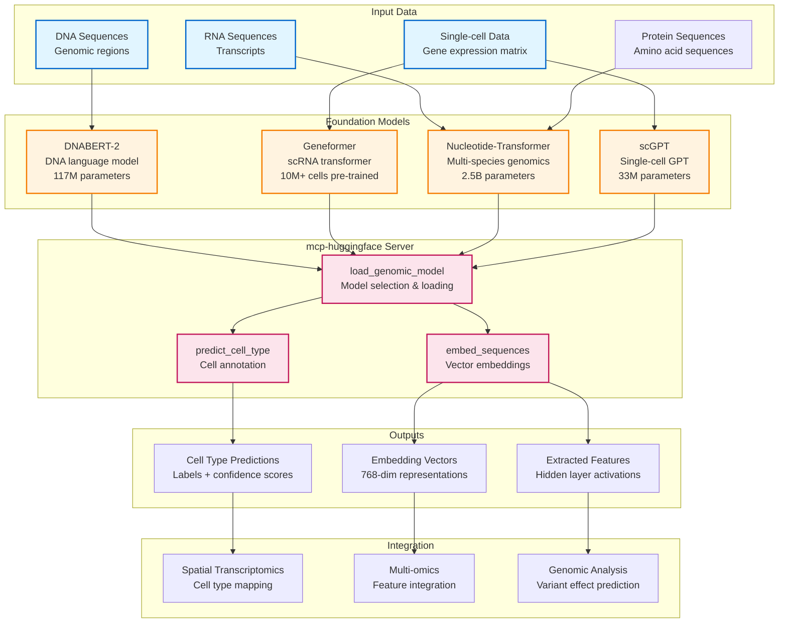

# AI/ML Model Inference Architecture

**Status:** ❌ Mocked (Hugging Face API integration ready)
**Last Updated:** 2026-01-10

---

## Executive Summary

AI/ML model inference leverages pre-trained foundation models from Hugging Face for genomic analysis tasks. The **mcp-huggingface** server provides access to genomic language models (DNABERT-2, Geneformer, Nucleotide-Transformer) for cell type prediction, sequence embedding, and feature extraction from DNA, RNA, protein, and single-cell transcriptomics data.

**Key Capabilities:**
- Cell type annotation from single-cell RNA-seq
- DNA/RNA sequence embeddings (768-dimensional vectors)
- Genomic language model inference
- Foundation model feature extraction

---

## System Overview



---

## Server Architecture

### mcp-huggingface (Foundation Model Inference)

**Status:** ❌ Mocked (Hugging Face Hub integration ready)
**Deployment:** GCP Cloud Run (SSE transport)
**Tools:** 3 core tools

| Tool | Purpose | Inputs | Outputs |
|------|---------|--------|---------|
| `load_genomic_model` | Model selection | Model name, data type | Model metadata, status |
| `predict_cell_type` | Cell annotation | scRNA expression matrix | Cell type labels, confidence scores |
| `embed_sequences` | Feature extraction | DNA/RNA sequences | 768-dim embedding vectors |

**Resources:**
- `huggingface://models/dnabert` - DNABERT-2 model metadata
- `huggingface://models/geneformer` - Geneformer model metadata

**DRY_RUN Mode:** Default true - returns mock predictions without model loading

**For detailed specifications:** [mcp-huggingface README](../../../../servers/README.md#mcp-huggingface)

---

## Supported Foundation Models

### 1. DNABERT-2 (DNA Language Model)

**Architecture:** BERT-based transformer (117M parameters)
**Pre-training:** Multi-species genomes (human, mouse, fly, worm, arabidopsis)
**Input:** DNA sequences up to 512 bp
**Output:** 768-dimensional embeddings, k-mer predictions

**Use Cases:**
- Promoter/enhancer prediction
- Regulatory element identification
- Variant effect scoring
- Sequence similarity search

**Example:**
```python
# Embed a promoter region
sequence = "ATGCGATCGATCGATCGATCG..."
embedding = embed_sequences(sequences=[sequence], model="DNABERT-2")
# Returns: [768-dim vector representing sequence features]
```

---

### 2. Geneformer (Single-cell Transformer)

**Architecture:** GPT-based transformer (10M+ cells pre-trained)
**Pre-training:** Human single-cell RNA-seq datasets (29M cells)
**Input:** Gene expression vector (top 2,048 genes by expression)
**Output:** Cell type predictions, cell state embeddings

**Use Cases:**
- Cell type annotation
- Cell state classification (e.g., cycling, quiescent)
- Trajectory inference support
- Disease cell identification

**Example:**
```python
# Predict cell types from scRNA-seq
expression_matrix = [[5.2, 0.3, 8.1, ...], ...]  # Cells × genes
predictions = predict_cell_type(expression_data=expression_matrix, model="geneformer")
# Returns: ["T cell", "B cell", "Fibroblast", ...]
```

---

### 3. Nucleotide-Transformer (Multi-species Genomics)

**Architecture:** Transformer (2.5B parameters)
**Pre-training:** 3,202 human genomes + 850 diverse species
**Input:** DNA/RNA sequences up to 6,000 bp
**Output:** Nucleotide-level embeddings, genomic features

**Use Cases:**
- Long-range regulatory interactions
- Splice site prediction
- Non-coding variant interpretation
- Cross-species conservation analysis

**Example:**
```python
# Analyze long regulatory region
sequence = "ATGC..." * 500  # 2000 bp enhancer
embedding = embed_sequences(sequences=[sequence], model="nucleotide-transformer")
# Returns: [2000 × 768 tensor for position-specific features]
```

---

### 4. scGPT / scBERT (Alternative scRNA Models)

**scGPT:** 33M parameter generative model for single-cell data
**scBERT:** BERT-based model with cell type classification head

**Use Case:** Alternative cell type predictors with different pre-training datasets

---

## Key Workflows

### Workflow 1: Cell Type Annotation

```
1. Load single-cell gene expression matrix (cells × genes)
2. Select foundation model (Geneformer, scGPT, or scBERT)
3. Run cell type prediction
4. Get cell labels + confidence scores
5. Validate against marker genes
```

**Use Case:** Annotate cell types in spatial transcriptomics or scRNA-seq

**Example Output:**
```json
{
  "cell_id": "AAACCTGAGAAACCAT",
  "predicted_type": "CD8+ T cell",
  "confidence": 0.92,
  "top_3_types": [
    {"type": "CD8+ T cell", "score": 0.92},
    {"type": "CD4+ T cell", "score": 0.06},
    {"type": "NK cell", "score": 0.02}
  ]
}
```

---

### Workflow 2: Sequence Embedding

```
1. Extract DNA/RNA sequences of interest (promoters, enhancers, exons)
2. Select appropriate model (DNABERT-2 or Nucleotide-Transformer)
3. Generate embeddings (768-dim vectors)
4. Use vectors for downstream tasks (clustering, classification)
```

**Use Case:** Feature extraction for variant effect prediction or regulatory analysis

**Example Output:**
```python
embedding_vector = [0.23, -0.15, 0.88, ..., 0.42]  # 768 dimensions
# Use for: similarity search, classification, clustering
```

---

### Workflow 3: Variant Effect Scoring

```
1. Extract reference and alternate allele sequences
2. Generate embeddings for both sequences
3. Compute embedding distance (cosine similarity)
4. Large distance → likely functional impact
```

**Use Case:** Prioritize non-coding variants for functional validation

---

## Integration with Other Modalities

### With Spatial Transcriptomics (mcp-spatialtools)

**Integration Point:** Cell type deconvolution

**Workflow:**
1. Run cell type deconvolution on spatial data (signature-based)
2. Validate predicted cell types using Geneformer on pseudo-bulk expression
3. Map cell types to spatial coordinates
4. Assess cell type spatial organization

**Example:** "Does spatial deconvolution predict correct cell types?"

**Validation:** Compare signature-based predictions (mcp-spatialtools) to foundation model predictions (mcp-huggingface) for consistency.

---

### With Multi-omics (mcp-multiomics)

**Integration Point:** Feature extraction for multi-modal integration

**Workflow:**
1. Generate sequence embeddings for genomic regions
2. Extract protein sequence embeddings
3. Combine with RNA/protein expression features
4. Integrate into unified feature space for association testing

**Example:** "Do DNA sequence features predict protein expression?"

**Use Case:** Multi-modal feature fusion for improved prediction accuracy

---

### With Genomic Analysis (mcp-fgbio)

**Integration Point:** Variant annotation enhancement

**Workflow:**
1. Extract variant context sequences (reference + alternate)
2. Generate DNABERT-2 embeddings
3. Predict functional impact based on embedding distance
4. Prioritize variants for experimental validation

**Example:** "Which non-coding variants likely affect gene regulation?"

**Output:** Ranked list of variants by predicted functional impact score

---

## Data Requirements

### Input Data Formats

**Single-cell Expression Matrix:**
```json
{
  "cells": ["AAACCTGAGAAACCAT", "AAACCTGAGAAACCGC", ...],
  "genes": ["CD3D", "CD8A", "GZMA", ...],
  "expression": [
    [5.2, 0.3, 8.1, ...],  // Cell 1
    [0.1, 4.5, 0.2, ...]   // Cell 2
  ]
}
```

**DNA/RNA Sequences:**
```json
{
  "sequences": [
    {
      "id": "promoter_TP53",
      "sequence": "ATGCGATCGATCG...",
      "type": "DNA"
    }
  ]
}
```

---

### Output Data Formats

**Cell Type Predictions:**
```json
{
  "predictions": [
    {
      "cell_id": "AAACCTGAGAAACCAT",
      "cell_type": "CD8+ T cell",
      "confidence": 0.92,
      "embedding": [0.23, -0.15, ..., 0.42]
    }
  ],
  "model": "geneformer",
  "timestamp": "2026-01-10T10:30:00Z"
}
```

**Sequence Embeddings:**
```json
{
  "embeddings": [
    {
      "sequence_id": "promoter_TP53",
      "embedding": [0.12, 0.45, ..., -0.33],
      "dimensions": 768
    }
  ],
  "model": "DNABERT-2"
}
```

---

## Performance Characteristics

### Model Loading

| Model | Size | Load Time | Memory |
|-------|------|-----------|--------|
| DNABERT-2 | 440 MB | ~5 sec | 2 GB |
| Geneformer | 1.2 GB | ~10 sec | 4 GB |
| Nucleotide-Transformer | 9.5 GB | ~30 sec | 12 GB |
| scGPT | 130 MB | ~3 sec | 1.5 GB |

**Note:** In DRY_RUN mode, no actual models are loaded (instant responses with mock data).

---

### Inference Speed

| Task | Batch Size | Time/Batch | Throughput |
|------|------------|------------|------------|
| Cell type prediction | 100 cells | ~2 sec | 50 cells/sec |
| DNA embedding | 50 sequences | ~1 sec | 50 seq/sec |
| Long sequence embedding | 10 sequences (2kb) | ~5 sec | 2 seq/sec |

**Optimization:** Batch processing recommended for large datasets.

---

## PatientOne Integration

### Test Case

**Patient:** PAT001-OVC-2025 (Stage IV HGSOC)

**Use Case 1: Spatial Cell Type Validation**
- Run cell type deconvolution on Visium data (mcp-spatialtools)
- Validate cell type assignments using Geneformer predictions
- Confirm presence of CD8+ T cells at tumor periphery (immune excluded from core)

**Use Case 2: Variant Effect Scoring**
- Extract sequences around PIK3CA H1047R mutation
- Generate DNABERT-2 embeddings for reference and variant alleles
- Compute functional impact score

**Use Case 3: Single-cell Annotation** (future)
- If scRNA-seq data available, predict cell types using Geneformer
- Map cell states (cycling, apoptotic, hypoxic)
- Integrate with spatial data for cell type localization

---

## 📖 Detailed Documentation

### Server Documentation
- **mcp-huggingface:** [/servers/mcp-huggingface/README.md](../../../../servers/README.md#mcp-huggingface)
  - Tool specifications with examples
  - Model selection guide
  - Hugging Face API integration
  - DRY_RUN mode configuration

### Deployment & Operations
- **GCP Deployment:** [/docs/deployment/DEPLOYMENT_STATUS.md](../../archive/deployment/DEPLOYMENT_STATUS.md)
- **Server Status:** [Server Implementation Status](../../../shared/server-registry.md)

### External Resources
- **Hugging Face Models:** [https://huggingface.co/models](https://huggingface.co/models)
- **DNABERT-2:** [Paper](https://arxiv.org/abs/2306.15006)
- **Geneformer:** [Paper](https://www.nature.com/articles/s41586-023-06139-9)

---

## Related Workflows

- [Spatial Transcriptomics](../spatial-transcriptomics/README.md) - Cell type deconvolution validation
- [Multi-omics Integration](../multiomics/README.md) - Multi-modal feature fusion
- [Genomic Analysis](../genomic/README.md) - Variant effect prediction
- [PatientOne Workflow](../../test-docs/patient-one-scenario/README.md) - Complete precision medicine workflow

---

**See also:** [Main Architecture](../README.md) | [Hugging Face Hub](https://huggingface.co/)
