# Clinical Data Retrieval Architecture

**Status:** ✅ Production Ready (mcp-epic: 100% real) | 🎭 Mock by Design (mcp-mockepic)
**Last Updated:** 2026-01-10

---

## Executive Summary

Clinical data retrieval from Electronic Health Records (EHR) provides essential patient context for precision medicine analysis. The **mcp-epic** server integrates with real Epic FHIR APIs with built-in HIPAA de-identification, while **mcp-mockepic** provides synthetic patient data for development and demonstrations.

**Key Capabilities:**
- Real-time FHIR data retrieval (demographics, diagnoses, labs, medications)
- Automatic HIPAA Safe Harbor de-identification
- Clinical-spatial data linkage for outcome correlation
- Synthetic data generation for development workflows

---

## System Overview

```mermaid
graph TB
    subgraph "Data Sources"
        EPIC[Epic EHR<br/>Real Patient Data<br/>FHIR R4 API]
        SYNTH[Synthetic EHR<br/>Synthea-based<br/>Mock Data]
    end

    subgraph "MCP Servers"
        REALEPIC[mcp-epic<br/>Real FHIR Integration<br/>🏥 Local Only]
        MOCKEPIC[mcp-mockepic<br/>Synthetic FHIR<br/>🌐 GCP Deployed]
    end

    subgraph "De-identification Layer"
        DEIDENT[HIPAA Safe Harbor<br/>Remove 18 identifiers<br/>Date truncation, ID hashing]
    end

    subgraph "Clinical Data Output"
        DEMO[Demographics<br/>Age, gender, birth year]
        COND[Conditions<br/>ICD-10 diagnoses, staging]
        OBS[Observations<br/>Labs, vitals, biomarkers]
        MEDS[Medications<br/>Drugs, dosages, status]
    end

    subgraph "Integration"
        SPATIAL[Spatial Transcriptomics<br/>mcp-spatialtools]
        MULTI[Multi-omics<br/>mcp-multiomics]
        TCGA[Genomic Cohorts<br/>mcp-mocktcga]
    end

    EPIC --> REALEPIC
    SYNTH --> MOCKEPIC

    REALEPIC --> DEIDENT
    DEIDENT --> DEMO
    DEIDENT --> COND
    DEIDENT --> OBS
    DEIDENT --> MEDS

    MOCKEPIC --> DEMO
    MOCKEPIC --> COND
    MOCKEPIC --> OBS
    MOCKEPIC --> MEDS

    DEMO --> SPATIAL
    COND --> SPATIAL
    OBS --> MULTI
    MEDS --> MULTI

    COND --> TCGA
    OBS --> TCGA

    style EPIC fill:#e1f5ff,stroke:#0066cc,stroke-width:2px
    style SYNTH fill:#f3e5f5,stroke:#7b1fa2,stroke-width:2px
    style REALEPIC fill:#d4edda,stroke:#28a745,stroke-width:3px
    style MOCKEPIC fill:#e2e3e5,stroke:#6c757d,stroke-width:2px
    style DEIDENT fill:#fff3e0,stroke:#f57c00,stroke-width:2px
    style DEMO fill:#f1f8e9,stroke:#689f38,stroke-width:2px
    style COND fill:#f1f8e9,stroke:#689f38,stroke-width:2px
    style OBS fill:#f1f8e9,stroke:#689f38,stroke-width:2px
    style MEDS fill:#f1f8e9,stroke:#689f38,stroke-width:2px
```



---

## Server Architecture

### mcp-epic (Real FHIR Integration)

**Status:** ✅ 100% Production Ready
**Deployment:** Local only (STDIO transport) for HIPAA compliance
**Tools:** 4 core tools

| Tool | Purpose | Data Returned |
|------|---------|---------------|
| `get_patient_demographics` | Patient identity | Age, gender, birth year (de-identified) |
| `get_patient_conditions` | Diagnoses | ICD-10 codes, clinical status, cancer staging |
| `get_patient_observations` | Lab results | LOINC-coded labs, vital signs, reference ranges |
| `get_patient_medications` | Drug therapy | Drug names, dosages, status, dates |

**Authentication:** OAuth 2.0 client credentials flow with token caching
**Rate Limiting:** 1000 requests/hour with exponential backoff
**De-identification:** HIPAA Safe Harbor - removes all 18 identifiers

**For detailed specifications:** [mcp-epic README](../../../../servers/README.md#mcp-epic)

---

### mcp-mockepic (Synthetic FHIR)

**Status:** 🎭 Mock by Design
**Deployment:** GCP Cloud Run (public SSE endpoint)
**Tools:** 3 core tools

| Tool | Purpose | Data Returned |
|------|---------|---------------|
| `query_patient_records` | Patient lookup | Demographics, diagnoses, optional labs/meds |
| `link_spatial_to_clinical` | Outcome correlation | PFS, treatment response, toxicity grades |
| `search_diagnoses` | ICD-10 search | Diagnosis codes by keyword |

**Data Source:** Synthea-generated synthetic patients (10,000 in database)
**Use Case:** Development, testing, public demos (no credentials needed)
**Resource:** `ehr://patients/mock` - Patient database metadata

**For detailed specifications:** [mcp-mockepic README](../../../../servers/README.md#mcp-mockepic)

---

## Why Two Epic Servers?

| Aspect | mcp-epic (Real) | mcp-mockepic (Synthetic) |
|--------|-----------------|--------------------------|
| **Data Source** | Epic FHIR API | Synthea mock data |
| **Deployment** | Local only (HIPAA) | GCP Cloud Run (public) |
| **Authentication** | OAuth 2.0 required | None |
| **De-identification** | HIPAA Safe Harbor | Synthetic by design |
| **Use Case** | Production hospital | Development, demos, testing |
| **Credentials** | Epic + GCP Healthcare API | None needed |
| **Transport** | STDIO | SSE |

**Key Decision:** Use mcp-epic for real patient data in hospital settings; use mcp-mockepic for development, workflow testing, and public demonstrations.

---

## Key Workflows

### Workflow 1: Clinical Context Retrieval

```
1. Query patient demographics (age, gender, ethnicity)
2. Retrieve cancer diagnoses (ICD-10, staging, status)
3. Fetch relevant biomarkers (CA-125, BRCA status)
4. Get treatment history (chemotherapy, targeted therapy)
```

**Use Case:** Provide clinical context for spatial transcriptomics findings

---

### Workflow 2: Clinical-Spatial Linkage

```
1. Retrieve spatial sample ID from mcp-spatialtools
2. Link to patient clinical record via mcp-mockepic
3. Correlate spatial heterogeneity with treatment response
4. Assess progression-free survival (PFS) correlation
```

**Use Case:** Connect tumor spatial patterns to clinical outcomes

---

### Workflow 3: Cohort Comparison (TCGA Integration)

```
1. Get patient cancer diagnosis from mcp-epic
2. Query matching TCGA cohort via mcp-mocktcga
3. Compare patient biomarkers to population statistics
4. Stratify survival based on expression profiles
```

**Use Case:** Contextualize individual patient against large genomic cohorts

---

## Data Requirements

### Input Data (mcp-epic)

**Required:**
- Epic FHIR API credentials (client ID, client secret)
- Google Cloud Healthcare API access
- Patient MRN or FHIR ID

**Configuration:**
```bash
export GCP_PROJECT_ID="precision-medicine-poc"
export GCP_REGION="us-central1"
export HEALTHCARE_DATASET="precision-medicine-dataset"
export FHIR_STORE="identified-fhir-store"
export GOOGLE_APPLICATION_CREDENTIALS="path/to/credentials.json"
export DEIDENTIFY_ENABLED="true"
```

---

### Output Data Formats

**FHIR R4 Resources:**
- `Patient` - Demographics (de-identified)
- `Condition` - ICD-10 diagnoses with clinical status
- `Observation` - LOINC-coded lab results
- `MedicationStatement` - Drug therapy records

**De-identified Example:**
```json
{
  "patient_id": "hash_abc123",
  "age": 54,
  "birth_year": 1971,
  "gender": "female",
  "conditions": [
    {
      "code": "C56.9",
      "display": "Malignant neoplasm of ovary",
      "stage": "IV",
      "status": "active"
    }
  ],
  "observations": [
    {
      "code": "27935-5",
      "display": "CA-125",
      "value": 842,
      "unit": "U/mL",
      "reference_range": "0-35"
    }
  ]
}
```

---

## Integration with Other Modalities

### With Spatial Transcriptomics (mcp-spatialtools)

**Integration Point:** Clinical outcomes → Spatial patterns

**Workflow:**
1. Identify spatial heterogeneity in tumor (high vs low proliferation zones)
2. Link to clinical treatment response via mcp-mockepic
3. Correlate spatial metrics with PFS or toxicity grades

**Example:** "Does immune exclusion in spatial data predict poor response to immunotherapy?"

---

### With Multi-omics (mcp-multiomics)

**Integration Point:** Biomarkers → Molecular profiles

**Workflow:**
1. Retrieve patient CA-125 levels from mcp-epic
2. Compare to RNA/protein expression of MUC16 (CA-125 gene)
3. Validate biomarker-expression concordance

**Example:** "Do elevated CA-125 levels correlate with MUC16 overexpression in multi-omics data?"

---

### With Genomic Cohorts (mcp-mocktcga)

**Integration Point:** Diagnosis → Cohort selection

**Workflow:**
1. Get patient diagnosis (e.g., "Ovarian Serous Cystadenocarcinoma")
2. Query TCGA-OV cohort via mcp-mocktcga
3. Compare patient mutation profile to cohort frequencies
4. Stratify survival based on mutation burden

**Example:** "How does this patient's TP53/BRCA1 profile compare to TCGA-OV cohort survival?"

---

## PatientOne Integration (TEST_1)

### Test Case

**Patient:** PAT001-OVC-2025 (Stage IV HGSOC, platinum-resistant)

**Data Retrieved:**
- Demographics: Female, 54 years old, birth year 1971
- Diagnosis: Ovarian cancer (C56.9), Stage IV, active
- Biomarkers: CA-125 842 U/mL (elevated), BRCA1 mutation detected
- Medications: Carboplatin, Paclitaxel, Bevacizumab (active treatment)

**Expected Integration:**
- Spatial data shows immune exclusion (CD8+ low in tumor core)
- Multi-omics reveals PI3K/AKT pathway activation
- TCGA comparison: Patient in high-risk group based on mutation profile

**Test File:** [TEST_1_CLINICAL](../../testing/patient-one/test-prompts/DRY_RUN/test-1-clinical-genomic.md)

---

## 📖 Detailed Documentation

### Server Documentation
- **mcp-epic:** [/servers/mcp-epic/README.md](../../../../servers/README.md#mcp-epic)
  - OAuth 2.0 setup and credentials
  - De-identification implementation details
  - Tool specifications with examples
  - FHIR resource mapping

- **mcp-mockepic:** [/servers/mcp-mockepic/README.md](../../../../servers/README.md#mcp-mockepic)
  - Synthetic data generation methodology
  - Tool specifications with examples
  - Resource endpoints
  - DRY_RUN mode configuration

### Deployment & Operations
- **Hospital Deployment:** [/docs/for-hospitals/](../../../for-hospitals)
- **HIPAA Compliance:** [/docs/for-hospitals/compliance/hipaa.md](../../../for-hospitals/compliance/hipaa.md)
- **GCP Healthcare API Setup:** [/docs/deployment/GET_STARTED.md](../../deployment/GET_STARTED.md)

---

## Related Workflows

- [Multi-omics Integration](../rna/multiomics.md) - Biomarker-expression correlation
- [Spatial Transcriptomics](../spatial/README.md) - Clinical-spatial outcome linkage
- [Genomic Cohorts](../dna/genomic-cohorts.md) - Patient-cohort comparison
- [PatientOne Workflow](../../testing/patient-one/README.md) - Complete precision medicine workflow

---

**See also:** [Main Architecture](../README.md) | [Server Implementation Status](../../shared/server-registry.md)
