# Genomic Results Architecture

**Status:** Production (100% real)
**Last Updated:** 2026-02-11

---

## System Overview

```mermaid
graph TB
    subgraph Input["📁 Input Files"]
        VCF[Somatic VCF<br/>Mutect2 variants<br/>SNVs/indels]
        CNS[CNVkit .cns<br/>Copy number segments<br/>log2 ratios]
    end

    subgraph GR["🧬 mcp-genomic-results<br/>(4 tools, 100% real)"]
        Parse[Parse Somatic<br/>Variants]
        CNV[Parse CNV<br/>Calls]
        HRD[Calculate HRD<br/>Score]
        Report[Generate Genomic<br/>Report]
    end

    subgraph Annot["📚 Annotation Database"]
        ClinVar[ClinVar/COSMIC<br/>Variant lookups]
        CN[Copy Number<br/>Gene annotations]
        Panel[OVC Gene Panel<br/>18 genes]
    end

    subgraph Output["📊 Outputs"]
        Variants[Annotated Variants<br/>Pathogenicity, therapies]
        CNVOut[CNV Calls<br/>Amp/del classification]
        HRDOut[HRD Score<br/>LOH+TAI+LST, PARP eligibility]
        ReportOut[Comprehensive Report<br/>All findings + recommendations]
    end

    VCF --> Parse
    VCF --> HRD
    CNS --> CNV
    CNS --> HRD

    Parse --> Variants
    CNV --> CNVOut
    HRD --> HRDOut

    Parse --> Report
    CNV --> Report
    HRD --> Report
    Report --> ReportOut

    ClinVar --> Parse
    CN --> CNV
    Panel --> HRD

    classDef inputStyle fill:#e1f5ff,stroke:#0288d1,stroke-width:2px
    classDef grStyle fill:#fff3e0,stroke:#f57c00,stroke-width:2px
    classDef annotStyle fill:#f3e5f5,stroke:#7b1fa2,stroke-width:2px
    classDef outputStyle fill:#f1f8e9,stroke:#689f38,stroke-width:2px

    class Input inputStyle
    class GR grStyle
    class Annot annotStyle
    class Output outputStyle
```

---

## Quick Navigation

### Server
- **[mcp-genomic-results README](../../../../servers/mcp-genomic-results/README.md)** - Server details, usage examples, environment variables

### Reference
- **[PatientOne Workflow](../../testing/patient-one/README.md)** - End-to-end precision medicine workflow

---

## What This Is

Genomic results parsing and clinical annotation component for the Precision Medicine MCP system. Takes variant calling outputs (VCF from Mutect2, CNS from CNVkit) and produces clinically annotated reports with therapy recommendations, focused on high-grade serous ovarian carcinoma (HGSOC).

---

## Tools (4)

### mcp-genomic-results
**Status:** ✅ 100% Real (pure Python, no C dependencies)

**Tools:**
- ✅ `parse_somatic_variants` — Parse VCF files, filter by allele frequency, annotate with ClinVar/COSMIC IDs, classify as somatic mutations, copy number events, or wild-type
- ✅ `parse_cnv_calls` — Parse CNVkit .cns segment files, classify segments as amplifications or deletions by log2 ratio thresholds, annotate clinically relevant genes
- ✅ `calculate_hr_deficiency_score` — Simplified HRD scoring from three genomic scar signatures (LOH + TAI + LST) combined with BRCA mutation status; score >= 42 suggests PARP inhibitor eligibility
- ✅ `generate_genomic_report` — Aggregated report calling all three tools above, combining somatic variants, CNV calls, and HRD analysis into a single structured output with therapy recommendations

---

## Annotation Database

The `annotations.py` module provides hardcoded lookup tables for HGSOC-specific clinical annotations. These are intentionally simplified for demonstration and are **not** a substitute for real annotation pipelines (OncoKB, CIViC, ACMG).

### Somatic Variant Annotations (ClinVar/COSMIC)

| Gene | Variant | ClinVar | Classification | Therapies |
|------|---------|---------|----------------|-----------|
| TP53 | R175H | VCV000012347 | Pathogenic | APR-246 (investigational) |
| PIK3CA | E545K | VCV000013652 | Pathogenic | Alpelisib (off-label), Copanlisib |
| PTEN | LOH | VCV000233105 | Pathogenic | AKT inhibitors (capivasertib) |

### Copy Number Annotations

| Gene | Cytoband | Alteration | Significance | Therapies |
|------|----------|------------|--------------|-----------|
| MYC | 8q24.21 | Amplification | Aggressive disease | BET inhibitors (JQ1) |
| CCNE1 | 19q12 | Amplification | Platinum resistance | CDK2/Wee1 inhibitors |
| AKT2 | 19q13.2 | Amplification | PI3K/AKT activation | Capivasertib |
| RB1 | 13q14.2 | Deletion | Cell cycle deregulation | — |
| CDKN2A | 9p21.3 | Deletion | p16 loss | CDK4/6 inhibitors |

### Gene Panels

- **HRD_GENES** (13): BRCA1, BRCA2, PALB2, RAD51C, RAD51D, ATM, ATR, CHEK1, CHEK2, BARD1, BRIP1, FANCA, FANCD2
- **OVC_GENE_PANEL** (18): TP53, BRCA1, BRCA2, PIK3CA, PTEN, KRAS, BRAF, ARID1A, MYC, CCNE1, AKT2, RB1, CDKN2A, NF1, CDK12, EMSY, RAD51C, RAD51D

---

## PatientOne Integration

```mermaid
graph LR
    subgraph Upstream["⚙️ Upstream"]
        Seqera[External Seqera MCP<br/>nf-core/sarek]
    end

    subgraph This["🧬 This Server"]
        GR[mcp-genomic-results<br/>VCF + CNS parsing<br/>Clinical annotation]
    end

    subgraph Downstream["📋 Downstream"]
        PR[mcp-patient-report<br/>Patient-facing summary]
    end

    Seqera -->|VCF + CNS files| GR
    GR -->|Annotated findings| PR

    classDef upStyle fill:#e1f5ff,stroke:#0288d1,stroke-width:2px
    classDef thisStyle fill:#fff3e0,stroke:#f57c00,stroke-width:2px
    classDef downStyle fill:#f1f8e9,stroke:#689f38,stroke-width:2px

    class Upstream upStyle
    class This thisStyle
    class Downstream downStyle
```

### Pipeline Flow

1. **Upstream:** External Seqera MCP/Nextflow runs the nf-core/sarek variant calling pipeline (FASTQ → aligned BAM → Mutect2 VCF + CNVkit CNS)
2. **This server:** Parses VCF + CNS outputs, annotates variants with ClinVar/COSMIC, classifies copy number events, calculates HRD score
3. **Downstream:** mcp-patient-report consumes the structured findings to generate a patient-facing genomic summary

### Test Data

| File | Format | Source | Purpose |
|------|--------|--------|---------|
| `somatic_variants.vcf` | VCF 4.2 | Mutect2 | Somatic SNVs, indels, and wild-type calls |
| `copy_number_results.cns` | CNVkit CNS | CNVkit | Log2 ratio segments with gene annotations |

---

## Design Notes

- **Pure Python** — No C dependencies (cyvcf2, pysam). Patient VCF/CNS files are small enough for simple line-by-line parsing, keeping the Docker image lightweight.
- **DRY_RUN mode** — Set `GENOMIC_RESULTS_DRY_RUN=true` (default) to return synthetic responses without requiring file access. Set to `false` for production use with real files.
- **Simplified HRD scoring** — The LOH + TAI + LST calculation is a proof-of-concept approximation. Real clinical HRD scoring requires validated assays (Myriad myChoice, FoundationOne CDx). Documented as non-clinical-grade in tool docstrings and output.
- **Hardcoded annotations** — Lookup tables in `annotations.py` cover the 8 most relevant HGSOC genes. Not a substitute for real-time queries against OncoKB, CIViC, or ClinVar APIs.
- **FastMCP framework** — Uses the `fastmcp` library with support for `stdio`, `sse`, and `streamable-http` transports.

---

## Related Workflows

- [Genomic Cohorts (TCGA)](genomic-cohorts.md) - Population-level genomic context
- [Workflow Orchestration (External Seqera MCP)](../platform/workflow.md) - Upstream nf-core/sarek pipeline
- [Multiomics Integration](../rna/multiomics.md) - RNA/Protein/Phospho integration
- [PatientOne Workflow](../../testing/patient-one/README.md) - Complete end-to-end workflow

---

**See also:** [Main Architecture](../README.md) | [PatientOne README](../../testing/patient-one/README.md)
