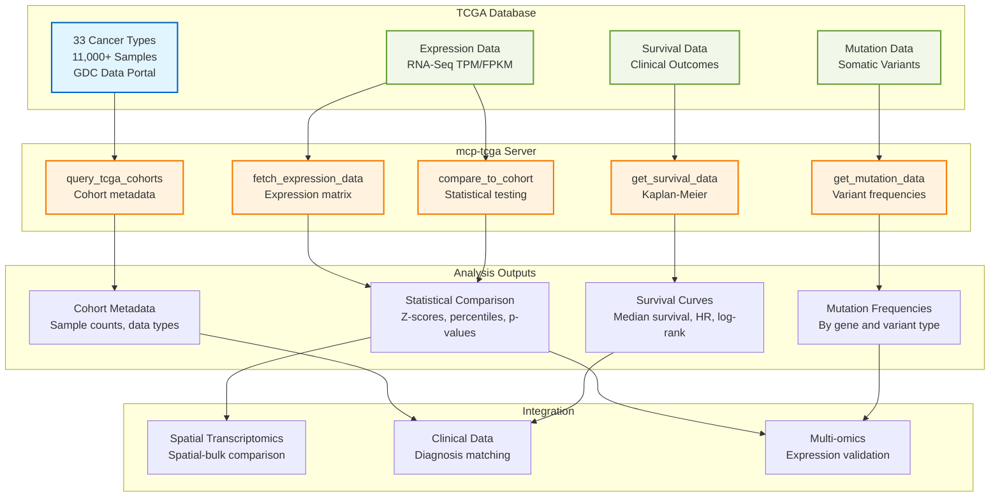

# Genomic Cohort Analysis Architecture

**Status:** ❌ Mocked (GDC-ready implementation)
**Last Updated:** 2026-01-10

---

## Executive Summary

Genomic cohort analysis enables comparison of individual patient data against large cancer genomics datasets from The Cancer Genome Atlas (TCGA). The **mcp-tcga** server provides access to 33 cancer types with 11,000+ samples for expression comparison, mutation frequency analysis, and survival correlation.

**Key Capabilities:**
- Cohort discovery across 33 TCGA cancer types
- Gene expression comparison (bulk RNA-seq)
- Somatic mutation frequency queries
- Survival stratification and Kaplan-Meier analysis
- Statistical testing against population distributions

---

## System Overview



---

## Server Architecture

### mcp-tcga (TCGA Cohort Access)

**Status:** ❌ Mocked (GDC API integration ready)
**Deployment:** GCP Cloud Run (SSE transport)
**Tools:** 5 core tools

| Tool | Purpose | Data Returned |
|------|---------|---------------|
| `query_tcga_cohorts` | Cohort discovery | Cancer types, sample counts, available data types |
| `fetch_expression_data` | Gene expression | TPM/FPKM matrix with sample metadata |
| `compare_to_cohort` | Statistical testing | Z-scores, p-values, percentiles |
| `get_survival_data` | Survival analysis | Median survival, 5-year rates, hazard ratios |
| `get_mutation_data` | Mutation frequency | Variant prevalence by gene and type |

**Resources:**
- `tcga://cohorts` - Catalog of 33 TCGA cancer types
- `tcga://brca` - BRCA cohort metadata (1097 tumors, 113 normal)

**DRY_RUN Mode:** Default true - returns realistic mock data without GDC downloads

**For detailed specifications:** [mcp-tcga README](../../../../servers/mcp-tcga/README.md)

---

## Available TCGA Cohorts

### Cancer Types (33 total)

| Code | Cancer Type | Samples | Primary Site |
|------|-------------|---------|--------------|
| **TCGA-OV** | Ovarian Serous Cystadenocarcinoma | 379 | Ovary |
| **TCGA-BRCA** | Breast Invasive Carcinoma | 1,097 | Breast |
| **TCGA-LUAD** | Lung Adenocarcinoma | 515 | Lung |
| **TCGA-UCEC** | Uterine Corpus Endometrial Carcinoma | 548 | Uterus |
| **TCGA-KIRC** | Kidney Renal Clear Cell Carcinoma | 533 | Kidney |
| **TCGA-HNSC** | Head and Neck Squamous Cell Carcinoma | 500 | Head and Neck |
| **TCGA-LGG** | Brain Lower Grade Glioma | 516 | Brain |
| **TCGA-THCA** | Thyroid Carcinoma | 502 | Thyroid |
| **TCGA-PRAD** | Prostate Adenocarcinoma | 497 | Prostate |
| **TCGA-COAD** | Colon Adenocarcinoma | 456 | Colon |

**Full list:** 33 cohorts, 11,000+ total samples

**Data Modalities:**
- RNA-Seq (gene expression, TPM/FPKM)
- DNA-Seq (somatic mutations, CNV)
- Methylation (450K/EPIC arrays)
- Clinical (survival, demographics, treatment)
- Pathology images (H&E slides)

---

## Key Workflows

### Workflow 1: Cohort Discovery

```
1. Search cohorts by cancer type (e.g., "ovarian")
2. Filter by minimum sample count (n > 300)
3. Review available data types (RNA-Seq, mutations, survival)
4. Select matching cohort (TCGA-OV)
```

**Use Case:** Identify appropriate TCGA cohort for patient comparison

---

### Workflow 2: Expression Comparison

```
1. Fetch gene expression for genes of interest (PIK3CA, BRCA1, TP53)
2. Compare patient expression to cohort distribution
3. Calculate z-scores and percentiles
4. Identify outlier genes (|z| > 2)
```

**Use Case:** Determine if patient gene expression is typical or aberrant

**Example Output:**
```
PIK3CA: Patient TPM = 45.2, Cohort mean = 12.3, Z-score = 3.8 (99th percentile)
→ Significant overexpression (p < 0.001)
```

---

### Workflow 3: Survival Stratification

```
1. Stratify TCGA cohort by gene expression (high vs low PIK3CA)
2. Compute Kaplan-Meier survival curves
3. Calculate hazard ratio and log-rank p-value
4. Assess prognostic value
```

**Use Case:** Evaluate prognostic significance of gene expression

**Example Output:**
```
High PIK3CA: Median survival = 28 months, 5-year survival = 15%
Low PIK3CA: Median survival = 42 months, 5-year survival = 35%
Hazard Ratio = 1.85, p = 0.003
→ High PIK3CA associated with worse prognosis
```

---

### Workflow 4: Mutation Frequency Analysis

```
1. Query mutation frequencies for TP53, BRCA1, PIK3CA
2. Compare patient mutations to cohort prevalence
3. Identify rare vs common variants
4. Assess therapeutic implications
```

**Use Case:** Contextualize patient mutation burden

**Example Output:**
```
TP53 missense: 96% cohort frequency (very common)
BRCA1 truncating: 12% cohort frequency (common in HGSOC)
PIK3CA H1047R: 8% cohort frequency (actionable mutation)
```

---

## Integration with Other Modalities

### With Spatial Transcriptomics (mcp-spatialtools)

**Integration Point:** Spatial expression → Bulk cohort comparison

**Workflow:**
1. Aggregate spatial gene expression across tissue regions
2. Compare regional averages to TCGA-OV bulk expression
3. Identify spatial-specific dysregulation
4. Validate findings against population distributions

**Example:** "Is CD8A downregulation in tumor core typical for HGSOC?"

**Answer:** "TCGA-OV cohort mean CD8A = 5.2 TPM; Patient tumor core = 1.1 TPM (15th percentile, significantly low)"

---

### With Multi-omics (mcp-multiomics)

**Integration Point:** Protein expression → RNA validation

**Workflow:**
1. Identify protein-level dysregulation (e.g., phospho-AKT elevated)
2. Query TCGA RNA-Seq for AKT1 mRNA expression
3. Validate RNA-protein concordance at population level
4. Assess if patient shows RNA-protein discordance

**Example:** "Does elevated phospho-AKT correspond to high AKT1 mRNA?"

**TCGA Validation:** "AKT1 RNA-protein correlation in TCGA-OV: r = 0.62 (moderate concordance expected)"

---

### With Clinical Data (mcp-epic/mcp-mockepic)

**Integration Point:** Diagnosis → Cohort selection

**Workflow:**
1. Retrieve patient diagnosis from mcp-epic (e.g., "Ovarian Serous Cystadenocarcinoma")
2. Match to TCGA cohort (TCGA-OV)
3. Compare patient biomarkers to cohort clinical features
4. Stratify survival based on patient mutation profile

**Example:** "How does this BRCA1-mutated patient compare to TCGA-OV?"

**Cohort Context:** "BRCA1 mutations in 12% of TCGA-OV; median survival 45 months vs 32 months for WT (p = 0.02)"

---

## Data Requirements

### Input Data

**Cohort Query:**
- Cancer type (e.g., "ovarian", "breast")
- Minimum sample count (e.g., n > 100)
- Required data types (e.g., "RNA-Seq", "mutation")

**Gene Expression Query:**
- Gene symbols (e.g., ["PIK3CA", "TP53", "BRCA1"])
- Sample IDs (optional, defaults to all samples)
- Expression units (TPM, FPKM, or raw counts)

**Mutation Query:**
- Gene symbols
- Mutation types (missense, truncating, splice site)

---

### Output Data Formats

**Cohort Metadata:**
```json
{
  "cohort_id": "TCGA-OV",
  "cancer_type": "Ovarian Serous Cystadenocarcinoma",
  "total_samples": 379,
  "data_types": ["RNA-Seq", "Mutation", "Methylation", "Clinical"],
  "primary_site": "Ovary"
}
```

**Expression Comparison:**
```json
{
  "gene": "PIK3CA",
  "patient_tpm": 45.2,
  "cohort_mean": 12.3,
  "cohort_std": 8.5,
  "z_score": 3.87,
  "percentile": 99,
  "p_value": 0.0001
}
```

**Survival Data:**
```json
{
  "stratification": "PIK3CA_high_vs_low",
  "high_group": {
    "n": 189,
    "median_survival_months": 28,
    "five_year_survival_rate": 0.15
  },
  "low_group": {
    "n": 190,
    "median_survival_months": 42,
    "five_year_survival_rate": 0.35
  },
  "hazard_ratio": 1.85,
  "log_rank_p": 0.003
}
```

---

## PatientOne Integration

### Test Case

**Patient:** PAT001-OVC-2025 (Stage IV HGSOC, platinum-resistant)

**TCGA Cohort:** TCGA-OV (Ovarian Serous Cystadenocarcinoma, n=379)

**Comparison Queries:**
1. **Expression Comparison:**
   - PIK3CA: Patient 45.2 TPM → 99th percentile (significant overexpression)
   - TP53: Patient 2.1 TPM → 5th percentile (loss of function expected)
   - BRCA1: Patient 8.5 TPM → 45th percentile (typical expression)

2. **Mutation Context:**
   - TP53 mutation: 96% cohort frequency (ubiquitous in HGSOC)
   - BRCA1 mutation: 12% cohort frequency (germline + somatic)
   - PIK3CA H1047R: 8% cohort frequency (activating hotspot)

3. **Survival Stratification:**
   - BRCA1-mutated patients: Median survival 45 months vs 32 months WT
   - PIK3CA-high patients: Worse prognosis (HR = 1.85)

**Clinical Interpretation:** Patient has high-risk molecular profile (PIK3CA overexpression, platinum resistance) but BRCA1 mutation may improve response to PARP inhibitors.

---

## 📖 Detailed Documentation

### Server Documentation
- **mcp-tcga:** [/servers/mcp-tcga/README.md](../../../../servers/mcp-tcga/README.md)
  - Tool specifications with parameters
  - GDC API integration details
  - DRY_RUN mode configuration
  - Example queries and outputs

### Deployment & Operations
- **GCP Deployment:** [/docs/deployment/DEPLOYMENT_STATUS.md](../../deployment/DEPLOYMENT_STATUS.md)
- **Server Status:** [Server Implementation Status](../servers.md)

---

## Related Workflows

- [Clinical Data](../clinical/README.md) - Diagnosis-cohort matching
- [Multi-omics Integration](../multiomics/README.md) - RNA-protein validation
- [Spatial Transcriptomics](../spatial-transcriptomics/README.md) - Spatial-bulk comparison
- [PatientOne Workflow](../../test-docs/patient-one-scenario/README.md) - Complete precision medicine workflow

---

**See also:** [Main Architecture](../README.md) | [TCGA Data Portal](https://portal.gdc.cancer.gov/)
