# Imaging Analysis Architecture

**Status:** Production (openimagedata: 100% real, deepcell: 100% real)
**Last Updated:** 2026-01-31

---

## System Overview

```mermaid
graph TB
    subgraph Input["📁 Input Images"]
        HE[H&E TIFF<br/>RGB brightfield<br/>Morphology]
        IF1[IF_CD8 TIFF<br/>Grayscale fluorescence<br/>T cells]
        IF2[IF_Ki67 TIFF<br/>Grayscale fluorescence<br/>Proliferation]
        MX[MxIF TIFF<br/>3-channel RGB<br/>TP53/Ki67/DAPI]
    end

    subgraph OID["🔧 mcp-openimagedata<br/>(5 tools, 100% real)"]
        Load[Load Image]
        Comp[Generate<br/>Composite]
        Anno[Annotate<br/>H&E]
    end

    subgraph DC["🔬 mcp-deepcell<br/>(3 tools, 100% real)"]
        Seg[Segment<br/>Cells]
        Quant[Quantify<br/>Markers]
        Viz[Generate<br/>Overlay]
    end

    subgraph CC["🎯 mcp-cell-classify<br/>(3 tools, 100% real)"]
        Class[Classify<br/>Phenotypes]
        Multi[Multi-marker<br/>Phenotyping]
        PhenoViz[Phenotype<br/>Visualization]
    end

    subgraph Output["📊 Outputs"]
        Morph[H&E Morphology<br/>Necrosis, cellularity]
        Counts[Cell Counts<br/>CD8+, Ki67+]
        Pheno[Phenotypes<br/>TP53+/Ki67+ co-expression]
        Imgs[PNG Visualizations<br/>Composites, overlays]
    end

    HE --> Load
    Load --> Anno
    Anno --> Morph
    Anno --> Imgs

    IF1 --> Load
    IF2 --> Load
    MX --> Load

    Load --> Comp
    Comp --> Imgs

    Load --> Seg
    Seg --> Quant
    Quant --> Class
    Quant --> Multi
    Class --> Counts
    Multi --> Pheno
    Multi --> PhenoViz
    PhenoViz --> Imgs
    Viz --> Imgs

    classDef inputStyle fill:#e1f5ff,stroke:#0288d1,stroke-width:2px
    classDef oidStyle fill:#fff3e0,stroke:#f57c00,stroke-width:2px
    classDef dcStyle fill:#f3e5f5,stroke:#7b1fa2,stroke-width:2px
    classDef ccStyle fill:#e8f5e9,stroke:#388e3c,stroke-width:2px
    classDef outputStyle fill:#f1f8e9,stroke:#689f38,stroke-width:2px

    class Input inputStyle
    class OID oidStyle
    class DC dcStyle
    class CC ccStyle
    class Output outputStyle
```

---

## Quick Navigation

### Workflows
- **[HE_WORKFLOW.md](HE_WORKFLOW.md)** - ⭐ **H&E brightfield morphology** (openimagedata ONLY, no segmentation)
- **[MXIF_WORKFLOW.md](MXIF_WORKFLOW.md)** - **MxIF fluorescence cell segmentation** (openimagedata → deepcell pipeline)

### Servers
- **[mcp-openimagedata README](../../../../servers/mcp-openimagedata/README.md)** - Histology image processing (5 tools, 100% real)
- **[mcp-deepcell README](../../../../servers/mcp-deepcell/README.md)** - Cell segmentation and phenotyping (3 tools, 100% real)

### Reference
- **[GLOSSARY.md](GLOSSARY.md)** - Imaging terminology (H&E, MxIF, DeepCell, segmentation)

---

## What This Is

Imaging analysis component for histology and multiplexed immunofluorescence (MxIF) in the Precision Medicine MCP system.

**Current workflows:**
1. **H&E:** Brightfield morphology assessment (chromogenic stains, RGB TIFF)
2. **MxIF:** Fluorescence cell segmentation (fluorescent antibodies, multi-channel TIFF)

**Servers:**
- mcp-openimagedata (100% real - loading, registration, feature extraction, visualization)
- mcp-deepcell (100% real - segmentation + per-cell marker quantification)
- mcp-cell-classify (100% real - phenotype classification + visualization, lightweight)

---

## H&E vs MxIF: Key Differences

| Feature | H&E | MxIF |
|---------|-----|------|
| **Microscopy** | Brightfield | Fluorescence |
| **Staining** | Chromogenic dyes | Fluorescent antibodies |
| **Format** | RGB TIFF | Grayscale (single) or Multi-channel (multiplex) |
| **Purpose** | Visual morphology | Quantitative protein expression |
| **Analysis** | Visual inspection | Automated cell segmentation |
| **Servers** | openimagedata ONLY | openimagedata → deepcell → cell-classify |
| **Output** | Annotated images | Cell counts, phenotypes |
| **Example** | Necrosis detection | CD8+ T cell quantification |

**Key Point:** H&E uses chromogenic stains (not fluorescence!) for visual assessment.

---

## Server Status

### mcp-openimagedata
**Status:** ✅ 100% Real (deployed to GCP Cloud Run)
**URL:** https://mcp-openimagedata-ondu7mwjpa-uc.a.run.app

**Tools (5):**
- ✅ `fetch_histology_image` — PIL image loading with glob fallback for partial ID matching
- ✅ `register_image_to_spatial` — Otsu tissue detection, bbox-based affine/rigid estimation, phase-cross-correlation refinement for deformable; Visium + generic x/y CSV support
- ✅ `extract_image_features` — LBP + GLCM texture (25 features), connected-component morphology (15 features), intensity stats + entropy (10 features); per-ROI support
- ✅ `generate_multiplex_composite` — RGB MxIF composites (1-7 channels)
- ✅ `generate_he_annotation` — Annotate H&E morphology with region overlays

**Use cases:**
- Load H&E and IF/MxIF images
- Register histology to spatial transcriptomics spot coordinates
- Extract texture, morphology, and intensity features per region
- Generate multiplex RGB composites
- Annotate H&E regions (necrosis, high cellularity)

---

### mcp-deepcell
**Status:** ✅ 100% Real (deployed to GCP Cloud Run)
**URL:** https://mcp-deepcell-ondu7mwjpa-uc.a.run.app

**Tools (3):**
- ✅ `segment_cells` — DeepCell-TF nuclear/membrane segmentation, 16-bit TIFF mask output
- ✅ `quantify_markers` — Per-cell mean/max/min intensity for multiple markers, CSV output
- ✅ `generate_segmentation_overlay` — Cell boundary visualization overlaid on original image

**Use cases:**
- Segment cells from DAPI nuclear stain or membrane markers
- Quantify per-cell marker intensities for downstream classification
- Validate segmentation quality with overlay visualizations

---

### mcp-cell-classify
**Status:** ✅ 100% Real (lightweight, no TensorFlow dependency)

**Tools (3):**
- ✅ `classify_cell_states` — Single-marker threshold classification (proliferating/quiescent/intermediate)
- ✅ `classify_multi_marker` — Multi-marker phenotyping (e.g., Ki67+/TP53- assignments)
- ✅ `generate_phenotype_visualization` — Color cells by marker expression (positive/negative)

**Use cases:**
- Classify cell phenotypes from segmentation masks + marker images
- Multi-marker co-expression analysis (Ki67+/TP53+ double-positive cells)
- Generate publication-quality phenotype visualizations

**Note:** Split from mcp-deepcell for lighter dependencies (~200MB vs ~2GB Docker image). Users can swap in alternative classifiers (FlowSOM, Leiden, scikit-learn).

---

## PatientOne Integration (TEST_4)

### Test Files

| File | Type | Microscopy | Servers | Purpose |
|------|------|-----------|---------|---------|
| **PAT001_tumor_HE_20x.tiff** | H&E | Brightfield | openimagedata | Morphology assessment |
| **PAT001_tumor_IF_CD8.tiff** | IF (single) | Fluorescence | openimagedata + deepcell | CD8+ T cell counts |
| **PAT001_tumor_IF_KI67.tiff** | IF (single) | Fluorescence | openimagedata + deepcell | Ki67+ proliferation index |
| **PAT001_tumor_multiplex_IF_TP53_KI67_DAPI.tiff** | MxIF (3-ch) | Fluorescence | openimagedata + deepcell | Multi-marker phenotyping |

### Expected Findings

**H&E Morphology:**
- Necrosis: Present (pale regions)
- Cellularity: 70-80% tumor cells
- Architecture: HGSOC (papillary, high-grade)

**MxIF Quantification:**
- CD8+ cells: ~12 (LOW, immune exclusion)
- Ki67+ cells: ~112 (HIGH, 45% proliferation)
- TP53+/Ki67+ double-positive: ~85 cells (35%, active growth with mutation)

---

## Quick Start

**For users:** Read [HE_WORKFLOW.md](HE_WORKFLOW.md) and [MXIF_WORKFLOW.md](MXIF_WORKFLOW.md) → Run [PatientOne TEST_4_IMAGING](../../testing/patient-one/test-prompts/test-4-imaging.md)

**For developers:** See [mcp-openimagedata README](../../../../servers/mcp-openimagedata/README.md) and [mcp-deepcell README](../../../../servers/mcp-deepcell/README.md) for tool details

---

## Related Workflows

- [Spatial Transcriptomics](../spatial/README.md) - Gene expression analysis (TEST_3)
- [Multiomics Integration](../rna/multiomics.md) - RNA/Protein/Phospho integration (TEST_2)
- [PatientOne Workflow](../../testing/patient-one/README.md) - Complete end-to-end workflow

---

**See also:** [Main Architecture](../README.md) | [PatientOne README](../../testing/patient-one/README.md)
