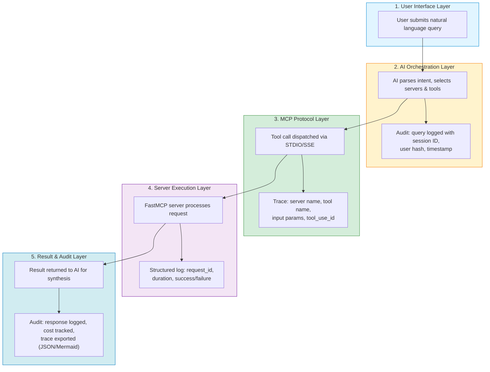
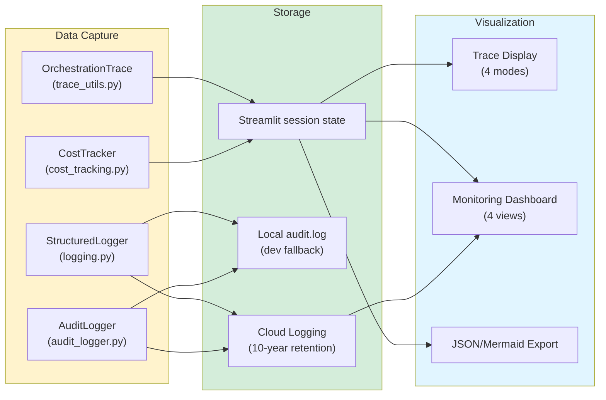

# Observability & Trust: How to Verify AI Orchestration

> **Quick answer:** Every AI routing decision, tool call, parameter, and result is logged and visualizable. This page shows you exactly where that data lives and how to inspect it.

---

## Table of Contents

- [A. How Tracing Works](#a-how-tracing-works)
- [B. Traceability Inventory](#b-traceability-inventory)
- [C. What Users See](#c-what-users-see)
- [D. Standards Alignment](#d-standards-alignment)
- [E. Verify It Works](#e-verify-it-works)
- [F. Future Enhancements](#f-future-enhancements)

---

## A. How Tracing Works

Every user query passes through 5 architectural layers. Each layer captures structured trace data:



**What gets captured at each layer:**

| Layer | What Is Logged | Where It Goes |
|-------|---------------|---------------|
| **1. UI** | User query text, session start/end | Audit log (Cloud Logging or local) |
| **2. AI Orchestration** | Server selection, model selection, routing decisions | Audit events + orchestration trace |
| **3. MCP Protocol** | Tool name, input parameters, tool_use_id | Orchestration trace (per-call) |
| **4. Server Execution** | Request ID, execution duration, success/failure | Structured JSON log |
| **5. Result & Audit** | Result summary, token count, cost estimate | Audit log + cost tracker + trace export |

---

## B. Traceability Inventory

Every traceability capability in the platform, mapped to its source file:

| Capability | Source File | What It Captures |
|---|---|---|
| **Structured tool logging** | [`shared/common/logging.py`](../../../../shared/common/logging.py) | Tool name, request ID, parameters, duration, success (JSON format via `StructuredLogger`) |
| **HIPAA audit events** | [`ui/streamlit-app/utils/audit_logger.py`](../../../../ui/streamlit-app/utils/audit_logger.py) | 10 event types: login, query, response, error, server selection, model selection, session start/end, benchmark prompt, benchmark run |
| **Orchestration traces** | [`ui/streamlit-app/utils/trace_utils.py`](../../../../ui/streamlit-app/utils/trace_utils.py) | Per-call: server name, tool name, input params, result summary, duration (ms), tool_use_id, timestamp |
| **Trace visualization** | [`ui/streamlit-app/utils/trace_display.py`](../../../../ui/streamlit-app/utils/trace_display.py) | 4 display modes: log view, expandable cards, timeline, Mermaid sequence diagram. Plus JSON/Mermaid export. |
| **Cost tracking** | [`shared/utils/cost_tracking.py`](../../../../shared/utils/cost_tracking.py) | Per-operation costs (compute, storage, API, AI inference), budget alerts, JSON export, cost decorators |
| **Live monitoring dashboard** | [`ui/dashboard/streamlit_app.py`](../../../../ui/dashboard/streamlit_app.py) | Server health, latency metrics, token usage, cost analysis across 4 dashboard views |

### How These Connect



---

## C. What Users See

### Streamlit Trace Toggle

The main Streamlit chat interface includes a trace display toggle. When enabled, every AI response shows an expandable trace panel with:

- **Summary bar:** Server icons, call count, total duration, estimated cost
- **4 visualization modes** (user-selectable):

| Mode | View | Best For |
|------|------|----------|
| **Log** | Compact text list of each tool call | Quick inspection |
| **Cards** | Expandable cards with full parameters and results | Detailed debugging |
| **Timeline** | Visual timeline showing call sequence and duration | Performance analysis |
| **Mermaid** | Sequence diagram (User → AI → Server → Result) | Documentation and compliance |

### Monitoring Dashboard

The live monitoring dashboard (`ui/dashboard/`) provides 4 views:

| View | What It Shows |
|------|--------------|
| **Overview** | Server health status, active connections, recent errors |
| **Cost Analysis** | Per-operation costs, budget utilization, cost trends |
| **Performance** | Latency percentiles, throughput, tool call duration |
| **Optimization** | Token usage patterns, caching effectiveness, recommendations |

### Export for Compliance Records

- **JSON export:** Full trace data including all parameters, results, and timing
- **Mermaid export:** Sequence diagram suitable for embedding in compliance documents
- Both available via the trace display panel in the Streamlit UI

---

## D. Standards Alignment

The platform's observability capabilities align with recognized frameworks for AI transparency and healthcare software:

| Standard | Relevant Requirement | Platform Capability |
|----------|---------------------|-------------------|
| **NIST AI RMF** (MAP 1.1) | Document AI system behavior and decisions | Orchestration traces capture every routing decision and tool call |
| **NIST AI RMF** (MEASURE 2.6) | Monitor AI system performance | Live dashboard with latency, throughput, and error metrics |
| **FDA TPLC** (Transparency) | Explain AI-assisted clinical decisions | Trace visualization shows exactly which tools produced which results |
| **OWASP Agentic Top 10** (A07) | Audit trail for agent actions | HIPAA audit logger records all 10 event types with 10-year retention |
| **HIPAA** (164.312(b)) | Audit controls for PHI access | Cloud Logging with immutable retention; user identity hashing |

> **Note:** This table shows *alignment* with framework principles, not formal certification or compliance claims.

---

## E. Verify It Works

### Inspect Structured Logs (Server-Side)

```bash
# View local server logs (when running locally)
# Logs appear on stderr with JSON-structured tool_call / tool_result events
cd servers/mcp-multiomics
uv run python -m mcp_multiomics 2>&1 | grep '"event"'

# View Cloud Logging (when deployed to GCP)
gcloud logging read 'resource.type="cloud_run_revision" AND jsonPayload.event="tool_call"' \
  --project=YOUR_PROJECT --limit=10 --format=json
```

### Inspect Audit Logs

```bash
# Local dev mode: audit events written to audit.log
cat audit.log | python -m json.tool

# Cloud mode: query Cloud Logging
gcloud logging read 'logName="projects/YOUR_PROJECT/logs/mcp-audit-log"' \
  --limit=20 --format=json
```

### Enable Trace Display in Streamlit

1. Launch the Streamlit app: `cd ui/streamlit-app && streamlit run app.py`
2. Toggle the trace display (available in the sidebar or response panel)
3. Submit any query — trace panel appears below each AI response
4. Switch between Log, Cards, Timeline, and Mermaid views

### Exercise Multi-Server Routing

Use the PatientOne test prompts to exercise routing across multiple servers:

- [Test Prompt 1: Clinical + Genomic](../../testing/patient-one/test-prompts/) — routes to mcp-mockepic + mcp-genomic-results + mcp-fgbio
- [Test Prompt 2: Multi-omics Integration](../../testing/patient-one/test-prompts/) — routes to mcp-multiomics
- [Test Prompt 7: End-to-End Workflow](../../testing/patient-one/test-prompts/) — routes across all servers

Each test prompt generates traces showing exactly which servers were called, with what parameters, and what was returned.

---

## F. Future Enhancements

| Enhancement | Description | Status |
|---|---|---|
| **OpenTelemetry instrumentation** | Replace custom structured logging with OTel spans for industry-standard distributed tracing | Planned |
| **Distributed trace correlation IDs** | Single trace ID that follows a query from UI through AI orchestration to every server call and back | Planned |
| **Request-level provenance chains** | Cryptographically signed chain linking each result to its source data, tool version, and parameters | Under evaluation |
| **Automated trace regression tests** | CI tests that verify expected server routing for known prompts | Planned |

---

**See also:**
- [Architecture Overview](../README.md) — system design and modality workflows
- [Error Handling](error-handling.md) — error handling and retry logic
- [Cost and Budget Management](../../../for-hospitals/operations/cost-and-budget.md) — operational cost tracking
- [HIPAA Compliance](../../../for-hospitals/compliance/hipaa.md) — audit logging requirements
