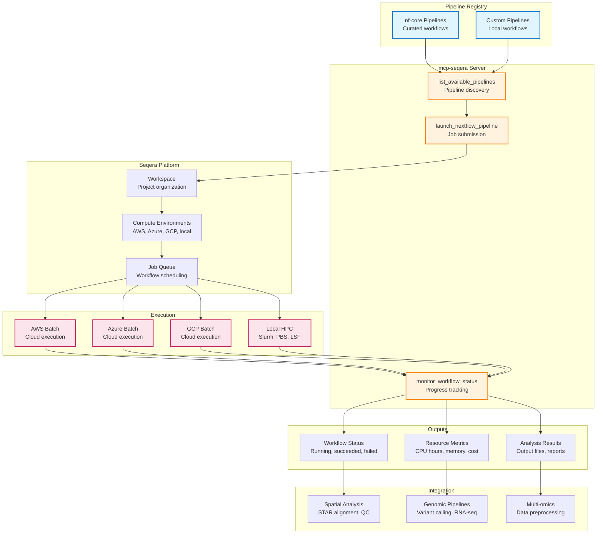

# Workflow Orchestration Architecture

**Status:** ❌ Mocked (Seqera Platform integration ready)
**Last Updated:** 2026-01-10

---

## Executive Summary

Workflow orchestration via the Seqera Platform enables management of Nextflow bioinformatics pipelines at scale. The **mcp-seqera** server provides programmatic access to launch, monitor, and manage workflows from the nf-core pipeline collection and custom pipelines across diverse compute environments (AWS, Azure, GCP, local).

**Key Capabilities:**
- Nextflow pipeline submission (nf-core and custom)
- Multi-cloud workflow execution (AWS Batch, Azure Batch, GCP Batch, local)
- Real-time progress monitoring and resource tracking
- Cost estimation and usage metrics
- Workflow registry access (nf-core pipeline catalog)

---

## System Overview



---

## Server Architecture

### mcp-seqera (Nextflow Workflow Orchestration)

**Status:** ❌ Mocked (Seqera Platform API integration ready)
**Deployment:** GCP Cloud Run (SSE transport)
**Tools:** 3 core tools

| Tool | Purpose | Inputs | Outputs |
|------|---------|--------|---------|
| `launch_nextflow_pipeline` | Submit workflow | Pipeline name, params, compute env | Job ID, submission status |
| `monitor_workflow_status` | Track progress | Job ID | Status, completion %, resources |
| `list_available_pipelines` | Pipeline discovery | Category filter | Pipeline metadata, params |

**Resources:**
- `seqera://pipelines/nf-core` - nf-core pipeline catalog metadata

**DRY_RUN Mode:** Default true - simulates job submission without actual execution

**For detailed specifications:** [mcp-seqera README](../../../../servers/README.md#mcp-seqera)

---

## Available Pipelines

### nf-core Curated Pipelines

**Category: RNA-seq**
- `nf-core/rnaseq` - Bulk RNA-seq alignment, quantification, QC
- `nf-core/scrnaseq` - Single-cell RNA-seq processing (10x, Drop-seq, Smart-seq2)
- `nf-core/differentialabundance` - Differential expression analysis

**Category: Spatial**
- `nf-core/spatial` - Spatial transcriptomics (Visium, Slide-seq)
- Custom spatial pipelines with STAR alignment

**Category: Variant Calling**
- `nf-core/sarek` - Germline + somatic variant calling
- `nf-core/variantcall` - SNP/indel calling from WGS/WES

**Category: Methylation**
- `nf-core/methylseq` - Bisulfite sequencing analysis
- `nf-core/nanoseq` - Long-read sequencing (Oxford Nanopore)

**Category: ChIP-seq / ATAC-seq**
- `nf-core/chipseq` - ChIP-seq peak calling, annotation
- `nf-core/atacseq` - ATAC-seq chromatin accessibility

**Total:** 90+ nf-core pipelines across all bioinformatics domains

---

## Compute Environments

### Supported Platforms

| Platform | Executor | Typical Use | Cost Model |
|----------|----------|-------------|------------|
| **AWS Batch** | AWS Batch | Large-scale cloud | Pay per CPU hour |
| **Azure Batch** | Azure Batch | Enterprise cloud | Pay per CPU hour |
| **GCP Batch** | Google Batch | GCP-native | Pay per CPU hour |
| **Local HPC** | Slurm, PBS, LSF | On-premise clusters | Fixed cost |
| **Local** | Local executor | Development, testing | Free (local resources) |

**Auto-scaling:** Cloud executors support dynamic resource allocation based on workflow demand.

---

## Key Workflows

### Workflow 1: Launch RNA-seq Pipeline

```
1. Select pipeline: nf-core/rnaseq
2. Specify input: FASTQ files (S3, GCS, or local paths)
3. Configure params: --genome GRCh38, --aligner star
4. Select compute: AWS Batch (us-east-1)
5. Submit job → Get job ID
6. Monitor progress
```

**Use Case:** Process bulk RNA-seq data from FASTQ to count matrix

**Example Parameters:**
```json
{
  "pipeline": "nf-core/rnaseq",
  "params": {
    "input": "s3://mybucket/samplesheet.csv",
    "genome": "GRCh38",
    "aligner": "star",
    "outdir": "s3://mybucket/results/"
  },
  "compute_env": "aws-batch-us-east-1"
}
```

---

### Workflow 2: Spatial Transcriptomics Processing

```
1. Select pipeline: nf-core/spatial (or custom)
2. Input: Visium FASTQ + tissue images
3. Configure: --chemistry visium, --reference GRCh38
4. Launch on GCP Batch
5. Monitor tissue alignment and count generation
```

**Use Case:** Process raw Visium data to spot × gene count matrix

**Output:** Spot coordinates, gene expression matrix, tissue images

---

### Workflow 3: Monitor Long-Running Job

```
1. Submit variant calling pipeline (nf-core/sarek)
2. Initial status: "Submitted" → "Running"
3. Poll every 5 minutes for progress
4. Track resource usage (CPU hours, memory GB-hours)
5. Receive completion notification
6. Download results
```

**Use Case:** Track multi-hour pipeline execution with cost monitoring

**Example Status:**
```json
{
  "job_id": "abc123",
  "status": "running",
  "progress": 45,
  "tasks_completed": 120,
  "tasks_total": 267,
  "cpu_hours": 42.5,
  "memory_gb_hours": 185.2,
  "estimated_cost_usd": 8.50,
  "runtime_minutes": 125
}
```

---

## Integration with Other Modalities

### With Spatial Transcriptomics (mcp-spatialtools)

**Integration Point:** Raw FASTQ → Processed count matrix

**Workflow:**
1. Launch nf-core/spatial via mcp-seqera for FASTQ alignment
2. Monitor job until completion
3. Load count matrix into mcp-spatialtools for downstream analysis
4. Run differential expression, pathway enrichment

**Example:** "Process raw Visium FASTQ files, then analyze spatial patterns"

**Pipeline Chain:** mcp-seqera (alignment) → mcp-spatialtools (analysis) → mcp-multiomics (integration)

---

### With Genomic Analysis (mcp-fgbio)

**Integration Point:** Variant calling workflow

**Workflow:**
1. Launch nf-core/sarek for germline/somatic variant calling
2. Monitor variant calling job
3. Load VCF results into mcp-fgbio for annotation
4. Integrate variants with spatial/multi-omics data

**Example:** "Run germline variant calling, then annotate mutations and correlate with expression"

---

### With Multi-omics (mcp-multiomics)

**Integration Point:** Preprocessing large datasets

**Workflow:**
1. Launch custom Nextflow pipeline for multi-omics preprocessing
2. Batch correction, normalization at scale
3. Load preprocessed data into mcp-multiomics
4. Run HAllA association testing

**Example:** "Preprocess 1000-sample proteomics dataset, then run multi-omics integration"

---

## Workflow Lifecycle Management

### Job States

```
Submitted → Queued → Running → Succeeded
                               ↓ (if error)
                             Failed
```

**State Transitions:**
- **Submitted:** Job accepted by Seqera Platform
- **Queued:** Waiting for compute resources
- **Running:** Tasks executing on compute environment
- **Succeeded:** All tasks completed successfully
- **Failed:** One or more tasks failed (check logs)

---

### Resource Tracking

**Metrics Collected:**
- CPU hours (total across all tasks)
- Memory GB-hours (peak memory × duration)
- Disk I/O (read/write volumes)
- Network transfer (data uploaded/downloaded)
- Estimated cost (based on cloud pricing)

**Cost Estimation:**
```
AWS Batch: $0.20/CPU-hour (approximate)
Azure Batch: $0.18/CPU-hour (approximate)
GCP Batch: $0.17/CPU-hour (approximate)
Local HPC: Fixed institutional cost
```

---

### Error Handling

**Automatic Retries:**
- Transient failures: 3 retries with exponential backoff
- Spot instance preemption: Auto-restart on new instance

**Failure Modes:**
- Task failure: Single process error (check task logs)
- Pipeline failure: Workflow configuration error
- Compute failure: Infrastructure issue (insufficient resources)

**Recovery:**
- Resume from checkpoint (if enabled in Nextflow config)
- Re-submit failed tasks only

---

## Data Requirements

### Input Data

**Pipeline Submission:**
```json
{
  "pipeline": "nf-core/rnaseq",
  "revision": "3.12.0",
  "params": {
    "input": "s3://bucket/samplesheet.csv",
    "genome": "GRCh38",
    "outdir": "s3://bucket/results/"
  },
  "compute_env": "aws-batch-us-east-1",
  "workspace": "precision-medicine"
}
```

**Monitoring Request:**
```json
{
  "job_id": "abc123"
}
```

---

### Output Data

**Job Submission Response:**
```json
{
  "job_id": "abc123",
  "status": "submitted",
  "submission_time": "2026-01-10T10:30:00Z",
  "workspace": "precision-medicine",
  "pipeline": "nf-core/rnaseq"
}
```

**Status Response:**
```json
{
  "job_id": "abc123",
  "status": "running",
  "progress": 45,
  "tasks": {
    "total": 267,
    "completed": 120,
    "running": 8,
    "pending": 139,
    "failed": 0
  },
  "resources": {
    "cpu_hours": 42.5,
    "memory_gb_hours": 185.2,
    "estimated_cost_usd": 8.50
  },
  "runtime_minutes": 125,
  "eta_minutes": 152
}
```

---

## Performance Characteristics

### Typical Runtimes (nf-core Pipelines)

| Pipeline | Input Size | Compute | Runtime | Cost (AWS) |
|----------|------------|---------|---------|------------|
| nf-core/rnaseq | 10 samples, 30M reads | AWS Batch (16 CPUs) | 2-4 hours | $8-15 |
| nf-core/sarek | 1 WGS sample, 30× coverage | AWS Batch (32 CPUs) | 8-12 hours | $50-80 |
| nf-core/spatial | 1 Visium slide | GCP Batch (8 CPUs) | 3-6 hours | $12-20 |
| nf-core/scrnaseq | 10,000 cells, 10× Genomics | AWS Batch (16 CPUs) | 1-2 hours | $5-10 |

**Note:** Actual runtimes vary by sample complexity, read depth, and compute environment performance.

---

## PatientOne Integration

### Test Case

**Patient:** PAT001-OVC-2025 (Stage IV HGSOC)

**Use Case 1: Visium FASTQ Processing**
- Launch: `nf-core/spatial` with Visium FASTQ inputs
- Compute: GCP Batch (8 CPUs, 32 GB memory)
- Monitor alignment progress (STAR)
- Output: 900 spots × 31 genes count matrix
- Downstream: Load into mcp-spatialtools for spatial analysis

**Use Case 2: Variant Calling (Future)**
- Launch: `nf-core/sarek` with tumor/normal WGS
- Compute: AWS Batch (32 CPUs, 128 GB memory)
- Monitor somatic variant calling
- Output: VCF with TP53, PIK3CA, BRCA1 mutations
- Downstream: Annotate with mcp-fgbio, integrate with expression

**Use Case 3: RNA-seq Preprocessing**
- Launch: `nf-core/rnaseq` for bulk tumor RNA-seq
- Compute: Local HPC (Slurm cluster)
- Monitor STAR alignment + feature counting
- Output: Gene count matrix (31 cancer genes)
- Downstream: Load into mcp-multiomics for integration

---

## 📖 Detailed Documentation

### Server Documentation
- **mcp-seqera:** [/servers/mcp-seqera/README.md](../../../../servers/README.md#mcp-seqera)
  - Tool specifications with examples
  - Seqera Platform API integration
  - Compute environment configuration
  - DRY_RUN mode details

### Deployment & Operations
- **GCP Deployment:** [GCP Testing Guide](../../deployment/GCP_TESTING_GUIDE.md)
- **Server Status:** [Server Implementation Status](../../shared/server-registry.md)

### External Resources
- **Seqera Platform:** [https://seqera.io/](https://seqera.io/)
- **nf-core Pipelines:** [https://nf-co.re/pipelines](https://nf-co.re/pipelines)
- **Nextflow Documentation:** [https://www.nextflow.io/docs/latest/](https://www.nextflow.io/docs/latest/)

---

## Related Workflows

- [Spatial Transcriptomics](../spatial/README.md) - FASTQ alignment integration
- [Genomic Analysis](../dna/genomic-cohorts.md) - Variant calling workflows
- [Multi-omics Integration](../rna/multiomics.md) - Large-scale preprocessing
- [PatientOne Workflow](../../testing/patient-one/README.md) - Complete precision medicine workflow

---

**See also:** [Main Architecture](../README.md) | [nf-core](https://nf-co.re/)
