# MCP Server Implementation Status Matrix

> **ARCHIVED:** This document is a historical snapshot from Q3-Q4 2025. Server counts, tool counts, and status info are outdated. For current data, see **[servers/README.md](../../../../servers/README.md)** and **[SERVER_REGISTRY.md](../../SERVER_REGISTRY.md)**.

**Last Updated:** 2026-01-30
**Purpose:** Clearly document what's real vs mocked in each server to prevent accidental use of synthetic data

---

## ⚠️ CRITICAL WARNING

**Before using any server in production or for research decisions:**

1. Check this document to verify the server has real implementation (not mocked)
2. Verify `DRY_RUN` environment variable is set to `false`
3. Review the "Safe for Production?" status below
4. Test with known data to validate results

**Using mocked servers for research decisions will produce SYNTHETIC RESULTS that do not reflect reality.**

---

## Quick Reference

📋 **[See Server Status Table →](../../../../servers/README.md#-server-status)** - Tools, status, and documentation for all 15 servers

**Production Ready Count:** 11/15 servers (73%)
**Framework/Utility:** 3/15 servers (tcga, huggingface, seqera)
**Mock-by-Design:** 1/15 servers (mockepic)

**Total MCP Servers:** 15 (14 deployed to GCP Cloud Run + mcp-epic local only)

**🎉 GCP Cloud Run Deployment:** 14 servers deployed to production infrastructure

### Production Safety Summary

| Safe for Production? | Servers | Risk Level |
|---------------------|---------|------------|
| **YES** | mcp-multiomics (85%), mcp-fgbio (95%), mcp-spatialtools (95%), mcp-perturbation (100%), mcp-quantum-celltype-fidelity (100%), mcp-deepcell (100%), mcp-epic (100% local) | ✅ Low - Extensively tested |
| **NO** | mcp-openimagedata (60%) | ⚠️ Medium - Registration/features mocked |
| **NO** | mcp-tcga, mcp-huggingface, mcp-seqera (0%) | ❌ **CRITICAL - All synthetic** |
| **N/A** | mcp-mockepic (0%) | ✅ Low - Mock EHR by design |

---

## Visual Server Status Matrix

```mermaid
%%{init: {'theme':'base', 'themeVariables': {'fontSize':'14px'}}}%%
graph LR
    subgraph Production["✅ Production (11/15)"]
        direction TB
        FGBIO["mcp-fgbio<br/>4 tools"]
        MULTI["mcp-multiomics<br/>10 tools"]
        SPATIAL["mcp-spatialtools<br/>14 tools"]
        PERTURB["mcp-perturbation<br/>8 tools"]
        QUANTUM["mcp-quantum-celltype-fidelity<br/>6 tools"]
        DEEP["mcp-deepcell<br/>3 tools"]
        EPIC["mcp-epic<br/>4 tools<br/>(Local Only)"]
        IMAGE["mcp-openimagedata<br/>5 tools"]
        CELLCLASS["mcp-cell-classify<br/>3 tools"]
        GENOMICRES["mcp-genomic-results<br/>4 tools"]
        PATREPORT["mcp-patient-report<br/>5 tools"]
    end

    subgraph Framework["🔧 Framework (3/15)"]
        direction TB
        TCGA["mcp-tcga<br/>5 tools"]
        HF["mcp-huggingface<br/>3 tools"]
        SEQ["mcp-seqera<br/>3 tools"]
    end

    subgraph MockDesign["🎭 Mock by Design (1/15)"]
        direction TB
        MOCK["mcp-mockepic<br/>3 tools"]
    end

    style Production fill:#d4edda,stroke:#28a745,stroke-width:3px
    style Framework fill:#fff3cd,stroke:#ffc107,stroke-width:3px
    style MockDesign fill:#d1ecf1,stroke:#0c5460,stroke-width:3px
```



**Color Legend:**
- 🟢 **Green**: Production ready - safe for research use
- 🟡 **Yellow**: Framework/utility - API stubs ready for integration
- 🔵 **Blue**: Mock by design - synthetic data for demos

**Total: 90 tools across 15 servers**

---

## Epic FHIR Integration: mcp-epic vs mcp-mockepic

**⚠️ IMPORTANT DISTINCTION:** This system includes TWO Epic FHIR servers with different purposes.

### mcp-epic (Real Epic FHIR - Local Only)

- **Status:** ✅ 100% Real Implementation
- **Deployment:** Local STDIO only (NOT deployed to GCP Cloud Run)
- **Tools:** 4 tools
  - `get_patient_demographics` - Retrieve patient demographic data
  - `get_patient_conditions` - Fetch patient conditions/diagnoses
  - `get_patient_observations` - Get patient observations (labs, vitals)
  - `get_patient_medications` - Retrieve medication records
- **Data Source:** Real Epic FHIR API with HIPAA Safe Harbor de-identification
- **Purpose:** Production hospital deployment with real patient data
- **Use Case:** Hospital integration with Epic EHR for precision medicine workflows
- **Security:** Built-in de-identification removes all 18 HIPAA identifiers

### mcp-mockepic (Mock EHR - GCP Deployed)

- **Status:** ✅ Intentional Mock (synthetic data by design)
- **Deployment:** GCP Cloud Run (publicly accessible demo endpoint)
- **Tools:** 3 tools
  - `query_patient_records` - Query synthetic patient records
  - `link_spatial_to_clinical` - Link synthetic spatial data to clinical
  - `search_diagnoses` - Search synthetic diagnosis codes
- **Data Source:** 100% synthetic FHIR resources for demonstration
- **Purpose:** Demonstration, education, and workflow development
- **Use Case:** Demos, testing, education without real PHI
- **Security:** No real patient data - safe for public demos

**When to Use Which:**
- **Hospital Production:** Use mcp-epic (local deployment with Epic FHIR API credentials)
- **Demos & Testing:** Use mcp-mockepic (deployed on GCP, no Epic credentials needed)
- **Development:** Use mcp-mockepic for workflow development, then switch to mcp-epic for production

---

## GCP Cloud Run Deployment Status

**Deployment Date:** 2025-12-30
**Status:** ✅ 9 SERVERS DEPLOYED TO GCP CLOUD RUN

Nine servers successfully deployed to Google Cloud Platform Cloud Run (mcp-epic runs locally only):

### Deployment Details

| Server | Cloud Run URL | Transport | Status | Tested |
|--------|---------------|-----------|--------|--------|
| mcp-fgbio | https://mcp-fgbio-{hash}.run.app/sse | SSE over HTTP | ✅ Running | ✅ Validated |
| mcp-multiomics | https://mcp-multiomics-{hash}.run.app/sse | SSE over HTTP | ✅ Running | ✅ Validated |
| mcp-spatialtools | https://mcp-spatialtools-{hash}.run.app/sse | SSE over HTTP | ✅ Running | ✅ Validated |
| mcp-tcga | https://mcp-tcga-{hash}.run.app/sse | SSE over HTTP | ✅ Running | ⚠️ Mocked |
| mcp-openimagedata | https://mcp-openimagedata-{hash}.run.app/sse | SSE over HTTP | ✅ Running | ⚠️ Partial |
| mcp-seqera | https://mcp-seqera-{hash}.run.app/sse | SSE over HTTP | ✅ Running | ⚠️ Mocked |
| mcp-huggingface | https://mcp-huggingface-{hash}.run.app/sse | SSE over HTTP | ✅ Running | ⚠️ Mocked |
| mcp-deepcell | https://mcp-deepcell-{hash}.run.app/sse | SSE over HTTP | ✅ Running | ✅ Validated |
| mcp-mockepic | https://mcp-mockepic-{hash}.run.app/sse | SSE over HTTP | ✅ Running | ⚠️ Mock by Design |

### Infrastructure Configuration

- **Platform:** Google Cloud Run (managed, serverless)
- **Region:** us-central1
- **Transport:** SSE (Server-Sent Events) over HTTP
- **Authentication:** Public endpoints (no authentication currently enabled)
- **Access Method:** Claude API (Python/TypeScript SDK)
- **Cold Start:** ~2-5 seconds
- **Auto-scaling:** 0 to 5 instances per server
- **Cost:** Pay-per-use (~$0.50-2.00/hour during active use, $0 when idle)

### Key Differences from Local Deployment

**Local (Claude Desktop):**
- STDIO transport (stdin/stdout)
- Configured in `claude_desktop_config.json`
- Runs locally on user's machine
- No network latency

**GCP Cloud Run:**
- SSE transport over HTTP
- Accessible via Claude API (Python/TypeScript SDK)
- Runs in Google's infrastructure
- Network latency ~50-100ms

### Testing Status

**Automated Testing:** ✅ Complete
- All 9 servers tested via automated test suite
- SSE transport validated
- Tool discovery working
- Basic functionality confirmed

**Manual Validation:**
- ✅ mcp-fgbio: Reference genome queries working
- ✅ mcp-multiomics: Real data processing validated
- ✅ mcp-spatialtools: Differential expression tested
- ✅ mcp-epic: De-identification working (GCP Healthcare API)
- ⚠️ Other servers: Mocked behavior confirmed

### Known Limitations

1. **No Authentication:** Currently deployed with `--allow-unauthenticated` flag
   - **Risk:** Public internet access (low risk for demo servers)
   - **Mitigation:** Will add IAM authentication for hospital deployment

2. **Public Endpoints:** All servers accessible without credentials
   - **Impact:** Anyone with URL can call servers
   - **Plan:** Add Azure AD SSO for hospital deployment (Month 1, Week 2)

3. **No VPC Connector:** Not integrated with private hospital network yet
   - **Impact:** Cannot access hospital's internal data sources
   - **Plan:** Configure VPC connector during hospital deployment

### Next Steps for Production Hospital Deployment

See [Hospital Deployment Plan](../../../for-hospitals/OPERATIONS_MANUAL.md) for complete roadmap:

**Month 1:**
- Add Azure AD SSO authentication
- Configure VPC connector for hospital network
- Enable IAM-based access control
- Set up audit logging (10-year retention)

**Month 2:**
- Deploy all 9 servers with authentication
- Integrate with Epic FHIR endpoint
- Configure GCS bucket access
- Load test with 10-20 patients

**Month 3:**
- Production go-live with full monitoring
- User training and knowledge transfer
- Documentation handoff to hospital IT

---

## Detailed Implementation Status

---

### ✅ mcp-multiomics (85% Real Implementation)

**Overall Status:** Production-ready for PDX multi-omics analysis
**Testing:** 91 automated tests, 68% code coverage
**Safe for Production:** **YES**

#### Real Capabilities (Fully Implemented)

| Tool | Status | Implementation Details |
|------|--------|------------------------|
| `validate_multiomics_data` | ✅ 100% Real | Pandas-based validation: batch effects, missing values, outliers |
| `preprocess_multiomics_data` | ✅ 90% Real | Batch correction (limma), KNN imputation, quantile normalization |
| `visualize_data_quality` | ✅ 100% Real | Matplotlib/seaborn PCA plots, correlation heatmaps, before/after comparison |
| `calculate_stouffer_meta` | ✅ 100% Real | Statistical meta-analysis with directionality, FDR correction |
| `predict_upstream_regulators` | ✅ 95% Real | Kinase/TF/drug target prediction using curated databases |
| `run_halla_analysis` | ✅ 85% Real | HAllA association testing with chunking (Python implementation) |
| `integrate_omics_data` | ✅ 100% Real | Pandas-based merging across RNA/Protein/Phospho modalities |
| `create_multiomics_heatmap` | ✅ 100% Real | Seaborn clustered heatmaps with dendrograms |
| `run_multiomics_pca` | ✅ 100% Real | Scikit-learn PCA with variance explained |

#### Mocked/Limited Capabilities

| Feature | Status | Notes |
|---------|--------|-------|
| Advanced HAllA (R integration) | 🔶 15% Mocked | Uses Python fallback instead of R's original implementation |

#### DRY_RUN Behavior

**When `MULTIOMICS_DRY_RUN=true` (default):**
- Returns synthetic results immediately
- No actual computation performed
- Fast execution (~5-8 min for full analysis)
- Zero cost beyond Claude tokens

**When `MULTIOMICS_DRY_RUN=false`:**
- Executes real preprocessing, statistical analysis, visualization
- Processes actual data files (RNA/Protein/Phospho TSV files)
- Longer execution (~15-25 min for full analysis)
- Costs $2-4 per analysis

#### Production Readiness Assessment

**✅ READY FOR PRODUCTION**

**Evidence:**
- 91 automated tests covering real data processing
- 68% code coverage including all critical paths
- 100% test coverage on Stouffer's module
- 93% test coverage on upstream regulators module
- Real data fixtures (580KB+) used in testing
- Validated against known PDX datasets

**Use Cases:**
- PDX treatment resistance analysis (RNA/Protein/Phospho)
- Multi-omics integration for drug discovery
- Upstream regulator prediction for pathway analysis

**Estimated Cost:** $2-4 per patient analysis
**Estimated Time:** 15-25 minutes

---

### ✅ mcp-fgbio (95% Real Implementation)

**Overall Status:** Production-ready for genomic QC workflows
**Testing:** 29 automated tests, 77% code coverage
**Safe for Production:** **YES**
**GCP Deployment:** ✅ Deployed to Cloud Run (2025-12-30)

#### Real Capabilities (Fully Implemented)

| Tool | Status | Implementation Details |
|------|--------|------------------------|
| `validate_fastq` | ✅ 100% Real | Quality validation using BioPython, encoding detection, statistics |
| `extract_umis` | ✅ 100% Real | UMI extraction and processing from FASTQ files |
| `fetch_reference_genome` | ✅ 100% Real | Downloads reference sequences from NCBI/Ensembl with caching |
| `query_gene_annotations` | ✅ 100% Real | Queries GTF/GFF annotation files for gene information |

#### Mocked/Limited Capabilities

| Feature | Status | Notes |
|---------|--------|-------|
| Advanced fgbio toolkit features | 🔶 5% Mocked | Most features implemented, few specialized tools remaining |
| BAM processing pipelines | ✅ Real | All basic and most advanced operations implemented |

#### DRY_RUN Behavior

**When `FGBIO_DRY_RUN=true` (default):**
- Returns synthetic quality metrics
- No actual FASTQ parsing
- Fast execution (~3-5 min)

**When `FGBIO_DRY_RUN=false`:**
- Processes real FASTQ files
- Generates real quality statistics
- Downloads real reference genomes (cached)
- Execution time: 10-15 min per sample

#### Production Readiness Assessment

**✅ READY FOR PRODUCTION**

**Evidence:**
- 29 automated tests with real FASTQ data
- 77% code coverage
- Validated FASTQ parsing (Phred+33/Phred+64)
- Reference genome caching works correctly
- UMI extraction tested with real data

**Use Cases:**
- FASTQ quality control before alignment
- UMI-based deduplication preprocessing
- Reference genome management
- Gene annotation lookups

**Estimated Cost:** $0.50-0.75 per sample
**Estimated Time:** 10-15 minutes

---

### ✅ mcp-spatialtools (95% Real Implementation)

**Overall Status:** Production-ready for spatial transcriptomics analysis with pre-aligned data
**Testing:** 5 smoke tests, 23% code coverage
**Safe for Production:** **YES** (for pre-aligned data)
**GCP Deployment:** ✅ Deployed to Cloud Run (2025-12-30)

#### Real Capabilities (Fully Implemented)

| Tool | Status | Implementation Details |
|------|--------|------------------------|
| `filter_quality` | ✅ 100% Real | Pandas-based quality filtering (min reads, min genes) |
| `split_by_region` | ✅ 100% Real | Region segmentation using spatial coordinates |
| `merge_tiles` | ✅ 80% Real | Combines spatial tiles with coordinate alignment |
| `perform_differential_expression` | ✅ 100% Real | Mann-Whitney U test + Benjamini-Hochberg FDR correction (scipy) |
| `calculate_spatial_autocorrelation` | ✅ 100% Real | Moran's I statistic with row-standardized spatial weights |
| `deconvolve_cell_types` | ✅ 100% Real | Signature-based scoring using marker gene expression |
| `generate_spatial_heatmap` | ✅ 100% Real | Matplotlib-based spatial gene expression visualization |
| `generate_gene_expression_heatmap` | ✅ 100% Real | Seaborn heatmap for genes × regions matrix |
| `generate_region_composition_chart` | ✅ 100% Real | Bar chart showing spot counts per tissue region |
| `visualize_spatial_autocorrelation` | ✅ 100% Real | Bar chart of Moran's I statistics for genes |

#### Limited/Mocked Capabilities (5% of functionality)

| Tool | Status | Why Limited | Path to Production |
|------|--------|------------|-------------------|
| `align_spatial_data` | ❌ 0% Real | Requires STAR aligner (external tool) | 1 week - Install STAR, wrap commands |
| `perform_batch_correction` | ❌ 0% Real | Requires ComBat/Harmony integration | 3-5 days - Add Python ComBat |
| `perform_pathway_enrichment` | ⚠️ 50% Real | Uses Enrichr API, limited database coverage | 2-3 days - Add local KEGG/GO |

**Note:** For typical spatial transcriptomics workflows using Space Ranger pre-aligned data, alignment is NOT needed. The 95% real implementation covers all essential analysis steps.

#### DRY_RUN Behavior

**When `SPATIAL_DRY_RUN=true` (default):**
- All tools return synthetic data immediately
- No actual computation performed
- Fast execution for demonstrations

**When `SPATIAL_DRY_RUN=false`:**
- Quality filtering: ✅ Real (pandas-based)
- Region splitting: ✅ Real (coordinate-based)
- Differential expression: ✅ Real (scipy statistical tests)
- Spatial autocorrelation: ✅ Real (Moran's I calculation)
- Cell deconvolution: ✅ Real (signature scoring with ovarian cancer markers)
- Alignment: ❌ Not needed (use Space Ranger pre-aligned data)
- Batch correction: ❌ Still mocked (ComBat not integrated, rarely needed)
- Pathway enrichment: ⚠️ Partial (Enrichr API working, local databases pending)

#### Production Readiness Assessment

**✅ PRODUCTION READY (Updated 2025-12-30)**

**Safe for Production:**
- ✅ Quality filtering and region segmentation
- ✅ Differential expression analysis (Mann-Whitney U, t-test, FDR correction)
- ✅ Spatial autocorrelation (Moran's I)
- ✅ Cell type deconvolution (signature-based with ovarian cancer markers)
- ✅ Works with pre-aligned data (Space Ranger, STARsolo output)
- ✅ Validated with real patient data (Patient-001, 900 spots × 31 genes)
- ✅ Deployed to GCP Cloud Run for production use

**Not Included (Rarely Needed):**
- ❌ End-to-end raw FASTQ alignment (use Space Ranger/STARsolo externally)
- ❌ Batch correction (ComBat - add if multi-batch study needed)

**Recent Improvements (2025-12-29 to 2025-12-30):**
- ✅ Real differential expression analysis (scipy-based with FDR)
- ✅ Real Moran's I spatial autocorrelation
- ✅ Real cell type deconvolution (8 cell types: tumor, immune, endothelial, CAFs)
- ✅ Deployed to GCP Cloud Run with SSE transport
- ✅ Validated with automated testing
- 📊 Implementation improved from 70% → 95% real

**Recommended Usage:**
- ✅ **USE NOW** for production spatial transcriptomics analysis
- ✅ Ideal for Visium, Slide-seq, MERFISH, CosMx data
- ✅ Works with Space Ranger pre-processed data
- ✅ Suitable for clinical research (PatientOne workflow validated)

**Estimated Cost:** $8-17 per patient analysis (depending on data size)
**Estimated Time:** 45-90 minutes for complete spatial analysis

#### Automated Patient Report Generator

In addition to the MCP server tools, a standalone automated patient report generator script is available:

**Script:** `tools/reports/generate_patient_report.py`
**Documentation:** `docs/AUTOMATED_PATIENT_REPORTS.md`

**Capabilities:**
- ✅ Integrates FHIR clinical data from GCP Healthcare API
- ✅ Performs differential expression (Mann-Whitney U + FDR)
- ✅ Calculates spatial autocorrelation (Moran's I)
- ✅ Cell type deconvolution (signature-based)
- ✅ Generates publication-quality visualizations (300 DPI PNG)
- ✅ Creates clinical summary reports (TXT/JSON/CSV)

**Runtime:** ~12 seconds per patient
**Output:** 10 files (5 data + 5 visualizations, ~3.4 MB total)

**Usage:**
```bash
cd /path/to/spatial-mcp
/path/to/servers/mcp-spatialtools/venv/bin/python3 \
  tools/reports/generate_patient_report.py \
  --patient-id patient-001 \
  --output-dir ./results
```

---

### ✅ mcp-epic (100% Real Implementation)

**Overall Status:** Production-ready for Epic FHIR clinical data integration with de-identification
**Testing:** 12 automated tests, 58% code coverage
**Safe for Production:** **YES** (with proper de-identification validation)
**GCP Deployment:** ✅ Deployed to Cloud Run (2025-12-30)

#### Real Capabilities (Fully Implemented)

| Tool | Status | Implementation Details |
|------|--------|------------------------|
| `query_patient_records` | ✅ 100% Real | Queries real Epic FHIR API with OAuth 2.0 authentication |
| `get_patient_demographics` | ✅ 100% Real | Retrieves demographics with automatic de-identification |
| `get_patient_conditions` | ✅ 100% Real | Fetches diagnoses (ICD-10) with temporal data |
| `get_patient_observations` | ✅ 100% Real | Lab results (CA-125, BRCA, etc.) with de-identification |
| `get_patient_medications` | ✅ 100% Real | Active and completed medications with dosing |
| `link_spatial_to_clinical` | ✅ 100% Real | Bridge tool connecting patient ID to spatial dataset |

#### De-identification Features

**Method:** HIPAA Safe Harbor (18 identifiers removed)

| Protected Health Information (PHI) | De-identification Action |
|------------------------------------|-------------------------|
| Names | ✅ Removed (patient.name = []) |
| Addresses | ✅ Removed (except state) |
| Dates | ✅ Generalized to year only |
| Telephone/Fax | ✅ Removed |
| Email | ✅ Removed |
| SSN | ✅ Removed |
| Medical Record Number | ✅ Replaced with research ID |
| Account Numbers | ✅ Removed |
| IP Addresses | ✅ Removed |

**Validation:** De-identification tested with real Epic FHIR sandbox data

#### Epic FHIR Integration

**Current Implementation:**
- ✅ OAuth 2.0 client credentials flow
- ✅ FHIR R4 resource support (Patient, Condition, Observation, MedicationStatement)
- ✅ Automatic token refresh
- ✅ Error handling and retry logic
- ✅ Rate limiting compliance

**Epic-Specific Extensions:**
- Handles Epic's custom FHIR extensions
- Supports Epic's identifier system
- Compatible with Epic's OAuth flow

#### DRY_RUN Behavior

**When `DEIDENTIFY_ENABLED=true` and `EPIC_DRY_RUN=false`:**
- Connects to real Epic FHIR endpoint
- Applies HIPAA Safe Harbor de-identification
- Returns de-identified clinical data
- All PHI removed before returning to Claude

**When `EPIC_DRY_RUN=true` (default for testing):**
- Uses synthetic patient data (same structure as real)
- De-identification logic still applies
- Safe for development/testing

#### Production Readiness Assessment

**✅ READY FOR PRODUCTION**

**Evidence:**
- 12 automated tests covering FHIR queries and de-identification
- 58% code coverage including all critical paths
- De-identification validated against HIPAA Safe Harbor method
- OAuth 2.0 authentication working with Epic sandbox
- Tested with GCP Healthcare API FHIR store

**Use Cases:**
- Clinical data retrieval for precision medicine workflows
- Patient demographics for cohort selection
- Lab results (CA-125, BRCA) for treatment planning
- Medication history for drug interaction checking
- Clinical-spatial data integration (PatientOne workflow)

**Hospital Deployment Requirements:**
- Epic FHIR endpoint URL (from hospital IT)
- OAuth 2.0 client ID and secret
- Authorized scopes: `patient/*.read`, `Observation.read`, `Condition.read`, `MedicationStatement.read`
- IRB approval for research data access
- Business Associate Agreement (BAA) if handling PHI

**Estimated Cost:** $0.25-0.50 per patient query
**Estimated Time:** 2-5 seconds per patient

**Security Notes:**
- ✅ De-identification applied automatically before data leaves server
- ✅ No PHI stored in logs
- ✅ OAuth tokens encrypted in Secret Manager
- ✅ All FHIR requests logged for audit trail
- ✅ Compatible with hospital VPN and firewall rules

---

### ⚠️ mcp-openimagedata (60% Real Implementation)

**Overall Status:** Image loading and visualization ready, registration/feature extraction mocked
**Testing:** 5 smoke tests, 35% code coverage
**Safe for Production:** **NO** (conditional - see below)

#### Real Capabilities (Fully Implemented)

| Tool | Status | Implementation Details |
|------|--------|------------------------|
| `fetch_histology_image` | ✅ 100% Real | PIL-based image loading (PNG, TIFF, JPEG) |
| `generate_multiplex_composite` | ✅ 100% Real | RGB overlay for multiplex IF channels (PIL/numpy) |
| `generate_he_annotation` | ✅ 100% Real | H&E morphology annotation with region highlighting |
| Image metadata extraction | ✅ 100% Real | EXIF/TIFF tag parsing |
| Basic image manipulation | ✅ 80% Real | Resize, crop, format conversion |

#### Mocked Capabilities (Not Yet Implemented)

| Tool | Status | Why Mocked | Path to Production |
|------|--------|------------|-------------------|
| `register_image_to_spatial` | ❌ 0% Real | Needs image registration algorithms (SIFT/ORB) | 1 week - Integrate OpenCV |
| `extract_image_features` | ❌ 0% Real | Requires computer vision (OpenCV/scikit-image) | 1 week - Add feature extractors |
| Color deconvolution (H&E) | ❌ 0% Real | Needs specialized algorithms | 3-5 days - Integrate scikit-image |

#### DRY_RUN Behavior

**When `IMAGE_DRY_RUN=true` (default):**
- Image loading works (real)
- Metadata extraction works (real)
- Registration and feature extraction return synthetic data

**When `IMAGE_DRY_RUN=false`:**
- Same as DRY_RUN=true (advanced features still mocked)

#### Production Readiness Assessment

**⚠️ CONDITIONAL - PARTIAL PRODUCTION USE**

**SAFE for Production:**
- ✅ Image loading (H&E, immunofluorescence TIFF/PNG)
- ✅ Multiplex composite generation (RGB overlays for IF channels)
- ✅ H&E morphology annotation (region highlighting)
- ✅ Metadata extraction

**NOT SAFE for Production:**
- ❌ Image registration to spatial coordinates (still mocked)
- ❌ Feature extraction (texture, morphology analysis - still mocked)

**Recommended Action:**
- ✅ **USE NOW** for visualization and basic image handling
- ✅ Safe for TEST_4 imaging workflow (multiplex IF composites, H&E annotations)
- ❌ Do NOT use for image registration or automated feature analysis
- Implement OpenCV integration for registration/features (1-2 weeks)

---

### ❌ mcp-tcga (0% Real Implementation)

**Overall Status:** **FULLY MOCKED - ALL RESULTS ARE SYNTHETIC**
**Testing:** 5 smoke tests, 35% code coverage
**Safe for Production:** **NO**

#### ❌ All Tools Return Synthetic Data

| Tool | Real Implementation | What It Actually Does |
|------|-------------------|----------------------|
| `query_tcga_cohorts` | ❌ 0% | Returns hardcoded list: ["TCGA-OV", "TCGA-BRCA", "TCGA-LUAD"] |
| `fetch_expression_data` | ❌ 0% | Returns `np.random.randn()` - random numbers |
| `compare_to_cohort` | ❌ 0% | Returns synthetic z-scores with no real comparison |
| `get_survival_data` | ❌ 0% | Returns fake survival curves |
| `get_mutation_data` | ❌ 0% | Returns mock mutation frequencies |

#### Why Fully Mocked

**Technical Reason:**
- TCGA GDC API client not yet implemented
- Requires authentication setup with NIH GDC
- API integration estimated at 1 week of development

**Data Availability:**
- TCGA data is **FREE and PUBLIC** via GDC API
- No cost or API key barriers (unlike HuggingFace)
- Purely a development priority issue

#### DRY_RUN Behavior

**Both `TCGA_DRY_RUN=true` and `TCGA_DRY_RUN=false` return synthetic data**

This server is 100% mocked regardless of DRY_RUN setting.

#### Production Readiness Assessment

**❌ ABSOLUTELY NOT SAFE FOR PRODUCTION**

**Critical Risk:**
- Any cohort comparisons are FICTIONAL
- Any survival data is RANDOM
- Any mutation frequencies are MADE UP

**Example of Danger:**
```python
# What you see:
result = get_mutation_data("TP53", "TCGA-OV")
# Returns: {"mutation_frequency": 0.82, "samples_mutated": 164}

# Reality:
# This is np.random.uniform(0.6, 0.95) - completely synthetic!
# Real TP53 mutation rate in ovarian cancer: ~96% (very different!)
```

**Recommended Action:**

**Option 1: Implement Real TCGA API (RECOMMENDED)**
- Estimated effort: 1 week
- Use GDC API client: https://gdc.cancer.gov/developers/gdc-application-programming-interface-api
- Cost: $0 (TCGA data is free)

**Option 2: Remove from Production Config**
- Remove mcp-tcga from `claude_desktop_config.json`
- Document as "demo only" in README
- Use external tools for TCGA comparison

**DO NOT:**
- ❌ Use current implementation for any research decisions
- ❌ Include in PatientOne workflow with real data
- ❌ Cite results in publications

---

### ✅ mcp-deepcell (100% Real Implementation)

**Overall Status:** **PRODUCTION READY - Phase 1 Complete**
**Testing:** Real DeepCell-TF models, synthetic test data validated
**Safe for Production:** **YES (Cloud Run only - requires Python 3.10, Linux x86_64)**

#### ✅ All Tools Use Real DeepCell Models

| Tool | Real Implementation | What It Does |
|------|-------------------|--------------|
| `segment_cells` | ✅ 100% | DeepCell-TF nuclear/membrane segmentation |
| `classify_cell_states` | ✅ 100% | Intensity-based phenotyping (Ki67, TP53, etc.) |
| `generate_segmentation_overlay` | ✅ 100% | Boundary overlays on original images |
| `generate_phenotype_visualization` | ✅ 100% | Multi-marker phenotype visualizations |

#### Production Deployment (Phase 1)

**Completed (Jan 2026):**
- Real DeepCell-TF nuclear and membrane segmentation
- Intensity-based cell state classification
- Multi-marker phenotyping support
- GPU-optional inference (CPU with auto-tiling)
- Model caching for fast subsequent runs
- GCS integration for remote images
- Cloud Run deployment at https://mcp-deepcell-{hash}.run.app/sse

**Configuration:**
- Python 3.10 (TensorFlow 2.8.x requirement)
- 4Gi RAM, 2 CPU on Cloud Run
- 300s timeout for large images
- Test data: gs://sample-inputs-patientone/mcp-deepcell-test-data/

**Platform Support:**
- ✅ Cloud Run (Linux x86_64) - Production
- ❌ Apple Silicon - TensorFlow 2.8.x incompatible

**DRY_RUN Behavior:**
- `DEEPCELL_DRY_RUN=true`: Returns synthetic data (for testing)
- `DEEPCELL_DRY_RUN=false`: Real DeepCell-TF inference (production)

**Documentation:** [servers/mcp-deepcell/README.md](../../../../servers/mcp-deepcell/README.md)

---

### ❌ mcp-huggingface (0% Real Implementation)

**Overall Status:** **FULLY MOCKED - ALL RESULTS ARE SYNTHETIC**
**Testing:** 12 smoke tests, 56% code coverage
**Safe for Production:** **NO**

#### ❌ All Tools Return Synthetic Data

| Tool | Real Implementation | What It Actually Does |
|------|-------------------|----------------------|
| `load_genomic_model` | ❌ 0% | Returns "Model loaded: [model_name]" (fake) |
| `predict_cell_type` | ❌ 0% | Returns random cell type from hardcoded list |
| `embed_sequences` | ❌ 0% | Returns `np.random.randn(768)` - random embeddings |

#### Why Fully Mocked

**Technical Reason:**
- Requires HuggingFace API token (free tier available)
- Model downloads can be large (500MB - 2GB)
- Inference needs significant compute

**Cost:**
- Free tier: Limited API calls
- Pro tier: $9/month for more calls
- Self-hosted inference: GPU recommended

#### Production Readiness Assessment

**❌ NOT SAFE FOR PRODUCTION**

**Path to Production:**
1. Sign up for HuggingFace account (free)
2. Obtain API token
3. Integrate `transformers` library
4. Test with genomic models (e.g., DNABERT, Nucleotide Transformer)
5. Estimated effort: 3-5 days

---

### ❌ mcp-seqera (0% Real Implementation)

**Overall Status:** **FULLY MOCKED - ALL RESULTS ARE SYNTHETIC**
**Testing:** 6 smoke tests, 56% code coverage
**Safe for Production:** **NO**

#### ❌ All Tools Return Synthetic Data

| Tool | Real Implementation | What It Actually Does |
|------|-------------------|----------------------|
| `launch_nextflow_pipeline` | ❌ 0% | Returns "Pipeline launched: run_id_12345" (fake) |
| `monitor_workflow_status` | ❌ 0% | Returns synthetic status updates |
| `list_available_pipelines` | ❌ 0% | Returns hardcoded nf-core pipeline list |

#### Why Fully Mocked

**Technical Reason:**
- Requires Seqera Platform account (free tier available)
- Needs access tokens for API authentication
- Pipeline execution needs compute infrastructure

**Cost:**
- Seqera Platform: Free tier available
- Compute costs: Depends on infrastructure (AWS/GCP/local)

#### Production Readiness Assessment

**❌ NOT SAFE FOR PRODUCTION**

**Path to Production:**
1. Create Seqera Platform account
2. Configure access tokens
3. Integrate Seqera Platform API
4. Test with small nf-core pipelines
5. Estimated effort: 1 week

---

### ✅ mcp-mockepic (0% Real - But Intentional)

**Overall Status:** Mock EHR by design - working as intended
**Testing:** 5 smoke tests, 45% code coverage
**Safe for Production:** **N/A** (it's a mock by design)

#### Intentionally Mocked (For Demonstration)

| Tool | Status | Purpose |
|------|--------|---------|
| `query_patient_records` | ✅ Mock EHR | Returns synthetic patient demographics |
| `link_spatial_to_clinical` | ✅ Mock EHR | Demonstrates EHR integration concept |
| `search_diagnoses` | ✅ Mock EHR | Returns ICD-10 codes (real codes, mock assignments) |

#### Purpose

**This server is INTENTIONALLY mocked** to demonstrate:
- How clinical data would integrate into workflow
- EHR/MCP integration patterns
- FHIR data structure examples

#### Production Path

**For real clinical integration:**
- Replace with HL7 FHIR API client
- Integrate with actual EHR (Epic, Cerner, etc.)
- Requires hospital IT collaboration + BAA agreements
- Estimated effort: 2-3 weeks + institutional approval

---

## Production Deployment Checklist

Before deploying any server to production:

### ✅ Pre-Deployment Validation

- [ ] Verify server is NOT in the "Fully Mocked" list above
- [ ] Check "Safe for Production" status is YES or CONDITIONAL
- [ ] Set `{SERVER}_DRY_RUN=false` in environment
- [ ] Run test cases with known data to validate results
- [ ] Review test coverage (ideally >60%)
- [ ] Check error handling and logging
- [ ] Verify input validation exists

### ✅ Configuration Review

- [ ] `claude_desktop_config.json` has correct environment variables
- [ ] Data directories exist and have correct permissions
- [ ] API keys/tokens configured (if needed)
- [ ] DRY_RUN explicitly set to "false"

### ✅ Testing with Real Data

- [ ] Process 3-5 samples with known results
- [ ] Compare output to expected values
- [ ] Validate statistical calculations manually
- [ ] Check for runtime errors or warnings
- [ ] Monitor costs during test runs

### ✅ Documentation & Training

- [ ] Users understand server limitations
- [ ] Disclaimer about research use only
- [ ] Contact for issues documented
- [ ] Example workflows provided

---

## Recommended Production Configurations

### Configuration 1: Multi-Omics Only (Available Now)

**Safe servers:**
```json
{
  "mcpServers": {
    "multiomics": {
      "command": "/path/to/mcp-multiomics/venv/bin/python",
      "args": ["-m", "mcp_multiomics"],
      "env": {
        "MULTIOMICS_DRY_RUN": "false",
        "MULTIOMICS_DATA_DIR": "/data/multiomics"
      }
    },
    "fgbio": {
      "command": "/path/to/mcp-fgbio/venv/bin/python",
      "args": ["-m", "mcp_fgbio"],
      "env": {
        "FGBIO_DRY_RUN": "false"
      }
    }
  }
}
```

**Use cases:**
- PDX treatment resistance analysis
- Multi-omics integration (RNA/Protein/Phospho)
- Genomic QC workflows

**Cost:** $2-5 per patient
**Risk:** Low

---

### Configuration 2: Spatial (Partial) - Use with Caution

**Safe servers + conditional:**
```json
{
  "mcpServers": {
    "multiomics": { ... },
    "fgbio": { ... },
    "spatialtools": {
      "command": "/path/to/mcp-spatialtools/venv/bin/python",
      "args": ["-m", "mcp_spatialtools"],
      "env": {
        "SPATIAL_DRY_RUN": "false",
        "SPATIAL_DATA_DIR": "/data/spatial"
      }
    }
  }
}
```

**⚠️ WARNING:** STAR alignment and DE are still mocked!

**Safe operations:**
- Quality filtering
- Region segmentation
- Data preprocessing

**NOT safe:**
- Alignment
- Differential expression
- Batch correction

**Cost:** $8-10 per patient (if you add STAR externally)
**Risk:** Medium

---

### Configuration 3: DO NOT USE - All Servers

**❌ DO NOT deploy this configuration:**

```json
{
  "mcpServers": {
    // Including mcp-tcga, mcp-huggingface, mcp-seqera
    // DANGER: These return SYNTHETIC data!
  }
}
```

**Why dangerous:**
- 4 servers are fully mocked
- Results will be synthetic but may look real
- High risk of incorrect research conclusions

---

## Summary & Recommendations

### Current State (2025-12-30)

**Production Ready:** 5/9 servers (56%)
- ✅ mcp-multiomics (85% real)
- ✅ mcp-fgbio (95% real)
- ✅ mcp-spatialtools (95% real - **IMPROVED from 70%**)
- ✅ mcp-deepcell (100% real - **NEW Phase 1 complete**)
- ✅ mcp-epic (100% real - NEW Epic FHIR integration)

**Needs Development:** 4/9 servers (44%)
- ❌ mcp-tcga (1 week to implement)
- ❌ mcp-huggingface (3-5 days)
- ❌ mcp-seqera (1 week)
- ⚠️ mcp-openimagedata (1-2 weeks)

**Intentional Mock:** 1/9 servers
- mcp-mockepic (demo EHR)

### Recommended Actions

**Completed (2025-12-30):**
1. ✅ Deployed all 4 production-ready servers to GCP Cloud Run
2. ✅ Real differential expression, Moran's I, cell deconvolution in spatialtools
3. ✅ Epic FHIR integration with de-identification
4. ✅ All servers validated with automated testing

**Immediate (Next 1-2 Weeks):**
1. Add authentication to GCP Cloud Run deployments (IAM, Azure AD SSO)
2. Implement real TCGA GDC API integration (highest research impact, 1 week)
3. Configure VPC connector for hospital network access
4. Set up 10-year audit logging for HIPAA compliance

**Short-term (Next 2-4 Weeks):**
1. Test hospital deployment with 10-20 real patients
2. Complete DeepCell integration (cell segmentation)
3. Add HuggingFace API integration (genomic models)
4. Complete Seqera Platform integration (Nextflow pipelines)

**Medium-term (1-2 Months):**
1. Add DeepCell GPU support (1 week)
2. Integrate HuggingFace API (3-5 days)
3. Complete mcp-openimagedata (1-2 weeks)

### Questions?

If you're unsure whether a server is safe for your use case, contact the development team with:
- Your use case description
- Which servers you plan to use
- Whether you need DRY_RUN or real data processing

---

**Last Updated:** 2026-01-10
**Maintained by:** Precision Medicine MCP Team
**Review Schedule:** Update after each server implementation change

**Major Updates in This Revision:**
- ✅ All 9 servers deployed to GCP Cloud Run (2025-12-30)
- ✅ mcp-fgbio improved from 65% → 95% real
- ✅ mcp-spatialtools improved from 70% → 95% real (production-ready)
- ✅ mcp-epic added as 4th production-ready server (100% real)
- ✅ Production ready count increased from 2/9 (22%) → 4/9 (44%)
