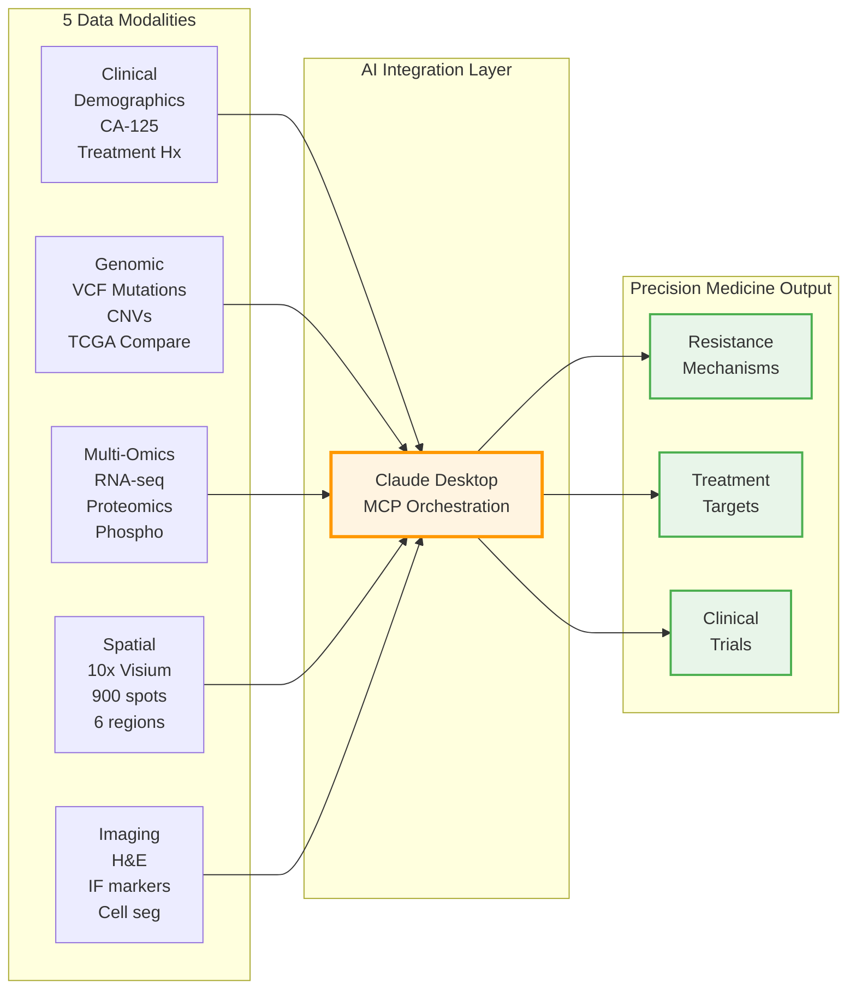

# PatientOne: Precision Medicine Workflow

Comprehensive precision medicine workflow for Stage IV Ovarian Cancer using all MCP servers.

## Overview

> **Quick references:** [PatientOne Profile](../../shared/patientone-profile.md) | [Platform Overview](../../shared/README.md) | [DRY_RUN Mode](../../shared/dry-run-mode.md) | [Cost Analysis](../../shared/cost-analysis.md)

PatientOne demonstrates end-to-end precision medicine analysis integrating:
- **Clinical** data (demographics, CA-125 trends)
- **Genomic** variants (VCF, CNVs, TCGA comparison)
- **Multiomics** (RNA/Protein/Phospho from PDX models)
- **Spatial** transcriptomics (10x Visium, 900 spots)
- **Imaging** (H&E histology, multiplex IF)
- **Perturbation** prediction (GEARS treatment response modeling)

**All synthetic data** for demonstration purposes.

**What makes PatientOne unique:** Unlike traditional bioinformatics pipelines that analyze individual data types in isolation, PatientOne shows how AI can seamlessly integrate across all modalities through **natural language** — replacing weeks of glue code with conversational requests.

### Data Integration Flow



---

## Research Use Only Disclaimer

**CRITICAL:** This workflow is for RESEARCH and EDUCATIONAL purposes only.

- **NOT clinically validated** — Do not use for actual patient care decisions
- **NOT FDA-approved** — Not a medical device or diagnostic tool
- **NOT a substitute for clinical judgment** — Requires expert review
- **FOR demonstration** — Shows feasibility of AI-orchestrated precision medicine
- **FOR research** — Hypothesis generation and method development

**All data is synthetic.** Any resemblance to actual patients is coincidental.

**See [complete disclaimers](../../../for-hospitals/compliance/disclaimers.md)**

---

## Prerequisites

### System Requirements
- **Python:** 3.11+
- **Claude Desktop:** Latest version ([Download](https://claude.ai/download))
- **RAM:** 16GB recommended
- **Disk:** 50GB free space
- **OS:** macOS, Linux, or Windows with WSL2

### Setup Verification

1. **Check Python version:**
```bash
python3 --version  # Should show 3.11 or higher
```

2. **Verify Claude Desktop configuration:**
```bash
cat ~/Library/Application\ Support/Claude/claude_desktop_config.json
# Should show all MCP servers configured
```

3. **Confirm data files exist:**
```bash
ls -lh ../../data/patient-data/PAT001-OVC-2025/
# Should show 17 files (~3.2 MB total)
```

### First-Time Setup

If you haven't installed the MCP servers yet:

```bash
# Clone repository
git clone https://github.com/lynnlangit/precision-medicine-mcp.git
cd precision-medicine-mcp

# Install dependencies (5-10 min)
cd manual_testing
./install_dependencies.sh

# Configure Claude Desktop
cp docs/getting-started/desktop-configs/claude_desktop_config.json ~/Library/Application\ Support/Claude/claude_desktop_config.json

# Restart Claude Desktop
# Verify servers loaded (should see all servers in Claude Desktop)

# Test basic server connectivity
./verify_servers.sh
```

---

## Running Modes: DRY_RUN vs Actual Data

PatientOne can run in two modes:

| Mode | Purpose | Data Source | External APIs | Best For |
|------|---------|-------------|---------------|----------|
| **DRY_RUN** (default) | Demo & testing | Synthetic responses | None | Quick demo, CI/CD, learning |
| **Actual Data** | Real analysis | Your files | May connect | Production, research, clinical |

**Quick Mode Selection:**
- **DRY_RUN mode** (default): No setup needed, works immediately with synthetic data
- **Actual Data mode**: Requires data files and configuration — see [Data Modes Guide](./data-modes-guide.md)

**Tip:** Start with DRY_RUN mode to understand the workflow (5 min), then switch to actual data for real analysis.

---

## Try PatientOne in 5 Minutes

### Option 1: Quick Demo (Single Test)

Run **Test 1** to see clinical + genomic integration:

1. **Open Claude Desktop**

2. **Copy/paste the prompt from:** [test-prompts/DRY_RUN/test-1-clinical-genomic.md](./test-prompts/DRY_RUN/test-1-clinical-genomic.md)

3. **Expected output:**
- Patient demographics (Sarah Anderson, 58yo, Stage IV HGSOC)
- CA-125 trajectory showing initial response then resistance
- Key mutations: TP53 R175H, PIK3CA E545K, PTEN LOH
- TCGA subtype: C1 Immunoreactive
- BRCA1 germline mutation implications

**Duration:** 5-10 minutes

---

### Option 2: Complete Analysis (All Tests)

Run all modular tests sequentially for comprehensive precision medicine analysis.

**See [test-prompts/README.md](./test-prompts/README.md) for the full test index.**

#### DRY_RUN Tests (9 tests)

| Test | Focus | Servers | Time |
|------|-------|---------|------|
| **[Test 1](./test-prompts/DRY_RUN/test-1-clinical-genomic.md)** | Clinical + Genomic | mockepic, fgbio, mocktcga | 5-10 min |
| **[Test 2](./test-prompts/DRY_RUN/test-2-multiomics-enhanced.md)** | Multi-Omics Resistance | multiomics | 5-10 min |
| **[Test 3](./test-prompts/DRY_RUN/test-3-spatial.md)** | Spatial Transcriptomics | spatialtools | 5-10 min |
| **[Test 4](./test-prompts/DRY_RUN/test-4-imaging.md)** | Histology & Imaging | openimagedata, deepcell, cell-classify | 5-10 min |
| **[Test 5](./test-prompts/DRY_RUN/test-5-integration.md)** | Integration & Recommendations | all (synthesis) | 5-10 min |
| **[Test 6](./test-prompts/DRY_RUN/test-6-citl-review.md)** | CitL Review & Approval | patient-report | 20-30 min |
| **[Test 7](./test-prompts/DRY_RUN/test-7-e2e-claude-desktop.md)** | E2E Claude Desktop | 6 servers, single prompt | 5-10 min |
| **[Test 8](./test-prompts/DRY_RUN/test-8-e2e-claude-desktop-with-connectors.md)** | E2E + Connectors | 6 servers + PubMed, ClinicalTrials, bioRxiv | 10-15 min |
| **[Test 9](./test-prompts/DRY_RUN/test-9-e2e-seqera-connector.md)** | E2E Seqera Connector | mockepic, genomic-results, patient-report + Seqera | 5-10 min |

#### Cost Estimates

| Data Mode | Time | Cost |
|-----------|------|------|
| **DRY_RUN** (all 9 tests) | ~45-65 min | ~$1 (tokens only) |
| **Actual Data** (small synthetic files) | 2-4 hours | $15-45 |
| **Production Data** (hospital volumes) | 4-8 hours | $24-104 |

**Cost Breakdown:**
- **DRY_RUN:** Claude token usage only (~30K tokens) — ~$1
- **Real Data:** See [Cost Analysis](../../shared/cost-analysis.md) for detailed per-mode cost breakdowns
  - Token costs stay low because MCP servers return summaries, not raw 3-8 GB files!

**Instructions:**
1. Open each test prompt file from [test-prompts/DRY_RUN/](./test-prompts/DRY_RUN/)
2. Copy/paste the prompt into Claude Desktop
3. Review results before proceeding to next test
4. Tests build on each other but are independently runnable

---

## MCP Server Orchestration

### How MCP Servers Contribute

| Workflow Stage | MCP Servers Engaged | Tools Used | Output |
|---|---|---|---|
| **1. Clinical Retrieval** | Epic | `query_patient_records`, `search_diagnoses` | Demographics, CA-125 trends, ICD-10 codes |
| **2. Genomic Analysis** | FGbio, TCGA | `validate_fastq`, `query_gene_annotations`, `compare_to_cohort`, `get_mutation_data` | VCF variants, CNV profile, TCGA subtype |
| **3. Multiomics Integration** | MultiOmics | `integrate_omics_data`, `calculate_stouffer_meta`, `create_multiomics_heatmap` | Resistance gene signatures, pathway activation |
| **4. Spatial Processing** | SpatialTools, DeepCell | `filter_quality`, `split_by_region`, `align_spatial_data`, `segment_cells` | Spatial expression maps, tissue segmentation |
| **5. Histology Analysis** | OpenImageData, DeepCell | `fetch_histology_image`, `register_image_to_spatial`, `classify_cell_states` | Cell counts, phenotype distributions |

---

## Imaging Modality Reference

Understanding the difference between imaging types is critical for correct analysis:

| Image Type | Microscopy Mode | Staining Method | Analysis Server(s) | Use Case |
|------------|----------------|-----------------|-------------------|----------|
| **H&E** | Brightfield | Chromogenic (Hematoxylin=blue nuclei, Eosin=pink cytoplasm) | OpenImageData | Tissue architecture, morphology, cellularity assessment |
| **IF (single-plex)** | Fluorescence | Single fluorescent antibody | OpenImageData + DeepCell | Protein marker quantification (CD8, Ki67, etc.) |
| **MxIF (multiplex)** | Fluorescence | Multiple fluorophores (2-7 colors) | OpenImageData + DeepCell | Cell phenotyping, protein co-localization, co-expression analysis |
| **Spatial RNA-seq** | N/A (sequencing) | Tabular CSV data (no images) | SpatialTools only | Gene expression patterns across tissue |

**Key Differences:**
- **H&E:** Brightfield microscopy with colored (chromogenic) stains — NOT fluorescence
- **IF/MxIF:** Fluorescence microscopy with fluorescent antibodies — requires different analysis
- **Spatial data:** No images, just CSV files with coordinates and expression values

**What is MxIF?**
MxIF (Multiplexed Immunofluorescence) enables imaging of multiple protein markers (2-7+) on a single tissue section through repeated rounds of staining, imaging, dye inactivation, and background subtraction.

The Patient One workflow uses the **open-source DeepCell-TF library** (https://github.com/vanvalenlab/deepcell-tf) for AI-based cell segmentation in MxIF images.

**When to use DeepCell in PatientOne Workflow:**
- MxIF/IF images requiring cell segmentation and quantification (CD8, Ki67, TP53/Ki67/DAPI multiplex)
- NOT for H&E images (used for visual morphology assessment only in this workflow)
- NOT for tabular spatial data (CSV files) — use SpatialTools instead

---

## Test Descriptions

### TEST_1: Clinical + Genomic Analysis
**Servers:** Epic, FGbio, TCGA
**Files:** 3 (patient_demographics.json, lab_results.json, somatic_variants.vcf)

**What it does:**
- Retrieves patient demographics and treatment history
- Analyzes CA-125 tumor marker trajectory
- Identifies somatic mutations and CNVs
- Compares to TCGA ovarian cancer cohort
- Determines molecular subtype

**Key Findings:**
- Platinum-resistant disease (8-month recurrence)
- TP53/PIK3CA/PTEN driver mutations
- C1 immunoreactive subtype
- BRCA1 germline mutation — HRD-positive

---

### TEST_2: Multi-Omics Resistance Analysis
**Servers:** MultiOmics
**Files:** 4 (pdx_rna_seq.csv, pdx_proteomics.csv, pdx_phosphoproteomics.csv, sample_metadata.csv)

**What it does:**
- Integrates RNA/Protein/Phospho data from 15 PDX samples
- Compares resistant vs sensitive samples (7 vs 8)
- Performs Stouffer's meta-analysis with FDR correction
- Identifies dysregulated pathways

**Key Findings:**
- PI3K/AKT/mTOR pathway activation in resistant samples
- PIK3CA, AKT1, mTOR, RPS6KB1 upregulated (p < 0.001)
- Drug efflux: ABCB1 (MDR1) overexpression
- Anti-apoptotic: BCL2L1 upregulation

---

### TEST_3: Spatial Transcriptomics
**Servers:** SpatialTools
**Files:** 3 (visium_gene_expression.csv, visium_spatial_coordinates.csv, visium_region_annotations.csv)

**What it does:**
- Processes 10x Visium spatial RNA-seq **tabular data** (900 spots, 31 genes)
- Identifies 6 tissue regions (tumor_core, proliferative, interface, stroma, etc.)
- Maps spatial expression patterns from CSV files
- Quantifies immune cell distribution
- **Generates visualizations:** Spatial heatmaps, gene expression matrices, autocorrelation plots

**Note:** Uses only tabular CSV data, not images. DeepCell is NOT needed for this test.

**Key Findings:**
- Immune exclusion phenotype (CD8+ low in tumor core)
- High proliferation in tumor_proliferative region (Ki67+, PCNA+)
- Thick stromal barrier separating immune cells from tumor
- Spatial heterogeneity in resistance markers

---

### TEST_4: Histology & Imaging
**Servers:** OpenImageData (H&E + MxIF), DeepCell (MxIF segmentation only)
**Files:** 4 TIFF images used in test (7 available: H&E brightfield, IF single-markers, multiplex IF)

**Test Files:**
1. PAT001_tumor_HE_20x.tiff - H&E brightfield (openimagedata ONLY)
2. PAT001_tumor_IF_CD8.tiff - IF fluorescence (openimagedata + deepcell)
3. PAT001_tumor_IF_KI67.tiff - IF fluorescence (openimagedata + deepcell)
4. PAT001_tumor_multiplex_IF_TP53_KI67_DAPI.tiff - MxIF 3-channel (openimagedata + deepcell)

**Key Findings:**
- Tumor cellularity: 70-80%
- Ki67 proliferation index: 45-55% (HIGH)
- CD8+ T cell density: 5-15 cells/mm2 (LOW, mostly peripheral)
- CD3+ overall: 30-50 cells/mm2 (moderate T cells, but not cytotoxic)

---

### TEST_5: Integration & Recommendations
**Servers:** All servers (synthesis)
**Files:** None (builds on previous tests)

**What it does:**
- Synthesizes findings across all 5 modalities
- Integrates molecular, spatial, and clinical insights
- Identifies actionable treatment targets
- Generates precision medicine recommendations

**Key Recommendations:**
- **Primary:** PI3K inhibitor (Alpelisib) targeting PIK3CA E545K mutation
- **Secondary:** Anti-PD-1 immunotherapy to overcome immune exclusion
- **Tertiary:** PARP inhibitor consideration (BRCA1 mutation, but PIK3CA pathway may limit efficacy)
- **Clinical trial:** NCT03602859 (alpelisib + paclitaxel in ovarian cancer)

---

### TEST_6: Clinician-in-the-Loop (CitL) Review
**Servers:** patient-report
**Files:** `draft_report.json` (generated from TEST_1-5)

**What it does:**
- Generates draft report with quality gates (4 automated checks)
- Clinician validates 10 molecular findings (CONFIRM/UNCERTAIN/INCORRECT)
- Assesses NCCN + institutional guideline compliance
- Reviews quality flags, makes decision: APPROVE / REVISE / REJECT
- Creates HIPAA-compliant audit trail with digital signature (10-year retention)

See [citl-quick-test.md](./citl-quick-test.md) for the hands-on CitL test guide.

---

### TEST_7-9: End-to-End Tests

- **[Test 7](./test-prompts/DRY_RUN/test-7-e2e-claude-desktop.md):** Single-prompt E2E covering 6 servers
- **[Test 8](./test-prompts/DRY_RUN/test-8-e2e-claude-desktop-with-connectors.md):** Test 7 + PubMed, ClinicalTrials.gov, bioRxiv connectors
- **[Test 9](./test-prompts/DRY_RUN/test-9-e2e-seqera-connector.md):** Focused E2E with Seqera nf-core pipeline discovery

---

## Data Assets

All synthetic patient data located in: `/data/patient-data/PAT001-OVC-2025/`

### File Inventory (18 files, ~3.2 MB total)

| Modality | Files | Size | Content Description |
|----------|-------|------|---------------------|
| **Clinical** | 2 | 10.7 KB | `patient_demographics.json`, `lab_results.json` |
| **Genomic** | 1 | 2.3 KB | `somatic_variants.vcf` (12 key variants) |
| **Multiomics** | 4 | 505 KB | `pdx_rna_seq.csv` (1K genes), `pdx_proteomics.csv` (500), `pdx_phosphoproteomics.csv` (300), `sample_metadata.csv` |
| **Spatial** | 4 | 315 KB | `visium_gene_expression.csv` (900 spots x 31 genes), `visium_spatial_coordinates.csv`, `visium_region_annotations.csv` |
| **Imaging** | 7 | 2.2 MB | H&E + IF (DAPI, CD3, CD8, Ki67, PanCK) + multiplex |
| **TOTAL** | **18** | **~3.2 MB** | Complete precision medicine dataset |

---

## Key Findings from PatientOne Analysis

### 1. Molecular Resistance Mechanisms

**From Multiomics Integration (MCP-MultiOmics):**
- **PI3K/AKT/mTOR pathway activation** in carboplatin-resistant PDX samples
- Upregulated genes/proteins: `PIK3CA`, `AKT1`, `mTOR`, `RPS6KB1` (Stouffer's combined p < 0.001)
- Drug efflux: `ABCB1` (MDR1) overexpression (log2FC = 2.8, FDR < 0.01)
- Anti-apoptotic: `BCL2L1` upregulation

**From Genomic Analysis (MCP-FGbio + MCP-TCGA):**
- `PIK3CA E545K` activating mutation (allele frequency 38%)
- `TP53 R175H` hotspot mutation (loss of function)
- `PTEN` loss of heterozygosity (tumor suppressor inactivation)
- TCGA subtype: **C1 Immunoreactive** (immune infiltration expected, but...)

### 2. Tumor Microenvironment

**From Spatial Transcriptomics (MCP-SpatialTools):**
- **6 distinct spatial regions** identified
- **Immune exclusion phenotype:** CD8+ T cells enriched at tumor periphery, sparse in core
- **Proliferation gradient:** Ki67/PCNA high in tumor_proliferative region
- **Stroma barrier:** Thick stromal band separating immune cells from tumor

**From Histology Imaging (MCP-OpenImageData + MCP-DeepCell):**
- Tumor cellularity: 70-80%
- Ki67 proliferation index: 45-55% (high)
- CD8+ T cell density: 5-15 cells/mm2 (LOW, mostly peripheral)
- CD3+ overall: 30-50 cells/mm2 (moderate T cell presence, but not cytotoxic)

### 3. Clinical-Molecular Integration

**From Clinical Data (MCP-Epic):**
- **CA-125 response pattern:** Initial deep response (1456 -> 22 U/mL) followed by resistance (-> 389 U/mL)
- **BRCA1 germline mutation:** HRD-positive — PARP inhibitor candidate, BUT PIK3CA pathway may confer resistance
- **Platinum-free interval:** 8 months — platinum-resistant category

### 4. MTB-Ready Treatment Recommendations

> All recommendations are presented for Molecular Tumor Board review using AMP/ASCO/CAP evidence tiers. Clinician validation is required via the [CITL workflow](../../../for-hospitals/citl-workflows/CITL_WORKFLOW_GUIDE.md) before clinical use.

**Primary Target: PI3K/AKT Pathway** *(Tier 1 — FDA-approved biomarker)*
- Consider: **Alpelisib** (PIK3CA inhibitor) given E545K mutation
- Clinical trial: NCT03602859 (alpelisib + paclitaxel in ovarian cancer)

**Secondary Target: Immune Checkpoint** *(Tier 2 — evidence from other tumor types)*
- Consider: **Anti-PD-1** (pembrolizumab, nivolumab) to overcome immune exclusion

**PARP Inhibitor Re-consideration** *(Tier 1 — FDA-approved for BRCA1+ ovarian)*
- Given BRCA1 mutation + HRD score 42, PARP inhibitor (olaparib, niraparib) remains option
- Caution: PIK3CA pathway activation may limit efficacy

---

## Bias Audit Summary

**Audit Date:** 2026-01-12 | **Risk Level:** MEDIUM (acceptable with mitigations)

The PatientOne workflow has undergone comprehensive bias auditing. Key findings:

- **5 checks passed:** Insurance status, geographic location, race/ethnicity coding, spatial algorithms, PDX models
- **3 biases detected and mitigated:** Euro-centric BRCA variant databases (MEDIUM), GTEx reference ranges 85% European (MEDIUM), generic cell type references (LOW)
- **Fairness metrics:** All within acceptable thresholds (<10% disparity)
- **No proxy features** used (geographic, socioeconomic data excluded)

**Full details:** [Bias Audit Guide](../../../for-hospitals/ethics/BIAS_AUDIT_GUIDE.md) | [Ethics & Bias Framework](../../../for-hospitals/ethics/ETHICS_AND_BIAS.md)

---

## Why PatientOne Matters

### Paradigm Shift in Precision Medicine

**From:** Siloed tools requiring weeks of glue code
**To:** AI-assisted clinical decision support for Molecular Tumor Boards

PatientOne demonstrates that with MCP servers, Claude can seamlessly coordinate across:
- EHR systems (clinical context)
- Genomic databases (molecular foundation)
- Multi-omics platforms (functional landscape)
- Spatial biology (tissue microenvironment)
- Medical imaging (cellular morphology)
- Reference cohorts (comparative context)

**All in one conversational interface** — replacing weeks of glue code with natural language prompts.

### Real-World Impact

While PatientOne uses synthetic data, the workflow represents a **real clinical decision-making process:**

1. **Tumor Board Preparation:** Integrate all available molecular data before multidisciplinary review
2. **Clinical Trial Matching:** Identify actionable targets and match to available trials
3. **Treatment Selection:** Evidence-based therapy recommendations accounting for resistance mechanisms
4. **Biomarker Monitoring:** Track CA-125 and other markers to assess response

---

## Technical Architecture

### Data Flow

```
User Prompt -> Claude Desktop -> MCP Protocol -> Server Selection
                                    |
                    +-------------------------------+
                    |  All MCP Servers              |
                    |  Each with specialized tools  |
                    +-------------------------------+
                                    |
            +---------------------------------------+
            |  Data Sources (Local Files)           |
            |  /data/patient-data/PAT001-OVC-2025/  |
            +---------------------------------------+
                                    |
            +---------------------------------------+
            |  Tool Execution & Results             |
            |  JSON responses with data             |
            +---------------------------------------+
                                    |
            +---------------------------------------+
            |  Claude Synthesis & Interpretation    |
            |  Integrated insights, recommendations |
            +---------------------------------------+
                                    |
                        User-friendly output
```

### Reproducibility

All PatientOne analyses are:
- **Logged:** Complete MCP server call history
- **Versioned:** Git-tracked data and configurations
- **Repeatable:** Deterministic tool execution (DRY_RUN mode available)
- **Auditable:** Full trace from raw data to recommendations

---

## Troubleshooting

### Issue: "MCP servers not found"

**Cause:** Claude Desktop config not loaded or servers not installed

**Fix:**
```bash
# Verify config exists
cat ~/Library/Application\ Support/Claude/claude_desktop_config.json

# If missing, copy template
cp docs/getting-started/desktop-configs/claude_desktop_config.json ~/Library/Application\ Support/Claude/

# Restart Claude Desktop
```

---

### Issue: "Cannot find data files"

**Cause:** Incorrect file paths or data not present

**Fix:**
```bash
# Verify data exists
ls -lh data/patient-data/PAT001-OVC-2025/
# Should show 17 files

# Check absolute path in prompt matches your system
pwd  # Note current directory
# Update file paths in prompts to match your installation
```

---

### Issue: "Server returned error / DRY_RUN warnings"

**Cause:** Servers are in DRY_RUN mode (expected behavior for testing)

**Explanation:**
- All MCP servers are configured with `DRY_RUN=true` by default
- This prevents actual external API calls while demonstrating tool orchestration
- Servers return realistic synthetic responses

**To use your own data:**
- See the [Data Modes Guide](./data-modes-guide.md) for complete instructions

---

### Issue: "Context limit exceeded"

**Cause:** Trying to run all tests in single prompt

**Fix:**
- Run tests individually (Test 1 through Test 5)
- Each test designed to fit within Claude Desktop context limits
- Do NOT combine multiple tests in one prompt
- Clear conversation history between tests if needed

---

### Issue: "Missing Python packages"

**Cause:** Virtual environments not set up correctly

**Fix:**
```bash
cd manual_testing
./install_dependencies.sh

# Verify each server's venv
for server in ../servers/mcp-*/; do
    echo "Checking $server"
    $server/venv/bin/python --version
done
```

---

## Expected Outputs

### For Each Test

Claude Desktop will generate:
1. **Data Summary:** Key statistics from loaded files
2. **Tool Execution:** MCP server calls with results
3. **Analysis:** Interpretation and synthesis
4. **Findings:** Bullet-point key discoveries

### Final Integrated Output (After TEST_5)

Comprehensive report including:
- **Executive Summary:** Patient profile and precision medicine strategy
- **Molecular Profile:** Genomic alterations, pathway dysregulation
- **Microenvironment:** Spatial distribution, immune landscape
- **Resistance Mechanisms:** Multi-omics signatures
- **Treatment Plan:** Evidence-based recommendations with rationale

---

## Related Documentation

- **Test Prompts:** [test-prompts/README.md](./test-prompts/README.md) — Full test index (DRY_RUN and SYNTHETIC_DATA)
- **Data Modes:** [data-modes-guide.md](./data-modes-guide.md) — DRY_RUN vs Actual Data configuration
- **CitL Testing:** [citl-quick-test.md](./citl-quick-test.md) — Clinician-in-the-Loop workflow test
- **Immunotherapy:** [immunotherapy-reference.md](./immunotherapy-reference.md) — Next-gen immunotherapy candidates
- **Spatial Workflow:** [Architecture](../../architecture/spatial/README.md)
- **Imaging Workflow:** [Architecture](../../architecture/imaging/README.md)
- **Multiomics Workflow:** [Architecture](../../architecture/rna/multiomics.md)
- **Main Project:** [Precision Medicine MCP Servers](../../../README.md)

---

## Support

**Issues:** https://github.com/lynnlangit/precision-medicine-mcp/issues
**Documentation:** https://github.com/lynnlangit/precision-medicine-mcp

---

**Last Updated:** February 23, 2026
**Testing Status:** 9 DRY_RUN tests + 4 SYNTHETIC_DATA tests validated
**Data:** 100% synthetic for demonstration purposes
