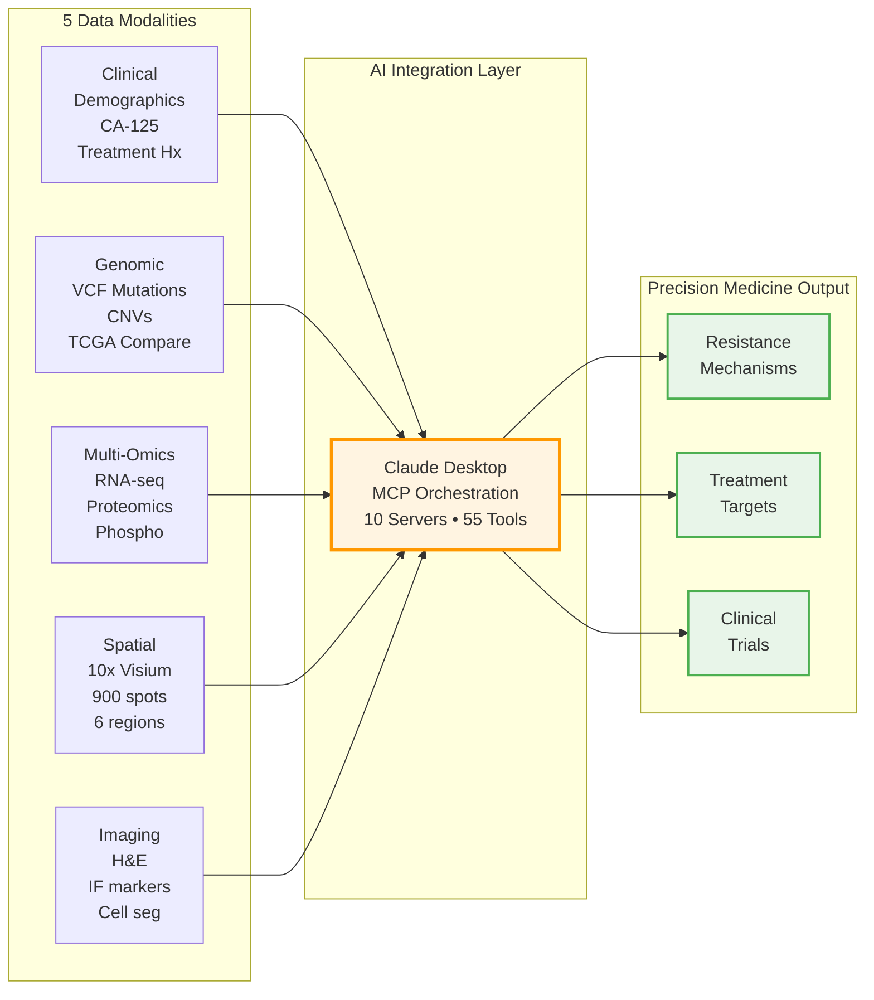

# PatientOne: Comprehensive Precision Medicine Architecture

## Overview

PatientOne demonstrates how Claude orchestrates 10 MCP servers (9 deployed + mcp-epic local) to deliver comprehensive precision medicine analysis for a patient with Stage IV Ovarian Cancer. This end-to-end workflow integrates clinical, genomic, multiomics, spatial, and imaging data to identify resistance mechanisms and actionable treatment targets.

**What makes PatientOne unique:** Unlike traditional bioinformatics pipelines that analyze individual data types in isolation, PatientOne shows how AI can seamlessly integrate across all modalities through **natural language**—replacing weeks of glue code with conversational requests.

### Data Integration Flow


---

## ⚠️ Research Use Only Disclaimer

**CRITICAL:** This workflow is for RESEARCH and EDUCATIONAL purposes only.

- ❌ **NOT clinically validated** - Do not use for actual patient care decisions
- ❌ **NOT FDA-approved** - Not a medical device or diagnostic tool
- ❌ **NOT a substitute for clinical judgment** - Requires expert review
- ✅ **FOR demonstration** - Shows feasibility of AI-orchestrated precision medicine
- ✅ **FOR research** - Hypothesis generation and method development

**All data is synthetic.** Any resemblance to actual patients is coincidental.

**See [complete disclaimers →](../../docs/DISCLAIMERS.md)**

---

## Clinical Context

### Patient Profile (Synthetic Data)

**Patient ID:** PAT001-OVC-2025
**Demographics:** Sarah Anderson (pseudonym), 58-year-old female, Caucasian
**Diagnosis:** Stage IV High-Grade Serous Ovarian Carcinoma (HGSOC)
**FIGO Stage:** IVB (pleural effusion, distant metastases)
**Treatment History:**
- Primary debulking surgery (2023)
- First-line: Carboplatin + Paclitaxel (6 cycles) - Initial response
- Recurrence at 8 months → Platinum-resistant disease
- Second-line: Doxil (pegylated liposomal doxorubicin) - Partial response
- Current status: Stable disease, considering clinical trial enrollment

**Family History:** Mother diagnosed with breast cancer at age 52
**Germline Status:** BRCA1 pathogenic mutation (c.5266dupC, p.Gln1756fs)

**Clinical Markers:**
- CA-125 trajectory:
  - Diagnosis: 1,456 U/mL
  - Post-treatment nadir: 22 U/mL
  - Platinum-resistant recurrence: 389 U/mL
  - Current: 289 U/mL (stable on second-line therapy)

---

## The Precision Medicine Challenge

How do we integrate:
- **Clinical records** from EHR systems (demographics, treatment history, biomarkers)
- **Genomic variants** from whole-exome/genome sequencing (mutations, CNVs)
- **Gene expression** from bulk RNA-seq (transcriptomic profiles)
- **Multi-omics data** from PDX models (RNA/Protein/Phospho resistance signatures)
- **Spatial context** from spatial transcriptomics (tissue microenvironment, immune landscape)
- **Histology imaging** from H&E and IF microscopy (cellular architecture, phenotypes)

...to make **actionable treatment recommendations** that account for:
- Molecular mechanisms of resistance
- Tumor microenvironment composition
- Pathway-level dysregulation
- Available therapeutic options

**Traditional Approach:** Weeks of custom scripts, multiple software tools, manual data wrangling, siloed analysis
**PatientOne with MCP:** Conversational requests that orchestrate 55 tools across 10 servers automatically


## Architecture Overview

### 5 Integrated Data Modalities

```
┌─────────────────────────────────────────────────────────────┐
│                      PatientOne Workflow                     │
└─────────────────────────────────────────────────────────────┘
                              ↓
┌─────────────────────────────────────────────────────────────┐
│  1. CLINICAL DATA (Epic Server)                             │
│  ━━━━━━━━━━━━━━━━━━━━━━━━━━━━━━━━━━━━━━━━━━━━━━━━━━━━━━━  │
│  • Demographics, family history                             │
│  • CA-125 tumor marker trends (4 timepoints)                │
│  • CBC, metabolic panel                                     │
│  • Treatment timeline & response assessment                 │
├─────────────────────────────────────────────────────────────┤
│  2. GENOMIC DATA (FGbio + TCGA Servers)                     │
│  ━━━━━━━━━━━━━━━━━━━━━━━━━━━━━━━━━━━━━━━━━━━━━━━━━━━━━━━  │
│  • Somatic mutations: TP53 R175H, PIK3CA E545K, PTEN LOH    │
│  • Copy number: MYC/CCNE1/AKT2/KRAS amplified               │
│  • HRD score: 42 (positive for homologous recombination)    │
│  • TCGA cohort comparison → C1 immunoreactive subtype       │
├─────────────────────────────────────────────────────────────┤
│  3. MULTIOMICS DATA (MultiOmics Server)                     │
│  ━━━━━━━━━━━━━━━━━━━━━━━━━━━━━━━━━━━━━━━━━━━━━━━━━━━━━━━  │
│  • 15 PDX samples (7 resistant, 8 sensitive to carboplatin) │
│  • RNA-seq: 1,000 genes × 15 samples                        │
│  • Proteomics: 500 proteins × 15 samples                    │
│  • Phosphoproteomics: 300 sites × 15 samples                │
│  • Analysis: Stouffer's meta-analysis, FDR correction       │
│  • Findings: PI3K/AKT/mTOR pathway activation in resistant  │
├─────────────────────────────────────────────────────────────┤
│  4. SPATIAL DATA (SpatialTools + DeepCell Servers)          │
│  ━━━━━━━━━━━━━━━━━━━━━━━━━━━━━━━━━━━━━━━━━━━━━━━━━━━━━━━  │
│  • 10x Visium spatial transcriptomics                       │
│  • 900 spatial spots, 31 genes profiled                     │
│  • 6 tissue regions: tumor_core, proliferative, interface,  │
│    stroma_immune, stroma, necrotic_hypoxic                  │
│  • Spatial heterogeneity in resistance markers              │
│  • Immune exclusion phenotype (CD8+ low/peripheral)         │
├─────────────────────────────────────────────────────────────┤
│  5. IMAGING DATA (OpenImageData + DeepCell Servers)         │
│  ━━━━━━━━━━━━━━━━━━━━━━━━━━━━━━━━━━━━━━━━━━━━━━━━━━━━━━━  │
│  • 7 high-resolution TIFF images                            │
│  • H&E histology (20x magnification)                        │
│  • Immunofluorescence: DAPI, CD3, CD8, Ki67, PanCK          │
│  • Multiplex IF: TP53/Ki67/DAPI 3-channel                   │
│  • Cell segmentation, phenotyping, quantification           │
│  • Findings: 70-80% tumor cellularity, Ki67 ~45-55%         │
└─────────────────────────────────────────────────────────────┘
                              ↓
┌─────────────────────────────────────────────────────────────┐
│               INTEGRATED SYNTHESIS & INSIGHTS                │
│  ━━━━━━━━━━━━━━━━━━━━━━━━━━━━━━━━━━━━━━━━━━━━━━━━━━━━━━━  │
│  • Molecular resistance signature: PIK3CA/AKT1/ABCB1 high   │
│  • Microenvironment: Immune exclusion, high stroma          │
│  • Proliferation: Ki67+ tumor core, regional heterogeneity  │
│  • Actionable targets: PI3K inhibitors, immune checkpoint   │
│  • Treatment recommendation: Alpelisib + anti-PD-1 combo    │
└─────────────────────────────────────────────────────────────┘
```


---

## MCP Server Orchestration

### How All 9 Servers Contribute

| Workflow Stage | MCP Servers Engaged | Tools Used | Output |
|---|---|---|---|
| **1. Clinical Retrieval** | Epic | `query_patient_records`, `search_diagnoses` | Demographics, CA-125 trends, ICD-10 codes |
| **2. Genomic Analysis** | FGbio, TCGA | `validate_fastq`, `query_gene_annotations`, `compare_to_cohort`, `get_mutation_data` | VCF variants, CNV profile, TCGA subtype |
| **3. Multiomics Integration** | MultiOmics | `integrate_omics_data`, `calculate_stouffer_meta`, `create_multiomics_heatmap` | Resistance gene signatures, pathway activation |
| **4. Spatial Processing** | SpatialTools, DeepCell | `filter_quality`, `split_by_region`, `align_spatial_data`, `segment_cells` | Spatial expression maps, tissue segmentation |
| **5. Histology Analysis** | OpenImageData, DeepCell | `fetch_histology_image`, `register_image_to_spatial`, `classify_cell_states` | Cell counts, phenotype distributions |
| **6. Workflow Orchestration** | Seqera | `launch_nextflow_pipeline`, `monitor_workflow_status` | Reproducible pipeline execution |
| **7. ML Inference** | HuggingFace | `predict_cell_type`, `embed_sequences` | Cell type predictions, sequence embeddings |

**Total Servers:** 9
**Total Tools:** 36
**Integration:** Seamless orchestration through natural language prompts

---

## Data Assets

All synthetic patient data located in: `/data/patient-data/PAT001-OVC-2025/`

### File Inventory (18 files, ~3.2 MB total)

| Modality | Files | Size | Content Description |
|----------|-------|------|---------------------|
| **Clinical** | 2 | 10.7 KB | `patient_demographics.json`, `lab_results.json` |
| **Genomic** | 1 | 2.3 KB | `somatic_variants.vcf` (12 key variants) |
| **Multiomics** | 4 | 505 KB | `pdx_rna_seq.csv` (1K genes), `pdx_proteomics.csv` (500), `pdx_phosphoproteomics.csv` (300), `sample_metadata.csv` |
| **Spatial** | 4 | 315 KB | `visium_gene_expression.csv` (900 spots × 31 genes), `visium_spatial_coordinates.csv`, `visium_region_annotations.csv` |
| **Imaging** | 7 | 2.2 MB | H&E + IF (DAPI, CD3, CD8, Ki67, PanCK) + multiplex |
| **TOTAL** | **18** | **~3.2 MB** | Complete precision medicine dataset |

---

## Key Findings from PatientOne Analysis

### 1. Molecular Resistance Mechanisms

**From Multiomics Integration (MCP-MultiOmics):**
- **PI3K/AKT/mTOR pathway activation** in carboplatin-resistant PDX samples
- Upregulated genes/proteins: `PIK3CA`, `AKT1`, `mTOR`, `RPS6KB1` (Stouffer's combined p < 0.001)
- Drug efflux: `ABCB1` (MDR1) overexpression (log2FC = 2.8, FDR < 0.01)
- Anti-apoptotic: `BCL2L1` upregulation

**From Genomic Analysis (MCP-FGbio + MCP-TCGA):**
- `PIK3CA E545K` activating mutation (allele frequency 38%)
- `TP53 R175H` hotspot mutation (loss of function)
- `PTEN` loss of heterozygosity (tumor suppressor inactivation)
- TCGA subtype: **C1 Immunoreactive** (immune infiltration expected, but...)

### 2. Tumor Microenvironment

**From Spatial Transcriptomics (MCP-SpatialTools):**
- **6 distinct spatial regions** identified
- **Immune exclusion phenotype:** CD8+ T cells enriched at tumor periphery, sparse in core
- **Proliferation gradient:** Ki67/PCNA high in tumor_proliferative region
- **Stroma barrier:** Thick stromal band separating immune cells from tumor

**From Histology Imaging (MCP-OpenImageData + MCP-DeepCell):**
- Tumor cellularity: 70-80%
- Ki67 proliferation index: 45-55% (high)
- CD8+ T cell density: 5-15 cells/mm² (LOW, mostly peripheral)
- CD3+ overall: 30-50 cells/mm² (moderate T cell presence, but not cytotoxic)

### 3. Clinical-Molecular Integration

**From Clinical Data (MCP-Epic):**
- **CA-125 response pattern:** Initial deep response (1456 → 22 U/mL) followed by resistance (→ 389 U/mL)
- **BRCA1 germline mutation:** HRD-positive → PARP inhibitor candidate, BUT PIK3CA pathway may confer resistance
- **Platinum-free interval:** 8 months → platinum-resistant category

### 4. Actionable Treatment Recommendations

**Primary Target: PI3K/AKT Pathway**
- Consider: **Alpelisib** (PIK3CA inhibitor) given E545K mutation
- Rationale: Direct target of activating mutation, demonstrated efficacy in PIK3CA-mutant cancers
- Clinical trial: NCT03602859 (alpelisib + paclitaxel in ovarian cancer)

**Secondary Target: Immune Checkpoint**
- Consider: **Anti-PD-1** (pembrolizumab, nivolumab) to overcome immune exclusion
- Rationale: C1 immunoreactive subtype suggests immune-responsive potential
- Combination: Alpelisib + anti-PD-1 may reverse exclusion + activate cytotoxic response

**PARP Inhibitor Re-consideration**
- Given BRCA1 mutation + HRD score 42, PARP inhibitor (olaparib, niraparib) remains option
- Caution: PIK3CA pathway activation may limit efficacy
- Strategy: Sequence after PI3K inhibitor or combination approach

---

## Outputs by Stakeholder

### For Bioinformaticians (`patient-one-outputs/for-researchers/patient-001/`)

**Data Files (CSV/JSON/TXT):**
- **differential_expression.csv:** Differential expression results (tumor core vs stroma), 17 significant DEGs, log2FC, p-values, FDR
- **spatial_autocorrelation.csv:** Moran's I spatial statistics for all 31 genes with z-scores and p-values
- **cell_deconvolution.csv:** Cell type signature scores by tissue region (fibroblasts, immune, hypoxic, resistant)
- **clinical_summary.txt:** Human-readable analysis report with molecular findings, spatial organization, treatment recommendations
- **metadata.json:** Analysis metadata, patient ID, dataset statistics, configuration parameters

**Visualizations (PNG, 300 DPI):**
- **volcano_plot.png:** Differential expression visualization with 17 significant DEGs highlighted (TP53, KRT8, ABCB1, etc.)
- **spatial_heatmap.png:** Spatial expression patterns for top 6 spatially variable genes (HIF1A, BCL2L1, CD3D, KRT8, MYC, VEGFA)
- **cell_composition_heatmap.png:** Cell type enrichment heatmap across 6 tissue regions
- **spatial_autocorrelation_plot.png:** Moran's I bar chart for top 15 genes ranked by spatial clustering strength
- **summary_figure.png:** Publication-ready multi-panel figure (6 panels: DEGs, cell types, spatial patterns, statistics)

### For Developers (`patient-one-outputs/for-developer/`)
- **MCP_Report_PAT001.pdf:** Technical validation report showing all MCP server calls, data flows, and integration points
- **MCP_Report_PAT001_v2.0_NewSections.pdf:** Enhanced version with additional sections and analysis details
- **MCP_Servers_Reference_Guide.pdf:** Complete documentation of 10 servers and 55 tools used
- **Full_Test_Prompt.pdf:** End-to-end prompt that reproduces entire analysis

### For Care Teams (`patient-one-outputs/for-care-team/`)
- **spatial_transcriptomics_analysis.png:** Tissue region maps showing immune landscape and spatial heterogeneity
- **histology_imaging_analysis.png:** Cell segmentation results with Ki67 proliferation index and CD8+ T cell quantification
- **multiomics_resistance_analysis.png:** PI3K/AKT/mTOR pathway visualization showing resistance gene signatures
- **MCP_Report_PAT001.pdf:** Complete technical report with clinical context and actionable findings
- **generate_multiomics_figure.py:** Python script for regenerating multi-omics visualizations

### For Patients (`patient-one-outputs/for-patient/`)
- **medication_guide.pdf:** Plain-language explanation of recommended therapies and how they work
- **patient_summary.pdf:** Disease status, test results, next steps in accessible language
- **patient_infographic.png:** Visual summary of tumor profile and treatment strategy
- **HTML-versions/:** Web-friendly versions of medication guide and patient summary

---

## Implementation Guide

### Testing Strategy

PatientOne testing is divided into **5 modular tests** to avoid Claude Desktop context limits:

| Test | Focus | Servers | Data Files | Duration | Status |
|------|-------|---------|------------|----------|--------|
| **TEST_1** | Clinical + Genomic | Epic, FGbio, TCGA | 3 files | 5-10 min | ✅ |
| **TEST_2** | Multi-Omics | MultiOmics | 4 files | 5-10 min | ✅ |
| **TEST_3** | Spatial Transcriptomics | SpatialTools, DeepCell | 3 files | 5-10 min | ✅ |
| **TEST_4** | Histology & Imaging | OpenImageData, DeepCell | 4 images | 5-10 min | ✅ |
| **TEST_5** | Integration & Recommendations | All servers | Synthesis | 5 min | ✅ |

**Each test is independently runnable and sequentially composable.**

### Quick Start

**Running PatientOne:**

PatientOne supports two modes:
- **DRY_RUN mode** (default): Uses synthetic data for demonstration — works immediately
- **Actual Data mode**: Analyzes your real patient data files — requires configuration

For detailed instructions:
- [PatientOne Quick Start Guide →](../../tests/manual_testing/PatientOne-OvarianCancer/README.md) - How to run the tests
- [Data Modes Configuration Guide →](../../tests/manual_testing/PatientOne-OvarianCancer/DATA_MODES_GUIDE.md) - DRY_RUN vs Actual Data setup

### Test Prompts

All test prompts available in:
- `manual_testing/PatientOne-OvarianCancer/implementation/TEST_1_CLINICAL_GENOMIC.txt`
- `manual_testing/PatientOne-OvarianCancer/implementation/TEST_2_MULTIOMICS.txt`
- `manual_testing/PatientOne-OvarianCancer/implementation/TEST_3_SPATIAL.txt`
- `manual_testing/PatientOne-OvarianCancer/implementation/TEST_4_IMAGING.txt`
- `manual_testing/PatientOne-OvarianCancer/implementation/TEST_5_INTEGRATION.txt`

---

## Why PatientOne Matters

### Paradigm Shift in Precision Medicine

**From:** AI tools for bioinformatics analysis
**To:** AI as orchestrator of complete precision medicine workflows

PatientOne demonstrates that with MCP servers, Claude can seamlessly coordinate across:
- ✅ EHR systems (clinical context)
- ✅ Genomic databases (molecular foundation)
- ✅ Multi-omics platforms (functional landscape)
- ✅ Spatial biology (tissue microenvironment)
- ✅ Medical imaging (cellular morphology)
- ✅ Reference cohorts (comparative context)
- ✅ Workflow engines (reproducibility)
- ✅ ML models (predictive power)

**All in one conversational interface** — replacing weeks of glue code with natural language prompts.

### Real-World Impact

While PatientOne uses synthetic data, the workflow represents a **real clinical decision-making process**:

1. **Tumor Board Preparation:** Integrate all available molecular data before multidisciplinary review
2. **Clinical Trial Matching:** Identify actionable targets and match to available trials
3. **Treatment Selection:** Evidence-based therapy recommendations accounting for resistance mechanisms
4. **Biomarker Monitoring:** Track CA-125 and other markers to assess response

**Future Direction:** Integration with real EHR systems, genomic databases, and clinical workflows for production precision medicine.

---

## Technical Architecture Details

### Data Flow

```
User Prompt → Claude Desktop → MCP Protocol → Server Selection
                                    ↓
                    ┌───────────────────────────────┐
                    │  9 MCP Servers (Local)        │
                    │  Each with specialized tools  │
                    └───────────────────────────────┘
                                    ↓
            ┌───────────────────────────────────────┐
            │  Data Sources (Local Files)           │
            │  /data/patient-data/PAT001-OVC-2025/  │
            └───────────────────────────────────────┘
                                    ↓
            ┌───────────────────────────────────────┐
            │  Tool Execution & Results             │
            │  JSON responses with data             │
            └───────────────────────────────────────┘
                                    ↓
            ┌───────────────────────────────────────┐
            │  Claude Synthesis & Interpretation    │
            │  Integrated insights, recommendations │
            └───────────────────────────────────────┘
                                    ↓
                        User-friendly output
```

### Reproducibility

All PatientOne analyses are:
- **Logged:** Complete MCP server call history
- **Versioned:** Git-tracked data and configurations
- **Repeatable:** Deterministic tool execution (DRY_RUN mode available)
- **Auditable:** Full trace from raw data to recommendations

---

## Related Documentation

- **Main Project:** [Precision Medicine MCP Servers →](../../README.md)
- **Spatial Transcriptomics Workflow:** [Architecture →](../spatial-transcriptomics/README.md)
- **Imaging Analysis Workflow:** [Architecture →](../imaging/README.md)
- **Multiomics Workflow:** [Architecture →](../multiomics/README.md)
- **Testing Guide:** [PatientOne Implementation →](../../tests/manual_testing/PatientOne-OvarianCancer/README.md)

---

**Last Updated:** 2026-01-10
**Version:** 1.0
**Status:** Demonstration POC with synthetic data
