# mcp-perturbation Server Architecture

## Overview

The mcp-perturbation server predicts how patient cells will respond to treatments using GEARS (Graph-Enhanced Gene Activation and Repression Simulator), a state-of-the-art graph neural network published in Nature Biotechnology 2024.

---

## Server Capabilities


---

## Complete Workflow: Predict Treatment Response

```mermaid
flowchart TD
    Start([User: Predict checkpoint<br/>inhibitor response]) --> Load

    subgraph "Step 1: Load Reference Data"
        Load[perturbation_load_dataset<br/>GSE184880 ovarian cancer]
        Load --> Normalize[Normalize + log1p<br/>Select 7000 HVGs]
    end

    subgraph "Step 2: Setup GEARS Model"
        Normalize --> Setup[perturbation_setup_model<br/>hidden_size=64, num_layers=2]
        Setup --> Init[Initialize GNN<br/>Load gene networks]
    end

    subgraph "Step 3: Train Model"
        Init --> Train[perturbation_train_model<br/>20 epochs, batch_size=32]
        Train --> Checkpoint{Model<br/>converged?}
        Checkpoint -->|Yes| Trained[Model ready]
        Checkpoint -->|No| Train
    end

    subgraph "Step 4: Predict Response"
        Trained --> Predict[perturbation_predict_response<br/>genes: PDCD1,CTLA4<br/>cell_type: T_cells]
        Predict --> Effect[Compute perturbation effect<br/>40% better than VAE]
        Effect --> Multi[Multi-gene prediction<br/>Handles combinations]
    end

    subgraph "Step 5: Analyze Results"
        Multi --> DE[perturbation_differential_expression<br/>Top changed genes]
        DE --> Viz[perturbation_visualize<br/>PCA/UMAP plots]
    end

    Viz --> Results([Results: Predicted cell states<br/>Changed genes: GZMB↑ PRF1↑ IFNG↑<br/>Treatment recommendation])

    style Start fill:#e3f2fd
    style Results fill:#c8e6c9
    style Predict fill:#fff9c4
    style Effect fill:#ffe0b2
```



---

## GEARS Architecture: How Predictions Work


---

## PatientOne Use Case: Ovarian Cancer Treatment Prediction

```mermaid
sequenceDiagram
    participant Clinician
    participant MCP Server
    participant GEARS Model
    participant GCS Data

    Clinician->>MCP Server: Load PatientOne baseline T cells
    MCP Server->>GCS Data: Fetch patientone_tcells.h5ad
    GCS Data-->>MCP Server: 500 cells, 100 genes

    Clinician->>MCP Server: Setup GEARS model
    MCP Server->>GEARS Model: Initialize GNN (hidden=64, layers=2)
    GEARS Model-->>MCP Server: Model ready

    Clinician->>MCP Server: Train on ovarian cancer data
    MCP Server->>GEARS Model: Train 20 epochs
    Note over GEARS Model: Learning gene networks<br/>Control vs treated patterns
    GEARS Model-->>MCP Server: Training complete (5x faster than VAE)

    Clinician->>MCP Server: Predict checkpoint inhibitor response<br/>Genes: PDCD1, CTLA4
    MCP Server->>GEARS Model: Predict multi-gene perturbation
    GEARS Model-->>MCP Server: Predicted cell states + effect

    MCP Server->>MCP Server: Compute differential expression
    Note over MCP Server: Top genes:<br/>GZMB ↑2.5x (cytotoxicity)<br/>PRF1 ↑2.0x (cell killing)<br/>IFNG ↑1.8x (immune activation)

    MCP Server-->>Clinician: Treatment prediction + top changed genes
    Note over Clinician: Decision: Patient likely<br/>to respond to checkpoint<br/>inhibitor therapy
```



---

## Key Features

### 🎯 **Multi-Gene Perturbations**
```
Single gene:       "PDCD1"
Multi-gene combo:  "PDCD1,CTLA4,LAG3"
```
GEARS handles complex combinatorial effects that VAE-based methods struggle with.

### ⚡ **Faster Training**
- **scGen (VAE)**: 100+ epochs
- **GEARS (GNN)**: 20 epochs
- **Result**: 5x faster

### 📊 **Better Performance**
- **40% higher precision** vs VAE methods
- **Integrates biological knowledge** (gene networks, GO terms)
- **Uncertainty quantification** (confidence scores)

### 🔬 **Production Ready**
- Python 3.11+ compatible
- No dependency conflicts
- 4Gi memory, 2 CPU on Cloud Run
- SSE transport for remote access

---

## Data Flow


---

## Comparison: GEARS vs scGen

| Feature | scGen (VAE) | GEARS (GNN) |
|---------|-------------|-------------|
| **Architecture** | Variational Autoencoder | Graph Neural Network |
| **Publication** | Nature Methods 2019 | Nature Biotech 2024 |
| **Python Version** | 3.9 only | 3.11+ ✅ |
| **Training Speed** | 100+ epochs | 20 epochs (5x faster) |
| **Precision** | Baseline | +40% improvement |
| **Multi-gene** | Limited | Excellent ✅ |
| **Biological Knowledge** | No | Uses gene networks ✅ |
| **Dependencies** | Conflicts ❌ | Modern & compatible ✅ |

---

## Resources

- **Memory**: 4Gi (for PyTorch + torch-geometric)
- **CPU**: 2 cores
- **Storage**: GEARS datasets cached (~5GB for Norman)
- **Cloud Run URL**: `https://mcp-perturbation-ondu7mwjpa-uc.a.run.app/sse`

---

## Example API Call

```json
{
  "tool": "perturbation_predict_response",
  "params": {
    "model_name": "ovarian_cancer_model",
    "patient_data_path": "gs://sample-inputs-patientone/perturbation/patientone_tcells.h5ad",
    "cell_type_to_predict": "T_cells",
    "treatment_key": "PDCD1,CTLA4"
  }
}
```

**Returns:**
```json
{
  "status": "success",
  "predicted_cells": 250,
  "effect_magnitude": 0.82,
  "top_changed_genes": [
    {"gene": "GZMB", "fold_change": 2.5, "direction": "up"},
    {"gene": "PRF1", "fold_change": 2.0, "direction": "up"},
    {"gene": "IFNG", "fold_change": 1.8, "direction": "up"}
  ],
  "output_path": "/predictions/predicted_cells.h5ad"
}
```

---

**Created**: January 20, 2026
**Server Version**: 0.2.0
**GEARS Version**: 0.1.2
**Status**: ✅ Production Ready
