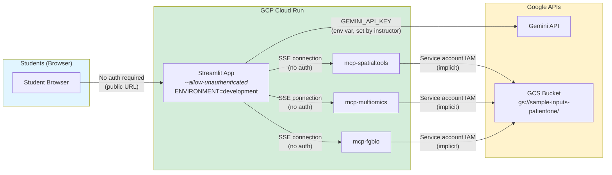

# Student MCP Chat App - For Study Group

This is a **safety-limited version** of the MCP Chat app designed for the bioinformatics study group (6 students, 6 weeks).

## Key Differences from Main App

| Feature | This App (Students) | Main App (Instructor) |
|---------|-------------------|---------------------|
| **Purpose** | Learning with safety limits | Unrestricted testing |
| **LLM Provider** | Gemini only (Flash/Pro) | Claude + Gemini |
| **Token Limit** | 50,000 per session | Unlimited |
| **Request Limit** | 50 per session | Unlimited |
| **Cost Display** | Gemini Flash pricing | Per-provider pricing |
| **Cost Cap** | ~$1.50 per session | No limit |
| **File Upload** | Disabled (uses GCS data) | Full upload + GCS |
| **Authentication** | None (public access) | Optional SSO |
| **Usage Display** | Always visible | Optional |
| **Service Name** | `streamlit-mcp-chat-students` | `streamlit-mcp-chat` |

## Active MCP Servers (Default)

The student app connects to **3 production servers** by default:

| Server | Description |
|--------|-------------|
| **spatialtools** | Spatial transcriptomics (Moran's I, cell deconvolution, DE) |
| **multiomics** | Multi-omics integration (RNA/Protein/Phospho), pathway enrichment |
| **fgbio** | Genomic QC and FASTQ validation |

See [Server Registry](../../docs/reference/shared/server-registry.md) for tool counts and full server list.

All built-in prompts use PatientOne sample data from GCS bucket `gs://sample-inputs-patientone/patient-data/PAT001-OVC-2025/`.

### Data Access

- **Built-in prompts** reference PatientOne data in the instructor's GCS bucket
- **Custom prompts** can reference any **public** GCS bucket (students type `gs://` paths in the chat box)
- **File upload is disabled** — local files can't reach Cloud Run MCP servers
- **Private buckets** are not accessible unless the Cloud Run service account has been granted read permission

## Example Prompts (6 built-in)

| Prompt | Server(s) | What it demonstrates |
|--------|-----------|---------------------|
| **Warm Up Servers** | all 3 | Lists tools — wakes up cold Cloud Run instances |
| **Spatial Analysis** | spatialtools | Moran's I autocorrelation on Visium data |
| **Multi-omics Integration** | multiomics | Load/align/QC across RNA + protein + phospho |
| **Genomic QC** | fgbio | FASTQ file validation and quality metrics |
| **Pathway Enrichment** | multiomics | GO biological process enrichment |
| **PatientOne Mini Workflow** | fgbio + spatialtools | 2-step: FASTQ QC then spatial autocorrelation |

**Tip**: Run "Warm Up Servers" first to avoid cold-start delays (servers have `min-instances=0`).

## Authentication & Data Flow

The student app uses a simplified auth model — no login required. The instructor's API key is baked into the Cloud Run deployment.



**Key points:**
- **Students** access the app via a public Cloud Run URL (no login, no API keys)
- **Gemini API key** is set as a Cloud Run env var by the instructor at deploy time — students never see it
- **MCP servers** are public Cloud Run services (`--allow-unauthenticated`) — the Streamlit app connects via SSE
- **GCS data access** uses the Cloud Run default service account's IAM permissions (implicit, no keys needed)
- **The auth module** (`utils/auth.py`) supports Azure AD SSO via OAuth2 Proxy for hospital deployments, but in student mode (`ENVIRONMENT=development`) it returns a mock dev user and is effectively bypassed

## Shared Infrastructure

Both apps use:
- **Same MCP servers** (no duplication)
- **Same provider code** (copied from main app)
- **Same utilities** (copied from main app)

Only `app.py` differs (adds safety guardrails, forces Gemini, removes provider switching, disables file upload).

**Note**: `providers/` and `utils/` are copied from `../streamlit-app/` to ensure Docker builds work correctly (symlinks don't work in Docker build context).

## Directory Structure

```
streamlit-app-students/
├── app.py                    # Student app with guardrails
├── providers/                # Copied from ../streamlit-app/providers/
├── utils/
│   ├── mcp_config.py         # Server URLs + 6 example prompts
│   └── ...                   # Other utils (copied from main app)
├── for-instructors/          # Instructor materials
│   ├── 6-wk-course.md        # 6-session curriculum
│   ├── TOKEN_ANALYSIS.md     # Token usage analysis
│   └── COST_FORECAST.md      # Cost projections
├── .env.example              # Student-specific config
├── deploy.sh                 # Deploys to different service
├── STUDENT_GUIDE.md          # Student documentation
└── README.md                 # This file
```

## For Students

See **[STUDENT_GUIDE.md](STUDENT_GUIDE.md)** for complete instructions.

## For Instructors

### Deploy Student App

```bash
export GEMINI_API_KEY="your-key-here"
cd ui/streamlit-app-students
./deploy.sh
```

Deploys to: `streamlit-mcp-chat-students` service (separate from instructor app).

### Warm Up Servers Before Class

Cloud Run servers with `min-instances=0` need 10-30s to cold start. Before a demo:
```bash
curl -s https://mcp-spatialtools-ondu7mwjpa-uc.a.run.app/sse &
curl -s https://mcp-multiomics-ondu7mwjpa-uc.a.run.app/sse &
curl -s https://mcp-fgbio-ondu7mwjpa-uc.a.run.app/sse &
```
Or use the **"Warm Up Servers"** example prompt in the app.

### Adjust Safety Limits

Edit `app.py`:
```python
MAX_TOKENS_PER_SESSION = 50000  # Change as needed
MAX_REQUESTS_PER_SESSION = 50
```

Then redeploy: `./deploy.sh`

## Expected Costs (Gemini Flash Pricing)

- **Per query**: ~$0.002 (e.g., Genomic QC with 12k input tokens)
- **Per student per session** (10-15 queries): ~$0.02-0.03
- **Study group (6 students, 6 weeks)**: ~$1-2 total
- Cost display in the app uses actual Gemini Flash rates ($0.15/M input, $0.60/M output)

## Safety Features

- Token limits per session (50K max)
- Request limits per session (50 max)
- Real-time usage tracking in sidebar
- Automatic warnings at 80%
- Easy reset (clear conversation or refresh)
- No authentication required (public access)
- File upload disabled (prevents confusion — local files can't reach Cloud Run servers)
- Accurate Gemini Flash cost display (not inflated Claude pricing)
