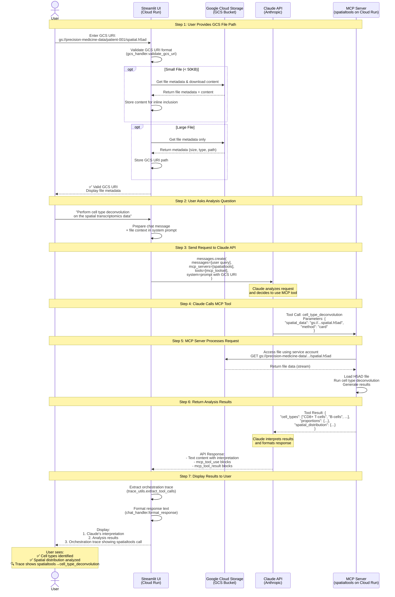

# MCP Chat - Streamlit UI for Precision Medicine MCP Servers

A visual chat interface for testing deployed MCP servers on GCP Cloud Run. Provides a Claude Desktop-like experience for bioinformatics workflows.


## Architecture: GCS File Analysis Flow

The following diagram shows how a user request flows through the system when analyzing files stored in Google Cloud Storage:



### Key Architecture Benefits

- **☁️ Cloud-to-Cloud Transfer** - MCP servers access GCS directly (no local bottleneck)
- **🔒 Service Account Security** - IAM-based access control for GCS buckets
- **⚡ Inline Optimization** - Small files (< 50KB) analyzed directly by Claude
- **💰 Cost Efficient** - Data stays within GCP region (free egress within us-central1)
- **🏥 HIPAA Compliant** - No data leaves GCP infrastructure when configured properly

### Flow Summary

1. **File Registration** - User enters `gs://bucket/path/file` → Streamlit validates and fetches metadata
2. **Query Processing** - User asks analysis question → Streamlit builds system prompt with GCS URI
3. **Tool Orchestration** - Claude API selects appropriate MCP tool and passes GCS URI
4. **Cloud Analysis** - MCP server accesses GCS file directly and performs bioinformatics analysis
5. **Results Display** - Claude interprets results → User sees interpretation + orchestration trace

## Features

- 💬 **Chat Interface** - Natural language interaction with MCP servers
- 🤖 **Multi-Provider Support** - Choose between Claude (Anthropic) or Gemini (Google) LLMs
- 🔧 **Server Selection** - Choose which of the 13 MCP servers to use
- 🎯 **Example Prompts** - 14 built-in prompts with GCS data paths for PatientOne
- 📊 **Token Usage** - Track API usage per message
- 🎨 **Clean UI** - Simple, Claude Desktop-like interface
- ⚡ **Real-time** - Instant responses from deployed servers
- 🔍 **Orchestration Trace** - See which servers were called and in what order
- 📁 **File Upload** - Secure upload for 21+ bioinformatics file formats (FASTQ, VCF, BAM, H5AD, etc.)
- ☁️ **GCS Integration** - Direct access to files in Google Cloud Storage buckets

## LLM Provider Support

The Streamlit UI supports two LLM providers, each with different MCP integration approaches:

### Claude (Anthropic) - Native MCP Support

Claude uses Anthropic's native MCP integration where Claude API directly orchestrates MCP servers.

**Architecture:**
```
Streamlit UI → Claude API (with MCP servers) → Response
```

**Features:**
- Native MCP server support via Claude API
- Automatic tool discovery and calling
- Built-in orchestration

**Models:**
- `claude-sonnet-4-5` (recommended)
- `claude-opus-4-5`
- `claude-haiku-4`

### Gemini (Google) - SSE-Based MCP Integration

Gemini uses a custom SSE-based MCP client that connects directly to MCP servers and manually orchestrates tool calls.

**Architecture:**
```
Streamlit UI → MCP SSE Client → Cloud Run MCP Servers
            ↓                           ↓
        Gemini API ← Tool Results ← Tool Execution
```

**How It Works:**
1. **MCP Client Manager** establishes SSE connections to Cloud Run MCP servers
2. **Tool Discovery** fetches available tools from each server
3. **Schema Cleaning** converts MCP tool schemas to Gemini function declarations
4. **Agentic Loop** manages multi-turn tool calling:
   - Gemini decides which tools to call
   - Streamlit executes tools via MCP SSE client
   - Results fed back to Gemini for interpretation
5. **Cloud Run Auth** uses Google Cloud ID tokens for server authentication

**Models:**
- `gemini-3-flash-preview` (recommended)
- `gemini-2.5-flash`

**Key Implementation:**
- **SSE Client:** `utils/mcp_client.py` - Manages persistent connections to MCP servers
- **Provider:** `providers/gemini_provider.py` - Implements agentic tool calling loop
- **Schema Cleaning:** Strict whitelist removes JSON schema properties Gemini doesn't support (e.g., `additionalProperties`, `anyOf`)
- **Tool Name Resolution:** Hyphenated server names (e.g., `cell-classify`) are sanitized to `cell_classify_*` for Gemini, then mapped back via `_gemini_name_map` for MCP dispatch
- **Thought Signatures:** Preserves complete Part objects for Gemini's tool calling requirements

**Why This Approach:**
- Gemini's Interactions API doesn't support remote MCP servers or tool configuration
- Direct SSE connections provide full control over tool calling behavior
- Works with existing Cloud Run MCP server deployments
- Enables Gemini to call the same MCP tools as Claude

**Switching Providers:**

When running on Cloud Run, select your preferred provider in the sidebar:
1. Set `GEMINI_API_KEY` environment variable for Gemini support
2. Use the "LLM Provider" dropdown to switch between Claude and Gemini
3. Both providers work with the same MCP servers

## Quick Start (2 minutes)

### Prerequisites

- Python 3.11+
- At least one API key: Anthropic ([get one](https://console.anthropic.com/)) or Google AI ([get one](https://aistudio.google.com/apikey))

### Installation

```bash
# 1. Navigate to the UI directory
cd ui/streamlit-app

# 2. Create virtual environment
python -m venv venv
source venv/bin/activate  # On Windows: venv\Scripts\activate

# 3. Install dependencies
pip install -r requirements.txt
# Includes: streamlit, anthropic, google-cloud-storage, google-cloud-logging

# 4. Set your API key
export ANTHROPIC_API_KEY=your_key_here  # On Windows: set ANTHROPIC_API_KEY=your_key_here

# Or create a .env file:
cp .env.example .env
# Edit .env and add your API key

# 5. (Optional) Configure GCS access for Cloud Storage features
# If using GCS file access, authenticate with GCP:
gcloud auth application-default login

# 6. Run the app
streamlit run app.py
```

The app will open in your browser at http://localhost:8501

## Usage

### 1. Select MCP Servers

Use the sidebar to select which servers to enable. Default active: **spatialtools, multiomics, fgbio**.

**Production Servers (9 — Real Analysis):**
- **fgbio** - Genomic reference data and FASTQ validation (4 tools)
- **multiomics** - Multi-omics integration RNA/Protein/Phospho (9 tools)
- **spatialtools** - Spatial transcriptomics analysis (10 tools)
- **perturbation** - GEARS perturbation prediction for treatment response (8 tools)
- **deepcell** - DeepCell-TF cell segmentation and phenotyping (3 tools)
- **openimagedata** - H&E/MxIF image loading and composites (5 tools)
- **quantum-celltype-fidelity** - Quantum cell type validation and immune evasion detection (6 tools)
- **cell-classify** - Cell phenotyping and classification (3 tools)
- **patient-report** - PDF report generation (5 tools)

**Mock Servers (4 — Demo/Workflow):**
- **mockepic** - Synthetic FHIR clinical data
- **tcga** - TCGA cancer genomics data
- **seqera** - Nextflow workflow management
- **huggingface** - AI/ML models for genomics

### 2. Choose a Provider and Model

Use the sidebar to switch between Claude and Gemini. Available models:

**Claude:** `claude-sonnet-4-5` (recommended), `claude-opus-4-5`, `claude-haiku-4`
**Gemini:** `gemini-3-flash-preview` (recommended), `gemini-2.5-flash`

### 3. Start Chatting

Type your question or use a built-in prompt:
1. Select a prompt from the "Example Prompts" dropdown in the sidebar
2. Preview the prompt text shown below the dropdown
3. Click "Send Prompt" to execute

Start with "Warm Up Servers" to wake Cloud Run instances, then try the analysis prompts.

### 4. View Responses

- Chat history shows full conversation
- Token usage displayed per message
- Server status cards show active servers

## Orchestration Trace Feature

The Streamlit UI includes an "Orchestration Trace" feature that shows which MCP servers were called during each query. This makes the "invisible orchestration" visible, helping users understand:

- **How** Claude orchestrates multiple specialized servers
- **Which** data sources contributed to each recommendation
- **The flow** of data through the precision medicine pipeline

### Enabling the Trace

1. In the sidebar, toggle **"Show trace for responses"**
2. Select your preferred trace style:
   - **Log View (📝)** - Simple text-based step-by-step log
   - **Card View (🎴)** - Visual cards for each server call
   - **Timeline View (📈)** - Horizontal timeline showing the flow
   - **Sequence Diagram (📊)** - Mermaid diagram (copyable)

### What the Trace Shows

For each server call, you'll see:
- Which MCP server was called (with icon and description)
- What tool was invoked
- Input parameters passed to the tool
- Result summary
- Timing metrics (duration, tokens, estimated cost)

### Example Trace Output

```
🔍 Orchestration Trace (3 server calls)

Step 1: 🧬 Genomics (FGbio)
- Tool: validate_fastq
- Input: {'file': 'patient_001.fastq'}
- Result: Valid FASTQ, 1.2M reads

Step 2: 🔬 Multi-Omics
- Tool: run_halla_analysis
- Input: {'data_file': 'multiomics.tsv'}
- Result: 42 significant associations found

Step 3: 🗺️ Spatial Transcriptomics
- Tool: cell_type_deconvolution
- Input: {'spatial_data': 'visium_data.h5ad'}
- Result: Identified 8 cell types, CD8+ T-cells enriched in margin
```

### Exporting Traces

Click the download buttons to export:
- **📥 Download JSON** - Complete trace data for programmatic use
- **📥 Download Mermaid** - Sequence diagram for documentation

### Educational Value

The trace feature helps:
- **Students** - See how agentic AI actually works
- **Funders** - Demos become self-explanatory
- **Clinicians** - Understand which data sources contributed
- **Developers** - Debug when something goes wrong
- **Hospital IT** - Audit trail for compliance

### Use Cases

1. **Education** - Teaching bioinformatics workflows
2. **Demos** - Showing platform capabilities to funders
3. **Debugging** - Understanding why a query failed
4. **Compliance** - Audit trail of data access
5. **Documentation** - Creating workflow diagrams

## Example Prompts (14 Built-in)

The app includes 14 example prompts in the sidebar dropdown. All use PatientOne sample data from GCS (`gs://sample-inputs-patientone/patient-data/PAT001-OVC-2025/`).

**Start here — wake up Cloud Run servers (cold starts take 10-30s):**

| # | Prompt | Servers Used |
|---|--------|-------------|
| 1 | **Warm Up Servers** — Lists all tools from connected servers | All active |

**Core analysis prompts (tested, working with default servers):**

| # | Prompt | Servers Used |
|---|--------|-------------|
| 2 | **Spatial Analysis** — Moran's I for CD3D, CD8A, EPCAM, MKI67 | spatialtools |
| 3 | **Multi-omics Integration** — RNA + Protein + Phospho integration | multiomics |
| 4 | **Genomic QC** — FASTQ validation for PAT001 exome | fgbio |
| 5 | **Pathway Enrichment** — GO_BP for TP53, BRCA1, MYC, KRAS | multiomics |
| 6 | **Complete PatientOne Workflow** — FHIR + Spatial + Multi-omics | mockepic, spatialtools, multiomics |

**Advanced prompts (require additional servers enabled):**

| # | Prompt | Servers Needed |
|---|--------|---------------|
| 7 | **Batch Correction** — ComBat batch effects | multiomics |
| 8 | **Predict Treatment Response** — GEARS model training | perturbation |
| 9 | **Immunotherapy Prediction** — Anti-PD1/CTLA4 response | perturbation |
| 10 | **Drug Screening** — Compare checkpoint/PARP/platinum | perturbation |
| 11 | **Quantum Cell Type Fidelity** — Quantum embeddings | quantum-celltype-fidelity |
| 12 | **Immune Evasion Detection** — Quantum fidelity scoring | quantum-celltype-fidelity |
| 13 | **TLS Analysis** — Tertiary lymphoid structures | quantum-celltype-fidelity |
| 14 | **Quantum + GEARS Validation** — Cross-method validation | perturbation, quantum-celltype-fidelity |

### Cold Start Note

MCP servers on Cloud Run use `min-instances=0` to save costs. First requests after idle periods may take 10-30 seconds. Use "Warm Up Servers" before running analysis prompts, or pre-warm with curl:

```bash
curl -s https://mcp-spatialtools-ondu7mwjpa-uc.a.run.app/sse &
curl -s https://mcp-multiomics-ondu7mwjpa-uc.a.run.app/sse &
curl -s https://mcp-fgbio-ondu7mwjpa-uc.a.run.app/sse &
wait
```

## Configuration

### API Key Security

**API keys are stored differently depending on environment:**

| Environment | Storage Method | Security |
|-------------|---------------|----------|
| **Local Development** | `.env` file (gitignored) | Not committed to git, local machine only |
| **GCP Cloud Run** | Environment variable (encrypted) | Encrypted at rest, managed by Google Cloud |
| **Browser/Client** | Never exposed | Keys stay on server, never sent to browser |

**Important Security Notes:**
- ✅ `.env` file is in `.gitignore` - never committed to git
- ✅ Cloud Run environment variables are encrypted at rest
- ✅ API keys are only used server-side, never exposed to browser
- ✅ Use separate API keys for development vs production
- ❌ Never hardcode API keys in source code
- ❌ Never commit `.env` files to git

### Environment Variables

**For Local Development:**

Create a `.env` file (from `.env.example`):

```bash
# Required (at least one)
ANTHROPIC_API_KEY=your_anthropic_key_here
GEMINI_API_KEY=your_google_ai_key_here

# Optional
DEFAULT_MODEL=claude-sonnet-4-5
DEFAULT_MAX_TOKENS=4096
```

**For Cloud Run Deployment:**

API keys are passed as environment variables during deployment:

```bash
export ANTHROPIC_API_KEY=your_anthropic_key_here
export GEMINI_API_KEY=your_google_ai_key_here
./deploy.sh
```

The deployment script automatically sets the keys as Cloud Run environment variables (encrypted).

**Note:** You can use either provider independently - only the corresponding API key is required.

### MCP Server Configuration

Server URLs are configured in `utils/mcp_config.py`. All 13 servers are pre-configured with GCP Cloud Run URLs.

To add/modify servers:
```python
# Edit utils/mcp_config.py
MCP_SERVERS = {
    "your_server": {
        "name": "your_server",
        "url": "https://your-server.run.app/sse",
        "description": "Server description",
        "status": "production",  # or "mock"
        "tools_count": 5
    }
}
```

## Architecture

### Multi-Provider System

```
Streamlit UI (Browser)
    ↓
Provider Abstraction Layer
    ├─→ Claude Provider (Native MCP)
    │       ↓
    │   Anthropic Claude API
    │       ↓
    │   [Direct MCP orchestration]
    │
    └─→ Gemini Provider (SSE-based MCP)
            ↓
        MCP SSE Client ─→ Cloud Run MCP Servers (13 servers)
            ↓                      ↓
        Google Gemini API ← Tool Results
            ↓
    [Manual agentic loop]
    ↓
GCP Cloud Run MCP Servers (13 servers)
    ↓
Bioinformatics Tools (STAR, ComBat, HAllA, GEARS, etc.)
```

**Key Components:**
- **Provider Abstraction** - Unified interface for Claude and Gemini
- **Claude Provider** - Uses Anthropic's native MCP support
- **Gemini Provider** - Custom SSE client with manual tool orchestration
- **MCP Servers** - 13 Cloud Run services (9 production, 4 mock/framework)
- **Bioinformatics Tools** - Real analysis engines (STAR, scanpy, GEARS, etc.)

## Cost Estimates

**Per Message:**
- Input: ~500-2000 tokens ($0.003-0.012 with Sonnet)
- Output: ~1000-4000 tokens ($0.015-0.060 with Sonnet)
- **Total: ~$0.02-0.08 per exchange**

**Typical Session (10 messages):**
- ~$0.20-0.80 total

**See:** [Cost Analysis](../../docs/for-hospitals/operations/cost-and-budget.md) for detailed breakdowns

## Additional Documentation

For detailed guides on specific topics, see:

- **[📁 File Handling Guide](FILE_HANDLING.md)** - Local file upload and GCS integration
- **[🚀 Deployment Guide](DEPLOYMENT.md)** - Deploy to local, Streamlit Cloud, or GCP Cloud Run
- **[🔧 Troubleshooting Guide](TROUBLESHOOTING.md)** - Common issues and solutions
- **[🤖 Provider Architecture](providers/README.md)** - Claude vs Gemini implementation details

## Development

### Project Structure

```
ui/streamlit-app/
├── app.py                 # Main Streamlit application
├── requirements.txt       # Python dependencies (includes mcp>=1.0.0)
├── .env.example          # Environment variable template
├── .gitignore            # Git ignore rules
├── README.md             # This file
├── Dockerfile            # Container image for Cloud Run
├── deploy.sh             # Deployment script for GCP
├── providers/            # LLM provider abstraction layer
│   ├── __init__.py       # Provider factory and discovery
│   ├── base.py           # Abstract base class for providers
│   ├── anthropic_provider.py  # Claude with native MCP support
│   └── gemini_provider.py     # Gemini with SSE-based MCP client
└── utils/
    ├── __init__.py       # Package init
    ├── mcp_config.py     # MCP server configurations + 14 example prompts
    ├── mcp_client.py     # SSE-based MCP client manager (for Gemini)
    ├── mcp_mock.py       # Mock MCP client for local dev (USE_MOCK_MCP=true)
    ├── chat_handler.py   # Claude API integration (legacy)
    ├── trace_utils.py    # Orchestration trace extraction
    ├── trace_display.py  # Trace visualization components
    ├── file_validator.py # File upload security validation
    ├── gcs_handler.py    # Google Cloud Storage integration
    ├── auth.py           # Authentication (SSO)
    └── audit_logger.py   # Audit logging
```

### Adding New Features

**Add a new example prompt:**
```python
# Edit utils/mcp_config.py
EXAMPLE_PROMPTS["Your New Prompt"] = "Your prompt text here..."
```

**Add custom styling:**
```python
# Edit app.py, add to st.markdown() CSS block
st.markdown("""
<style>
    .your-custom-class {
        /* your styles */
    }
</style>
""", unsafe_allow_html=True)
```

**Add response visualization:**
```python
# In app.py, after displaying response:
if "spatial_data" in response_text:
    import pandas as pd
    # Create visualization
    st.plotly_chart(your_plot)
```

## Deployment

The Streamlit app can be deployed in three ways:

| Environment | Best For | Cost | Setup Time |
|-------------|----------|------|------------|
| **Local Development** | Testing, debugging | Free | 5 minutes |
| **Streamlit Cloud** | Public demos, education | Free | 10 minutes |
| **GCP Cloud Run** | Production, hospital use | ~$5-20/month | 15 minutes |

**Quick Deploy to Cloud Run:**
```bash
cd ui/streamlit-app
export ANTHROPIC_API_KEY=your_key
export GEMINI_API_KEY=your_key  # optional
./deploy_now.sh
```

**See [Deployment Guide](DEPLOYMENT.md)** for complete instructions on all deployment options, including CI/CD, monitoring, security, and rollback procedures.

## Roadmap

**Planned Features:**
- [ ] Data visualization (spatial plots, pathway networks, cell type heatmaps)
- [ ] Export conversation to PDF/Markdown with embedded traces
- [ ] Workflow templates (save/load common analysis workflows)
- [ ] Multi-user support (Google SSO authentication)
- [ ] Response streaming (real-time token display)
- [ ] Server health monitoring dashboard
- [ ] Cost tracking per session with budget alerts
- [ ] Batch file processing (analyze multiple FASTQ files)
- [ ] Interactive parameter tuning for MCP tools
- [ ] Additional LLM providers (OpenAI, Azure, Bedrock)


